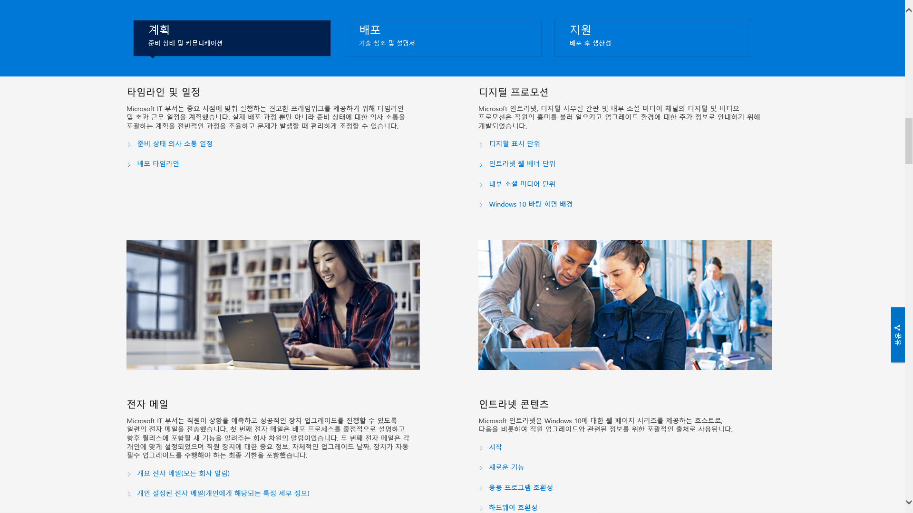

# 8단계: 사용자 커뮤니케이션 및 교육

<table>
<thead>
<td></td>
<td>
<strong>8단계: 사용자 커뮤니케이션 및 교육</strong>

사용자에게 새로운 환경과 PC를 Windows 10 및 엔터프라이즈용 Microsoft 365 앱으로 전환하는 새로운 작업 방법을 알려주어야 합니다. Microsoft FastTrack, 교육 자료 및 커뮤니케이션 서식 파일과 사용자 수용 및 사용 현황을 모니터링하는 새로운 방법을 통해 사용자 채택과 사용을 지원하는 방법을 알아보세요.
</td>
<td></td>
</thead>
</table>

>[!NOTE]
>사용자 커뮤니케이션 및 교육은 사용자에게 정보를 알려주고 준비를 지원하기 위한 팁과 권장 사항을 포함하는 권장 배포 프로세스 사이클의 8번째 단계입니다. 전체 데스크톱 배포 프로세스를 보려면 [데스크톱 배포 센터](https://aka.ms/HowToShift)를 방문하세요.
>

Office 365, Windows 10 및 Azure Active Directory를 통한 새로운 보안 및 준수 컨트롤을 포함하는 최신 작업 환경을 사용자에게 알리고 준비하는 과정은 채택을 촉진하는 데 매우 중요합니다. 여기에서 다루는 내용은 업데이트를 적용하는 방법을 찾아내는 것입니다. 즉, 사용자들이 생산성 중단이나 워크플로 변경을 두려워하거나, 새로운 기능을 배워야 하는 경우가 여기에 해당합니다.

긍정적인 측면은 Windows 7과 Office 2010 또는 Office 2013에서 전환하는 경우 많은 사용자들이 개인용 장치에서 실행되는 Windows 10과 새 버전의 Office에 친숙하며, 이러한 측면이 변경이 미치는 영향을 줄이는 데 도움이 될 것이라는 점입니다.

## 새로운 환경 준비

Office부터 시작해서, 엔터프라이즈용 Microsoft 365 앱을 처음 배포할 때, Office 앱에 로그인한 후 OneDrive 또는 SharePoint 위치에 파일을 저장할 경우 공유가 쉬워지고, 파일 분기가 줄어들고, 실시간 공동 작업이 가능하다는 이점을 전달할 수 있습니다.

이러한 앱은 물론, Teams 및 Planner와 같은 기타 로컬 또는 브라우저 기반 앱에서 자세한 커뮤니케이션 및 교육 서식 파일을 사용할 수 있습니다.

또한 Outlook에서 OneDrive 연결 파일을 첨부하고 PowerPoint에서 새로운 모핑 슬라이드 전환 및 디자인 기능을 사용하는 등, 새로운 앱 내 기능에 대한 지침도 제공됩니다.

Windows 10의 경우, Windows Hello와 같이 생체 인식을 사용하여 안전하게 로그인하는 기능, Windows 환경을 개인 설정하기 위한 시작 기능 업데이트, 작업 중이던 Cortana와 같은 기능으로 쉽게 복귀하기 위한 타임라인 등에 친숙해지도록 도와드립니다.

사용자가 노출될 수 있는 시각적인 보안 및 규정 준수 컨트롤도 있습니다. Azure AD 및 Microsoft Intune으로 구성된 Enterprise Mobility + Security는 데스크톱 업그레이드의 대상으로 지정할 수 있는 추가 기능을 Windows 10 및 Office 365에 통합합니다.

[Microsoft Enterprise Mobility + Security](https://www.microsoft.com/cloud-platform/enterprise-mobility-security)

예를 들어 다단계 인증을 사용하도록 설정한 경우 이 기능은 Azure AD를 사용하고, 휴대폰 앱 또는 PIN으로 안전하게 서비스에 액세스하도록 하여 리소스에 대한 사용자 로그인을 보호합니다. 또한 Azure Information Protection은 사용자가 문서를 쉽게 분류하고 레이블을 지정할 수 있도록 합니다.

[사용자를 위한 대한 다단계 인증 설정](https://support.office.com/article/set-up-multi-factor-authentication-for-office-365-users-8f0454b2-f51a-4d9c-bcde-2c48e41621c6)

사용자들이 경험하게 될 새로운 기능들이 약간 있으며 경우에 따라 긍정적이거나 덜 긍정적인 차원에서 사용자에게 놀라움을 주는 기능도 있을 수 있습니다. 또한 이러한 놀라운 기능들이 정상적인 워크플로에 변화를 가져올 경우 지원 센터에서 더 많은 문의 전화가 수신되고 지원 티켓이 늘어날 수 있습니다.

## 사전 준비 및 측정된 롤아웃

사용자 환경 변화와 관련된 위험을 최소화하기 위해 다음과 같은 두 가지 보완적인 접근 방법을 권장합니다.

  - 예상 결과를 알 수 있도록 사전에 사용자에게 정보 전달

  - 배포 링을 사용하여 배포 속도 제어

### 단계별 배포

배포 링을 사용하는 단계별 배포는 소규모 그룹에서 시작해서 시간이 지나면서 측정 가능한 방식으로 광범위한 배포 규모로 확장하는 개념입니다. 일반적으로 커뮤니케이션 및 교육 계획을 처음 세울 때 이러한 링 및 해당 멤버가 형성됩니다. 이러한 방식으로 배포 규모를 서서히 넓혀가면서 잠재적인 위험을 줄이고 접근 방식이 유효한지 검사할 수 있으며, 예상보다 더 많은 지원 센터 전화 문의가 발생할 때 작업을 일시 중지할 수 있습니다.

배포 링은 사업부 및 해당 관리자와 협의할 때 가장 잘 구현됩니다. 배포하거나 변경을 진행할 때 피해야 할 중요한 날짜와 시간을 이해해야 합니다. 신중하게 계획하지 못하거나 이해 관계자의 의견을 반영하지 않으면 앞으로 발생할 변화를 잘 받아들이고 손쉽게 사용하기 어려울 수 있습니다.

### 첫 번째 작업 단계: IT 팀 및 얼리 어답터 참가자 

일반적으로 IT 팀과 초기 액세스를 자원한 열정적인 얼라 어답터와 함께 배포를 시작하는 것이 가장 바람직합니다. 이러한 “참가자”와 함께 커뮤니케이션, 변경이 미치는 영향 및 커뮤니케이션과 교육의 효과를 테스트할 수 있습니다. 이러한 작업 단계 동안 IT 부서는 소유모 파일럿을 실행하면서 보다 광범위한 배포 단계 동안 도움이 될 수 있는 문제 해결 및 자동화 기법을 학습합니다.

초기 파일럿 작업 단계에는 구성원들을 참여시켜 관찰한 결과를 문서로 정리하고 프로세스에 대한 피드백을 제공하도록 하는 것이 중요합니다. 또한 IT 팀 외부에 새로운 기능을 구두로 유기적으로 전달하는 옹호자를 두는 것도 좋습니다. 이러한 옹호자들은 이후 작업 단계에서 사용자들이 도움이 필요할 때 최전방 지원 담당자가 될 수 있습니다.

### 두 번째 작업 단계: 파일럿 

첫 번째 작업 단계에서 좋은 결과를 얻었다면 두 번째 작업 단계인 파일럿 단계에서는 더 많은 사용자 집합을 대상으로 지정할 수 있습니다. 이러한 단계는 대표적인 사용자 역할, 장치 유형, Windows 앱 및 Office 추가 기능으로 구성되어야 합니다. 이러한 그룹에서 반환되는 데이터는 분석 기능에서 보다 광범위한 세 번째 작업 단계 배포의 초기 대상을 지정하는 데 활용됩니다.

이 작업 단계 및 이후 작업 단계의 모든 PC는 분석 서비스까지 로깅되므로, 전달 최적화 및 Windows Hello 로그인 사용을 통한 대역폭 절감 뿐만 아니라 장치 및 앱 상태에 대한 진단 데이터를 수집할 수 있습니다.

이 작업 단계에서는 변경 내용을 알리고 사용자가 새로운 기능을 활용하도록 지원하는 것이 특히 중요합니다. 사용자들이 IT 부서가 보내는 전자 메일이나 기타 커뮤니케이션을 우선적으로 고려하지 않거나 무시하는 경향이 있을 수 있으므로 관리 부서와 회의할 때 변경 내용을 전달하고 새로운 도구 및 기술에 대한 채택을 권장하면 도움이 됩니다.

또한 사용자 작업 중단을 최소화할 수 있도록 피해야 할 시간을 입력하도록 해야 합니다. 예를 들어 재무 팀은 회계 분기 동안 특히 민감할 수 있으며 제품 개발 팀은 제품 출시 기간 동안 민감할 수 있습니다.

장치, 사용자, 부서 및 타이밍을 계획하면서 동시에, 커뮤티케이션 및 교육 계획을 세우는 것은 물론, 콘텐츠를 준비하고 외부 리소스를 고용하여 사용자 교육을 도울 수 있습니다.

#### Microsoft FastTrack 

교육 콘텐츠를 준비할 때 Microsoft FastTrack 생산성 라이브러리에 대한 단계별 교육 가이드를 포함하는 포괄적인 짧은 비디오 기반 교육 자료에 액세스하면 도움이 될 수 있습니다.

[Microsoft FastTrack 생산성 라이브러리](https://www.microsoft.com/microsoft-365/success/?rtc=2)

보다 영향력 있는 콘텐츠 생성, 사이트 및 콘텐츠 공유, 팀워크 혁신 및 최신 장치로 생산성 향상 등, 조직에 중요한 목표를 기준으로 하는 수백 가지 항목이 제공됩니다.

또한 Microsoft 365 또는 Office 365를 사용하는 경우 Microsoft의 FastTrack 서비스를 통해 사용자 채택을 유도할 수 있는 타당한 자격을 얻을 수 있습니다. Microsoft 365(Windows, Office 및 EMS) 롤아웃 프로세스를 진행할 때 담당자가 채택 모범 사례를 안내해드립니다.

#### Microsoft IT Showcase 

Microsoft의 IT Showcase 시리즈는 Windows 10 배포 관련 콘텐츠를 제공하는 또 다른 유용한 리소스입니다. 여기에는 타임라인과 일정, 디지털 프로모션 서식 파일, 전자 메일 서식 파일 및 인트라넷 콘텐츠가 포함됩니다. 이러한 리소스는 Microsoft 자체의 Windows 10 배포에 사용되는 자료를 토대로 하며, 조직에서 사용할 수 있게 수정되었습니다.

[조직의 원활한 Windows 10 배포 준비](https://www.microsoft.com/itshowcase/windows10deployment)

이러한 구성 요소와 서비스는 파일럿 단계 중에 세부적으로 조정될 수 있습니다. 교육적 측면에서 사용자에게 공감을 주는 정보, 대상으로 지정할 장치, 그리고 분석을 통해 피하거나 지연해야 할 장치 또는 사용자 그룹에 대해 알게 되면 이후 작업 단계에서 데이터 및 환경 중심 접근 방식을 사용하여 배포를 확장할 수 있습니다.

파일럿이 확장되면, 자주 묻는 질문과 셀프 서비스 콘텐츠를 문서화하여 게시함으로써 지원 티켓 및 지원 센터 작업을 사전에 줄이는 데 도움을 줄 수 있습니다.

### 세 번째 작업 단계 및 이후 단계: 광범위한 프로덕션 배포 

광범위한 배포 작업 단계가 되면, 프로세스, 커뮤니케이션, 교육 및 셀프 서비스 도구를 구체화하게 될 것입니다. 이제 원격 분석을 통해 수집된 데이터를 사용하여 점점 더 많은 PC를 타깃팅할 수 있습니다.

IT 부서, 지원 센터, 사용자 및 네트워크 용량에 따라 관리 가능한 속도로 배포합니다. 항상 배포 프로세스 사이클의 2단계로 돌아가 네트워크를 최적화하고, 피어 간 캐시, LEDBAT 및 기타 기술을 사용하여 배포 관련 데이터를 더 빠르게 전송할 수 있습니다.

진단 도구를 통해 모니터링하는 진단 데이터 외에, 관리 센터의 워크로드를 기준으로 하는 자세한 사용 현황 보고서를 사용하거나 Power BI를 통해 관리 대시보드를 사용하여 세분화된 방식으로 Office 365 및 Microsoft 365 서비스 사용량을 모니터링할 수도 있습니다. 이러한 도구들은 함께 작업하기 위한 새로운 도구(예: Microsoft Teams) 또는 파일을 공유하는 새로운 방법(예: OneDrive)을 롤아웃할 때 목표를 설정하고 추적하는 데 유용합니다.

새 기술의 수용 및 채택은 조직의 모든 PC에 Windows 10 및 엔터프라이즈용 Microsoft 365 앱이 설치되고 한참 후에도 계속 진행됩니다. 또한 사용자들은 새로운 기능에 대한 정보를 받거나 교육을 받지 못한 상태로 업무 방식을 반드시 바꿀 필요는 없습니다. 마지막으로, Windows의 반기 일정 및 Office의 선택적 월별 일정에 따라 새로운 서비스 모델을 통해 새 기능이 제공되면서, 커뮤니케이션은 계속 진행될 것입니다.

## 이전 단계 

## [7단계: Windows 및 Office Servicing](https://aka.ms/mdd7)
