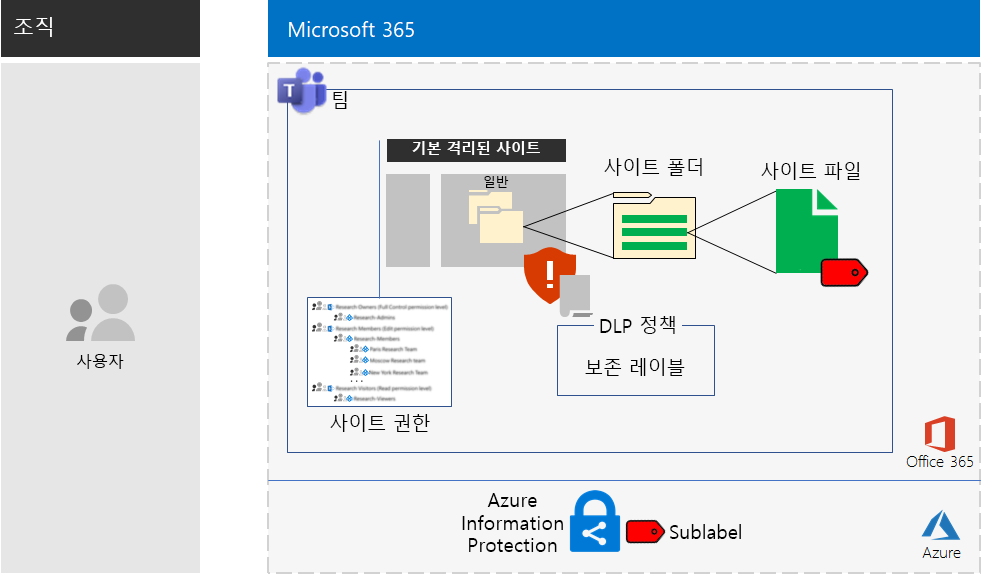

# 높은 규제 대상 데이터에 대한 Microsoft Teams 및 SharePoint Online 사이트Microsoft Teams and SharePoint Online sites for highly regulated data

*이 시나리오는 Microsoft 365 Enterprise E3 및 E5 버전에 적용됩니다.**This scenario applies to both the E3 and E5 versions of Microsoft 365 Enterprise*

Microsoft 365 Enterprise에는 높은 규제 대상 데이터를 만들고, 저장하고, 보안을 유지할 수 있도록 하기 위해 전체 클라우드 기반 서비스 제품군이 포함되어 있습니다. 여기에는 다음과 같은 데이터가 포함됩니다.Microsoft 365 Enterprise includes a full suite of cloud-based services so that you can create, store, and secure your highly regulated data. This includes data that is:

- 지역 규제를 받는 데이터Subject to regional regulations.
- 영업 비밀, 재무 또는 인사 관련 정보와 조직의 전략과 같이 조직에서 가장 중요한 데이터The most valuable data for your organization, such as trade secrets, financial or human resources information, and organization strategy.

이러한 비즈니스 요구를 충족하는 Microsoft 365 Enterprise 클라우드 기반 시나리오에서는 다음을 요구합니다.A Microsoft 365 Enterprise cloud-based solution that meets this business need requires that you:

- 디지털 자산(문서, 슬라이드 데크, 스프레드시트 등)을 SharePoint Online 팀 사이트 또는 Microsoft Teams 팀의 **파일** 탭에 저장해야 합니다.Store digital assets (documents, slide decks, spreadsheets, etc.) in a SharePoint Online team site or in the **Files** tab of a Microsoft Teams team.
- 사이트 또는 팀의 다음 작업이 방지됩니다.Lock down the site or team to prevent:
   - 그룹 멤버 자격을 통해 특정 사용자 계정 집합에만 액세스할 수 있습니다. 특정 사용자 계정 집합에는 임의 권한 수준에서 SharePoint Online 팀 사이트에 액세스할 수 있는 사용자 계정 및 해당 사이트를 관리할 수 있는 사용자 계정이 포함됩니다.Access to only a specific set of user accounts through group membership, which includes those who can access the SharePoint Online team site and at what level of permission, and those who can administer it.
   - 사이트의 멤버가 다른 사람에게 액세스 권한을 부여할 수 없습니다.Members of the site from granting access to others.
   - 사이트의 멤버 이외의 사용자가 다른 사람에게 액세스 권한을 요청할 수 없습니다.Non-members of the site from requesting access to the site.
- SharePoint Online 사이트 또는 팀에 대한 Office 365 보존 레이블을 사이트 또는 팀에 있는 문서에 대한 보존 정책을 정의하는 기본 방법으로 구성합니다.Configure an Office 365 retention label for your SharePoint Online sites or teams as a default way to define retention policies on the documents in the site or team.
- 사용자가 조직 외부로 파일을 보내지 못하도록 차단합니다.Block users from sending files outside the organization.
- 사이트 또는 팀의 가장 중요한 디지털 자산을 암호화합니다.Encrypt the most sensitive digital assets of the site or team.
- 사이트 외부에서 공유되더라도 자산을 열기 위해서는 권한이 있는 사용자 계정의 유효한 자격 증명을 요구하도록 가장 중요한 디지털 자산에 대한 권한을 추가합니다.Add permissions to the most sensitive digital assets so that if even if they get shared outside of the site, opening the asset still requires the valid credentials of a user account that has permission.

다음 표에서는 이러한 시나리오의 요구 사항과 해당하는 Microsoft 365 Enterprise의 기능을 연결해서 보여 줍니다.The following table maps the requirements of this solution to a feature of Microsoft 365 Enterprise.

|||
|:-------|:-----|
| **요구 사항****Requirement** | **Microsoft 365 Enterprise 기능****Microsoft 365 Enterprise feature** |
| 디지털 자산 저장Store digital assets | SharePoint Online 팀 사이트 및 Office 365의 팀SharePoint Online team sites and teams in Office 365 |
| 사이트 잠그기Lock down the site | Azure AD 그룹 및 SharePoint Online 팀 사이트 사용 권한Azure AD groups and SharePoint Online team site permissions |
| 사이트의 디지털 자산에 레이블 지정Label the digital assets of the site | Office 365 보존 레이블Office 365 retention labels |
| 사용자가 조직 외부로 파일을 보내지 못하도록 차단Block users when sending files outside the organization | Office 365의 DLP(데이터 손실 방지) 정책Data Loss Prevention (DLP) policies in Office 365 |
| 사이트의 모든 디지털 자산 암호화Encrypt all of the digital assets of the site | EMS(Enterprise Mobility + Security)의 Azure Information Protection 하위 레이블Azure Information Protection sub-labels in Enterprise Mobility + Security (EMS) |
| 사이트의 디지털 자산에 대한 권한 추가Add permissions to the digital assets of the site | EMS의 Azure Information Protection 하위 레이블Azure Information Protection sub-labels in EMS |
|||

다음은 SharePoint Online 사이트의 구성입니다.Here is the configuration for a SharePoint Online site.

이 시나리오를 사용하려면 다음을 배포했어야 합니다.This solution requires that you have already deployed:

- 기본 인프라의 [ID](identity-infrastructure.md) 단계 및 [정보 보호](infoprotect-infrastructure.md) 단계의 1-2단계The [Identity](identity-infrastructure.md) phase and steps 1 and 2 of the [Information protection](infoprotect-infrastructure.md) phase of the foundation infrastructure. 
- SharePoint Online 팀 사이트에 있는 높은 규제 대상 데이터의 경우 [SharePoint Online](sharepoint-online-onedrive-workload.md)For highly regulated data in SharePoint Online team sites, [SharePoint Online](sharepoint-online-onedrive-workload.md).
- Microsoft Teams 팀에 있는 높은 규제 대상 데이터의 경우 [Microsoft Teams](teams-workload.md)For highly regulated data in Microsoft Teams teams, [Microsoft Teams](teams-workload.md).

다음 단계에서는 높은 규제 대상 데이터에 대한 SharePoint Online 사이트 및 팀의 디자인 및 구성 작업과 채택을 유도하는 과정을 안내합니다.The following phases step you through the design, configuration, and driving adoption for SharePoint Online sites and teams for highly regulated data.

가상의 대표적인 다국적 기업인 Contoso Corporation에서 연구팀을 위해 SharePoint Online 사이트를 설계한 방법을 보려면 이 [예제 구성](contoso-sharepoint-online-site-for-highly-confidential-assets.md)을 참조하세요.To see how the Contoso Corporation, a fictional but representative multi-national organization, designed a SharePoint Online site for its research teams, see this [example configuration](contoso-sharepoint-online-site-for-highly-confidential-assets.md).

높은 규제 대상 데이터에 대한 팀을 사용하려면 먼저 높은 규제 대상 데이터에 대한 SharePoint Online 팀 사이트를 만들어야 합니다. 그런 후 SharePoint Online 팀 사이트의 Office 365 그룹을 사용하는 새 팀을 만듭니다. 자세한 내용은 두 번째 작업 단계, 4단계를 참조하세요.A team for highly regulated data requires that you first create a SharePoint Online team site for highly regulated data. You then create a new team that uses the Office 365 group of the SharePoint Online team site. See Phase 2, Step 4 for more information.

다음은 팀을 위한 구성입니다.Here is the configuration for a team.

## ID 및 장치 액세스 필수 구성 요소Identity and device access prerequisites

팀 또는 SharePoint Online 사이트에 대한 액세스를 보호하려면 [ID 및 장치 액세스 정책](identity-access-policies.md) 및 [권장 SharePoint Online 액세스 정책](sharepoint-file-access-policies.md)을 구성했는지 확인합니다.To protect access to the team or SharePoint Online site, ensure that you have configured [identity and device access policies](identity-access-policies.md) and the [recommended SharePoint Online access policies](sharepoint-file-access-policies.md).

## 첫 번째 작업 단계: 디자인Phase 1: Design

높은 규제 대상 데이터에 대한 SharePoint Online 사이트 또는 팀을 만들려면 먼저 해당 용도를 식별해야 합니다. 예를 들어, 제조 회사의 연구/개발 부서에는 기존 제품의 최신 디자인 사양을 저장하기 위한 SharePoint Online 사이트와 신제품에 대해 공동 작업을 진행할 장소가 필요합니다. 연구/개발 부서의 구성원과 선택한 임원만 해당 사이트에 액세스할 수 있습니다.To create a SharePoint Online site or team for highly regulated data, you must first identify its purpose. For example, the research and development department of a manufacturing organization needs a SharePoint Online site to store current design specifications for existing products and a place to collaborate on new products. Only members of the Research & Development department and selected executives will be allowed to access the site.

그 용도는 다음과 같은 필수 구성 항목을 파악하는 것입니다.That purpose will drive the determination of essential configuration items such as:

- SharePoint Online 권한 집합 및 SharePoint 그룹 집합The set of SharePoint Online permission sets and SharePoint groups
- 액세스 그룹 집합, Azure AD 보안 그룹 및 SharePoint 그룹에 추가할 구성원The set of access groups, the Azure AD security groups and their members to add to the SharePoint groups
- 사이트에 할당할 Office 365 보존 레이블 및 레이블에 대한 DLP 정책 집합The Office 365 retention label to assign to the site and the set of DLP policies for the label
- 사용자가 사이트에 저장된 높은 규제 대상 디지털 자산에 적용하는 Azure Information Protection 하위 레이블에 대한 설정The settings of an Azure Information Protection sub-label that users apply to highly sensitive digital assets stored in the site

일단 결정이 끝나면 이러한 설정을 사용하여 두 번째 작업 단계에서 사이트를 구성합니다.Once determined, you use these settings to configure the site in Phase 2. 

### 1단계: 격리된 SharePoint Online 사이트Step 1: An isolated SharePoint Online site

SharePoint Online 팀 사이트의 잠긴 버전을 격리된 사이트라고 합니다. 비공개 팀 사이트의 기본 설정과 달리, 격리된 사이트는 다음을 방지하도록 구성됩니다.The locked-down version of a SharePoint Online team site is known as an isolated site. Unlike the default settings of private team sites, isolated sites are configured to prevent:

- 지정된 그룹의 구성원이 아닌 사용자에게 액세스 권한 부여Access to those who are not members of specified groups.
- 액세스 요청The requesting of access.
- 지정된 그룹의 현재 구성원이 무단으로 액세스 권한 부여The unauthorized granting of access by current members of specified groups.
- 액세스 그룹 구성원에 의한 사이트 관리Administration of the site by access group members.

높은 규제 대상 자산을 포함하는 SharePoint Online 팀 사이트의 보안은 사이트의 SharePoint 관리자가 아니면 변경할 수 없습니다.The security of SharePoint Online team sites that contain highly regulated assets do not change unless done by a SharePoint administrator for the site.

권한 수준, SharePoint 그룹, 액세스 그룹 및 그룹 구성원 집합 결정에 대한 자세한 내용은 [격리된 SharePoint Online 팀 사이트 디자인](https://docs.microsoft.com/office365/enterprise/design-an-isolated-sharepoint-online-team-site)을 참조하세요.See [Design an isolated SharePoint Online team site](https://docs.microsoft.com/office365/enterprise/design-an-isolated-sharepoint-online-team-site) for the details to determine the set of permission levels, SharePoint groups, access groups, and group members.

### 2단계: Office 365 보존 레이블 및 DLP 정책Step 2: Office 365 retention labels and DLP policies

SharePoint Online 팀 사이트에 적용된 Office 365 보존 레이블은 사이트에 저장된 모든 디지털 자산에 대한 기본 분류 방법입니다.When applied to a SharePoint Online team site, Office 365 retention labels provide a default method of classifying all digital assets stored on the site.
 
높은 규제 대상 데이터에 대한 SharePoint Online 사이트에서는 사용할 Office 보존 365 레이블을 결정해야 합니다.For SharePoint Online sites for highly regulated data, you need to determine which Office 365 retention label to use.

Office 365 레이블의 디자인 고려 사항에 대해서는 [Office 365 분류 및 레이블](https://docs.microsoft.com/office365/securitycompliance/secure-sharepoint-online-sites-and-files#office-365-retention-labels)을 참조하세요.For the design considerations of Office 365 labels, see [Office 365 classification and labels](https://docs.microsoft.com/office365/securitycompliance/secure-sharepoint-online-sites-and-files#office-365-retention-labels).

중요한 정보를 보호하고 우발적이거나 의도적인 노출을 방지하려면 DLP 정책을 사용합니다. 자세한 내용은 이 [개요](https://docs.microsoft.com/office365/securitycompliance/data-loss-prevention-policies)를 참조하세요.To protect sensitive information and prevent its accidental or intentional disclosure, you use DLP policies. For more information, see this [overview](https://docs.microsoft.com/office365/securitycompliance/data-loss-prevention-policies).

높은 규제 대상 데이터에 대한 SharePoint Online 사이트의 경우, 사용자가 외부 사용자와 디지털 자산을 공유하려고 할 때 사용자를 차단하도록 사이트에 할당된 Office 365 보존 레이블에 대한 DLP 정책을 구성해야 합니다.For SharePoint Online sites for highly regulated data, you must configure a DLP policy for the Office 365 retention label assigned to the site to block users when they attempt to share digital assets with external users. 

### 3단계: Azure Information Protection 하위 레이블Step 3: Your Azure Information Protection sub-label

가장 중요한 디지털 자산에 암호화 및 권한 집합을 제공하기 위해 사용자는 Azure Information Protection 클라이언트를 사용하여 Azure Information Protection 레이블을 적용해야 합니다. 높은 규제 대상 데이터에 대한 SharePoint Online 사이트에 Azure Information Protection 레이블을 사용하려면 범위가 지정된 정책에서 Azure Information Protection 하위 레이블을 구성해야 합니다.To provide encryption and a set of permissions to your most sensitive digital assets, users must apply an Azure Information Protection label using the Azure Information Protection client. To use Azure Information Protection labels for SharePoint Online sites for highly regulated data, you must configure an Azure Information Protection sub-label in a scoped policy. 

하위 레이블은 기존 레이블 아래에 있습니다. 예를 들어 극비 레이블 아래에는 연구/개발 하위 레이블을 만들 수 있습니다. 범위가 지정된 정책은 사용자 하위 집합에만 적용되는 정책입니다. 높은 규제 대상 데이터에 대한 SharePoint Online 사이트에서는 해당 범위가 사이트의 액세스 그룹 구성원인 사용자 집합입니다.A sub-label exists under an existing label. For example, you can create a Research & Development sub-label under the Highly Confidential label. A scoped policy is one that applies only to a subset of users. For SharePoint Online sites for highly regulated data, the scope is the set of users that are members of the access groups for the site.

적용된 하위 레이블 설정은 자산을 따라 이동합니다. 사이트 외부에서 다운로드되고 공유되더라도, 권한이 있는 인증된 사용자 계정만 해당 자산을 열 수 있습니다.The settings of the applied sub-label travel with the asset. Even if it is downloaded and shared outside the site, only authenticated user accounts that have permissions can open it.

### 디자인 결과Design results

다음 사항이 결정되었습니다.You have determined the following:

- SharePoint 그룹 및 권한 수준 집합The set of SharePoint groups and permission levels
- 액세스 그룹 집합 및 각 권한 수준의 구성원The set of access groups and their members for each permission level
- 해당 Office 365 보존 레이블 및 레이블과 연결된 DLP 정책The appropriate Office 365 retention label and the DLP policy that is associated with the label
- 암호화 및 권한을 포함하는 Azure Information Protection 하위 레이블 설정The settings of the Azure Information Protection sub-label that include encryption and permissions

## 두 번째 작업 단계: 구성Phase 2: Configure

두 번째 작업 단계에서는 첫 번째 작업 단계에서 결정한 설정을 구현하여 높은 규제 대상 데이터에 대한 SharePoint Online 사이트를 만듭니다.In this phase, you take the settings determined in Phase 1 and implement them to create a SharePoint Online site for highly regulated data.

### 1단계: 격리된 SharePoint Online 팀 사이트 만들기 및 구성Step 1: Create and configure an isolated SharePoint Online team site

[격리된 SharePoint Online 팀 사이트 배포](https://docs.microsoft.com/office365/enterprise/deploy-an-isolated-sharepoint-online-team-site)의 지침에 따라 다음을 수행합니다.Use the instructions in [Deploy an isolated SharePoint Online team site](https://docs.microsoft.com/office365/enterprise/deploy-an-isolated-sharepoint-online-team-site) to:

- 사이트에서 사용되는 각 SharePoint 권한 수준에 대한 액세스 그룹을 만들고 채웁니다.Create and populate the access groups for each SharePoint permission level used on the site.
- 격리된 팀 사이트를 만들고 구성합니다.Create and configure the isolated team site.

### 2단계: Office 365 보존 레이블에 맞게 사이트 구성Step 2: Configure the site for an Office 365 retention label DLP policy

[Office 365 레이블 및 DLP를 사용하여 SharePoint Online 파일 보호](https://docs.microsoft.com/office365/enterprise/protect-sharepoint-online-files-with-office-365-labels-and-dlp)의 지침에 따라 다음을 수행합니다.Use the instructions in [Protect SharePoint Online files with Office 365 labels and DLP](https://docs.microsoft.com/office365/enterprise/protect-sharepoint-online-files-with-office-365-labels-and-dlp) to:

- Office 365 보존 레이블을 식별하거나 만든 후 격리된 SharePoint Online 사이트에 적용합니다.Identify or create the Office 365 retention label and apply it to your isolated SharePoint Online site.
- 조직 외부의 SharePoint Online 사이트에서 디지털 자산을 공유하려고 할 경우 사용자를 차단하는 DLP 정책을 만들고 구성합니다.Create and configure the DLP policy that blocks users when they attempt to share a digital asset on your SharePoint Online site outside the organization.

### 3단계: 사이트에 대한 Azure Information Protection 하위 레이블 만들기Step 3: Create an Azure Information Protection sub-label for the site

[Azure Information Protection을 사용한 SharePoint Online 파일 보호](https://docs.microsoft.com/office365/enterprise/protect-sharepoint-online-files-with-azure-information-protection)의 지침에 따라 다음을 수행합니다.Use the instructions in [Protect SharePoint Online files with Azure Information Protection](https://docs.microsoft.com/office365/enterprise/protect-sharepoint-online-files-with-azure-information-protection) to: 

- 범위가 지정된 정책에서 Azure Information Protection 하위 레이블을 만들고 구성합니다.Create and configure an Azure Information Protection sub-label in a scoped policy.
- 사용자 컴퓨터에 Azure Information Protection 클라이언트를 배포합니다.Deploy the Azure Information Protection client to user computers.

### 4단계(선택 사항): 높은 규제 대상 데이터에 대한 팀 만들기Step 4 (optional): Create a team for the highly regulated data

높은 규제 대상 데이터에 대한 팀을 원하는 경우 먼저 높은 규제 대상 데이터에 대한 SharePoint Online 사이트를 만듭니다. 초기 비공개 SharePoint Online 팀 사이트를 만들 때 Office 365 그룹 이름을 지정합니다.If you want a team for highly regulated data, you first create a SharePoint Online site for highly regulated data. When you create the initial private SharePoint Online team site, you specify an Office 365 group name.

높은 규제 대상 데이터에 대한 SharePoint Online 사이트가 완전히 구성되면 다음 단계에 따라 높은 규제 대상 데이터에 대한 팀으로 변환합니다.After the SharePoint Online site for highly regulated data is fully configured, use these steps to convert it into a team for highly regulated data:

1. Office 365에 로그인합니다.Sign in to Office 365.
2. **Microsoft Office 홈** 탭에서 **Teams**를 클릭합니다.From the **Microsoft Office Home** tab, click **Teams**.
3. **Microsoft Teams** 탭의 **팀 가입 또는 팀 만들기** 창에서 **팀 만들기**를 클릭합니다.From the **Microsoft Teams** tab, in the **Join or create a team** pane, click **Create team**.
4. **팀 만들기** 창에서 **기존 Office 365 그룹에서 팀 만들기**를 클릭합니다.In the **Create your team** pane, click **Create a team from an existing Office 365 group**.
5. Office 365 그룹 목록에서 높은 규제 대상 데이터에 대한 SharePoint Online 사이트에 해당하는 Office 365 그룹의 이름을 선택한 후 **팀 선택**을 클릭합니다.In the list of Office 365 groups, select the name of the Office 365 group corresponding to the SharePoint Online site for highly regulated data, and then click **Choose team**.

새 팀의 **파일** 탭에는 해당 SharePoint Online 사이트의 **문서** 영역에 있는 **일반** 폴더의 내용이 표시됩니다. 팀에 대한 SharePoint Online 사이트의 나머지 리소스를 보려면 줄임표를 클릭하고 **SharePoint에서 열기**를 클릭합니다.The **Files** tab of the new team lists the contents of the **General** folder of the **Documents** area of the corresponding SharePoint Online site. To see the rest of the resources of the SharePoint Online site for the team, click the ellipsis, and then click **Open in SharePoint**.

### 구성 결과Configuration results

구성한 항목You have configured the following:

- 격리된 SharePoint Online 사이트A SharePoint Online isolated site
- 격리된 SharePoint Online 사이트에 Office 365 보존 레이블 할당An Office 365 retention label assigned to the SharePoint Online isolated site
- Office 365 보존 레이블에 대한 DLP 정책A DLP policy for the Office 365 retention label
- 사이트에 저장되어 있으며 자산을 암호화하고 권한을 적용하는 가장 중요한 디지털 자산에 사용자가 적용할 수 있는 범위 지정 정책에 대한 Azure Information Protection 하위 레이블An Azure Information Protection sub-label of a scoped policy that users can apply to the most sensitive digital assets stored in the site that encrypts the asset and enforces permissions
- 필요한 경우, SharePoint Online 사이트를 기준으로 하는 높은 규제 대상 데이터용 팀If needed, a team for highly regulated data based on the SharePoint Online site

## 3단계: 사용자 채택 주도Phase 3: Drive user adoption

높은 규제 대상 데이터에 대한 SharePoint Online 사이트 또는 팀은 중요한 디지털 자산의 저장 및 액세스에 일관되게 사용되는 경우에만 해당 데이터를 보호할 수 있습니다. 이 단계에서는 사용자가 방식을 변경할 수 있으므로 가장 까다로운 단계에 해당합니다.A SharePoint Online site or team for highly regulated data can only protect that data if it is consistently used for storage and access of sensitive digital assets. This is the hardest phase because it relies on users changing their ways. 

예를 들어 USB 드라이브 또는 개인 클라우드 기반 저장소 솔루션에 중요한 데이터를 저장하던 임원이 이제는 해당 데이터를 높은 규제 대상 데이터에 대한 SharePoint Online 사이트 또는 팀에만 독점적으로 저장해야 합니다.For example, executives that are used to storing sensitive files on USB drives or on personal cloud-based storage solutions will now have to store them exclusively in a SharePoint Online site or team for highly regulated data.

### 1단계: 사용자 교육Step 1: Train your users

구성을 완료한 후 사이트 액세스 그룹의 구성원인 사용자 집합에게 다음을 교육합니다.After completing your configuration, train the set of users who are members of the site access groups:

- 새 사이트 또는 팀을 사용한 귀중한 자산 보호의 중요성과 높은 규제 대상 데이터가 누출되었을 때의 결과(예: 법적 효과, 규제 벌금, 랜섬웨어 또는 경쟁적 우위 박탈)On the importance of using the new site or team to protect valuable assets and the consequences of a highly regulated data leak, such as legal ramifications, regulatory fines, ransomware, or loss of competitive advantage.
- 사이트 및 해당 자산에 액세스하는 방법How to access the site and its assets.
- 사이트에서 새 파일을 만들고 로컬에 저장된 새 파일을 업로드하는 방법How to create new files on the site and upload new files stored locally.
- DLP 정책으로 외부에서 파일을 공유하지 못하도록 차단하는 방법How the DLP policy blocks them from sharing files externally.
- Azure Information Protection 클라이언트를 사용하여 하위 레이블이 구성된 가장 중요한 디지털 자산에 레이블을 지정하는 방법How to use the Azure Information Protection client to label the most sensitive digital assets with the configured sub-label.
- 사이트 또는 팀에서 누출된 자산을 Azure Information Protection 하위 레이블을 통해 보호하는 방법How the Azure Information Protection sub-label protects an asset even when it is leaked off the site or team.

이 교육에는 사용자가 이러한 작업 및 해당 결과를 경험해볼 수 있도록 하기 위해 실무 위주의 연습이 포함되어 있습니다.This training should include hands-on exercises so that the users can experience these operations and their results.

### 2단계: 정기적으로 사용 현황 및 파일 검토 수행Step 2: Conduct periodic reviews of usage and files

교육이 진행되고 몇 주 후에 SharePoint Online 사이트 또는 팀의 SharePoint 관리자는 다음을 수행할 수 있습니다.In the weeks after training, the SharePoint administrator for the SharePoint Online site or team can:

- 사이트 또는 팀의 사용 현황을 분석하고 예상 사용 현황과 비교합니다.Analyze usage for the site or team and compare it with usage expectations.
- 매우 중요한 파일에 Azure Information Protection 하위 레이블이 적절히 적용되었는지 확인합니다.Verify that highly sensitive files have been properly labeled with the Azure Information Protection sub-label.

필요에 따라 사용자를 재교육합니다.Retrain your users as needed.

### 사용자 채택 계획User adoption results

중요한 디지털 자산은 높은 규제 대상 데이터를 위한 SharePoint Online 사이트 또는 팀에 단독으로 저장되며 가장 중요한 자산은 Azure Information Protection 하위 레이블로 구성됩니다.Sensitive digital assets are stored exclusively on SharePoint Online sites or teams for highly regulated data and that the most sensitive assets have the configured Azure Information Protection sub-label applied.

## Contoso Corporation에서 Microsoft 365 Enterprise를 배포한 방식How the Contoso Corporation deployed Microsoft 365 Enterprise

Contoso 기업은 프랑스 파리에 본사를 둔 가상의 대표적인 글로벌 제조 대기업입니다.The Contoso Corporation is a fictional but representative global manufacturing conglomerate with its headquarters in Paris, France. Contoso가 파리, 모스크바, 뉴욕, 베이징, 방갈로르의 연구 팀을 위해 [보안 SharePoint Online 사이트](contoso-sharepoint-online-site-for-highly-confidential-assets.md)를 설계 및 구성한 다음 채택을 촉진하는 방법을 알아봅니다.See how Contoso designed, configured, and then drove the adoption of a [secure SharePoint Online site](contoso-sharepoint-online-site-for-highly-confidential-assets.md) for their research teams in Paris, Moscow, New York, Beijing, and Bangalore. 

## 참고 항목See also

[배포 가이드Deployment guide](deploy-microsoft-365-enterprise.md)

[테스트 랩 가이드Test lab guides](m365-enterprise-test-lab-guides.md)

[개발/테스트 환경의 보안 SharePoint Online 사이트Secure SharePoint Online sites in a dev/test environment](https://docs.microsoft.com/office365/enterprise/secure-sharepoint-online-sites-in-a-dev-test-environment)
