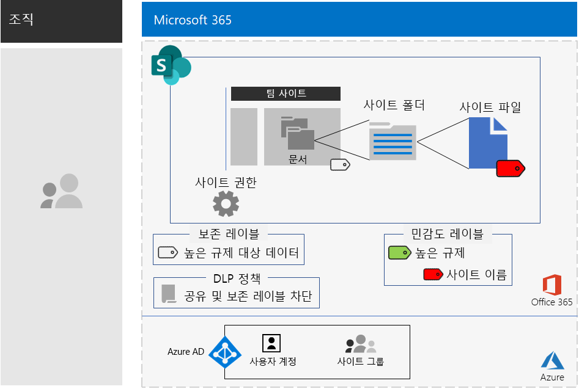

# 높은 규제 대상 데이터를 위한 SharePoint 사이트

*이 시나리오는 Microsoft 365 Enterprise E3 및 E5 버전에 적용됩니다.*

Microsoft 365 Enterprise에는 파일에 저장된 높은 규제 대상 데이터를 만들고, 저장하며, 보안을 설정할 수 있도록 하기 위해 전체 클라우드 기반 서비스 제품군이 포함되어 있습니다. 여기에는 다음과 같은 데이터가 포함됩니다.

- 지역 규제를 받는 데이터
- 영업 비밀, 재무 또는 인사 관련 정보와 조직의 전략과 같이 조직에서 가장 중요한 데이터

이러한 비즈니스 요구를 충족하는 Microsoft 365 Enterprise 클라우드 기반 시나리오에서는 다음을 요구합니다.

- SharePoint 팀 사이트에 파일(문서, 슬라이드 데크, 스프레드시트 등)을 저장합니다.
- 다음 사항을 방지하기 위해 사이트를 잠급니다.
  - 해당 사이트에 대한 Office 365 그룹의 구성원이 아닌 사용자에 액세스합니다.
  - 사이트의 멤버가 다른 사람에게 액세스 권한을 부여할 수 없습니다.
  - 사이트의 멤버 이외의 사용자가 다른 사람에게 액세스 권한을 요청할 수 없습니다.
- 사용자가 조직 외부에서 파일을 보내지 못하도록 차단하기 위한 기본적인 방법으로 SharePoint 사이트에 맞게 Office 365 보존 레이블을 구성합니다.
- 파일을 이동하는 암호화를 사용하여 사이트에서 가장 중요한 파일을 암호화합니다.
- 가장 중요한 파일이 사이트 외부에서 공유되더라도 파일을 열려면 권한이 있는 사용자 계정의 유효한 자격 증명이 필요하도록 해당 파일에 권한을 추가합니다.

다음 표에서는 이러한 시나리오의 요구 사항과 해당하는 Microsoft 365 Enterprise의 기능을 연결해서 보여 줍니다.

|||
|:-------|:-----|
| **요구 사항** | **Microsoft 365 Enterprise 기능** |
| 파일 저장 | SharePoint 팀 사이트 |
| 사이트 잠그기 | Azure Active Directory(Azure AD) 그룹 및 SharePoint 팀 사이트 권한 |
| 사이트 파일의 레이블 지정 | Office 365 보존 레이블 |
| 사용자가 조직 외부로 파일을 보내지 못하도록 차단 | Office 365의 DLP(데이터 손실 방지) 정책 |
| 사이트의 파일 모두 암호화 | Office 365 민감도 하위 레이블 |
| 사이트의 파일에 권한 추가 | Office 365 민감도 하위 레이블 |
|||

다음은 보안 SharePoint 사이트의 구성입니다.

이 시나리오를 사용하려면 다음을 배포했어야 합니다.

- 기본 인프라의 [ID](identity-infrastructure.md) 단계 및 [정보 보호](infoprotect-infrastructure.md) 단계의 1-2단계 
- [SharePoint](sharepoint-online-onedrive-workload.md).

다음 단계에서는 높은 규제 대상 데이터를 위한 SharePoint 사이트의 디자인 및 구성 작업과 채택을 유도하는 과정을 안내합니다.

가상의 대표적인 다국적 기업인 Contoso Corporation에서 연구팀을 위해 SharePoint 사이트를 설계한 방법을 보려면 이 [예제 구성](contoso-sharepoint-online-site-for-highly-confidential-assets.md)을 참조하세요.

## ID 및 장치 액세스 필수 구성 요소

SharePoint 사이트에 대한 액세스를 보호하려면 [ID 및 장치 액세스 정책](identity-access-policies.md) 및 [권장 SharePoint 액세스 정책](sharepoint-file-access-policies.md)을 구성했는지 확인합니다.

## 1단계: 디자인

높은 규제 대상 데이터에 적합한 SharePoint 사이트를 만들려면 먼저 해당 용도를 확인해야 합니다. 예를 들어, 제조 조직의 연구 및 개발 부서에는 기존 제품에 대해 현재 설계 사양을 저장할 수 있는 SharePoint 사이트와 새 제품에 대해 공동 작업할 수 있는 장소가 필요합니다. 연구 & 개발 부서의 구성원과 선택된 임원만 해당 사이트에 액세스할 수 있습니다.

그 용도는 다음과 같은 필수 구성 항목을 파악하는 것입니다.

- 사이트의 문서 부분에 할당할 Office 365 보존 레이블 및 해당 레이블의 DLP 정책
- 사이트에 저장된 중요한 파일에 적용하는 Office 365 민감도 하위 레이블 설정

일단 결정이 끝나면 이러한 설정을 사용하여 두 번째 작업 단계에서 사이트를 구성합니다. 

### 1단계: Office 365 보존 레이블 및 DLP 정책

SharePoint 팀 사이트의 문서 부분에 적용된 Office 365 보존 레이블은 사이트에 저장된 모든 파일에 대한 기본 분류 방법을 제공합니다.
 
높은 규제 대상 데이터를 위한 SharePoint 사이트에서는 사용할 Office 보존 365 레이블을 결정해야 합니다.

Office 365 레이블의 디자인 고려 사항에 대해서는 [Office 365 분류 및 레이블](https://docs.microsoft.com/office365/securitycompliance/secure-sharepoint-online-sites-and-files#office-365-retention-labels)을 참조하세요.

중요한 정보를 보호하고 우발적이거나 의도적인 노출을 방지하려면 DLP 정책을 사용합니다. 자세한 내용은 이 [개요](https://docs.microsoft.com/office365/securitycompliance/data-loss-prevention-policies)를 참조하세요.

SharePoint 사이트의 경우, 사용자가 외부 사용자와 파일을 공유하려고 할 때 사용자를 차단하도록 사이트에 할당된 Office 365 보존 레이블에 대한 DLP 정책을 구성해야 합니다. 

### 2단계: Office 365 민감도 하위 레이블

가장 중요한 파일에 암호화 및 권한 집합을 사용하려면 Office 365 민감도 하위 레이블을 적용해야 합니다.

하위 레이블은 기존 레이블 아래에 있습니다. 예를 들어, 높은 규제 대상 레이블 아래에 연구 및 개발 하위 레이블을 만들 수 있습니다. 높은 규제 대상 데이터를 위한 SharePoint 사이트의 경우, 사이트 구성원만 해당 레이블이 지정된 파일을 열고 변경할 수 있도록 권한을 구성합니다.

적용된 하위 레이블은 파일에 표시됩니다. 파일이 사이트 외부로 누출되는 경우에도 권한이 있는 인증된 사용자 계정만 파일을 열 수 있습니다.

### 디자인 결과

다음 사항이 결정되었습니다.

- 해당 Office 365 보존 레이블 및 레이블과 연결된 DLP 정책
- 암호화 및 사용 권한을 포함하는 Office 365 민감도 하위 레이블의 설정

## 2단계: 구성

두 번째 작업 단계에서는 첫 번째 작업 단계에서 결정한 설정을 구현하여 높은 규제 대상 데이터에 대한 SharePoint 사이트를 만듭니다.

### 1단계: 해당하는 Office 365 그룹의 소유자와 구성원과 함께 개인용 SharePoint 팀 사이트 만들기

개인용 SharePoint 팀 사이트를 만들려면 [이 지침]( https://support.office.com/article/create-a-site-in-sharepoint-online-4d1e11bf-8ddc-499d-b889-2b48d10b1ce8)을 따릅니다.

### 2단계: SharePoint 팀 사이트에 대한 추가 사용 권한 설정 구성

SharePoint 사이트에서 사용 권한 설정을 구성합니다.

1.  도구 모음에서 설정 아이콘을 클릭한 다음, **사이트 권한**을 클릭합니다.
2.  **사이트 권한** 창에서 **고급 권한 설정**을 클릭합니다.
3.  브라우저의 새 **권한** 탭에서 **액세스 요청 설정**을 클릭합니다.
4.  **액세스 요청 설정** 대화 상자에서 **구성원이 사이트와 개별 파일 및 폴더를 공유할 수 있도록 허용합니다.** 및 **액세스 요청 허용**(3개의 확인란이 모두 선택 취소됨)을 선택 취소하고 **확인**을 클릭합니다.

이 설정을 사용하는 경우, 사이트 그룹 구성원이 다른 구성원과 사이트를 공유하거나 구성원이 아닌 사용자가 해당 사이트의 액세스를 요청할 수 있는 기능을 사용할 수 없습니다.

### 3단계: Office 365 보존 레이블에 맞게 사이트 구성

[Office 365 레이블 및 DLP를 사용하여 SharePoint 파일 보호](https://docs.microsoft.com/office365/enterprise/protect-sharepoint-online-files-with-office-365-labels-and-dlp)의 지침에 따라 다음을 수행합니다.

1. 필요한 경우, 높은 규제 대상 데이터에 대한 보존 레이블을 만들고 게시합니다.
2. 1단계에서 만든 보존 레이블에 맞게 사이트를 구성합니다.
3. 2단계에서 만든 보존 레이블을 사용하고 사용자가 조직 외부에서 파일을 전송하지 못하도록 높은 규제 대상 데이터에 대한 DLP 정책을 만듭니다.

#### 4단계: 사이트의 Office 365 민감도 하위 레이블 만들기

모든 사용자가 모든 파일에 적용할 수 있는 높은 규제 대상 데이터의 민감도 레이블과 달리, 하위 레이블이 지정된 파일이 다음을 수행하려면 보안 사이트에 고유한 레이블이 필요합니다.

- 암호화되고 해당 암호화가 파일에 표시됩니다.
-   사이트 그룹의 구성원만 파일을 열 수 있도록 사용자 지정 권한을 포함합니다.

사이트에 저장된 파일에 보안 수준을 추가적으로 설정하려면, 높은 규제 대상 파일에 대한 일반적인 레이블의 하위 레이블인 새 민감도 레이블을 구성해야 합니다. 사이트의 그룹 구성원만 높은 규제 대상 레이블의 하위 레이블 목록에서 이 레이블을 볼 수 있습니다.

[여기](https://docs.microsoft.com/microsoft-365/compliance/encryption-sensitivity-labels)에 있는 지침을 참조하여 높은 규제 대상 데이터에 사용할 레이블의 하위 레이블을 다음과 같은 설정으로 구성할 수 있습니다.

- 파일에 하위 레이블을 지정할 때 쉽게 연상할 수 있도록 하위 레이블 이름에 사이트 이름을 포함합니다.
- 암호화가 사용하도록 설정됩니다.
- 사이트 그룹에 공동 작성자 권한이 있습니다.

### 구성 결과

구성한 항목

- SharePoint 사이트에 더 제한적인 사용 권한 설정
- SharePoint 사이트의 문서 부분에 할당된 Office 365 보존 레이블
- Office 365 보존 레이블에 대한 DLP 정책
- 파일을 암호화하고 팀 사이트 그룹의 구성원만 공동 작성자 액세스 권한이 있는 사이트에 저장된 가장 중요한 파일에 적용할 수 있는 Office 365 하위 레이블 

구성 결과는 다음과 같습니다.

다음은 해당 사이트에 저장된 파일에 민감도 하위 레이블을 적용한 사용자의 예입니다.

## 3단계: 사용자 채택 주도

중요한 파일을 저장하고 액세스하는 데 지속적으로 사용되는 경우 높은 규제 대상 데이터의 SharePoint 사이트에서 해당 데이터만 보호할 수 있습니다. 사용자가 습관과 선호 사항을 변경해야 하므로 가장 어려운 단계입니다. 

예를 들어, 중요한 파일을 USB 드라이브나 개인 클라우드 기반 스토리지 솔루션에 저장하는 데 익숙한 직원이 이제는 높은 규제 대상 데이터에 적합한 SharePoint 사이트에만 해당 파일을 저장해야 합니다.

### 1단계: 사용자 교육

구성을 완료한 후 사이트 액세스 그룹의 구성원인 사용자 집합에게 다음을 교육합니다.

- 새 사이트를 사용하여 중요한 파일을 보호해야 하는 중요성 및 높은 규제 대상 데이터 누출 결과(예: 법적 영향, 규제 벌금, 랜섬웨어 또는 경쟁적 우위 박탈)
- 사이트 및 해당 파일에 액세스하는 방법
- 사이트에서 새 파일을 만들고 로컬에 저장된 새 파일을 업로드하는 방법
- DLP 정책으로 외부에서 파일을 공유하지 못하도록 차단하는 방법
- 사이트의 하위 레이블을 사용하여 가장 중요한 파일의 레이블을 지정하는 방법
- 파일이 사이트 외부로 누출된 경우에도 하위 레이블이 파일을 보호하는 방법

이 교육에는 사용자가 이러한 작업 및 해당 결과를 경험해볼 수 있도록 하기 위해 실무 위주의 연습이 포함되어 있습니다.

### 2단계: 정기적으로 사용 현황 및 파일 검토 수행

교육이 진행되고 몇 주 후에 SharePoint 사이트의 SharePoint 관리자는 다음을 수행할 수 있습니다.

- 사이트의 사용 현황을 분석하고 예상 사용 현황과 비교합니다.
- 매우 중요한 파일의 레이블이 민감도 하위 레이블로 지정되었는지 확인합니다.

필요에 따라 사용자를 재교육합니다.

### 사용자 채택 계획

높은 규제 대상 파일이 높은 규제 대상 데이터를 위한 SharePoint 사이트에만 저장되고 가장 중요한 파일에 해당 사이트의 민감도 하위 레이블이 적용되어 있습니다.

## Contoso Corporation에서 Microsoft 365 Enterprise를 배포한 방식

Contoso 기업은 프랑스 파리에 본사를 둔 가상의 대표적인 글로벌 제조 대기업입니다. Contoso가 파리, 모스크바, 뉴욕, 베이징, 방갈로르의 연구 팀을 위해 [보안 SharePoint 사이트](contoso-sharepoint-online-site-for-highly-confidential-assets.md)를 설계 및 구성한 다음 채택을 촉진하는 방법을 알아봅니다. 

## 참고 항목

[배포 가이드](deploy-microsoft-365-enterprise.md)

[테스트 랩 가이드](m365-enterprise-test-lab-guides.md)

