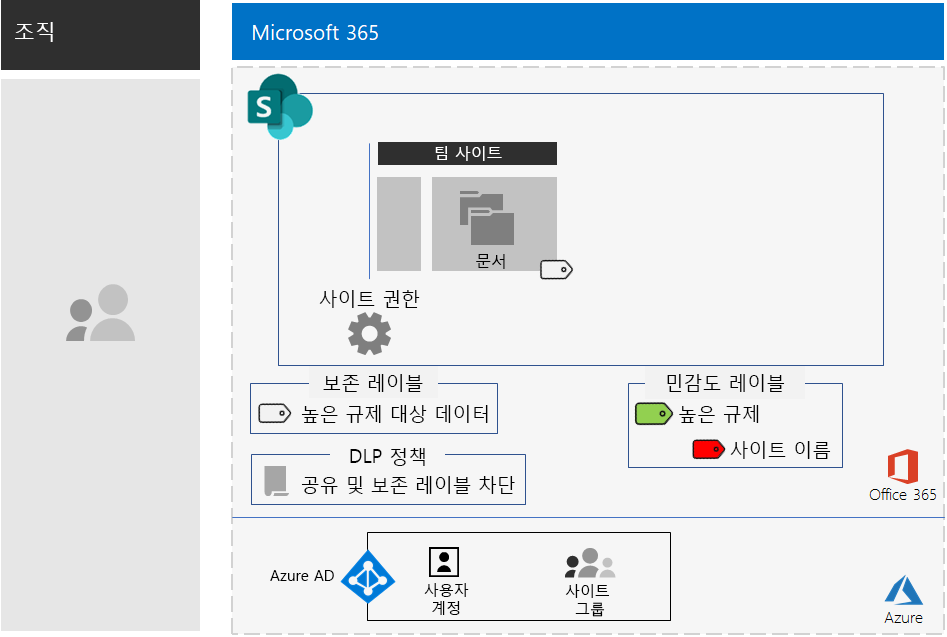
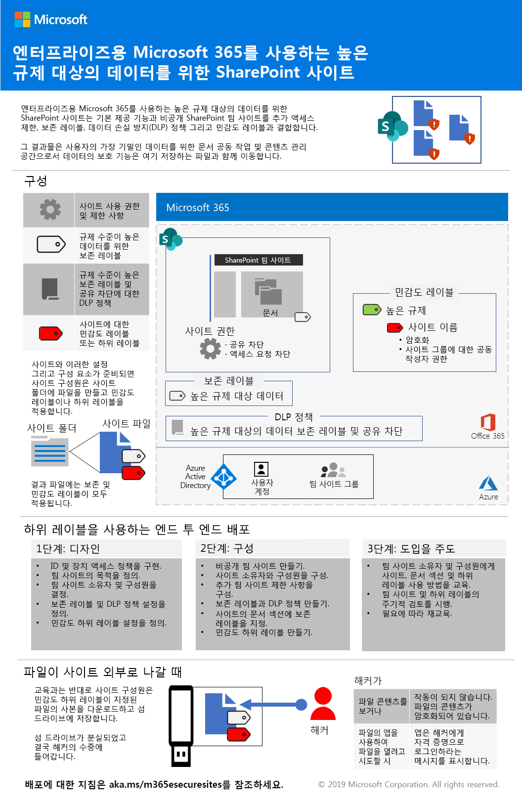
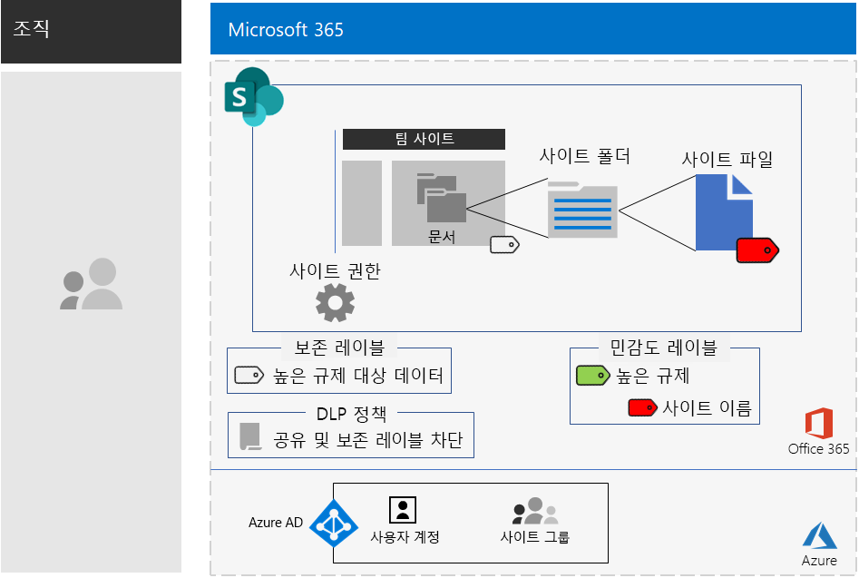

# 높은 규제 대상 데이터를 위한 SharePoint 사이트SharePoint sites for highly regulated data

*이 시나리오는 Microsoft 365 Enterprise E3 및 E5 버전에 적용됩니다.**This scenario applies to both the E3 and E5 versions of Microsoft 365 Enterprise*

Microsoft 365 Enterprise에는 완전한 클라우드 기반 서비스 제품군이 포함되어 있어 파일에 저장된 고도로 집중적으로 규제되는 데이터를 생성, 저장, 보호 및 관리할 수 있습니다. 여기에는 다음과 같은 데이터가 포함됩니다.Microsoft 365 Enterprise includes a full suite of cloud-based services so that you can create, store, secure, and manage your highly regulated data stored in files. This includes data that is:

- 지역 규제를 받는 데이터Subject to regional regulations.
- 영업 비밀, 재무 또는 인사 관련 정보와 조직의 전략과 같이 조직에서 가장 중요한 데이터The most valuable data for your organization, such as trade secrets, financial or human resources information, and organization strategy.

>[!Note]
> Microsoft Teams를 사용하는 비슷한 시나리오는 [여기서](secure-teams-highly-regulated-data-scenario.md) 확인할 수 있습니다.A similar scenario using Microsoft Teams is [here](secure-teams-highly-regulated-data-scenario.md).
>

이러한 비즈니스 요구를 충족하는 Microsoft 365 Enterprise 클라우드 기반 시나리오에서는 다음을 요구합니다.A Microsoft 365 Enterprise cloud-based scenario that meets this business need requires that you:

- SharePoint 팀 사이트에 파일(문서, 슬라이드 데크, 스프레드시트 등)을 저장합니다.Store files (documents, slide decks, spreadsheets, etc.) in a SharePoint team site.
- 다음 사항을 방지하기 위해 사이트를 잠급니다.Lock down the site to prevent:
  - 해당 사이트에 대한 Office 365 그룹의 구성원이 아닌 사용자에 액세스합니다.Access to users who are not members of the Office 365 group for the site.
  - 사이트의 멤버가 다른 사람에게 액세스 권한을 부여할 수 없습니다.Members of the site from granting access to others.
  - 사이트의 멤버 이외의 사용자가 다른 사람에게 액세스 권한을 요청할 수 없습니다.Non-members of the site from requesting access to the site.
- 사용자가 조직 외부에서 파일을 보내지 못하도록 차단하기 위한 기본적인 방법으로 SharePoint 사이트에 맞게 Office 365 보존 레이블을 구성합니다.Configure an Office 365 retention label for your SharePoint sites as a default way to block users from sending files outside the organization.
- 파일을 이동하는 암호화를 사용하여 사이트에서 가장 중요한 파일을 암호화합니다.Encrypt the most sensitive files of the site with encryption that travels with the file.
- 가장 중요한 파일이 사이트 외부에서 공유되더라도 파일을 열려면 권한이 있는 사용자 계정의 유효한 자격 증명이 필요하도록 해당 파일에 권한을 추가합니다.Add permissions to the most sensitive files so that if even if they get shared outside of the site, opening the file still requires the valid credentials of a user account that has permission.

다음 표에서는 이러한 시나리오의 요구 사항과 해당하는 Microsoft 365 Enterprise의 기능을 연결해서 보여 줍니다.The following table maps the requirements of this scenario to a feature of Microsoft 365 Enterprise.

|||
|:-------|:-----|
| **요구 사항****Requirement** | **Microsoft 365 Enterprise 기능****Microsoft 365 Enterprise feature** |
| 파일 저장Store files | SharePoint 팀 사이트SharePoint team sites |
| 사이트 잠그기Lock down the site | Office 365 그룹 및 SharePoint 팀 사이트 사용 권한Office 365 groups and SharePoint team site permissions |
| 사이트 파일의 레이블 지정Label the files of the site | Office 365 보존 레이블Office 365 retention labels |
| 사용자가 조직 외부로 파일을 보내지 못하도록 차단Block users when sending files outside the organization | Office 365의 DLP(데이터 손실 방지) 정책Data Loss Prevention (DLP) policies in Office 365 |
| 사이트의 파일 모두 암호화Encrypt all of the files of the site | Office 365 민감도 레이블 혹은 하위 레이블Office 365 sensitivity labels or sublabels |
| 사이트의 파일에 권한 추가Add permissions to the files of the site | Office 365 민감도 레이블 혹은 하위 레이블Office 365 sensitivity labels or sublabels |
|||

다음은 보안 SharePoint 사이트의 구성 예시입니다.Here is an example configuration for a secure SharePoint site.

이 시나리오를 사용하려면 다음을 배포했어야 합니다.This scenario requires that you have already deployed:

- 기본 인프라의 [ID](identity-infrastructure.md) 단계 및 [정보 보호](infoprotect-infrastructure.md) 단계의 1-2단계The [Identity](identity-infrastructure.md) phase and steps 1 and 2 of the [Information protection](infoprotect-infrastructure.md) phase of the foundation infrastructure. 
- [SharePoint](sharepoint-online-onedrive-workload.md).[SharePoint](sharepoint-online-onedrive-workload.md).

다음 단계에서는 높은 규제 대상 데이터를 위한 SharePoint 사이트의 디자인 및 구성 작업과 채택을 유도하는 과정을 안내합니다.The following phases step you through designing, configuring, and driving adoption for SharePoint sites for highly regulated data.

 이 시나리오의 1 페이지 요약서를 보려면 [높은 규제 대상 데이터를 위한 SharePoint 사이트 포스터](../media/teams-sharepoint-online-sites-highly-regulated-data/SharePointSitesHighlyRegulatedData.pdf)를 참조하세요.For a 1-page summary of this scenario, see the [SharePoint sites for highly regulated data poster](../media/teams-sharepoint-online-sites-highly-regulated-data/SharePointSitesHighlyRegulatedData.pdf).

이 포스터를 [PDF](https://github.com/MicrosoftDocs/microsoft-365-docs/raw/public/microsoft-365/enterprise/media/teams-sharepoint-online-sites-highly-regulated-data/SharePointSitesHighlyRegulatedData.pdf)나 [PowerPoint](https://github.com/MicrosoftDocs/microsoft-365-docs/raw/public/microsoft-365/enterprise/media/teams-sharepoint-online-sites-highly-regulated-data/SharePoint-Sites-Highly-Regulated-Data.pptx) 형식으로 다운로드할 수 있고, Letter, Legal, Tabloid(11 x 17) 크기 용지에 인쇄할 수도 있습니다.You can also download this poster in [PDF](https://github.com/MicrosoftDocs/microsoft-365-docs/raw/public/microsoft-365/enterprise/media/teams-sharepoint-online-sites-highly-regulated-data/SharePointSitesHighlyRegulatedData.pdf) or [PowerPoint](https://github.com/MicrosoftDocs/microsoft-365-docs/raw/public/microsoft-365/enterprise/media/teams-sharepoint-online-sites-highly-regulated-data/SharePoint-Sites-Highly-Regulated-Data.pptx) formats and print it on letter, legal, or tabloid (11 x 17)-sized paper.

## ID 및 장치 액세스 필수 구성 요소Identity and device access prerequisites

SharePoint 사이트에 대한 액세스를 보호하려면 [ID 및 장치 액세스 정책](identity-access-policies.md) 및 [권장 SharePoint 액세스 정책](sharepoint-file-access-policies.md)을 구성했는지 확인합니다.To protect access to the SharePoint site, ensure that you have configured [identity and device access policies](identity-access-policies.md) and the [recommended SharePoint access policies](sharepoint-file-access-policies.md).

## 1단계: 디자인Phase 1: Design

높은 규제 대상 데이터에 적합한 SharePoint 사이트를 만들려면 먼저 해당 용도를 확인해야 합니다.To create a SharePoint site for highly regulated data, you must first identify its purpose. 예를 들어, 제조 조직의 연구 및 개발 부서에는 기존 제품에 대해 현재 설계 사양을 저장할 수 있는 SharePoint 사이트와 새 제품에 대해 공동 작업할 수 있는 장소가 필요합니다.For example, the research and development department of a manufacturing organization needs a SharePoint site to store current design specifications for existing products and a place to collaborate on new products. 연구 & 개발 부서의 구성원과 선택된 임원만 해당 사이트에 액세스할 수 있습니다.Only members of the Research & Development department and selected executives will be allowed to access the site.

그 용도는 다음과 같은 필수 구성 항목을 파악하는 것입니다.That purpose will drive the determination of essential configuration items such as:

- 사이트의 문서 부분에 할당할 Office 365 보존 레이블 및 해당 레이블의 DLP 정책The Office 365 retention label to assign to the Documents portion of the site and DLP policies for the label
- 사이트에 저장된 중요한 파일에 적용하는 Office 365 민감도 하위 레이블 설정The settings of an Office 365 sensitivity sublabel that users apply to highly sensitive files stored in the site

일단 결정이 끝나면 이러한 설정을 사용하여 두 번째 작업 단계에서 사이트를 구성합니다.Once determined, you use these settings to configure the site in Phase 2. 

### 1단계: Office 365 보존 레이블 및 DLP 정책Step 1 Office 365 retention labels and DLP policies

SharePoint 팀 사이트의 문서 부분에 적용된 Office 365 보존 레이블은 사이트에 저장된 모든 파일에 대한 기본 분류 방법을 제공합니다.When applied to the Documents portion of a SharePoint team site, Office 365 retention labels provide a default method of classifying all files stored on the site.
 
높은 규제 대상 데이터를 위한 SharePoint 사이트에서는 사용할 Office 보존 365 레이블을 결정해야 합니다.For SharePoint sites for highly regulated data, you need to determine which Office 365 retention label to use.

Office 365 레이블의 디자인 고려 사항에 대해서는 [Office 365 분류 및 레이블](https://docs.microsoft.com/office365/securitycompliance/secure-sharepoint-online-sites-and-files#office-365-retention-labels)을 참조하세요.For the design considerations of Office 365 labels, see [Office 365 classification and labels](https://docs.microsoft.com/office365/securitycompliance/secure-sharepoint-online-sites-and-files#office-365-retention-labels).

중요한 정보를 보호하고 우발적이거나 의도적인 노출을 방지하려면 DLP 정책을 사용합니다. 자세한 내용은 이 [개요](https://docs.microsoft.com/office365/securitycompliance/data-loss-prevention-policies)를 참조하세요.To protect sensitive information and prevent its accidental or intentional disclosure, you use DLP policies. For more information, see this [overview](https://docs.microsoft.com/office365/securitycompliance/data-loss-prevention-policies).

SharePoint 사이트의 경우, 사용자가 외부 사용자와 파일을 공유하려고 할 때 사용자를 차단하도록 사이트에 할당된 Office 365 보존 레이블에 대한 DLP 정책을 구성해야 합니다.For SharePoint sites, you must configure a DLP policy for the Office 365 retention label assigned to the site to block users when they attempt to share files with external users. 

### 2단계: Office 365 민감도 하위 레이블Step 2: Your Office 365 sensitivity sublabel

가장 민감한 파일에 암호화 및 사용 권한 집합을 사용하려면 Office 365 민감도 레이블 혹은 하위 레이블을 적용해야 합니다.To provide encryption and a set of permissions to your most sensitive files, users must apply an Office 365 sensitivity label or sublabel. 하위 레이블은 기존 레이블 아래에 있습니다.A sublabel exists under an existing label. 

전역적인 사용과 개별적 개인 팀에 소수의 레이블이 필요한 경우에는 민감도 레이블을 사용합니다.Use a sensitivity label when you need is a small number of labels for both global use and individual private teams. 다수의 레이블을 보유하고 있거나 귀하의 높은 규제 대상 레이블 아래에 보안 사이트의 레이블을 구성하려는 경우 민감도 하위 레이블을 사용합니다.Use a sensitivity sublabel when you have a large number of labels or want to organize labels for secure sites the under your highly regulated label. 

적용된 레이블 혹은 하위 레이블의 설정은 파일에 표시됩니다.The settings of the applied label or sublabel travel with the file. 파일이 사이트 외부로 누출되는 경우에도 권한이 있는 인증된 사용자 계정만 파일을 열 수 있습니다.Even if it is leaked outside the site, only authenticated user accounts that have permissions can open it.

### 디자인 결과Design results

다음 사항이 결정되었습니다.You have determined the following:

- 해당 Office 365 보존 레이블 및 레이블과 연결된 DLP 정책The appropriate Office 365 retention label and the DLP policy that is associated with the label
- 암호화 및 사용 권한을 포함하는 Office 365 민감도 하위 레이블의 설정The settings of the Office 365 sensitivity sublabel that include encryption and permissions

## 2단계: 구성Phase 2: Configure

두 번째 작업 단계에서는 첫 번째 작업 단계에서 결정한 설정을 구현하여 높은 규제 대상 데이터에 대한 SharePoint 사이트를 만듭니다.In this phase, you take the settings determined in Phase 1 and implement them to create a SharePoint site for highly regulated data.

### 1단계: 해당하는 Office 365 그룹의 소유자와 구성원과 함께 개인용 SharePoint 팀 사이트 만들기Step 1: Create a private SharePoint team site with owners and members of the corresponding Office 365 group

개인용 SharePoint 팀 사이트를 만들려면 [이 지침]( https://support.office.com/article/create-a-site-in-sharepoint-online-4d1e11bf-8ddc-499d-b889-2b48d10b1ce8)을 따릅니다.Follow [these instructions]( https://support.office.com/article/create-a-site-in-sharepoint-online-4d1e11bf-8ddc-499d-b889-2b48d10b1ce8) to create a private SharePoint team site.

### 2단계: SharePoint 팀 사이트에 대한 추가 사용 권한 설정 구성Step 2: Configure additional permissions settings for the SharePoint team site

SharePoint 사이트에서 사용 권한 설정을 구성합니다.From the SharePoint site, configure these permission settings.

1. 도구 모음에서 설정 아이콘을 클릭한 다음, **사이트 사용 권한**을 클릭합니다.In the tool bar, click the settings icon, and then click **Site permissions**.
2. **사이트 사용 권한** 창에 있는 **공유 설정**에서 **공유 설정 변경**을 클릭합니다.In the **Site permissions** pane, under **Sharing Settings**, click **Change sharing settings**.
3. **사용 권한 공유**에서 **사이트 소유자만 파일, 폴더 및 사이트를 공유할 수 있습니다**를 선택합니다.Under **Sharing permissions**, choose **Only site owners can share files, folders, and the site**.
4. **액세스 요청 허용**을 해제한 다음, **저장**을 클릭합니다.Turn off **Allow access requests**, and then click **Save**.

이 설정을 사용하는 경우, 사이트 그룹 구성원이 다른 구성원과 사이트를 공유하거나 구성원이 아닌 사용자가 해당 사이트의 액세스를 요청할 수 있는 기능을 사용할 수 없습니다.With these settings, the ability for site group members to share the site with other members or for non-members to request access to the site is disabled.

### 3단계: Office 365 보존 레이블에 맞게 사이트 구성Step 3: Configure the site for an Office 365 retention label

[Office 365 레이블 및 DLP를 사용하여 SharePoint 파일 보호](https://docs.microsoft.com/office365/enterprise/protect-sharepoint-online-files-with-office-365-labels-and-dlp)의 지침에 따라 다음을 수행합니다.Use the instructions in [Protect SharePoint files with Office 365 labels and DLP](https://docs.microsoft.com/office365/enterprise/protect-sharepoint-online-files-with-office-365-labels-and-dlp) to:

1. 필요한 경우, 높은 규제 대상 데이터에 대한 보존 레이블을 만들고 게시합니다.Create and publish a retention label for highly regulated data (if needed).
2. 1단계에서 만든 보존 레이블에 맞게 사이트를 구성합니다.Configure the site for the retention label created in step 1.
3. 2단계에서 만든 보존 레이블을 사용하고 사용자가 조직 외부에서 파일을 전송하지 못하도록 높은 규제 대상 데이터에 대한 DLP 정책을 만듭니다.Create a DLP policy for highly regulated data that uses the retention label created in step 2 and blocks users from sending files outside the organization

#### 4단계: 사이트의 Office 365 민감도 하위 레이블 만들기Step 4: Create an Office 365 sensitivity sublabel for the site

모든 사용자가 모든 파일에 적용할 수 있는 높은 규제 대상 데이터의 민감도 레이블과 달리, 하위 레이블이 지정된 파일이 다음을 수행하려면 보안 사이트에 고유한 레이블이 필요합니다.Unlike a sensitivity label for highly regulated data that anyone can apply to any file, a secure site needs its own sublabel so that files with the sublabel assigned:

- 암호화되고 해당 암호화가 파일에 표시됩니다.Are encrypted and the encryption travels with the file.
- 사이트 그룹의 구성원만 파일을 열 수 있도록 사용자 지정 권한을 포함합니다.Contain custom permissions so that only members of the site group can open it.

사이트에 저장된 파일에 보안 수준을 추가적으로 설정하려면, 높은 규제 대상 파일을 위한 일반적인 레이블의 새로운 민감도 레이블 혹은 하위 레이블을 구성해야 합니다.To accomplish this additional level of security for files stored in the site, you must configure a new sensitivity label or a sublabel of the general label for highly regulated files. 이는 사이트의 그룹 구성원만이 높은 규제 대상 레이블의 하위 레이블 목록에서 볼 수 있습니다.Only group members for the site will see it in the list of sublabels for the highly regulated label.

[여기](https://docs.microsoft.com/microsoft-365/compliance/encryption-sensitivity-labels)에 있는 지침을 참조하여 높은 규제 대상 데이터에 사용하는 레이블 혹은 하위 레이블을 다음과 같은 설정으로 구성할 수 있습니다:Use the instructions [here](https://docs.microsoft.com/microsoft-365/compliance/encryption-sensitivity-labels) to configure a label or a sublabel of the label you are using for highly regulated files with the following settings:

- 파일에 레이블 혹은 하위 레이블을 지정할 때 쉽게 연상할 수 있도록 레이블 혹은 하위 레이블 이름은 사이트 이름을 포함합니다.The name of the label or sublabel contains the name of the site for easy association when assigning the label or sublabel to a file.
- 암호화가 사용하도록 설정됩니다.Encryption is enabled.
- 사이트 그룹에 공동 작성자 권한이 있습니다.The site group has Co-Author permissions.

### 구성 결과Configuration results

구성한 항목You have configured the following:

- SharePoint 사이트에 더 제한적인 사용 권한 설정More restrictive permission settings on the SharePoint site
- SharePoint 사이트의 문서 부분에 할당된 Office 365 보존 레이블An Office 365 retention label assigned to the Documents portion of the SharePoint site
- Office 365 보존 레이블에 대한 DLP 정책A DLP policy for the Office 365 retention label
- 파일을 암호화하고 팀 사이트 그룹의 구성원만 공동 작성자 액세스 권한이 있는 사이트에 저장된 가장 중요한 파일에 적용할 수 있는 Office 365 레이블 혹은 하위 레이블An Office 365 sensitivity label or sublabel that users can apply to the most sensitive files stored in the site, which encrypts the file and only allows Co-Author access for members of the team site group 

다음은 높은 규제 대상의 레이블의 하위 레이블을 사용하는 결과의 구성입니다.Here is the resulting configuration that uses a sublabel of the Highly regulated label.

다음은 해당 사이트에 저장된 파일에 하위 레이블을 적용한 사용자의 예시입니다.Here is an example of a user that has applied the sublabel to a file stored in the site.

## 3단계: 사용자 채택 주도Phase 3: Drive user adoption

중요한 파일을 저장하고 액세스하는 데 지속적으로 사용되는 경우 높은 규제 대상 데이터의 SharePoint 사이트에서 해당 데이터만 보호할 수 있습니다.A SharePoint site for highly regulated data can only protect that data if it is consistently used for storage and access of sensitive files. 사용자가 습관과 선호 사항을 변경해야 하므로 가장 어려운 단계입니다.This is the hardest phase because it relies on users changing their habits and preferences. 

예를 들어, 중요한 파일을 USB 드라이브나 개인 클라우드 기반 스토리지 솔루션에 저장하는 데 익숙한 직원이 이제는 높은 규제 대상 데이터에 적합한 SharePoint 사이트에만 해당 파일을 저장해야 합니다.For example, employees that are used to storing sensitive files on USB drives or on personal cloud-based storage solutions will now have to store them exclusively in a SharePoint site for highly regulated data.

### 1단계: 사용자 교육Step 1: Train your users

구성을 완료한 후 사이트의 구성원인 사용자 집합에게 다음을 교육합니다.After completing your configuration, train the set of users who are members of the site:

- 새 사이트를 사용하여 중요한 파일을 보호해야 하는 중요성 및 높은 규제 대상 데이터 누출 결과(예: 법적 영향, 규제 벌금, 랜섬웨어 또는 경쟁적 우위 박탈)On the importance of using the new site to protect valuable files and the consequences of a highly regulated data leak, such as legal ramifications, regulatory fines, ransomware, or loss of competitive advantage.
- 사이트 및 해당 파일에 액세스하는 방법How to access the site and its files.
- 사이트에서 새 파일을 만들고 로컬에 저장된 새 파일을 업로드하는 방법How to create new files on the site and upload new files stored locally.
- DLP 정책으로 외부에서 파일을 공유하지 못하도록 차단하는 방법How the DLP policy blocks them from sharing files externally.
- 사이트의 레이블 혹은 하위 레이블을 사용하여 가장 중요한 파일의 레이블을 지정하는 방법How to label the most sensitive files with the label or sublabel for the site.
- 파일이 사이트 외부로 누출된 경우에도 레이블 혹은 하위 레이블이 파일을 보호하는 방법How the label or sublabel protects a file even when it is leaked off the site.

이 교육에는 사용자가 이러한 작업 및 해당 결과를 경험해볼 수 있도록 하기 위해 실무 위주의 연습이 포함되어 있습니다.This training should include hands-on exercises so that the users can experience these operations and their results.

### 2단계: 정기적으로 사용 현황 및 파일 검토 수행Step 2: Conduct periodic reviews of usage and files

교육이 진행되고 몇 주 후에 SharePoint 사이트의 SharePoint 관리자는 다음을 수행할 수 있습니다.In the weeks after training, the SharePoint administrator for the SharePoint site can:

- 사이트의 사용 현황을 분석하고 예상 사용 현황과 비교합니다.Analyze usage for the site and compare it with usage expectations.
- 매우 민감한 파일에 민감도 레이블 혹은 하위 레이블이 적절히 할당되었는지 확인합니다.Verify that highly sensitive files have been properly labeled with the sensitivity label or sublabel.

  SharePoint에서 폴더를 보고 **열 추가**의 **열 표시/숨기기** 옵션을 통해 **민감도** 열을 추가하여 레이블이 할당된 파일을 볼 수 있습니다.You can see which files have a label assigned by viewing a folder in SharePoint and adding the **Sensitivity** column through the **Show/hide columns** option of **Add column**.

필요에 따라 사용자를 재교육합니다.Retrain your users as needed.

### 사용자 채택 계획User adoption results

높은 규제 대상 파일이 높은 규제 대상 데이터를 위한 SharePoint 사이트에만 저장되고 가장 중요한 파일에 해당 사이트의 민감도 레이블 혹은 하위 레이블이 적용되어 있습니다.Highly regulated files are stored exclusively on SharePoint sites for highly regulated data and the most sensitive files have the sensitivity label or sublabel for the site applied.

## Contoso Corporation에서 높은 규제 대상 데이터를 위해 SharePoint 사이트를 사용한 방법How the Contoso Corporation used a SharePoint site for highly regulated data

Contoso 기업은 가상의 대표적인 글로벌 제조 대기업입니다.The Contoso Corporation is a fictional but representative global manufacturing conglomerate. Contoso가 파리, 모스크바, 뉴욕, 베이징, 방갈로르의 연구 팀을 위해 [보안 SharePoint 사이트](contoso-sharepoint-online-site-for-highly-confidential-assets.md)를 설계 및 구성한 다음 채택을 촉진하는 방법을 알아봅니다.See how Contoso designed, configured, and then drove the adoption of a [secure SharePoint site](contoso-sharepoint-online-site-for-highly-confidential-assets.md) for their research teams in Paris, Moscow, New York, Beijing, and Bangalore. 

## 참고 항목See also

[높은 규제 대상 데이터를 위한 TeamsTeams for highly regulated data](secure-teams-highly-regulated-data-scenario.md)

[Microsoft 365 Enterprise 워크로드 및 시나리오Microsoft 365 Enterprise workloads and scenarios](deploy-workloads.md)

[Microsoft 365 생산성 라이브러리](https://aka.ms/productivitylibrary) (https://aka.ms/productivitylibrary)[Microsoft 365 Productivity Library](https://aka.ms/productivitylibrary) (https://aka.ms/productivitylibrary)

[배포 가이드Deployment guide](deploy-microsoft-365-enterprise.md)
