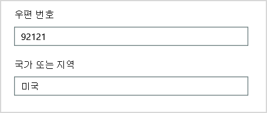

# <a name="why-you-need-to-use-powershell-for-microsoft-365"></a>Microsoft 365 용 PowerShell을 사용해야 하는 이유

*이 문서는 Microsoft 365 Enterprise와 Office 365 Enterprise에 모두 적용됩니다.*

이 Microsoft 365 관리 센터 사용하여 사용자 계정 및 Microsoft 365 관리할 수 있습니다. 온라인, Microsoft 365, Exchange Online 등의 Exchange Online Teams 서비스를 관리할 SharePoint 있습니다. 대신 PowerShell을 사용하여 이러한 서비스를 관리하는 경우 속도, 자동화 및 추가 기능에 대한 명령줄 및 스크립팅 언어 환경을 활용할 수 있습니다.

이 문서에서는 PowerShell을 사용하여 다음을 관리하는 Microsoft 365 보여줍니다.

- 보기에서 볼 수 없는 추가 정보 Microsoft 365 관리 센터

- PowerShell에서만 가능한 기능 및 설정 구성

- 대량 작업 수행

- 데이터 필터링

- 데이터 인쇄 또는 저장

- 여러 서비스 관리

Microsoft 365 PowerShell은 Windows PowerShell 서비스 및 플랫폼을 위한 명령줄 환경인 Windows 모듈 집합입니다. 이 환경에서는 추가 모듈로 확장할 수 있는 명령 셸 언어를 만듭니다. 간단한 명령이나 복잡한 명령이나 스크립트를 실행할 수 있는 방법을 제공합니다. 예를 들어 Microsoft 365 모듈용 PowerShell을 설치하고 Microsoft 365 구독에 연결한 후 다음 명령을 실행하여 해당 모듈의 모든 사용자 사서함을 나열할 Microsoft Exchange Online.

```powershell
Get-Mailbox
```

또한 웹앱을 사용하여 사서함 목록을 Microsoft 365 관리 센터 모든 웹앱에 대한 모든 사이트의 모든 목록에서 항목을 계산하는 것은 쉽지 않습니다.

Microsoft 365 PowerShell은 Microsoft 365 대신 관리하도록 Microsoft 365 관리 센터. 관리자는 PowerShell을 사용하여 Microsoft 365 명령에 대해 PowerShell을 통해서만 Microsoft 365 수 있습니다. 이러한 경우 다음 방법을 알아야 합니다.

- Microsoft 365 모듈용 PowerShell을 설치합니다(각 관리자 컴퓨터에 대해 한 번만 수행).

- 커넥트 구독에 Microsoft 365(각 PowerShell 세션에 대해 한 번).

- 명령에 필요한 PowerShell을 실행하기 위해 필요한 Microsoft 365 수집합니다.

- 명령에 대해 PowerShell을 Microsoft 365 실행합니다.

이러한 기본 기술을 학습한 후 **Get-Mailbox** 명령을 사용하여 사서함 사용자를 나열하지는 않습니다. 또한 모든 웹앱에 대한 모든 사이트의 모든 목록에 있는 모든 항목의 개수를 계산하기 위해 이전에 인용한 명령과 같은 새 명령을 만드는 방법을 이해할 수 없습니다. Microsoft와 관리자 커뮤니티는 필요한 경우 이러한 작업을 수행하는 데 도움을 줄 수 있습니다.

## <a name="powershell-for-microsoft-365-can-reveal-information-that-you-cant-see-with-the-microsoft-365-admin-center"></a>PowerShell for Microsoft 365 사용하여 볼 수 없는 정보를 볼 수 Microsoft 365 관리 센터

이 Microsoft 365 관리 센터 유용한 정보가 표시됩니다. 그러나 사용자, 라이선스, 사서함 및 사이트에 Microsoft 365 가능한 모든 정보는 표시되지 않습니다. 다음은 그룹의 사용자 *및* 그룹에 대한 Microsoft 365 관리 센터.


이 보기는 대부분의 경우에 필요한 정보를 제공합니다. 그러나 더 많은 정보가 필요한 경우도 있습니다. 예를 들어 Microsoft 365 라이선싱(Microsoft 365 사용 가능한 기능)은 사용자의 지리적 위치에 따라 부분적으로 달라 습니다. 미국에 거주하는 사용자에게 확장할 수 있는 정책 및 기능은 인도나 벨기에의 사용자로 확장할 수 있는 정책과 다를 수 있습니다. 사용자 지리적 위치를 Microsoft 365 관리 센터 단계에 따라 다음 단계를 수행합니다.

1. 사용자의 **표시 이름** 을 두 번 클릭합니다.

2. 사용자 속성 표시 창에서 세부 **정보를 선택합니다.**

3. 세부 정보 표시에서 추가 **세부 정보를 선택합니다.**

4. 국가 또는 지역 제목을 찾을 때까지 **스크롤합니다.**

     

5. 사용자의 표시 이름과 지역을 종이에 적어 두거나 복사한 다음 메모장에 붙여 넣습니다.

각 사용자에 대해 이 절차를 반복해야 합니다. 사용자가 많은 경우 이 프로세스는 지저분할 수 있습니다. PowerShell for Microsoft 365 다음 명령을 사용하여 모든 사용자에 대해 이 정보를 표시할 수 있습니다.

```powershell
Get-AzureADUser | Select DisplayName, UsageLocation
```


>[!Note]
>PowerShell Core는 이름에 *Msol이* Microsoft Azure Active Directory cmdlet을 Windows PowerShell 모듈용 Windows PowerShell 모듈을 지원하지 않습니다. 이러한 cmdlet은 해당 cmdlet에서 실행해야 Windows PowerShell.
>

결과의 예는 다음과 같습니다.

```powershell
DisplayName                               UsageLocation
-----------                               -------------
Bonnie Kearney                            GB
Fabrice Canel                             BR
Brian Johnson (TAILSPIN)                  US
Anne Wallace                              US
Alex Darrow                               US
David Longmuir                            BR
```

이 PowerShell 명령을 해석하면 다음을 실행합니다. 현재 Microsoft 365 구독의 모든 사용자를 **얻지만(Get-AzureADUser),** 각 사용자의 이름과 위치만 **표시합니다(DisplayName, UsageLocation** 선택).

PowerShell for Microsoft 365 셸 언어를 지원하기 때문에 **Get-AzureADUser** 명령으로 얻은 정보를 추가로 조작할 수 있습니다. 예를 들어 이러한 사용자를 위치별로 정렬하여 모든 브라질 사용자, 모든 미국 사용자를 함께 그룹화할 수 있습니다. 명령은 다음과 같습니다.

```powershell
Get-AzureADUser | Select DisplayName, UsageLocation | Sort UsageLocation, DisplayName
```

결과의 예는 다음과 같습니다.

```powershell
DisplayName                                 UsageLocation
-----------                                 -------------
David Longmuir                              BR
Fabrice Canel                               BR
Bonnie Kearney                              GB
Alex Darrow                                 US
Anne Wallace                                US
Brian Johnson (TAILSPIN)                    US
```

이 PowerShell 명령을 해석하면 다음을 실행합니다. 현재 Microsoft 365 구독의 모든 사용자를 되지만 각 사용자의 이름과 위치만 표시하고 먼저 해당 위치와 이름을 정렬한 다음 **이름(Sort UsageLocation, DisplayName)을** 정렬합니다.

추가 필터링을 사용할 수도 있습니다. 예를 들어 브라질 사용자에 대한 정보만 표시하려면 다음 명령을 사용합니다.

```powershell
Get-AzureADUser | Where {$_.UsageLocation -eq "BR"} | Select DisplayName, UsageLocation
```

결과의 예는 다음과 같습니다.

```powershell
DisplayName                                           UsageLocation
-----------                                           -------------
David Longmuir                                        BR
Fabrice Canel                                         BR
```

이 PowerShell 명령을 해석하면 다음을 실행합니다. 현재 Microsoft 365 해당 위치가 브라질인 구독의 모든 사용자를 얻습니다(**Where {$ \_ . UsageLocation -eq "BR"} )을** 입력한 다음 각 사용자의 이름과 위치를 표시합니다.

 **큰 도메인에 대한 참고 사항**

수만 명의 사용자가 있는 큰 도메인이 있는 경우 이 문서에 설명된 몇 가지 예제를 시도하면 스로틀이 발생할 수 있습니다. 컴퓨팅 전원 및 사용 가능한 네트워크 대역폭과 같은 요인에 따라 한 때 너무 많은 작업을 시도할 수 있습니다. 대규모 조직에서는 이러한 PowerShell 작업 중 일부를 두 개의 명령으로 분할할 수 있습니다.

예를 들어 다음 명령은 모든 사용자 계정을 반환하고 각 사용자에 대한 이름과 위치를 보여 주며,

```powershell
Get-AzureADUser | Select DisplayName, UsageLocation
```

소규모 도메인에서는 이 명령을 사용해도 아무런 문제가 없습니다. 그러나 대규모 조직에서는 이 작업을 두 개의 명령, 즉 변수에 사용자 계정 정보를 저장하는 명령과 필요한 정보를 표시하는 명령으로 분할할 수 있습니다. 다음은 예입니다.

```powershell
$x = Get-AzureADUser
$x | Select DisplayName, UsageLocation
```

이 PowerShell 명령 집합을 해석하는 것은 다음입니다.
1. 현재 구독의 모든 사용자를 Microsoft 365 변수에 정보를 저장합니다( $x (**$x = Get-AzureADUser).**
1.  변수의 내용을 $x 각 사용자의 이름과 위치만 **포함합니다( $x | DisplayName, UsageLocation을 선택합니다.**

## <a name="microsoft-365-has-features-that-you-can-only-configure-with-powershell-for-microsoft-365"></a>Microsoft 365 PowerShell로만 구성할 수 있는 기능이 Microsoft 365

이 Microsoft 365 관리 센터 대부분의 환경에 적용되는 일반적인 유용한 관리 작업에 대한 액세스를 제공하기 위한 것입니다. 즉, Microsoft 365 관리 센터 가장 일반적인 관리 작업을 수행할 수 있도록 디자인된 것입니다. 그러나 관리 센터에서 수행할 수 없는 몇 가지 작업이 있습니다.

예를 들어 비즈니스용 Skype 온라인 관리 센터에서는 사용자 지정 모임 초대를 만들기 위한 몇 가지 옵션을 제공합니다.


이러한 설정을 사용하여 모임 초대를 전문적으로 개인 설정할 수 있습니다. 그러나 모임 구성 설정에는 단순히 사용자 지정 모임 초대를 만드는 것 이상이 있습니다. 예를 들어 모임에서는 기본적으로 다음과 같은 설정이 가능합니다.

- 익명 사용자가 각 모임에 자동으로 입장할 수 있도록 설정

- 참석자가 모임을 기록하도록 설정

- 조직의 모든 사용자가 모임 참가 시 발표자로 지정되도록 설정

이러한 설정은 온라인 관리 센터의 비즈니스용 Skype 없습니다. PowerShell에서 해당 기능을 제어할 수 Microsoft 365. 다음은 이러한 세 가지 설정을 사용하지 않도록 설정하는 명령입니다.

```powershell
Set-CsMeetingConfiguration -AdmitAnonymousUsersByDefault $False -AllowConferenceRecording $False -DesignateAsPresenter "None"
```

> [!NOTE]
> 이 명령을 실행하려면 온라인 [PowerShell](https://www.microsoft.com/download/details.aspx?id=39366)모듈 비즈니스용 Skype 설치해야 합니다.

이 PowerShell 명령을 해석하는 것은 다음입니다.

1. 새 비즈니스용 Skype Online 모임 **설정(Set-CsMeetingConfiguration**)에서 익명 사용자가 모임에 자동으로 입장할 수 있도록 허용하지 않도록 **설정(-AdmitAnonymousUsersByDefault $False).**
2.  참석자들이 모임을 녹음 **녹음(-AllowConferenceRecording**$False).
3. 조직의 모든 사용자를 **발표자(-DesignateAsPresenter "None")로 지정하지 않습니다.**

이러한 기본 설정을 복원하려면(옵션을 사용하도록 설정) 다음 명령을 실행합니다.

```powershell
Set-CsMeetingConfiguration -AdmitAnonymousUsersByDefault $True -AllowConferenceRecording $True -DesignateAsPresenter "Company"
```

다른 유사한 시나리오도 있습니다. 따라서 관리자가 명령에 대해 PowerShell을 실행할 방법을 알아야 Microsoft 365 있습니다.

## <a name="powershell-for-microsoft-365-is-great-for-bulk-operations"></a>PowerShell for Microsoft 365 대량 작업에 대 한 좋은

단일 작업을 수행하면 Microsoft 365 관리 센터 인터페이스와 같은 시각적 인터페이스가 가장 소중합니다. 예를 들어 사용자 계정 하나를 사용하지 않도록 설정해야 하는 경우 관리 센터를 사용하여 확인란을 빠르게 찾아 선택을 취소할 수 있습니다. 이 작업은 PowerShell에서 유사한 작업을 수행하는 것보다 더 쉬워집니다.

그러나 여러 가지 작업이나 여러 가지 다른 작업 내에서 선택한 일부를 변경해야 하는 경우에는 Microsoft 365 관리 센터 가장 적합한 도구가 아 않을 수 있습니다. 예를 들어 수천 개의 전화 번호에 대한 prefix를 변경하거나 모든 SharePoint 사이트에서 특정 사용자 *Ken Myer를* 제거해야 합니다. 이 작업을 통해 어떻게 Microsoft 365 관리 센터?

마지막 예제에서는 온라인 SharePoint 수백 개가 있으며 Ken Meyer가 구성원으로 있는 사이트를 모르는 경우를 예로 들 수 있습니다. 다음 사이트에서 시작한 Microsoft 365 관리 센터 각 사이트에 대해 다음 절차를 수행해야 합니다.

1. 사이트의 **URL을** 선택합니다.

2. 사이트 **모음 속성 상자에서** 웹 사이트 주소 링크를 **선택하여** 사이트를 열 수 있습니다.

3. 사이트에서 공유를 **선택합니다.**

4. 공유 **대화** 상자에서 사이트에 대한 사용 권한이 있는 모든 사용자를 표시하는 링크를 선택합니다.

     

5. 공유 **대상 대화** 상자에서 고급 을 **선택합니다.**

6. 사용자 목록 아래로 스크롤하여 Ken Myer를 찾아 선택한 다음(사이트에 대한 사용 권한이 있는 경우) 사용자 권한 **제거를 선택합니다.**

수백 개의 *사이트에는* 시간이 오래 걸릴 수 있습니다.

또는 PowerShell에서 다음 명령을 실행하여 모든 Microsoft 365 Ken Myer를 제거하는 것입니다.

```powershell
Get-SPOSite | ForEach {Remove-SPOUser -Site $_.Url -LoginName "kenmyer@litwareinc.com"}
```

> [!NOTE]
> 이 명령을 사용하려면 온라인 [PowerShell SharePoint 설치해야 합니다.](/powershell/sharepoint/sharepoint-online/connect-sharepoint-online)

이 PowerShell 명령을 해석하면 다음을 실행합니다. 현재 Microsoft 365 구독의 모든 SharePoint **사이트(Get-SPOSite)를** 사용하며 각 사이트에 액세스할 수 있는 사용자 목록에서 Ken Meyer를 제거합니다(**ForEach {Remove-SPOUser -Site $ \_ ). Url -LoginName "kenmyer \@ litwareinc.com"}**).

액세스 Microsoft 365 없는 사이트를 포함하여 모든 사이트에서 Ken Meyer를 제거해야 합니다. 따라서 결과에는 액세스 권한이 없는 사이트에 대한 오류가 표시됩니다. 이 명령에 추가 조건을 사용하여 로그인 목록에 Ken Meyer가 있는 사이트에서만 Ken Meyer를 제거할 수 있습니다. 그러나 반환되는 오류는 사이트 자체에 해를 입히지 않습니다. 이 명령을 실행하기 전에 수백 개의 사이트에 대해 실행되는 데 몇 분 정도 걸릴 수 Microsoft 365 관리 센터.

다음은 다른 대량 작업 예제입니다. 이 명령을 사용하여 조직의 모든 사이트에 새 SharePoint 관리자인 *Bonnie Kearney를* 추가합니다.

```powershell
Get-SPOSite | ForEach {Add-SPOUser -Site $_.Url -LoginName "bkearney@litwareinc.com" -Group "Members"}
```

이 PowerShell 명령을 해석하면 다음이 있습니다. 현재 Microsoft 365 구독의 모든 SharePoint 사이트를 그리고 각 사이트에 대해 사이트의 구성원 그룹에 로그인 이름을 추가하여 Bonnie Kearney의 액세스를 허용합니다(**ForEach {Add-SPOUser -Site $ \_ ). Url -LoginName "bkearney \@ litwareinc.com" -Group "Members"}**).

## <a name="powershell-for-microsoft-365-is-great-at-filtering-data"></a>PowerShell for Microsoft 365 데이터를 필터링하는 데 매우 능동적입니다.

이 Microsoft 365 관리 센터 사용하여 대상 정보 하위 집합을 쉽게 찾을 수 있도록 데이터를 필터링하는 여러 가지 방법을 제공합니다. 예를 들어 Exchange에서는 사용자 사서함의 사실상 모든 속성을 기준으로 쉽게 필터링을 할 수 있습니다. 예를 들어 Bloomington에 거주하는 모든 사용자의 사서함 목록은 다음과 같습니다.


Exchange 관리 센터에서도 필터 기준을 조합할 수 있습니다. 예를 들어 Bloomington에 거주하고 Finance 부서에서 일하는 모든 사용자에 대한 사서함을 찾을 수 있습니다.

그러나 Exchange 관리 센터에서 할 수 있는 Exchange 있습니다. 예를 들어 *Bloomington* 또는 San Diego에 거주하는 사용자 사서함이나 Bloomington에 거주하지 않는 모든 사용자에 대한 사서함을 쉽게 찾을 수 없습니다.

다음 PowerShell을 사용하여 Microsoft 365 Bloomington 또는 San Diego에 거주하는 모든 사용자에 대한 사서함 목록을 얻을 수 있습니다.

```powershell
Get-User | Where {$_.RecipientTypeDetails -eq "UserMailbox&quot; -and ($_.City -eq &quot;San Diego&quot; -or $_.City -eq &quot;Bloomington")} | Select DisplayName, City
```

결과의 예는 다음과 같습니다.

```powershell
DisplayName                              City
-----------                              ----
Alex Darrow                              San Diego
Bonnie Kearney                           San Diego
Julian Isla                              Bloomington
Rob Young                                Bloomington
```

이 PowerShell 명령을 해석하면 다음을 실행합니다. 현재 Microsoft 365 구독에 사서함이 있는 모든 사용자를 San Diego 또는 Bloomington(**Where {$ \_ . RecipientTypeDetails -eq "UserMailbox" -and ($ \_ . City -eq "San Diego" -or $ \_ . City -eq "Bloomington")}** 을 표시한 다음 각 구/시의 이름과 도시를 표시합니다(**Select DisplayName, City**).

Bloomington을 제외한 모든 곳에 거주하는 사람에 대한 모든 사서함을 나열하는 명령은 다음과 같습니다.

```powershell
Get-User | Where {$_.RecipientTypeDetails -eq "UserMailbox" -and $_.City -ne "Bloomington"} | Select DisplayName, City
```

결과의 예는 다음과 같습니다.

```powershell
DisplayName                               City
-----------                               ----
MOD Administrator                         Redmond
Alex Darrow                               San Diego
Allie Bellew                              Bellevue
Anne Wallace                              Louisville
Aziz Hassouneh                            Cairo
Belinda Newman                            Charlotte
Bonnie Kearney                            San Diego
David Longmuir                            Waukesha
Denis Dehenne                             Birmingham
Garret Vargas                             Seattle
Garth Fort                                Tulsa
Janet Schorr                              Bellevue
```

이 PowerShell 명령을 해석하면 다음을 실행합니다. Bloomington에 사서함이 없는 현재 Microsoft 365 구독의 모든 사용자(**Where {$ \_ . RecipientTypeDetails -eq "UserMailbox" -and $ \_ . City -ne "Bloomington"}** 을 입력한 다음 각 구/시의 이름과 도시를 표시합니다.

### <a name="use-wildcards"></a>와일드카드 사용

PowerShell 필터에서 와일드카드 문자를 사용하여 이름의 일부와 일치할 수도 있습니다. 예를 들어 사용자 계정을 찾고 있는 경우를 가정해 보겠습니다. 사용자의 성은 *Anderson* 또는 *Henderson* 또는 *Jorgenson* 입니다.

검색 도구를 사용하고 Microsoft 365 관리 센터 세 가지 검색을 수행하여 검색에서 해당 사용자를 추적할 수 있습니다.

- *Anderson*  에 대해,

- *Henderson*  에 대해,

- *Jorgenson*  에 대해

이 세 이름은 모두 "son"으로 끝나기 때문에 PowerShell에 이름이 "son"으로 끝나는 모든 사용자를 표시하게 할 수 있습니다. 명령은 다음과 같습니다.

```powershell
Get-User -Filter '{LastName -like "*son"}'
```

이 PowerShell 명령을 해석하면 다음을 실행합니다. 현재 Microsoft 365 구독의 모든 사용자를이지만 성으로 끝나는 사용자만 나열하는 필터를 사용하세요(**-Filter '{LastName -like " \* son"}'**). 이 문자는 사용자의 성에 있는 문자 \* 집합을 지칭합니다.

## <a name="powershell-for-microsoft-365-makes-it-easy-to-print-or-save-data"></a>PowerShell for Microsoft 365 쉽게 데이터를 인쇄하거나 저장할 수 있습니다.

이 Microsoft 365 관리 센터 사용하여 데이터 목록을 볼 수 있습니다. 다음은 비즈니스용 Skype Online을 사용하도록 설정된 사용자 목록을 표시하는 비즈니스용 Skype 예입니다.


해당 정보를 파일에 저장하려면 문서나 워크시트에 붙여 Microsoft Excel 합니다. 두 경우 모두 추가 서식이 필요할 수 있습니다. 또한 표시된 Microsoft 365 관리 센터 직접 인쇄할 수 있는 방법은 없습니다.

다행히 PowerShell을 사용하여 목록을 표시할 뿐만 아니라 목록으로 쉽게 가져올 수 있는 파일에 저장할 수도 Excel. 다음은 비즈니스용 Skype Online 사용자 데이터를 CSV(콤보로 구분된 값) 파일에 저장하는 예제 명령으로, 이 파일을 워크시트의 표로 Excel 있습니다.

```powershell
Get-CsOnlineUser | Select DisplayName, UserPrincipalName, UsageLocation | Export-Csv -Path "C:\Logs\SfBUsers.csv" -NoTypeInformation
```

결과의 예는 다음과 같습니다.


이 PowerShell 명령을 해석하면 다음을 실행합니다. 현재 비즈니스용 Skype 온라인 사용자 모두를 Microsoft 365(**Get-CsOnlineUser**); 사용자 이름, UPN 및 위치만 얻습니다(**Select DisplayName, UserPrincipalName, UsageLocation**); 그런 다음 C: \\ \\ **LogsSfBUsers.csv(Export-Csv -Path "C: \\ Logs \\SfBUsers.csv" -NoTypeInformation)라는** CSV 파일에 해당 정보를 저장합니다.

옵션을 사용하여 이 목록을 XML 파일 또는 HTML 페이지로 저장할 수도 있습니다. 실제로 추가 PowerShell 명령을 사용하면 원하는 사용자 지정 서식을 Excel 파일로 직접 저장할 수 있습니다.

목록을 기본 프린터로 직접 표시하는 PowerShell 명령의 출력을 기본 프린터로 보낼 수도 Windows. 다음은 명령의 예입니다.

```powershell
Get-CsOnlineUser | Select DisplayName, UserPrincipalName, UsageLocation | Out-Printer
```

인쇄된 문서의 모양은 다음과 같습니다.


이 PowerShell 명령을 해석하면 다음을 실행합니다. 현재 비즈니스용 Skype Online 사용자 모두를 Microsoft 365 있습니다. 사용자 이름, UPN 및 위치만 얻습니다. 그런 다음 기본 Windows **프린터(Out-Printer)로 해당 정보를 전송합니다.**

인쇄된 문서의 서식은 PowerShell 명령 창의 표시 형식과 동일합니다. 하드 카피를 얻기 위해 다음을 **추가하기만 | 명령 끝까지의** 출력 프린터입니다.

## <a name="powershell-for-microsoft-365-lets-you-manage-across-server-products"></a>PowerShell for Microsoft 365 사용하여 여러 서버 제품을 관리할 수 있습니다.

구성 요소를 구성하는 Microsoft 365 함께 작동하도록 디자인되었습니다. 예를 들어 새 사용자를 추가하여 새 Microsoft 365 사용자의 부서 및 전화 번호와 같은 정보를 지정하는 경우를 가정해 보겠습니다. 이 정보는 Microsoft 365 Online, 비즈니스용 Skype 또는 Exchange 서비스에서 사용자 정보에 액세스하는 경우 사용할 수 SharePoint.

그러나 이러한 방식은 제품군 전체에 적용되는 일반적인 정보에만 해당됩니다. 사용자의 사서함에 대한 정보와 같은 제품별 Exchange 일반적으로 제품군 전체에서 사용할 수 없습니다. 예를 들어 사용자의 사서함을 사용할 수 있는지 여부에 대한 정보는 Exchange 관리 센터에서만 사용할 수 있습니다.

모든 사용자에 대해 다음 정보를 표시하는 보고서를 만들려는 경우를 가정해 보겠습니다.

- 사용자의 표시 이름

- 사용자에게 라이선스가 있는지 Microsoft 365

- 사용자의 Exchange 사서함이 사용하도록 설정되었는지 여부

- 사용자가 비즈니스용 Skype 온라인을 사용할 수 있도록 설정되었는지 여부

보고서에서 이러한 보고서를 쉽게 만들 수 Microsoft 365 관리 센터. 대신 워크시트와 같은 정보를 저장할 별도의 문서를 Excel 합니다. 그런 다음 Microsoft 365 관리 센터 사용자 이름 및 라이선스 정보를 모두 확인하여 Exchange 관리 센터에서 사서함 정보를 비즈니스용 Skype Online 관리 센터에서 비즈니스용 Skype Online 정보를 확인한 다음 해당 정보를 결합합니다.

또는 PowerShell 스크립트를 사용하여 보고서를 컴파일하는 것입니다.

다음 예제 스크립트는 이 문서에서 지금까지 본 명령보다 더 복잡합니다. 그러나 PowerShell을 사용하여 다른 보기를 만들기 어려운 정보 보기를 만들 수 있는 가능성을 보여 주게 됩니다. 다음은 필요한 목록을 컴파일하고 표시하는 스크립트입니다.

```powershell
$x = Get-AzureADUser

foreach ($i in $x)
    {
      $y = Get-Mailbox -Identity $i.UserPrincipalName
      $i | Add-Member -MemberType NoteProperty -Name IsMailboxEnabled -Value $y.IsMailboxEnabled

      $y = Get-CsOnlineUser -Identity $i.UserPrincipalName
      $i | Add-Member -MemberType NoteProperty -Name EnabledForSfB -Value $y.Enabled
    }

$x | Select DisplayName, IsLicensed, IsMailboxEnabled, EnabledforSfB
```

결과의 예는 다음과 같습니다.

```powershell
DisplayName             IsLicensed   IsMailboxEnabled   EnabledForSfB
-----------             ----------   ----------------   --------------
Bonnie Kearney          True         True               True
Fabrice Canel           True         True               True
Brian Johnson           False        True               False
Anne Wallace            True         True               True
Alex Darrow             True         True               True
David Longmuir          True         True               True
Katy Jordan             False        True               False
Molly Dempsey           False        True               False
```

이 PowerShell 스크립트를 해석하는 것은 다음입니다.

1. 현재 Microsoft 365 구독의 모든 사용자를 다운로드하고 정보를 $x 변수에 *저장합니다(* $x =**Get-AzureADUser).**
1. 변수에 있는 모든 사용자에 대해 실행되는 루프를 $x(**foreach($i)를 $x.**
1. 이름이 $y  변수를 정의하고 사용자의 사서함 정보를 저장합니다( $y **= Get-Mailbox -Identity $i.UserPrincipalName).**
1. *IsMailBoxEnabled라는* 사용자 정보에 새 속성을 추가합니다. 사용자 사서함의 IsMailBoxEnabled 속성 **값($i | Add-Member -MemberType NoteProperty -Name IsMailboxEnabled -Value $y.IsMailboxEnabled)으로** 설정하십시오.
1. *이라는 변수를 $y* 정의하고 사용자의 비즈니스용 Skype Online 정보($y =**Get-CsOnlineUser -Identity $i.UserPrincipalName)를** 저장합니다.
1. *EnabledForSfB라는* 사용자 정보에 새 속성을 추가합니다. 이 속성을 사용자의 비즈니스용 Skype Online 정보(**$i | Add-Member -MemberType NoteProperty -Name EnabledForSfB -Value $y.Enabled)의** Enabled 속성 값으로 설정합니다.
1. 사용자 목록을 표시하지만 이름, 라이선스 여부, 사서함을 사용할 수 있는지 여부 및 비즈니스용 Skype Online에 대해 사용하도록 설정되어 있는지 여부를 나타내는 두 가지 새 속성만 $x |**DisplayName, IsLicensed, IsMailboxEnabled, EnabledforSfB를 선택합니다.**

## <a name="see-also"></a>참고 항목

[Microsoft 365용 PowerShell 시작](getting-started-with-microsoft-365-powershell.md)

[PowerShell로 Microsoft 365 사용자 계정, 라이선스 및 그룹 관리](manage-user-accounts-and-licenses-with-microsoft-365-powershell.md)

[Microsoft 365에서 Windows PowerShell을 사용하여 보고서 만들기](use-windows-powershell-to-create-reports-in-microsoft-365.md)