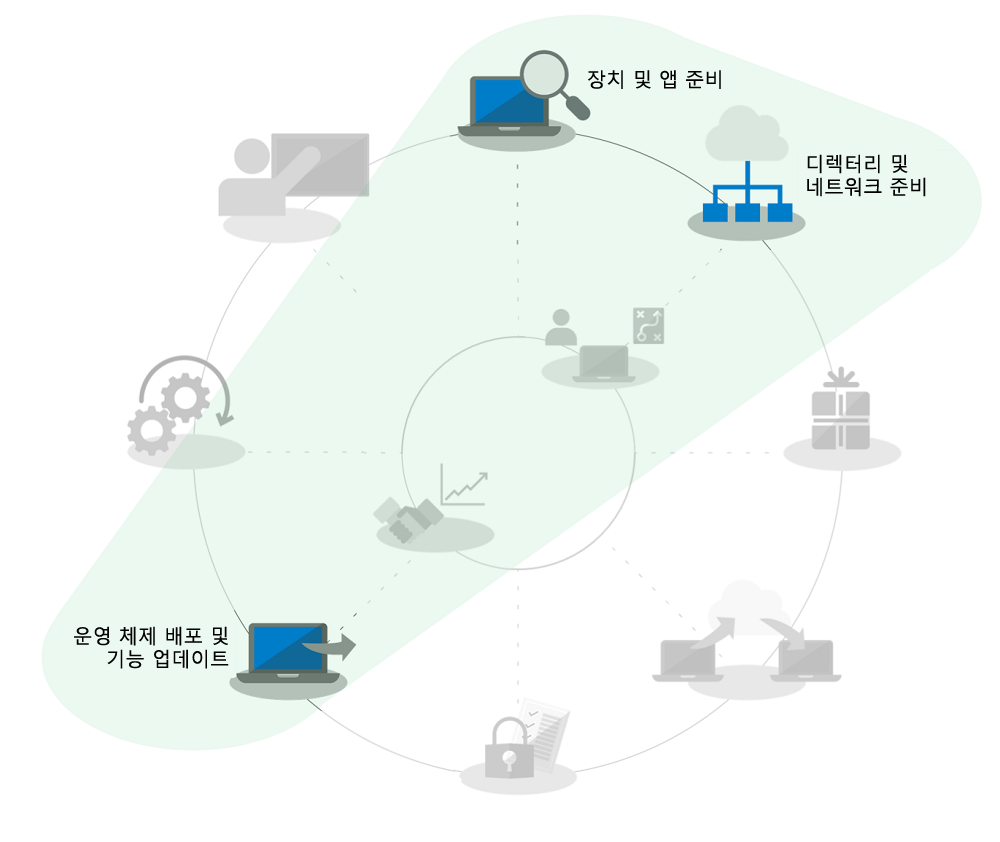
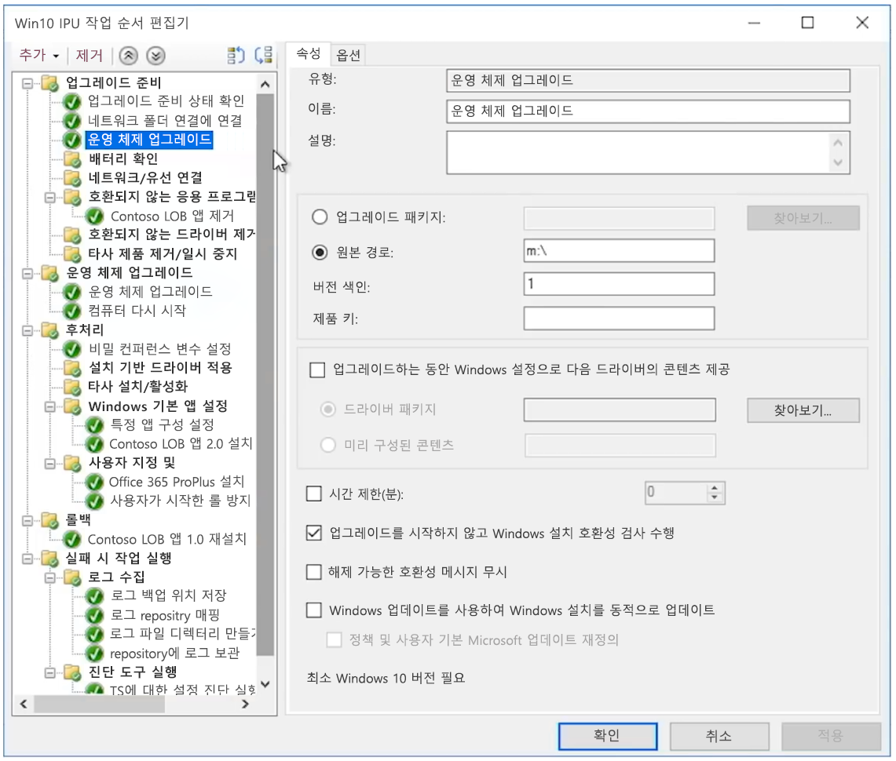

# 대규모 조직을 위한 Windows 7에서 Windows 10으로 현재 위치에서 자동 업그레이드

2020년 1월 14일 기준으로 Windows 7을 실행하는 PC에 대한 보안 업데이트 또는 지원이 더 이상 제공되지 않습니다. 여러 옵션을 배포할 수 있는 Windows 7에서 Windows 10으로의 전환에 대한 IT 커뮤니티의 일반적인 질문은 "Windows 7에서 Windows 10으로 가장 빠르게 이동하는 방법은 무엇입니까?"입니다. 짧은 대답은 기존 PC의 현재 위치에서 업그레이드를 수행하여 데스크톱 배포 프로세스의 여러 측면에 중점을 줄이는 것입니다.

현재 위치 업그레이드를 사용하면 다양한 데스크톱 배포 프로세스 범위가 특히 크게 줄어듭니다.

  - 필수 LOB(기간 업무) 앱의 **응용 프로그램 패키징** 및 재배송 - Windows 7 환경에서 바로 전달됩니다.

  - **파일 마이그레이션** 및 기본 사용자 설정 - 같은 사용자가 장치를 보유하고 있는 경우 이전 설치에서 전달됩니다.

위의 배포 프로세스 휠 그래픽에서 회색으로 표시된 작업은 완전히 무시할 수 있는 항목이 아니지만, 시간을 절약하기 위해 보안 구성을 전달하고 배포 후 소프트웨어 업데이트 프로세스를 변경한다고 가정합니다. 2012년부터 개인적으로 구입한 Windows 컴퓨터는 대부분 Windows 7이 사전에 포함되지 않았기 때문에 Windows 구성 요소에 대한 사용자 교육은 사용자가 집에서 주로 수행한 것으로 가정합니다. 그리고 2015년에 Windows 10이 출시된 이래로 대부분의 Windows 7 홈 시스템도 Windows 10으로 업그레이드되었습니다.

## 현재 위치 업그레이드 안정성, 보호책 및 규모

Windows 10의 현재 위치 업그레이드는 파일 마이그레이션 또는 응용 프로그램 재설치 없이 Windows 7 이상을 실행하는 기존 장치를 Windows 10으로 이전하는 안정된 방법입니다. 현재 위치 업그레이드를 수행한 후에 사용자 파일, 설정 및 사용 가능한 앱은 이전 Windows 7 설치와 일치합니다. 유사 아키텍처(32 비트에서 32 비트 또는 64 비트에서 64 비트로)와 유사 Windows 버전(Professional에서 Pro 또는 Enterprise에서 Enterprise로)으로 업그레이드하는 경우에도 업그레이드가 가능합니다.

업그레이드 프로세스는 기본적으로 이전 Windows 설치를 업그레이드의 일부로 백업하므로 업그레이드 실패 시나 장치 또는 응용 프로그램이 업그레이드 후 제대로 작동하지 않는 경우 컴퓨터가 Windows 7로 롤백될 수 있습니다. 업그레이드된 PC는 기본적으로 10일 안에 필요한 경우 수동으로 Windows 7로 롤백할 수 있습니다.

현재 위치 업그레이드는 [Microsoft Endpoint Configuration Manager](https://docs.microsoft.com/configmgr/osd/deploy-use/create-a-task-sequence-to-upgrade-an-operating-system) 또는 [Microsoft Deployment Toolkit](https://docs.microsoft.com/windows/deployment/upgrade/upgrade-to-windows-10-with-the-microsoft-deployment-toolkit)과 같은 운영 체제 배포 도구를 사용하여 자동화할 수 있습니다. 이 문서에서는 추가 지원을 위해 관련 리소스에 대한 링크와 함께 자동화된 접근 방법과 최적화를 중점적으로 설명합니다.

## 적은 수의 컴퓨터 업그레이드

단일 컴퓨터 또는 소수의 컴퓨터의 경우 수동으로 업그레이드를 하는 접근법은 자동화된 접근법과 비교했을 때 가장 좋은 옵션입니다. [Microsoft Store](https://go.microsoft.com/fwlink/p/?LinkId=808282), 다른 소프트웨어 대리점 또는 볼륨 라이선스가 있는 경우 [볼륨 라이선스 서비스 센터](https://www.microsoft.com/licensing/servicecenter/default.aspx)에서 필수 소프트웨어와 라이선스를 확인할 수 있습니다. 단일 PC를 Windows 10으로 업그레이드하는 방법과 업그레이드 후 복원 옵션에 대한 자세한 내용은 [Windows 7에서 Windows 10으로 수동 업그레이드 단계별 가이드](https://docs.microsoft.com/microsoft-365/enterprise/windows-7-to-windows-10-upgrade)를 참조하세요.

## 많은 컴퓨터를 업그레이드하는 방법

수십 또는 수천 대의 컴퓨터를 관리하는 경우 가장 좋은 방법은 Microsoft Endpoint Configuration Manager 또는 Microsoft Deployment Toolkit을 사용하여 작업 순서 자동화를 사용하여 현재 위치 업그레이드를 수행하는 것입니다. 이 과정은 업그레이드하는 PC의 수에 따라 대부분의 상황에서 매우 안정적이지만 여전히 규모에 따라 성공할 수 있도록 필요한 테스트 및 제어 기능을 갖추고 있습니다.

즉, Azure Active Directory, Office 및 LOB(기간 업무) 앱 제공 및 패키징 및 사용자 파일 마이그레이션과 관련된 디렉토리 준비 또는 작업을 건너 뛸 수 있으므로 업그레이드의 일부로 이러한 측면이 유지되므로 최소한의 보안이 유지되어야 합니다. 이러한 영역은 시간이 지나면서 모두 개선될 수 있습니다.

업그레이드 배포 옵션은[ OS 배포 및 기능 업데이트](https://www.aka.ms/mdd6)에서 다루며 관리 상호 작용이 거의 또는 전혀 없는 자동화된 방식으로 Windows 10 설치 프로그램을 실행하는 스크립트 솔루션을 쉽게 작성할 수 있지만, 작업 순서에 따라 다음을 보다 세부적으로 제어할 수 있습니다.

  - 사전 배포 검사 수행,

  - 드라이브 암호화 상태 사전 업그레이드 관리,

  - 알려진 문제를 일으키는 드라이버 제거 및 앱 사전 업그레이드 

  - 추가 드라이버 설치 및 앱 사후 업그레이드,

  - 드라이브 암호화 상태 사후 업그레이드 관리,

  - 업그레이드가 실패한 경우 앱이 제거된 또는 드라이버가 재설치된 PC를 이전 상태로 복원,

  - 비즈니스 준비 상태를 달성하기 위해 구성해야 하는 다른 모든 항목과 함께

다음과 같은 경우에는 가장 일반적인 이유로 업그레이드를 완료하지 못할 수 있습니다.

  - 오래된 장치 드라이버

  - 타사 디스크 암호화

  - 맬웨어 방지, VPN 또는 가상화와 같은 낮은 수준의 코드 솔루션

[업그레이드 작업 순서](https://docs.microsoft.com/configmgr/osd/deploy-use/create-a-task-sequence-to-upgrade-an-operating-system) 서식 파일은 Microsoft Endpoint Configuration Manager 현재 분기에 기본 제공되며, 여러 릴리스에서 사용할 수 있습니다. 최근 릴리스에서는 장치 및 Office 호환성 준비 상태를 확인하고 네트워크 트래픽을 줄이며 OneDrive 백업과 같은 새로운 옵션을 구성하는 프로세스가 더욱 효율적으로 수행되도록 하는 Configuration Manager에 대한 중요한 기술 향상이 있었습니다. 이 [Microsoft Mechanics 쇼](https://youtu.be/CYRnAmCD7ls)에서 Configuration Manager OS 배포에 대한 최신 업데이트를 확인하세요.

Microsoft Endpoint Configuration Manager를 사용하지 않는 경우 Microsoft Deployment Toolkit을 사용하여 업그레이드 배포 작업 순서를 작성하고 실행할 수 있습니다.

## 사전 캐시 작업 순서 업그레이드

Configuration Manager 배포 작업 순서의 [사전 캐시 옵션](https://docs.microsoft.com/configmgr/osd/deploy-use/create-a-task-sequence-to-upgrade-an-operating-system#configure-pre-cache-content)을 사용하면 작업 순서에 따라 운영 체제를 업그레이드하기 전에 클라이언트에서 관련 OS 업그레이드 패키지 콘텐츠를 다운로드할 수 있습니다. 이전에는 작업 시퀀스를 시작하면 패키지 내용 다운로드가 시작되었습니다. 사전 캐시 콘텐츠는 클라이언트가 배포를 받자마자 해당 OS 업그레이드 패키지 및 기타 모든 참조된 컨텐츠만 다운로드할 수 있는 옵션도 제공됩니다.

호환성 검사와 결합된 사전 캐시 작업 시퀀스

패키지 다운로드 시간을 절약하는 것 외에도 업그레이드 패키지를 사전 캐시하고 Windows 설치 프로그램을 사용하여 실제 Windows 업그레이드를 실행하기 전에 현재 위치 업그레이드가 성공할지를 평가할 수 있습니다. 다음 명령줄 구문을 사용하여 호환성 검사를 자동으로 실행하고 Windows 설치 프로그램에서 장치를 업그레이드 준비 상태로 평가하는지 여부를 확인할 수 있습니다.

그런 다음 로그가 정의된 서버 경로로 전송되고 Windows 설치가 사용자에게 표시되지 않고 사용자 조작이 없이도 종료합니다.

로그 자체의 결과는 다음과 같습니다.

1.  설치 프로그램에서 호환성 문제가 발견되지 않고 PC가 모든 요구 사항을 충족하는 것으로 나타나는 경우 MOSETUP\_E\_COMPAT\_SCANONLY (0xC1900210)를 반환합니다.

2.  설치 프로그램에서 호환되지 않는 것으로 알려진 앱과 같은 조치를 취할 수 있는 호환성 문제가 발견되는 경우 MOSETUP\_E\_COMPAT\_INSTALLREQ\_BLOCK (0xC1900208)을 반환합니다.

3.  설치 프로그램에서 Windows 10에 적합하지 않은 PC를 발견하면 MOSETUP\_E\_COMPAT\_SYSREQ\_BLOCK (0xC1900200)을 반환합니다.

4.  설치 프로그램에서 PC에 설치할 여유 공간이 충분하지 않으면 MOSETUP\_E\_ INSTALLDISKSPACE\_BLOCK (0xC190020E)을 반환합니다.

컬렉션에서 많은 수의 PC에 호환성 검사와 함께 사전 캐시 시퀀스를 배포했다면 장치 준비를 위해 로그 파일의 구문 분석을 시작할 수 있습니다. 위에 나열된 출력을 사용하여 \#1(0xC1900210)은 "배포 준비"로 동작할 수 있으며 \#4(0xC190020E)는 디스크 공간을 확보하여 실행될 수 있습니다. 여기서는 삭제 대상에 대한 주의를 기울이고 싶겠지만, Windows 업데이트 정리, 휴지통 및 임시 파일에서 시작하면 업그레이드할 수 있는 충분한 공간을 제공하는 경우가 많습니다. PC가 현재 위치 업그레이드를 위해 준비될 때까지 필요에 따라 자주 호환성 검사를 실행할 수 있습니다. Windows 설치 명령 줄 옵션에 대한 자세한 정보는 <https://aka.ms/setupswitches>에서 찾을 수 있습니다.

## [데스크톱 배포 센터](https://aka.ms/howtoshift)
