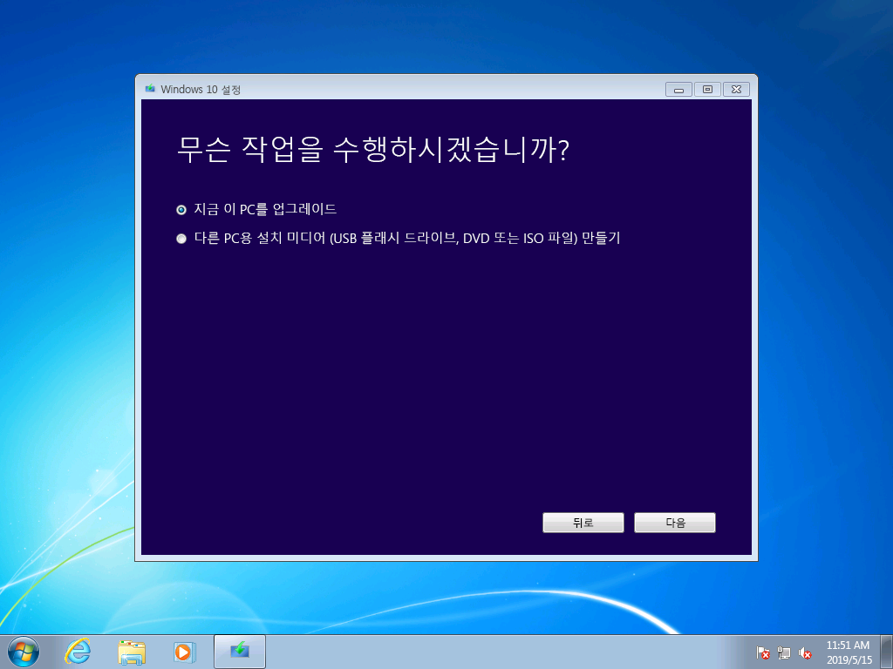
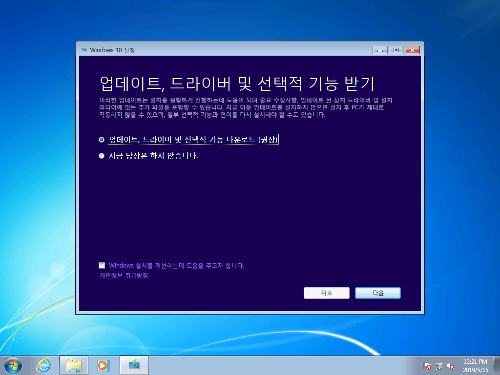
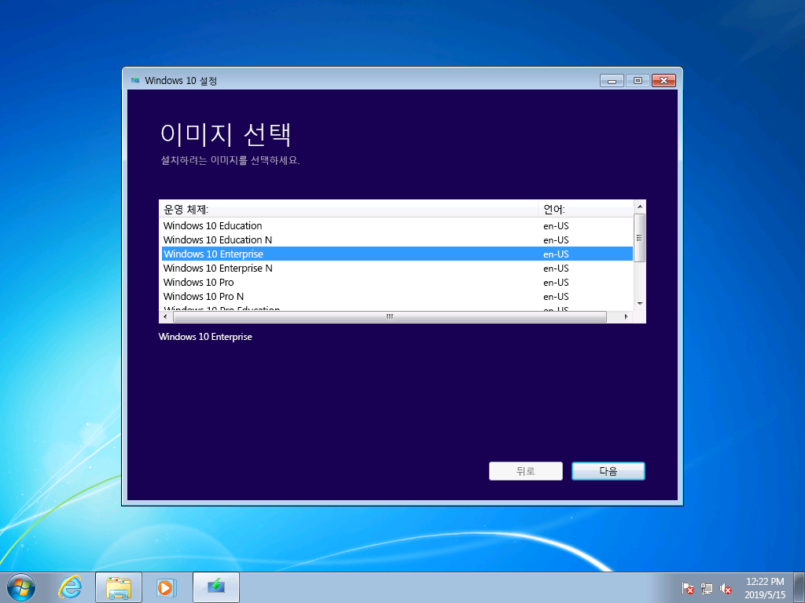
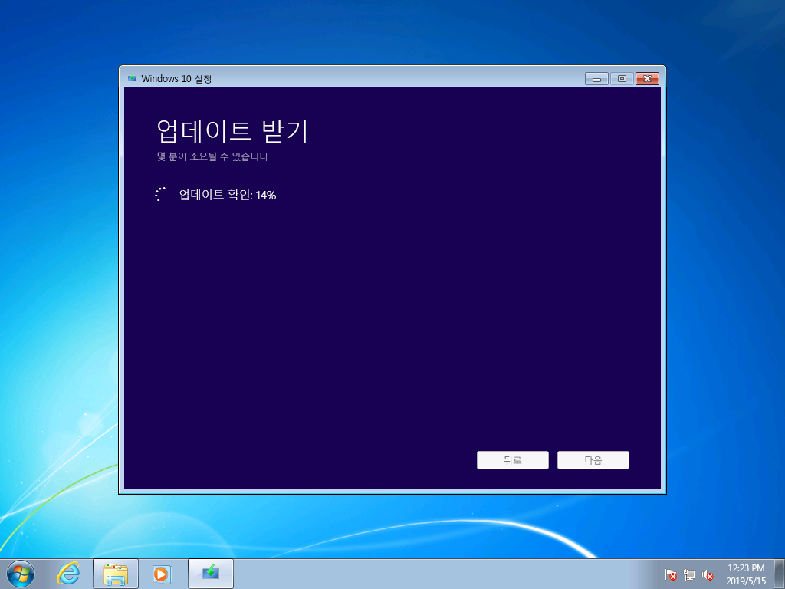
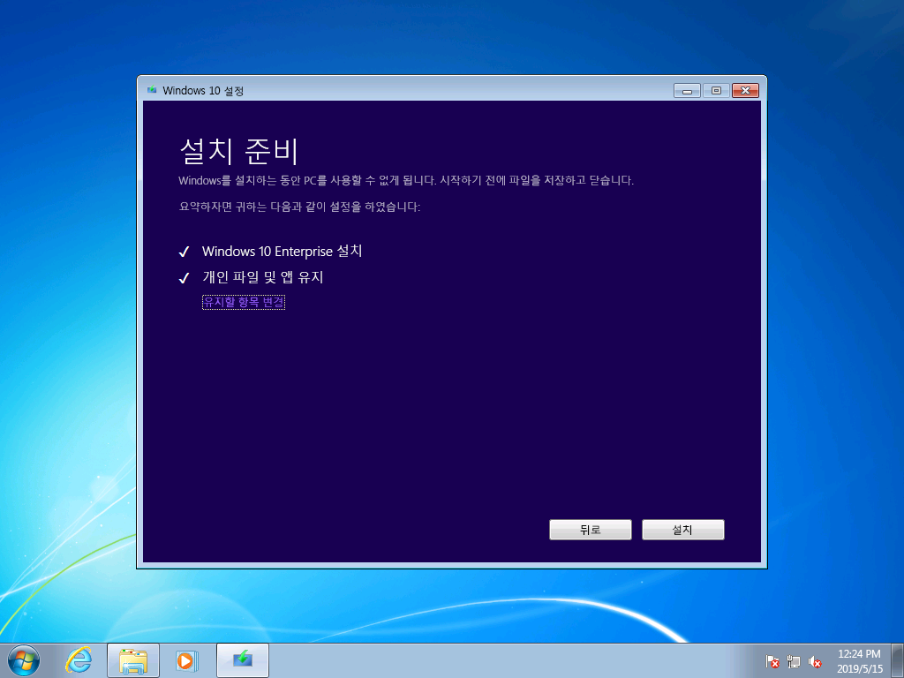
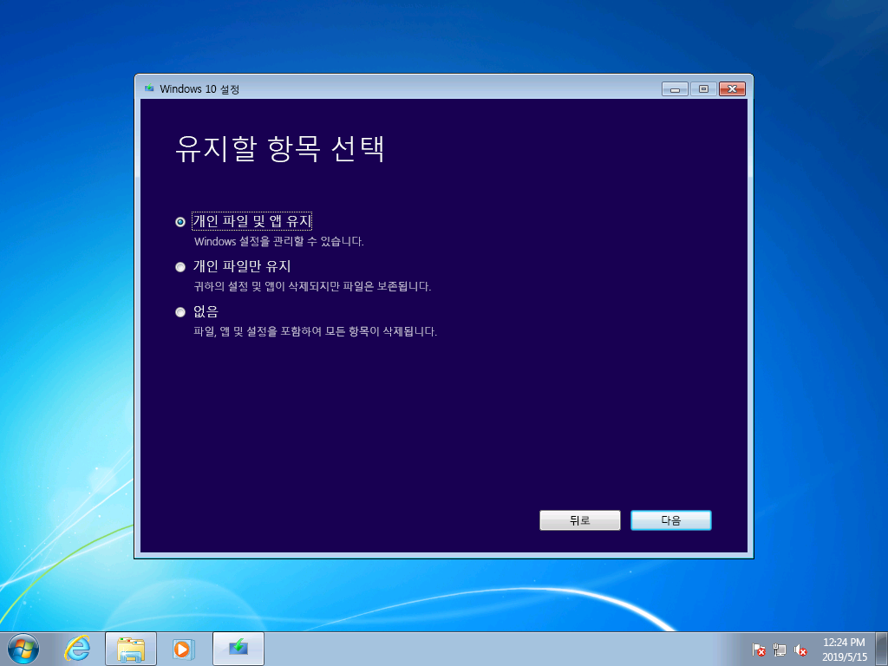
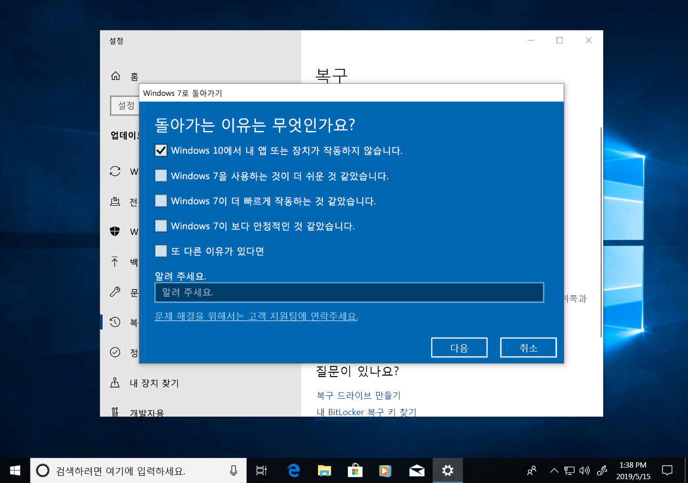

# Windows 7에서 Windows 10으로 수동 업그레이드 단계별 가이드

이 문서에서는 Windows 7 Enterprise PC를 Windows 10 Enterprise로 수동 업그레이드하는 방법을 설명합니다. Home 및 Professional을 비롯한 기타 Windows 7 버전의 경우, 업그레이드 방법이 매우 비슷하며, 이에 더해 미디어 만들기 도구를 사용하여 직접 업그레이드할 수도 있습니다. 모든 버전션의 Windows 7에서 Windows 10으로 업그레이드하려면 유효한 제품 키와 기존 Windows 버전과 동일하거나 높은 버전의 Windows가 필요합니다. 예를 들어, Windows 7 Professional은 Windows 10 Pro로 업그레이드할 수 있지만 Windows 10 Home으로는 업그레이드할 수 없습니다. Windows 7 Ultimate는 Windows 10 Pro로 업그레이드해야 합니다.

## 미디어 만들기 도구 또는 ISO 파일을 사용한 Windows 10 업그레이드

[미디어 만들기 도구](https://www.microsoft.com/software-download/windows10ISO)를 사용하여 직접 Windows 10으로 업그레이드할 수도 있고, 미디어 만들기 도구를 사용하여 Windows 10을 ISO 파일로 다운로드할 수도 있습니다. 먼저 기존 시스템이 32비트인지 아니면 64비트인지와 Windows 7의 시스템 기본 언어 및 버전(예: Home, Professional 또는 Enterprise)을 확인해 두어야 합니다. Windows 7의 경우 이 정보는 제어판 \> 시스템 및 보안 \> 시스템에 있습니다. 미디어 만들기 도구는 Windows 10 Enterprise의 업그레이드, 설치 미디어 만들기 또는 ISO 파일 다운로드를 지원하지 않습니다. Windows 7 Enterprise에서 업그레이드하려는 경우에는 Windows 10 Enterprise가 필요합니다.

Windows 7 Enterprise에서 Windows 10 Enterprise로 업그레이드하는 경우, [볼륨 라이선스 서비스 센터](https://www.microsoft.com/licensing/servicecenter/default.aspx)에서 해당 언어와 아키텍처(32비트 또는 64비트)에 맞는 ISO 파일을 다운로드해야 합니다.

ISO 파일을 사용하여 업그레이드하려면 ISO에 들어 있는 파일을 로컬 파일 시스템 또는 이동식 드라이브로 압축을 풀거나 ISO 파일을 DVD로 구워야 합니다. ISO에 들어 있는 설치 파일은 Windows 8 이상 PC를 사용하여 압축을 푼 다음 이동식 USB 스토리지에 저장하거나 [7zip](https://www.7-zip.org/)과 같은 애플리케이션을 사용하여 ISO 파일을 Windows 7 로컬 드라이브에 있는 폴더로 압축을 풀 수 있습니다.

Windows 7에 설치 미디어를 준비한 후에는 아래 그림과 같이 setup.exe를 실행하여 업그레이드를 시작할 수 있습니다.

**중요 팁: 애플리케이션과 데이터가 Window 10으로 마이그레이션되는 현재 위치 업그레이드를 수행하려면 현재 실행 중인 Windows 7 세션에서 프로세스를 시작해야 합니다. DVD 또는 USB 드라이브에서 설치 미디어로 부팅하면 앱과 파일을 그대로 유지할 수 있는 옵션이 제공되지 않으며, Windows 10이 새로 설치됩니다.**

Windows 10 설치 프로그램에서 설치 프로세스를 안내합니다. 첫 번째 화면에서는 업데이트, 드라이버 및 선택적 기능을 다운로드하는 옵션이 제공됩니다. 업그레이드를 성공적으로 진행하려면 이 옵션을 사용하는 것이 좋습니다.

업데이트가 적용된 후에는 Windows 10 설치 프로그램이 다음 단계인 ‘이미지 선택’으로 넘어갑니다. 여기에서 Windows 버전을 선택해야 합니다. 이 예에서는 PC에 Windows 7 Enterprise가 설치되어 있으므로 Windows 10 Enterprise를 선택해야 합니다.

Windows 10 설치 프로그램의 다음 화면에는 관련 통지 및 사용 조건이 표시됩니다. 통지 및 조건을 읽고 이해했으면 “동의”를 클릭하여 계속하거나 “동의 안 함”을 클릭하여 취소합니다.

이제 Windows 10 설치 프로그램이 추가 업데이트를 찾습니다.

작업이 완료되면 Windows 10 설치 프로그램이 설치를 진행할 준비가 됩니다. 기본적으로 Windows 10을 설치하고 개인 파일 및 앱이 설치된 상태를 유지하도록 구성됩니다. 이 옵션은 권장 옵션입니다. “유지할 항목 변경”을 클릭하면 추가 옵션을 확인할 수 있습니다. 추가 옵션을 확인할 필요가 없으면 “설치”를 클릭합니다.

“유지할 항목 변경”을 선택하면 다음과 같은 옵션이 표시됩니다.

“개인 파일만 유지합니다”를 선택하면 설치된 앱이나 설정이 Windows 7에서 Windows 10으로 이동되지 않습니다. 그 대신 파일과 사용자 계정만 Windows로 이동됩니다. 이 옵션을 사용한 경우에는 나중에 앱을 다시 설치해야 합니다. Windows를 설치한 후에 필요한 앱을 다시 설치하고 구성할 수 있다는 확신이 있는 경우에만 이 옵션을 사용하세요. 그렇지 않은 경우에는 기본값인 “개인 파일, 앱을 유지합니다” 옵션을 선택하세요.

“아무것도 유지하지 않습니다”를 선택하면 파일, 앱과 설정이 삭제되고 Windows가 새로 설치됩니다. 유지하려는 앱을 미리 백업해 두었고 앱을 다시 설치할 수 있는 경우에만 이 옵션을 사용하세요.

이제 Windows 10 설치 프로그램이 이전 화면에서 사용자가 선택한 옵션을 바탕으로 업데이트를 가져옵니다.

이제 몇 분 동안 Windows 10의 설치가 진행됩니다. 개인 파일과 앱을 유지하도록 선택한 경우, 모든 항목이 전과 같은 파일 위치에 유지되고 Windows 10에서 앱을 사용할 수 있습니다.

## 

## Windows 10의 복구

Windows 10의 설치를 마친 후, Windows 10의 복구 옵션을 통해 10일 동안 Windows 7으로 돌아갈 수 있습니다. 이 기능은 디바이스나 시스템상의 앱이 올바르게 작동하지 않아서 이전의 Windows 7 설치로 돌아가야 하는 경우에 유용합니다. 10일이 지나면 Windows 10은 기본적으로 하드 드라이브에서 Windows 7 복구 파일이 차지하는 공간을 비우고, 설치에 사용된 파일을 삭제합니다. 10일 후에는 Windows 7이 삭제되어 Windows 7으로 돌아갈 수 없지만, 앱과 개인 파일은 Windows 10에 유지됩니다.

Windows 7으로 돌아가기 프로세스를 시작하려면 설정 \> 업데이트 및 보안 \> 복구로 이동합니다. ‘Windows 7으로 돌아가기’ 아래에서 “시작”을 선택합니다.

이제 Windows 10에 돌아가려는 이유를 묻는 화면이 표시됩니다. 기술적인 이유가 있다면, 해결 방법을 촉구하고 내 경험을 통해 다른 사용자를 도울 수 있도록 이유를 작성해 주세요.

대부분의 경우, 사용 중인 Windows 10 버전에 공개된 업데이트를 사용하여 기술 문제를 해결할 수 있습니다. 업데이트를 확인하여 설치한 다음 해당 문제가 해결되었는지 확인해 보세요.

업데이트로도 문제가 해결되지 않고 이전 Windows 7 설치로 되돌려야 하는 경우, Windows 10을 실행하면서 설치한 앱 등 몇몇 앱을 다시 설치해야 할 수 있으며, 일부 설정은 손실될 수 있습니다. Windows 10을 사용하면서 로컬에 저장한 파일과 문서는 Windows 7으로 돌아간 후에도 계속해서 사용할 수 있습니다. 

시작하기 전에 먼저 이전 Windows 7 설치의 로컬 또는 도메인 계정과 암호를 알고 있는지 확인하세요.

여기에서 Windows 7으로 돌아가는 프로세스를 시작할 수 있습니다. 몇 분이 지나면 PC가 Windows 10으로 업그레이드하기 전과 동일한 환경을 갖춘 Windows 7으로 부팅됩니다.

## 새 PC에서 Windows 10으로 이동

새 PC에서 Windows 10으로 이동하는 것도 좋은 방법입니다. 새 PC에서 Windows 10으로 이동하려는 경우, [OneDrive](https://support.office.com/article/b5e918be-0fd4-4095-98da-bceed57f8e0c?ocid=MoveToWindows10) 백업 또는 [Windows에서 기본 제공하는 백업 및 복원](https://support.microsoft.com/help/4469209?ocid=MoveToWindows10)을 사용하거나, 수동으로 [외부 스토리지 디바이스](https://support.microsoft.com/help/4465814/windows-7-move-files-off-pc-with-an-external-storage-device?ocid=MoveToWindows10)를 사용하거나 Laplink PCmover Express와 같은 도구를 사용하여 기존 컴퓨터의 파일을 전송할 수 있습니다. 이 중에서 어떠한 옵션을 사용해도 Windows 10에 포함되어 있지 않으나 필요한 애플리케이션을 다시 설치할 수 있습니다. Windows 7을 실행하는 기존 PC에서 Windows 10을 실행하는 새 PC로 수동으로 이동하는 옵션에 대해 자세히 알아보려면 Windows 지원의 [Windows 10 PC로 이동](https://support.microsoft.com/help/4229823?ocid=MoveToWindows10)을 참조하세요.

## [데스크톱 배포 센터](https://aka.ms/howtoshift)
