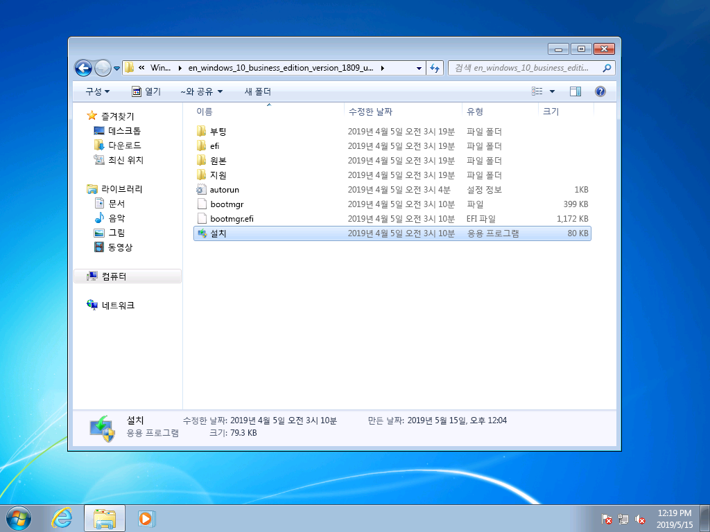
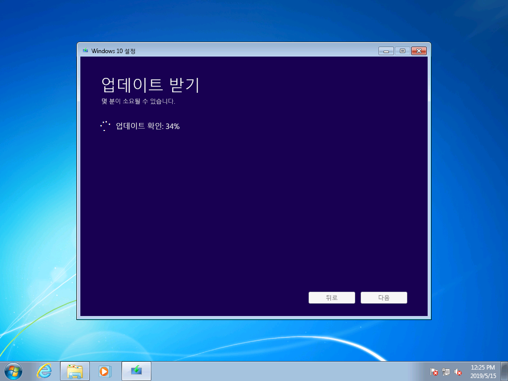
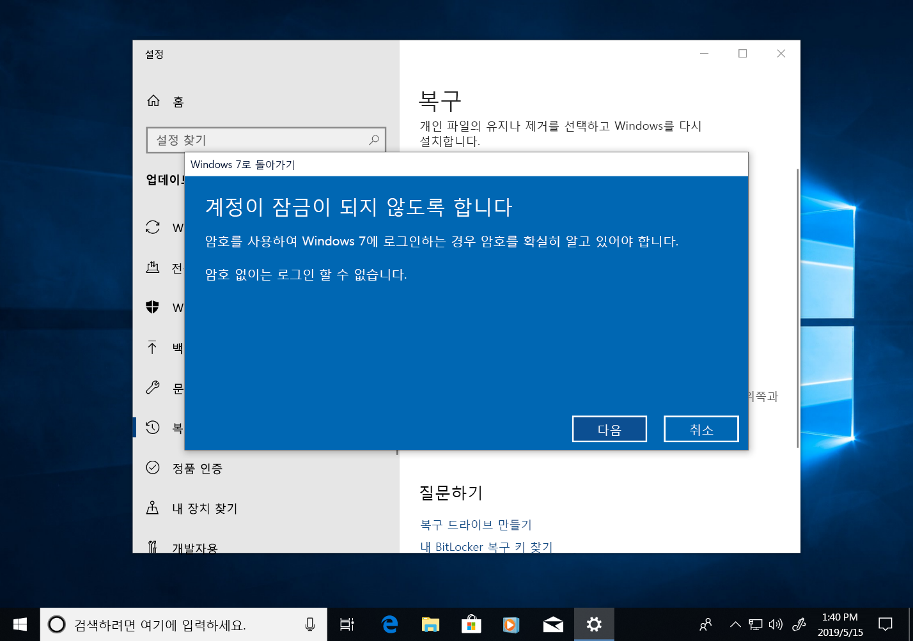

# Windows 7에서 Windows 10으로 수동 업그레이드하기 단계별 가이드Windows 7 to Windows 10 manual upgrade step-by-step guide

이 문서에서는 Windows 7 Enterprise PC를 Windows 10 Enterprise로 수동 업그레이드하는 방법을 설명합니다.This article describes the process to manually upgrade a Windows 7 Enterprise PC to Windows 10 Enterprise. Home 및 Professional을 비롯한 기타 Windows 7 버전의 경우, 업그레이드 방법이 매우 비슷하며, 이에 더해 미디어 만들기 도구를 사용하여 직접 업그레이드할 수도 있습니다.For other Windows 7 editions, such as Home and Professional, the process is very similar, but you also have the option to upgrade directly using the media creation tool. 모든 버전션의 Windows 7에서 Windows 10으로 업그레이드하려면 유효한 제품 키와 기존 Windows 버전과 동일하거나 높은 버전의 Windows가 필요합니다. 예를 들어, Windows 7 Professional은 Windows 10 Pro로 업그레이드할 수 있지만 Windows 10 Home으로는 업그레이드할 수 없습니다.Upgrades for any edition of Windows 7 to Windows 10 will require a valid product key and matching or higher edition of Windows, for example Windows 7 Professional can upgrade to Windows 10 Pro, but cannot be upgraded to Windows 10 Home. Windows 7 Ultimate는 Windows 10 Pro로 업그레이드해야 합니다.Windows 7 Ultimate will need to be upgraded to Windows 10 Pro.

## 미디어 만들기 도구 또는 ISO 파일을 사용한 Windows 10 업그레이드Windows 10 upgrades using the media creation tool or ISO files

[미디어 만들기 도구](https://www.microsoft.com/en-us/software-download/windows10ISO)를 사용하여 직접 Windows 10으로 업그레이드할 수도 있고, 미디어 만들기 도구를 사용하여 Windows 10을 ISO 파일로 다운로드할 수도 있습니다.You can upgrade to Windows 10 directly using the [media creation tool](https://www.microsoft.com/en-us/software-download/windows10ISO) or use the it to download Windows 10 as an ISO file. 먼저 기존 시스템이 32비트인지 아니면 64비트인지와 Windows 7의 시스템 기본 언어 및 버전(예: Home, Professional 또는 Enterprise)을 확인해 두어야 합니다.You’ll need to note whether your current system is 32 or 64-bit, your system’s default language and edition of Windows 7 (e.g. Home, Professional, or Enterprise). Windows 7의 경우 이 정보는 제어판 \> 시스템 및 보안 \> 시스템에 있습니다.In Windows 7, this information is located in the Control Panel \> System and Security \> System. 미디어 만들기 도구는 Windows 10 Enterprise의 업그레이드, 설치 미디어 만들기 또는 ISO 파일 다운로드를 지원하지 않습니다.The media creation tool does not support Windows 10 Enterprise for upgrades, creating installation media or downloading ISO files. Windows 7 Enterprise에서 업그레이드하려는 경우에는 Windows 10 Enterprise가 필요합니다.Windows 10 Enterprise is required if you are upgrading from Windows 7 Enterprise.

> Windows 10 미디어 만들기 도구 옵션Windows 10 media creation tool options

Windows 7 Enterprise에서 Windows 10 Enterprise로 업그레이드하는 경우, [볼륨 라이선스 서비스 센터](https://www.microsoft.com/licensing/servicecenter/default.aspx)에서 해당 언어와 아키텍처(32비트 또는 64비트)에 맞는 ISO 파일을 다운로드해야 합니다.When upgrading from Windows 7 Enterprise to Windows 10 Enterprise, you’ll need to download the ISO file for your language and architecture (32-bit or 64-bit) from the [Volume Licensing Service Center](https://www.microsoft.com/licensing/servicecenter/default.aspx).

ISO 파일을 사용하여 업그레이드하려면 ISO에 들어 있는 파일을 로컬 파일 시스템 또는 이동식 드라이브로 압축을 풀거나 ISO 파일을 DVD로 구워야 합니다.If you plan to perform the upgrade using an ISO file, you will need to extract the files within the ISO to either your local file system, to a removable drive, or you can burn the ISO file to a DVD. ISO에 들어 있는 설치 파일은 Windows 8 이상 PC를 사용하여 압축을 푼 다음 이동식 USB 스토리지에 저장하거나 [7zip](https://www.7-zip.org/)과 같은 애플리케이션을 사용하여 ISO 파일을 Windows 7 로컬 드라이브에 있는 폴더로 압축을 풀 수 있습니다.You can extract the installation files within the ISO using a Windows 8 or newer PC and save these files to removable USB storage or use an application such as [7zip](https://www.7-zip.org/) to extract the contents of your ISO file to a folder on your local drive within Windows 7.

Windows 7에 설치 미디어를 준비한 후에는 아래 그림과 같이 setup.exe를 실행하여 업그레이드를 시작할 수 있습니다.Once you have the install media available in Windows 7, you can initiate the upgrade by running setup.exe as shown below.

**중요 팁: 애플리케이션과 데이터가 Window 10으로 마이그레이션되는 현재 위치 업그레이드를 수행하려면 현재 실행 중인 Windows 7 세션에서 프로세스를 시작해야 합니다. DVD 또는 USB 드라이브에서 설치 미디어로 부팅하면 앱과 파일을 그대로 유지할 수 있는 옵션이 제공되지 않으며, Windows 10이 새로 설치됩니다.****Important tip: For an in-place upgrade where applications and your data are migrated to Window 10, you’ll need to initiate the process from within a running Windows 7 session. Booting to install media from a DVD or USB drive will not give you the option to keep your apps and files, instead it will perform a clean install of Windows 10.**

> Windows 10 Enterprise 32비트 ISO에서 압축을 푼 파일Extracted files from a Windows 10 Enterprise 32-bit ISO

Windows 10 설치 프로그램에서 설치 프로세스를 안내합니다. 첫 번째 화면에서는 업데이트, 드라이버 및 선택적 기능을 다운로드하는 옵션이 제공됩니다.Within Windows 10 Setup, you will be guided through the installation process and the first screen provides an option to download updates, drivers and optional features. 업그레이드를 성공적으로 진행하려면 이 옵션을 사용하는 것이 좋습니다.This is recommended to help ensure success with the upgrade

> Windows 10 설치 프로그램 초기 화면Initial Windows 10 Setup screen

업데이트가 적용된 후에는 Windows 10 설치 프로그램이 다음 단계인 ‘이미지 선택’으로 넘어갑니다.Once updates have been applied, Windows 10 Setup will move to the next phase, Select Image. 여기에서 Windows 버전을 선택해야 합니다.Here, you will need to select your edition of Windows. 이 예에서는 PC에 Windows 7 Enterprise가 설치되어 있으므로 Windows 10 Enterprise를 선택해야 합니다.In this case, since the PC has Windows 7 Enterprise installed, you would select Windows 10 Enterprise.

> Windows 10 Enterprise 32비트 이미지 선택 화면Windows 10 Enterprise 32-bit image selection screen

Windows 10 설치 프로그램의 다음 화면에는 관련 통지 및 사용 조건이 표시됩니다.In the next screen in Windows 10 Setup, you’re presented with applicable notices and license terms. 통지 및 조건을 읽고 이해했으면 “동의”를 클릭하여 계속하거나 “동의 안 함”을 클릭하여 취소합니다.Once you have read and understand the notices and terms, click “Accept” to continue or “Decline” to cancel.

*Windows 10 관련 통지 및 사용 조건**Windows 10 Applicable notices and license terms*

이제 Windows 10 설치 프로그램이 추가 업데이트를 찾습니다.Now Windows 10 Setup will look for additional updates.

*Windows 10 설치 프로그램 업데이트 다운로드**Windows 10 Setup getting updates*

작업이 완료되면 Windows 10 설치 프로그램이 설치를 진행할 준비가 됩니다. 기본적으로 Windows 10을 설치하고 개인 파일 및 앱이 설치된 상태를 유지하도록 구성됩니다.Once complete, Windows 10 Setup is ready to install and by default is configured to install Windows 10 and keep your personal files and apps installed. 이 옵션은 권장 옵션입니다.This is the recommended option. “유지할 항목 변경”을 클릭하면 추가 옵션을 확인할 수 있습니다.By clicking, “Change what to keep,” you’ll find additional options. 추가 옵션을 확인할 필요가 없으면 “설치”를 클릭합니다.Otherwise, click “Install.”

*Windows 10 설치 프로그램 업그레이드 옵션 기본값**Windows 10 Setup upgrade option default*

“유지할 항목 변경”을 선택하면 다음과 같은 옵션이 표시됩니다.If you select “Change what to keep”, you’ll be presented with these options:

“개인 파일만 유지합니다”를 선택하면 설치된 앱이나 설정이 Windows 7에서 Windows 10으로 이동되지 않습니다.“Keep personal files only” will not move your installed apps or settings from Windows 7 to Windows 10. 그 대신 파일과 사용자 계정만 Windows로 이동됩니다.Instead it will only move your files and user accounts to Windows. 이 옵션을 사용한 경우에는 나중에 앱을 다시 설치해야 합니다.Apps will need to be reinstalled later with this option. Windows를 설치한 후에 필요한 앱을 다시 설치하고 구성할 수 있다는 확신이 있는 경우에만 이 옵션을 사용하세요. 그렇지 않은 경우에는 기본값인 “개인 파일, 앱을 유지합니다” 옵션을 선택하세요.Only use this option if you are confident you can reinstall and configure the apps you will need after Windows is installed, otherwise stick with the default “Keep personal files and apps” option.

“아무것도 유지하지 않습니다”를 선택하면 파일, 앱과 설정이 삭제되고 Windows가 새로 설치됩니다.“Nothing” will delete your files, apps and settings and perform a clean install of Windows. 유지하려는 앱을 미리 백업해 두었고 앱을 다시 설치할 수 있는 경우에만 이 옵션을 사용하세요.Use this option only if you have previously backed up the data you want to keep and you are able to reinstall your apps.

*Windows 10 설치 프로그램 설치 옵션**Windows 10 Setup installation options*

이제 Windows 10 설치 프로그램이 이전 화면에서 사용자가 선택한 옵션을 바탕으로 업데이트를 가져옵니다.Now Windows 10 Setup will get updates again based on what you selected in the previous screen.

*Windows 10 설치 프로그램 업데이트 다운로드**Windows 10 Setup getting updates*

이제 몇 분 동안 Windows 10의 설치가 진행됩니다. 개인 파일과 앱을 유지하도록 선택한 경우, 모든 항목이 전과 같은 파일 위치에 유지되고 Windows 10에서 앱을 사용할 수 있습니다.Now Windows 10 will install for several minutes and if you chose to keep your personal files and apps, everything will be in the same file locations and your apps will now be available in Windows 10.

*Windows 10 설치 진행 상황**Windows 10 installation progress*

## 

## Windows 10의 복구Recovery in Windows 10

Windows 10의 설치를 마친 후, Windows 10의 복구 옵션을 통해 10일 동안 Windows 7으로 돌아갈 수 있습니다.After Windows 10 is installed, the Recovery option in Windows 10 gives you up to 10 days to go back to Windows 7. 이 기능은 디바이스나 시스템상의 앱이 올바르게 작동하지 않아서 이전의 Windows 7 설치로 돌아가야 하는 경우에 유용합니다.This is useful if a device or app on your system does not function properly and you need to go back to your previous Windows 7 installation. 10일이 지나면 Windows 10은 기본적으로 하드 드라이브에서 Windows 7 복구 파일이 차지하는 공간을 비우고, 설치에 사용된 파일을 삭제합니다.After 10 days, by default Windows 10 will free up the space consumed by your Windows 7 recovery files on your hard drive and delete files from the previous installation. 10일 후에는 Windows 7이 삭제되어 Windows 7으로 돌아갈 수 없지만, 앱과 개인 파일은 Windows 10에 유지됩니다.Although Windows 7 after this time is deleted and you won’t be able to revert Windows 7, your apps and personal files will remain in Windows 10.

Windows 7으로 돌아가기 프로세스를 시작하려면 설정 \> 업데이트 및 보안 \> 복구로 이동합니다.To start the Go back to Windows 7 process, navigate to Settings \> Update & Security \> Recovery. ‘Windows 7으로 돌아가기’ 아래에서 “시작”을 선택합니다.Under Go back to Windows 7, select “Get started.”

*Windows 10 복구 옵션**Windows 10 Recovery options*

이제 Windows 10에 돌아가려는 이유를 묻는 화면이 표시됩니다.Now, Windows 10 will ask why you are going back. 기술적인 이유가 있다면, 해결 방법을 촉구하고 내 경험을 통해 다른 사용자를 도울 수 있도록 이유를 작성해 주세요.If there is a technical reason, this is useful to fill out in order to help drive resolution and ensure others can benefit from your experience.

*Windows 7으로 돌아가려는 이유를 묻는 Windows 10 화면**Windows 10 asking why you are going back to Windows 7*

대부분의 경우, 사용 중인 Windows 10 버전에 공개된 업데이트를 사용하여 기술 문제를 해결할 수 있습니다.In many cases, your version of Windows 10 will have had updates issued, which may resolve technical issues. 업데이트를 확인하여 설치한 다음 해당 문제가 해결되었는지 확인해 보세요.It is encouraged that you check for updates and if found and installed, then check if that fixes the problems you have experienced.

*Windows 10 복구 업데이트 확인**Windows 10 Recovery check for updates*

업데이트로도 문제가 해결되지 않고 이전 Windows 7 설치로 되돌려야 하는 경우, Windows 10을 실행하면서 설치한 앱 등 몇몇 앱을 다시 설치해야 할 수 있으며, 일부 설정은 손실될 수 있습니다.If the updates do not resolve issues and you do need to revert to your previous installation of Windows 7, there is a chance that some apps will need to be reinstalled – such as any app that installed during the time you were running Windows 10 – and some settings may be lost. Windows 10을 사용하면서 로컬에 저장한 파일과 문서는 Windows 7으로 돌아간 후에도 계속해서 사용할 수 있습니다.Importantly, files and docs you’ve saved locally while using Windows 10 will remain and be available for you once you’re back in Windows 7. 

*Windows 10 복구: 알아야 할 사항**Windows 10 Recovery: What you need to know*

시작하기 전에 먼저 이전 Windows 7 설치의 로컬 또는 도메인 계정과 암호를 알고 있는지 확인하세요.Before you get started, make sure you have a local or domain account and password ready from the previous Windows 7 installation.

*사용자가 이전 설치의 로그인 자격 증명을 알고 있는지 확인하는 Windows 10 복구 화면**Windows 10 Recovery ensuring you have logon credentials from the previous installation*

여기에서 Windows 7으로 돌아가는 프로세스를 시작할 수 있습니다.From here you can initiate the process to go back to Windows 7. 몇 분이 지나면 PC가 Windows 10으로 업그레이드하기 전과 동일한 환경을 갖춘 Windows 7으로 부팅됩니다.After a few minutes, your PC will boot back into Windows 7 with the same experience prior to upgrading to Windows 10.

*Windows 7으로 돌아가기 전의 마지막 Windows 10 복구 화면**Windows 10 Recovery final screen before going back to Windows 7*

## 새 PC에서 Windows 10으로 이동Moving to Windows 10 on a new PC

새 PC에서 Windows 10으로 이동하는 것도 좋은 방법입니다.Another recommended option is to move to Windows 10 on a new PC. 새 PC에서 Windows 10으로 이동하려는 경우, [OneDrive](https://support.office.com/article/b5e918be-0fd4-4095-98da-bceed57f8e0c?ocid=MoveToWindows10) 백업 또는 [Windows에서 기본 제공하는 백업 및 복원](https://support.microsoft.com/help/4469209?ocid=MoveToWindows10)을 사용하거나, 수동으로 [외부 스토리지 디바이스](https://support.microsoft.com/ko-KR/help/4465814/windows-7-move-files-off-pc-with-an-external-storage-device?ocid=MoveToWindows10)를 사용하거나 [Laplink PCmover Express](https://www.microsoft.com/en-us/windows/transfer-your-data)와 같은 도구를 사용하여 기존 컴퓨터의 파일을 전송할 수 있습니다.If this is your preference, you can transfer your files from your old computer using [OneDrive](https://support.office.com/article/b5e918be-0fd4-4095-98da-bceed57f8e0c?ocid=MoveToWindows10) backup, [Backup and Restore built into Windows](https://support.microsoft.com/help/4469209?ocid=MoveToWindows10), manually using an [external storage device](https://support.microsoft.com/en-us/help/4465814/windows-7-move-files-off-pc-with-an-external-storage-device?ocid=MoveToWindows10), or tools like [Laplink’s PCmover Express](https://www.microsoft.com/en-us/windows/transfer-your-data). 이 중에서 어떠한 옵션을 사용해도 Windows 10에 포함되어 있지 않으나 필요한 애플리케이션을 다시 설치할 수 있습니다.With any of these options, you will still need to re-install any required applications not included with Windows 10. Windows 7을 실행하는 기존 PC에서 Windows 10을 실행하는 새 PC로 수동으로 이동하는 옵션에 대해 자세히 알아보려면 Windows 지원의 [Windows 10 PC로 이동](https://support.microsoft.com/ko-KR/help/4229823?ocid=MoveToWindows10)을 참조하세요.To learn more about your options for manually moving from an existing PC running Windows 7 to a new PC with Windows 10, see [Moving to a Windows 10 PC](https://support.microsoft.com/en-us/help/4229823?ocid=MoveToWindows10) in Windows Support.

## [데스크톱 배포 센터Desktop Deployment Center](https://aka.ms/howtoshift)