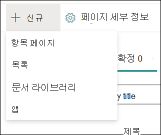
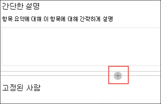

# 새 항목 만들기(미리 보기)

> [!Note] 
> 이 문서의 내용은 Project Cortex Private Preview용입니다. [Project Cortex](https://aka.ms/projectcortex)에 대해 자세히 알아보세요.

항목 환경의 경우 인덱싱을 통해 검색되지 않았거나 AI 기술에서 이를 주제로 설정할 충분한 증거를 찾지 못하면 새 항목을 만들 수 있습니다.

## 요구 사항

새 항목을 만들하려면 다음을 해야 합니다.
- 항목 환경 라이선스가 있습니다.
- 항목을 만들거나 편집할 수 [**있는 사용자에 대한 권한이 있습니다.**](https://docs.microsoft.com/microsoft-365/knowledge/topic-experiences-user-permissions) 지식 관리자는 기술 네트워크 항목 사용 권한 설정에서 사용자에게 이 권한을 부여할 수 있습니다. 

> [!Note] 
> 항목 센터(기술 관리자)에서 항목을 관리할 수 있는 권한이 있는 사용자는 이미 항목을 만들고 편집할 수 있는 권한이 있습니다.

## 새 항목을 만들 수 있습니다.

1. 항목 센터 페이지에서 새로 **고치고** 항목 **페이지를 선택합니다.** 항목 센터에서 새 옵션을  볼 수 없는 경우 필요한 사용 권한이 없는 것일 수 있습니다.

    

2. 새 항목 페이지에서 새 항목 템플릿에 대한 정보를 입력할 수 있습니다.

    - 이 **항목 이름 섹션에서** 새 항목의 이름을 입력합니다.
    
    - 대체 이름 **섹션에서** 항목을 참조하는 데 사용되는 이름이나 약어를 입력합니다.
    
    - 간단한 설명 **섹션에서** 항목에 대한 한두 문장 설명을 입력합니다. 이 텍스트는 관련 항목 카드에 사용됩니다.
    
    - 사용자 **섹션에서** 주제 전문가의 이름을 입력합니다. 항목에 수동으로 추가하는 사람은 항목 페이지에 고정된 **사용자로 표시됩니다.**
    
    - 파일 및 **페이지** 섹션에서  추가를 선택하고 다음 페이지에서 연결된 OneDrive 파일 또는 SharePoint Online 페이지를 선택할 수 있습니다.
    
    - 사이트 **섹션에서** 추가를 **선택합니다.** 사이트  **창이 표시되는** 경우 항목과 연결된 사이트를 선택합니다.

    
    
3. 텍스트, 이미지, 웹 파트, 링크 등의 다른 구성 요소를 페이지에 추가해야 하는 경우 페이지 가운데에 있는 캔버스 아이콘을 선택하여 해당 구성 요소를 찾아 추가합니다.

    

4. 완료되면 게시를 **선택하여** 항목 페이지를 게시합니다. 게시된 항목 페이지가 페이지 **탭에** 표시됩니다.

문서를 게시하면 항목 이름, 대체 이름, 설명 및 고정된 사용자가 해당 문서를 보는 모든 사용이 허가된 사용자에게 표시됩니다. 보기 권한자에 항목에 대한 Office 365 권한이 있는 경우 파일, 페이지 및 사이트가 항목 페이지에만 표시됩니다. 

새 항목 페이지는 지식 네트워크를 인식하는 웹 *파트로 구성됩니다.* 즉, AI가 항목에 대한 추가 정보를 수집할 때 이러한 웹 파트의 정보가 제안 사항으로 업데이트되어 사용자에게 페이지를 보다 유용하게 사용할 수 있습니다.

## 참고 항목

  

