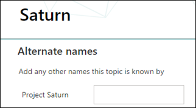
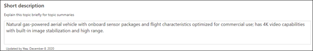

# Microsoft Viva 항목 만들기

Viva 항목에서는 인덱싱을 통해 검색되지 않았거나 AI 기술에서 이를 주제로 설정할 충분한 증거를 찾지 못하면 새 항목을 만들 수 있습니다.

> [!Note] 
> AI가 수집한 항목의 정보는 보안이 조정되는 반면 수동으로 만든 항목의 항목 설명 및 사용자 정보는 해당 항목을 볼 수 있는 권한이 있는 모든 사용자에게 표시됩니다.  

## 요구 사항

새 항목을 만들하려면 다음을 해야 합니다.
- Viva Topics 라이선스가 있어야 합니다.
- 항목을 만들거나 [**편집할 Who 권한이 있습니다.**](./topic-experiences-user-permissions.md) 지식 관리자는 Viva Topics의 항목 사용 권한 설정에서 사용자에게 해당 사용 권한을 부여할 수 있습니다. 

> [!Note] 
> 항목 센터에서 항목을 관리할 수 있는 권한이 있는 사용자(기술 관리자)에게는 이미 항목을 만들고 편집할 수 있는 권한이 있습니다.

## 항목을 만들 수 있습니다.

다음 두 위치에서 새 항목을 만들 수 있습니다.

- 항목 센터 홈 페이지: 사용이 허가된 Who(참가자)는 항목 센터에서 새 메뉴를 선택하고 항목 페이지를 선택하여  항목 센터에서 새 항목을 만들 수 **있습니다.**  

      

- 항목 관리 페이지: 사용 권한이  있는 Who(기술 관리자)는 새 항목 페이지를 선택하여 항목 센터의 항목 관리 페이지에서 새 항목을 만들 수 **있습니다.** 

      

### 새 항목을 만들려면 다음을 수행하세요.

1. 항목 관리 리본에서, 새 항목 페이지를 생성하는 옵션을 선택합니다.

2.  **이 항목의 이름 지정** 섹션에 해당 신규 항목의 이름을 입력합니다.

      

3. **대체 이름** 섹션에 해당 항목을 지칭할 수 있는 다른 이름을 입력합니다. 

      

4. 설명 **섹션에서** 항목을 설명하는 몇 가지 문장을 입력합니다. 

    

4. 고정된  사용자 섹션에서 다른 사람을 "고정"하여 항목에 대한 연결이 있는 것으로 표시될 수 있습니다(예: 연결된 리소스의 소유자). **새 사용자 추가** 상자에 이름 또는 전자 메일 주소를 입력한 다음 검색 결과에서 추가할 사용자를 선택합니다. 사용자 카드에서 목록에서 제거 아이콘을  선택하여 "제거"할 수 있습니다. 또한 목록을 다른 위치로 끌어다 놓을 수도 있습니다.
 
    

5. **고정 파일 및 페이지** 섹션에서 해당 항목과 연결된 파일 또는 SharePoint 사이트 페이지를 추가하거나 "지정"할 수 있습니다.

   
 
    새 파일을 추가하려면 추가를 선택하고 자주 SharePoint 팔로우한 사이트에서 사이트 사이트를 선택한 다음 사이트의 문서 라이브러리에서 해당 파일을 선택합니다.

    **링크에서** 옵션을 사용하면 URL을 입력하여, 특정 파일 또는 페이지를 추가할 수도 있습니다. 

    > [!Note] 
    > 추가하는 파일 및 페이지는 동일한 테넌트 내에 Microsoft 365 합니다. 항목의 외부 리소스에 대한 링크를 추가하려면 8단계의 캔버스 아이콘을 통해 추가하면 됩니다.

6.  **관련 사이트** 섹션에는 해당 항목에 대한 정보가 담긴 사이트가 표시됩니다. 

    

    추가를 선택한 다음 사이트를  검색하거나 자주 또는 최근 사이트 목록에서 해당 사이트를 선택하여 관련 사이트를 추가할 수 있습니다.
    
    

7. 관련 **항목 섹션에는** 항목 간에 존재하는 연결이 표시됩니다. 관련 항목 단추에 대한 커넥트 선택한  다음 관련 항목의 이름을 입력한 다음 검색 결과에서 해당 항목을 선택하여 다른 항목에 대한 연결을 추가할 수 있습니다. 

     

    그런 다음 항목의 관계에 대한 설명을 입력하고 업데이트를 선택할 **수 있습니다.**

    

   추가한 관련 항목은 연결된 항목으로 표시됩니다.

    

   관련 항목을 제거하려면 제거할 항목을 선택한 다음 항목 제거 **아이콘을** 선택합니다.
 
     

   그런 다음 **제거를 선택합니다.**

    

8. 간단한 설명 아래에 있는 캔버스 아이콘을 선택하여 페이지에 정적 항목(예: 텍스트, 이미지 또는 링크)을 추가할 수도 있습니다. 이 확인란을 선택하면 페이지에 추가할 SharePoint 선택할 수 있는 도구 상자가 열립니다.

    

9. **게시** 를 선택하여 변경 사항을 저장합니다. 

페이지를 게시하면, 해당 항목을 보는 모든 라이선스 사용자에게 항목 이름, 대체 이름, 설명 및 고정된 사용자 정보가 표시됩니다. 특정 파일, 페이지 및 사이트는 해당 사용자가 해당 항목에 대한 Office 365의 사용 권한을 보유한 경우에만 항목 페이지에 표시됩니다. 

## 참고 항목

