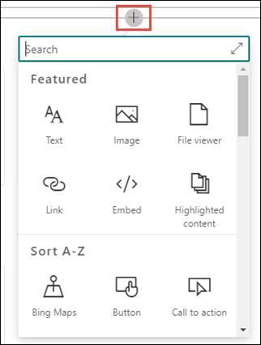

# 새 항목 만들기 

Viva 항목에서는 인덱싱을 통해 검색되지 않았거나 AI 기술에서 이를 주제로 설정할 충분한 증거를 찾지 못하면 새 항목을 만들 수 있습니다.

> [!Note] 
> AI가 수집하는 항목의 정보는 보안이 조정되는 [반면,](topic-experiences-security-trimming.md)수동으로 만든 항목의 정보는 해당 항목을 볼 수 있는 권한이 있는 모든 사용자에게 표시됩니다. 

## 요구 사항

새 항목을 만들하려면 다음을 해야 합니다.
- Viva Topics 라이선스가 있습니다.
- 항목을 만들거나 편집할 수 [**있는 사용자에 대한 권한이 있습니다.**](https://docs.microsoft.com/microsoft-365/knowledge/topic-experiences-user-permissions) 지식 관리자는 Viva 항목 항목의 사용 권한 설정에서 이 권한을 사용자에게 부여할 수 있습니다. 

> [!Note] 
> 항목 센터(기술 관리자)에서 항목을 관리할 수 있는 권한이 있는 사용자는 이미 항목을 만들고 편집할 수 있는 권한이 있습니다.

## 새 항목을 만들 수 있습니다.

1. 이 **항목 이름 섹션에서** 새 항목의 이름을 입력합니다.

       

2. 대체 <b>이름</b> 섹션에서 항목을 참조할 수 있는 다른 이름을 입력합니다. 

       
3. Description <b>섹션에서</b> 항목을 설명하는 몇 문장을 입력합니다. 

     

4. 고정된 <b></b> 사용자 섹션에서 주제 전문가로 표시하기 위해 사람을 "고정"할 수 있습니다. 먼저 새 사용자 추가 상자에 <b></b> 이름 또는 전자 메일 주소를 입력한 다음 검색 결과에서 추가할 사용자를 선택합니다. 사용자 카드에서 목록에서 제거 아이콘을 <b></b> 선택하여 "제거"할 수 있습니다. 또한 사람을 끌어서 사용자 목록이 나타나는 순서를 변경할 수 있습니다.
 
     

5. 고정된 파일 <b>및 페이지</b> 섹션에서 항목과 연결된 파일 또는 SharePoint 사이트 페이지를 추가하거나 "고정"할 수 있습니다.

    
 
    새 파일을 추가하려면 <b>추가를</b>선택하고 자주 방문하거나 팔로우한 사이트에서 SharePoint 사이트를 선택한 다음 사이트의 문서 라이브러리에서 해당 파일을 선택합니다.

    링크 시작 옵션을 <b></b> 사용하여 URL을 제공하여 파일 또는 페이지를 추가할 수도 있습니다. 

6.  관련 <b>사이트 섹션에는</b> 항목에 대한 정보가 있는 사이트가 표시됩니다. 

     

    추가를 선택한 다음 사이트를 <b></b> 검색하거나 자주 또는 최근 사이트 목록에서 해당 사이트를 선택하여 관련 사이트를 추가할 수 있습니다. 
    
     

7. 관련 <b>항목 섹션에는</b> 항목 간에 존재하는 연결이 표시됩니다. 관련 항목 연결 단추를 선택한 다음 <b></b> 관련 항목의 이름을 입력한 다음 검색 결과에서 해당 항목을 선택하여 다른 항목에 대한 연결을 추가할 수 있습니다. 

      

    그런 다음 항목의 관련성에 대한 설명을 입력하고 업데이트를 선택할 <b>수 있습니다.</b> 

     

   추가한 관련 항목은 연결된 항목으로 표시됩니다.

     

8. 간단한 설명 아래에 있는 캔버스 아이콘을 선택하여 페이지에 정적 항목(예: 텍스트, 이미지 또는 링크)을 추가할 수도 있습니다. 이 옵션을 선택하면 페이지에 추가할 항목을 선택할 수 있는 SharePoint 도구 상자가 열립니다.

     

9. 게시를 **선택하여** 변경 내용을 저장합니다. 

페이지를 게시하면 항목 이름, 대체 이름, 설명 및 고정된 사용자가 해당 항목을 보는 모든 사용이 허가된 사용자에게 표시됩니다. 특정 파일, 페이지 및 사이트는 보기 권한자에 항목에 대한 Office 365 권한이 있는 경우 항목 페이지에만 표시됩니다. 

## 참고 항목

  

