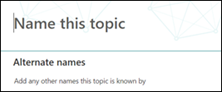

# 새 항목 만들기(미리 보기)Create a new topic (Preview)

> [!Note] 
> 이 문서의 내용은 Project Cortex Private Preview용입니다.The content in this article is for Project Cortex Private Preview. [Project Cortex](https://aka.ms/projectcortex)에 대해 자세히 알아보세요.[Find out more about Project Cortex](https://aka.ms/projectcortex).

항목 환경의 경우 인덱싱을 통해 검색되지 않았거나 AI 기술에서 이를 주제로 설정할 충분한 증거를 찾지 못하면 새 항목을 만들 수 있습니다.In Topic Experiences, you can create a new topic if one was not discovered through indexing or if the AI technology did not find enough evidence to establish it as a topic.

## 요구 사항Requirements

새 항목을 만들하려면 다음을 해야 합니다.To create a new topic, you need to:
- 항목 환경 라이선스가 있습니다.Have a Topic Experiences license.
- 항목을 만들거나 편집할 수 [**있는 사용자에 대한 권한이 있습니다.**](https://docs.microsoft.com/microsoft-365/knowledge/topic-experiences-user-permissions)Have permissions to [**Who can create or edit topics**](https://docs.microsoft.com/microsoft-365/knowledge/topic-experiences-user-permissions). 지식 관리자는 기술 네트워크 항목 사용 권한 설정에서 사용자에게 이 권한을 부여할 수 있습니다.Knowledge admins can give users this permission in the Knowledge Network topic permissions settings. 

> [!Note] 
> 항목 센터(기술 관리자)에서 항목을 관리할 수 있는 권한이 있는 사용자는 이미 항목을 만들고 편집할 수 있는 권한이 있습니다.Users who have permission to manage topics in the Topic center (knowledge managers) already have permissions to create and edit topics.

## 새 항목을 만들 수 있습니다.To create a new topic:

1. 항목 센터 페이지에서 새로 **고치고** 항목 **페이지를 선택합니다.**On the Topic center page, select **New**, then select **Topic Page**. 항목 센터에서 새 옵션을  볼 수 없는 경우 필요한 사용 권한이 없는 것일 수 있습니다.If you are not able to see the **New** option in the Topic Center, you may not have the required permissions.

    

2. 새 항목 페이지에서 새 항목 템플릿에 대한 정보를 입력할 수 있습니다.On the new topic page, you can fill in the information on the new topic template:

    - 이 **항목 이름 섹션에서** 새 항목의 이름을 입력합니다.In the **Name this topic** section, type the name of the new topic.
    
    - 대체 이름 **섹션에서** 항목을 참조하는 데 사용되는 이름이나 약어를 입력합니다.In the **Alternate names** section, type names or acronyms that are also used to refer to the topic.
    
    - 간단한 설명 **섹션에서** 항목에 대한 한두 문장 설명을 입력합니다.In the **Short description** section, type a one or two sentence description of the topic. 이 텍스트는 관련 항목 카드에 사용됩니다.This text will be used for the associated topic card.
    
    - 사용자 **섹션에서** 주제 전문가의 이름을 입력합니다.In the **People** section, type the names of subject matter experts for the topic. 항목에 수동으로 추가하는 사람은 항목 페이지에 고정된 **사용자로 표시됩니다.**People you manually add to the topic will display in the topic page as **Pinned people**.
    
    - 파일 및 **페이지** 섹션에서  추가를 선택하고 다음 페이지에서 연결된 OneDrive 파일 또는 SharePoint Online 페이지를 선택할 수 있습니다.In the **Files and pages** section, select **Add** and then on the next page you can select associated OneDrive files or SharePoint Online pages.
    
    - 사이트 **섹션에서** 추가를 **선택합니다.**In the **Sites** section, select **Add**. 사이트  **창이 표시되는** 경우 항목과 연결된 사이트를 선택합니다.In the  **Sites** pane that displays, select the sites that are associated to the topic.

    
    
3. 텍스트, 이미지, 웹 파트, 링크 등의 다른 구성 요소를 페이지에 추가해야 하는 경우 페이지 가운데에 있는 캔버스 아이콘을 선택하여 해당 구성 요소를 찾아 추가합니다.If you need to add other components to the page, such as text, images, web parts, links, etc., select the canvas icon in the middle of the page to locate and add them.

    

4. 완료되면 게시를 **선택하여** 항목 페이지를 게시합니다.When you are done, select **Publish** to publish the topic page. 게시된 항목 페이지가 페이지 **탭에** 표시됩니다.Published topic pages will display in the **Pages** tab.

문서를 게시하면 항목 이름, 대체 이름, 설명 및 고정된 사용자가 해당 문서를 보는 모든 사용이 허가된 사용자에게 표시됩니다.After you publish the article, the topic name, alternate name, description, and pinned people will display to all licensed users who view the article. 보기 권한자에 항목에 대한 Office 365 권한이 있는 경우 파일, 페이지 및 사이트가 항목 페이지에만 표시됩니다.Files, pages, and sites will only appear in the topic page if the viewer has Office 365 permissions to the item. 

새 항목 페이지는 지식 네트워크를 인식하는 웹 *파트로 구성됩니다.*The new topic page is made up of web parts that are *knowledge network aware*. 즉, AI가 항목에 대한 추가 정보를 수집할 때 이러한 웹 파트의 정보가 제안 사항으로 업데이트되어 사용자에게 페이지를 보다 유용하게 사용할 수 있습니다.This means that as AI gathers more information on the topic, the information in these web parts will be updated with suggestions to make the page more useful to users.

## 참고 항목See also

  

