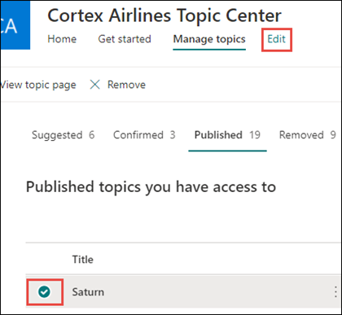

# Microsoft Viva 항목 편집 

 

> [!VIDEO https://www.microsoft.com/videoplayer/embed/RE4LA4n]  

 

Viva 항목에서는 기존 항목을 편집할 수 있습니다. 기존 항목 페이지에 추가 정보를 수정하거나 추가하려는 경우 이 작업을 해야 할 수 있습니다. 

> [!Note] 
> AI에서 수집하는 항목의 정보는 보안이 조정된 반면 기존 항목을 편집할 때 수동으로 추가하는 항목 설명 및 사용자 정보는 항목을 볼 수 있는 권한이 있는 모든 사용자에게 표시됩니다.  

## 요구 사항

기존 항목을 편집하려면 다음을 해야 합니다.
- Viva Topics 라이선스가 있어야 합니다.
- 항목을 [만들거나 편집할 수 있는 권한이 있습니다.](./topic-experiences-user-permissions.md) 지식 관리자는 Viva Topics의 항목 사용 권한 설정에서 사용자에게 해당 사용 권한을 부여할 수 있습니다. 

> [!Note] 
> 항목 센터에서 항목을 관리할 수 있는 권한이 있는 사용자(기술 관리자)에게는 이미 항목을 만들고 편집할 수 있는 권한이 있습니다.

## 항목 페이지를 편집하는 방법

사용자가 Who  만들거나 편집할 수 있는 권한이 있는 사용자는 항목 강조 표시에서 항목 페이지를 열고  항목 페이지의 오른쪽 위에 있는 편집 단추를 선택하여 항목을 편집할 수 있습니다. 또한 주제 페이지는 연결에 있는 모든 항목을 찾을 수 있는 항목 센터 홈 페이지에서 열 수 있습니다.

      

또한 기술 관리자는 항목 관리 페이지에서  항목을 선택한 다음 도구 모음에서 편집을  선택하여 항목을 직접 편집할 수도 있습니다.

   

### 항목 페이지를 편집하려면

1. 항목 페이지에서 편집 을 **선택합니다.** 여기에서 필요한 경우 주제 페이지를 변경할 수 있습니다.

     

2. 대체 **이름 섹션에서** 항목을 참조할 수 있는 다른 이름을 입력합니다. 

    

3. **설명** 섹션에 해당 항목에 대한 설명을 몇 개의 문장으로 입력합니다. 또는 설명이 이미 있는 경우에는 필요하면 설명을 업데이트합니다.

     

4. **고정 사용자** 섹션에서 해당 항목과 관련성이 있는 것으로 표시할 사용자를 "지정"할 수 있습니다(예: 연결된 리소스의 소유자). 먼저 새 사용자 추가 상자에  이름 또는 전자 메일 주소를 입력한 다음 검색 결과에서 추가할 사용자를 선택합니다. 사용자 카드에서 목록에서 제거 아이콘을  선택하여 "제거"할 수 있습니다.
 
     

    **추천 사용자** 섹션에는 AI가 항목 관련 리소스 연결에서 항목과 연관성이 있을 수 있다고 생각하는 사용자가 표시됩니다. 사용자 카드의 고정 아이콘을 선택하여 추천 사용자를 고정 사용자로 사용자 상태를 변경할 수 있습니다.

   

5. **고정 파일 및 페이지** 섹션에서 해당 항목과 연결된 파일 또는 SharePoint 사이트 페이지를 추가하거나 "지정"할 수 있습니다.

   
 
    새 파일을 추가하려면 추가를 선택하고 자주 SharePoint 팔로우한 사이트에서 사이트 사이트를 선택한 다음 사이트의 문서 라이브러리에서 해당 파일을 선택합니다.

    **링크에서** 옵션을 사용하면 URL을 입력하여, 특정 파일 또는 페이지를 추가할 수도 있습니다. 

   > [!Note] 
   > 추가하는 파일 및 페이지는 동일한 테넌트 내에 Microsoft 365 합니다. 항목의 외부 리소스에 대한 링크를 추가하려면 9단계의 캔버스 아이콘을 통해 추가하면 됩니다.

6. 추천 **파일 및 페이지 섹션에는** AI가 항목에 연결하기로 제안하는 파일 및 페이지가 표시됩니다.

   

    고정 아이콘을 선택하여 추천 파일 또는 페이지를 고정 파일 또는 페이지로 변경할 수 있습니다.

7.  고정된 **사이트 섹션에서** 항목과 연결된 사이트를 추가하거나 "고정"할 수 있습니다. 

    

    새 사이트를 추가하려면  추가를 선택한 다음 사이트를 검색하거나 자주 또는 최근 사이트 목록에서 사이트를 선택합니다.
    
    

8. 추천 **사이트 섹션에는** AI가 항목에 연결될 것으로 제안하는 사이트가 표시됩니다. 

     

    고정된 아이콘을 선택하여 추천 사이트를 고정된 사이트로 변경할 수 있습니다.

9. 간단한 설명 아래에서 찾을 수 있는 캔버스 아이콘을 선택하여 페이지에 정적 항목(예: 텍스트, 이미지 또는 링크)을 추가할 수도 있습니다. 이 확인란을 선택하면 페이지에 추가할 SharePoint 선택할 수 있는 도구 상자가 열립니다.

   

10. **게시** 또는 **다시 게시** 를 선택하여 변경 내용이 저장됩니다 **항목을 이전에** 게시한 경우 다시 게시 옵션을 사용할 수 있습니다.

