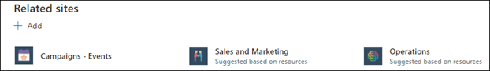

# 기존 항목 편집 

 

> [!VIDEO https://www.microsoft.com/videoplayer/embed/RE4LA4n]  

 

Viva 항목에서는 기존 항목을 편집할 수 있습니다. 기존 항목 페이지에 추가 정보를 수정하거나 추가하려면 이 작업을 해야 할 수 있습니다. 

> [!Note] 
> AI에서 수집하는 항목의 정보는 보안이 조정된 반면 [기존](topic-experiences-security-trimming.md)항목을 편집할 때 수동으로 추가하는 항목 설명 및 사용자 정보는 항목을 볼 수 있는 권한이 있는 모든 사용자에게 표시됩니다. 

## 요구 사항

기존 항목을 편집하려면 다음을 해야 합니다.
- Viva Topics 라이선스가 있습니다.
- 항목을 만들거나 편집할 수 있는 사용자에 대한 [**권한이 있습니다.**](https://docs.microsoft.com/microsoft-365/knowledge/topic-experiences-user-permissions) 지식 관리자는 Viva 항목 항목의 사용 권한 설정에서 사용자에게 이 권한을 부여할 수 있습니다. 

> [!Note] 
> 항목 센터(기술 관리자)에서 항목을 관리할 수 있는 권한이 있는 사용자는 이미 항목을 만들고 편집할 수 있는 권한이 있습니다.

## 항목 페이지를 편집하는 방법

항목 작성  또는 편집 권한이 있는 사용자는 항목 강조 표시에서 항목 페이지를 열고 항목 페이지의 <b></b> 오른쪽 위에 있는 편집 단추를 선택하여 항목을 편집할 수 있습니다. 또한 연결에 있는 모든 항목을 찾을 수 있는 항목 센터 홈 페이지에서 항목 페이지를 열 수도 있습니다.

      

또한 지식 관리자는 항목을 선택하고 도구 모음에서 편집을 선택하여 항목 관리 페이지에서 <b></b> 직접 항목을 편집할 수도 있습니다.

      

### 항목 페이지를 편집하려면

1. 항목 페이지에서 편집을 **선택합니다.** 이렇게 하면 항목 페이지에서 필요한 경우 변경할 수 있습니다.

       

2. 대체 <b>이름</b> 섹션에서 항목을 참조할 수 있는 다른 이름을 입력합니다. 

       
3. Description <b>섹션에서</b> 항목을 설명하는 몇 문장을 입력합니다. 또는 설명이 이미 있는 경우 필요한 경우 업데이트합니다.

     

4. 고정된 <b></b> 사용자 섹션에서 주제 전문가로 표시하기 위해 사람을 "고정"할 수 있습니다. 먼저 새 사용자 추가 상자에 <b></b> 이름 또는 전자 메일 주소를 입력한 다음 검색 결과에서 추가할 사용자를 선택합니다. 사용자 카드에서 목록에서 제거 아이콘을 <b></b> 선택하여 "제거"할 수 있습니다.
 
     

    추천 <b>사용자</b> 섹션에서는 AI가 주제에 대한 리소스와의 연결에서 주제에 대한 주제 전문가일 수 있는 것으로 생각할 수 있는 사용자를 보여줍니다. 사용자 카드에서 고정 아이콘을 선택하여 상태를 제안에서 고정으로 변경할 수 있습니다.

    

5. 고정된 파일 <b>및 페이지</b> 섹션에서 항목과 연결된 파일 또는 SharePoint 사이트 페이지를 추가하거나 "고정"할 수 있습니다.

    
 
    새 파일을 추가하려면 <b>추가를</b>선택하고 자주 방문하거나 팔로우한 사이트에서 SharePoint 사이트를 선택한 다음 사이트의 문서 라이브러리에서 해당 파일을 선택합니다.

    링크 시작 옵션을 <b></b> 사용하여 URL을 제공하여 파일 또는 페이지를 추가할 수도 있습니다. 

   > [!Note] 
   > 추가하는 파일 및 페이지는 동일한 Microsoft 365 테넌트 내에 있어야 합니다. 항목의 외부 리소스에 대한 링크를 추가하려면 9단계의 캔버스 아이콘을 통해 추가하면 됩니다.

6. 추천 <b>파일 및 페이지 섹션에는</b> AI가 항목에 연결될 수 있는 파일 및 페이지가 표시됩니다.

    

    고정된 아이콘을 선택하여 제안된 파일 또는 페이지를 고정된 파일 또는 페이지로 변경할 수 있습니다.

7.  관련 <b>사이트 섹션에는</b> 항목에 대한 정보가 있는 사이트가 표시됩니다. 

     

    추가를 선택한 다음 사이트를 <b></b> 검색하거나 자주 또는 최근 사이트 목록에서 해당 사이트를 선택하여 관련 사이트를 추가할 수 있습니다. 
    
     

8. 관련 <b>항목 섹션에는</b> 항목 간에 존재하는 연결이 표시됩니다. 관련 항목에 연결 단추를 선택한 다음 <b></b> 관련 항목의 이름을 입력한 다음 검색 결과에서 해당 항목을 선택하여 다른 항목에 대한 연결을 추가할 수 있습니다. 

      

    그런 다음 항목의 관련성에 대한 설명을 입력하고 업데이트를 선택할 <b>수 있습니다.</b> 

     

   추가한 관련 항목은 연결된 항목으로 표시됩니다.

     

   관련 항목을 제거하려면 제거할 항목을 선택한 다음 항목 제거 <b>아이콘을</b> 선택합니다. 
 
      

   그런 다음 <b>제거를 선택합니다.</b> 

     

9. 간단한 설명 아래에 있는 캔버스 아이콘을 선택하여 페이지에 정적 항목(예: 텍스트, 이미지 또는 링크)을 추가할 수도 있습니다. 이 옵션을 선택하면 페이지에 추가할 항목을 선택할 수 있는 SharePoint 도구 상자가 열립니다.

     

10. 변경 **내용을** **저장하려면** 게시 또는 다시 게시를 선택합니다. **항목을 이전에** 게시한 경우 다시 게시할 수 있습니다.

## 참고 항목

  

