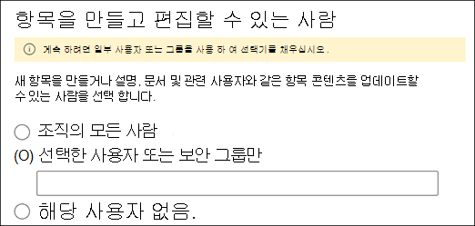
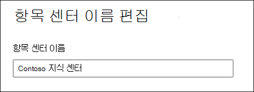

# 지식 관리 네트워크 관리 (미리 보기)Manage your knowledge management network (Preview)

> [!Note] 
> 이 문서에서 설명 하는 내용은 Project Cortex 비공개 미리 보기를 위한 것입니다.The content in this article is for Project Cortex Private Preview. [자세한 내용은 Project Cortex를 참조](https://aka.ms/projectcortex)하세요.[Find out more about Project Cortex](https://aka.ms/projectcortex).

[지식 관리를 설정한](set-up-knowledge-network.md)후에는 언제 든 지 관리자가 Microsoft 365 관리 센터를 통해 구성 설정을 조정할 수 있습니다.After you [set up knowledge management](set-up-knowledge-network.md), at any time afterwards an admin can make adjustments to your configuration settings through the Microsoft 365 admin center.

예를 들어 다음 중 하나에 대 한 설정을 조정 해야 할 수 있습니다.For example, you may need to adjust your settings for any of the following:
- 항목을 광산에 새 SharePoint 원본을 추가 합니다.Add new SharePoint sources to mine topics.
- 항목에 액세스할 사용자를 변경 합니다.Change which users will have access to topics.
- 항목 센터에서 작업을 수행할 수 있는 권한이 있는 사용자를 변경 합니다.Change which users have permissions to do tasks on the topic center.
- 주제 센터 이름 변경Change the name of your topic center

## 요구 사항Requirements 
Microsoft 365 관리 센터에 액세스 하 고 조직의 기술 자료 작업을 관리 하려면 전역 관리자 또는 SharePoint 관리자 권한이 있어야 합니다.You must have Global Admin or SharePoint admin permissions to be able to access the Microsoft 365 admin center and manage Organizational knowledge tasks.

## 기술 항목 관리 설정에 액세스 하려면To access knowledge management settings:

1. Microsoft 365 관리 센터에서 **설치**를 선택 하 고 **조직의 기술 자료** 섹션을 확인 합니다.In the Microsoft 365 admin center, select **Setup**, and then view the **Organizational Knowledge** section.
2. **조직의 기술 자료** 섹션에서 **사용자에 게 자세한 정보 연결을**클릭 합니다.In the **Organizational Knowledge** section, click **Connect people to knowledge**. 

      

3. **사용자에 게 정보 연결** 페이지에서 **관리** 를 선택 하 여 **정보 네트워크 설정** 창을 엽니다.On the **Connect people to knowledge** page, select **Manage** to open the **Knowledge network settings** pane. 

      

## 지식 네트워크에서 항목을 찾을 수 있는 방식 변경Change how the knowledge network can find topics

SharePoint 항목 원본에 대 한 선택 사항을 업데이트 하려면 **항목 검색** 탭을 선택 합니다.Select the **Topic discovery** tab if you want to update your choices for  for SharePoint topic sources. 이 설정을 사용 하 여 테 넌 트에서 크롤링할 SharePoint 사이트를 선택 하 고 항목에 대 한 의견을 받을 수 있습니다.This setting let you select the SharePoint sites in your tenant that will be crawled and mined for topics.

1. **항목 검색** 탭의 **SharePoint 항목 소스 선택**에서 **편집**을 선택 합니다.On the **Topic discovery** tab, under **Select SharePoint topic sources**, select **Edit**.
2. **Sharepoint 항목 원본 선택** 페이지에서 검색 중에 항목의 소스로 크롤링할 SharePoint 사이트를 선택 합니다.On the **Select SharePoint topic sources** page, select which SharePoint sites will be crawled as sources for your topics during discovery. 해당 활동은 다음과 같습니다.This includes: 
    a.a. **모든 사이트**: 테 넌 트의 모든 SharePoint 사이트**All sites**: All SharePoint sites in your tenant. 현재 및 미래의 사이트를 캡처합니다.This captures current and future sites. 
    b.b. **선택한 사이트를 제외한 모두 (모두**): 제외 하려는 사이트의 이름을 입력 합니다.**All, except selected sites**: Type the names of the sites you want to exclude.  검색에서 옵트아웃 할 사이트의 목록을 업로드할 수도 있습니다.You can also upload a list of sites you want to opt out from discovery. 앞으로 만들어진 사이트는 항목 검색의 원본으로 포함 됩니다.Sites created in the future will be included as sources for topic discovery.  
    c.c. **선택한 사이트만**: 포함 하려는 사이트의 이름을 입력 합니다.**Only selected sites**: Type the names of the sites you want to include. 사이트 목록을 업로드할 수도 있습니다.You can also upload a list of sites. 앞에서 만든 사이트는 항목 검색의 원본으로 포함 되지 않습니다.Sites created in the future will not be included as sources for topic discovery.  

      
   
    제외할 사이트가 여러 개 있는 경우 ( **모두, 선택한 사이트를 제외 하 고 모두**선택) 또는 포함 ( **선택한 사이트만**선택한 경우)을 선택 하 고 사이트 이름과 url을 사용 하 여 CSV 파일을 업로드 하도록 선택할 수 있습니다.If you have a number of sites that you want to exclude (if you select **All, except selected sites**) or include (if you selected **Only selected sites**), you can choose to upload a CSV file with the site names and URLs. CSV 서식 파일을 사용 하려는 경우에는 **사이트 서식 파일인 .Csv 다운로드** 를 선택할 수 있습니다.You can select **Download site template .csv** if you want to use the CSV template file.

3. **저장**을 선택합니다.Select **Save**.

##  조직의 항목을 볼 수 있는 사람 변경Change who can see topics in your organization

조직에서 검색 결과의 검색 된 항목을 볼 수 있는 사용자를 업데이트 하 고 SharePoint 페이지와 같은 콘텐츠에서 항목을 강조 표시 하려면 **항목 검색** 탭을 선택 합니다.Select the **Topic discovery** tab if you want to update who in your organization can see discovered topics in search results and when topics are highlighted in content like SharePoint pages.

1. **항목 검색** 탭의 **사용자가 정보 네트워크의 항목을 볼 수 있는 사람**아래에서 **편집**을 선택 합니다.On the **Topic discovery** tab, under **Who can see topics in the knowledge network**, select **Edit**.
2. **정보 네트워크 페이지의 항목을 볼 수 있는 사용자** 는 강조 표시 된 항목, 항목 카드, 검색의 항목 대답 및 주제 페이지와 같은 항목 세부 정보에 액세스할 사용자를 선택 합니다.On the **Who can see topics in the knowledge network** page, you choose who will have access to topic details, such as highlighted topics, topic cards, topic answers in search, and topic pages. 다음을 선택할 수 있습니다.You can select: 
    a.a. **조직의 모든 사람****Everyone in your organization** 
    b.b. **선택한 사용자 또는 보안 그룹만****Only selected people or security groups** 
    c.c. **아무도 없어****No one** 

       
3. **저장**을 선택합니다.Select **Save**.  
 
> [!Note] 
> 이 설정을 사용 하면 조직의 모든 사용자를 선택할 수 있지만, 기술 관리 라이선스가 할당 된 사용자만 항목을 볼 수 있습니다.While this setting allows you to select any user in your organization, only users who have knowledge management licenses assigned to them will be able to view topics.

## 항목 센터에서 작업을 수행할 수 있는 권한이 있는 사용자 변경Change who has permissions to do tasks on the topic center

항목 센터 페이지에서 다음 작업을 수행할 수 있는 권한이 있는 사용자를 업데이트 하려면 **항목 사용 권한** 탭을 선택 합니다.Select the **Topic permissions** tab if you want to update who has permissions to do the following in the topic center page:

- 항목을 만들고 편집할 수 있는 사용자: 검색 하는 동안 발견 되지 않은 새 항목을 만들거나 기존 항목 페이지 세부 정보를 편집 합니다.Which users can create and edit topics: Create new topics that were not found during discovery or edit existing topic page details.
- 항목을 관리할 수 있는 사용자: 검색 된 항목 확인 또는 거부Which users can manage topics: Confirm or reject discovered topics.

항목을 만들고 편집할 수 있는 권한이 있는 사용자를 업데이트 하려면 다음을 수행 합니다.To update who has permissions to create and edit topics:

1. **항목 권한** 탭의 **항목을 만들고 편집할 수 있는 사용자는 누구 입니까**?에서 **편집**을 선택 합니다.On the **Topic permissions** tab, under **Who can create and edit topics**, select **Edit**. 
2. 주제를 **만들고 편집할 수 있는 사람** 페이지에서 다음을 선택할 수 있습니다.On the **Who can create and edit topics** page, you can select: 
    a.a. **조직의 모든 사람****Everyone in your organization** 
    b.b. **선택한 사용자 또는 보안 그룹만****Only selected people or security groups** 

       

3. **저장**을 선택합니다.Select **Save**. 

항목을 관리할 수 있는 권한이 있는 사용자를 업데이트 하려면 다음을 수행 합니다.To update who has permissions to manage topics:

1. **항목 권한** 탭의 **항목을 관리할 수 있는 사용자**에서 **편집**을 선택 합니다.On the **Topic permissions** tab, under **Who can manage topics**, select **Edit**. 
2. 주제를 **관리할 수 있는 사람** 페이지에서 다음을 선택할 수 있습니다.On the **Who can manage topics** page, you can select: 
    a.a. **조직의 모든 사람****Everyone in your organization** 
    b.b. **선택한 사용자 또는 보안 그룹****Selected people or security groups** 

       

3. **저장**을 선택합니다.Select **Save**. 

##  항목 센터 이름 업데이트Update your topic center name

항목 센터의 이름을 업데이트 하려면 **항목 가운데** 탭을 선택 합니다.Select the **Topic center** tab if you want to update the name of your topic center. 

1. **항목 가운데** 탭의 **항목 센터 이름**에서 **편집**을 선택 합니다.On the **Topic center** tab, under **Topic center name**, select **Edit**.
2. **항목 센터 이름 편집** 페이지의 **항목 센터 이름** 상자에 항목 센터의 새 이름을 입력 합니다.On the **Edit topic center name** page, in the **Topic center name** box, type the new name for your topic center.
3. **저장**을 선택합니다.Select **Save**

       

## 참고 항목See also

  

