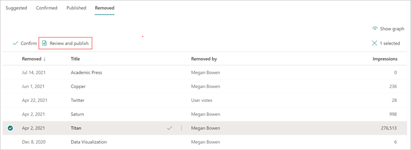

# 다음 항목의 항목 센터에서 Microsoft Viva 관리

 

> [!VIDEO https://www.microsoft.com/videoplayer/embed/RE4LxDx]  

 

Viva Topics 항목 센터에서 기술 관리자는  항목 관리 페이지를 보고 지식 관리자가 지정한 원본 위치에서 식별된 항목을 검토할 수 있습니다.  

     

## 항목 단계

지식 관리자는 제안됨, 확인됨, 게시됨 및 제거됨 등 다양한 항목 수명 주기 단계에 대해 검색된 항목을  **안내할 수 있습니다.**

    

- **추천 항목**: AI에 의해 식별되어 있으며 충분한 지원 리소스, 연결 및 속성을 가지고 있습니다. 이러한 항목은 UI에서 추천 **항목으로** 표시됩니다.

- **확인:** AI에서 검색되고 유효성이 검사된 항목입니다. 항목 유효성 검사는 다음 중 하나에 따라 발생합니다.

   - 지식 관리자가 항목을 확인 합니다. 지식 관리자가 [항목](manage-topics.md#confirmed-topics) 관리 페이지에서 항목을 **확인** 합니다.

   - 여러 사용자가 항목을 확인 합니다. 항목 카드의 피드백 메커니즘을 사용하여 투표한 사용자로부터 받은 두 개의 긍정적인 투표의 네트워크가 있어야 합니다. 예를 들어 한 사용자가 특정 항목에 대해 긍정적인 반응을 보인 경우 한 사용자가 특정 항목에 대해 부정적인 반응을 보인 경우 확인하려면 여전히 두 개의 긍정적인 투표가 필요합니다.
 
- **게시:** 큐레이터로 된 항목입니다. 품질을 개선하기 위해 수동 편집을 하거나 사용자가 만든 것입니다.

- **제거됨**: 거부되어 뷰어에게 더 이상 표시되지 않는 항목입니다. 모든 상태(제안, 확인 또는 게시)에서 항목을 제거할 수 있습니다. 항목 제거는 다음 중 하나일 때 발생합니다.

   - 지식 관리자가 항목을 제거합니다. 기술 관리자가 항목 관리 페이지에서 항목을 **제거합니다.**

   - 여러 사용자가 항목 카드의 피드백 메커니즘을 사용하여 부정적인 투표를 캐스팅합니다. 항목을 제거하려면 사용자로부터 받은 두 개의 부정적인 투표의 네트워크가 있어야 합니다. 예를 들어 한 사용자가 음수로 투표하고 한 사용자가 특정 항목에 대해 긍정적인 반응을 보인 경우 제거할 항목에 대해 두 개의 부정적인 투표가 더 필요합니다.

  게시된 항목을 제거하면 항목 센터의 페이지 라이브러리를 통해 큐레이터 세부 정보가 있는 페이지를 수동으로 삭제해야 합니다.

> [!Note] 
> 항목 **관리 페이지에서** 각 기술 관리자는 항목에 연결된 파일 및 페이지에 대한 액세스 권한이 있는 항목만 볼 수 있습니다. 이 사용 권한 트리밍은 제안됨, 확인됨, 게시됨 및 제거된 탭에 나타나는 항목 목록에 **반영됩니다.**  그러나 이 항목의 개수는 사용 권한에 관계없이 조직의 총 수를 보여 주게 됩니다.

## 요구 사항

항목 센터에서 항목을 관리하려면 다음을 해야 합니다.
- Viva Topics 라이선스가 있어야 합니다.

- 항목을 [**Who 수 있도록**](./topic-experiences-user-permissions.md) 합니다. 지식 관리자는 Viva Topics의 항목 사용 권한 설정에서 사용자에게 해당 사용 권한을 부여할 수 있습니다. 

항목 관리 권한이 있는  경우 항목 센터에서 항목 관리 페이지를 **Who 수** 없습니다.

항목 센터에서 기술 관리자는 지정한 원본 위치에서 식별된 항목을 검토할 수 있으며, 항목을 확인하거나 제거할 수 있습니다. 또한 지식 관리자는 항목 검색에서 발견되지 않은 새 항목 페이지를 만들어 게시하거나, 업데이트해야 하는 경우 기존 항목을 편집할 수 있습니다.

## 제안된 항목

항목 **관리 페이지에서** 지정한 원본 위치에서 검색된 항목은 SharePoint 탭에 나열됩니다.  필요한 경우 기술 관리자는 확인되지 않은 항목을 검토하고 확인하거나 제거할 수 있습니다.

    

제안된 항목을 검토합니다.

1. 항목 **관리 페이지에서** 추천 탭을 선택한 다음 항목을 선택하여 항목 페이지를 열 수 있습니다. 

2. 항목 페이지에서 항목 페이지를 검토하고 페이지를  변경해야 하는 경우 편집을 선택합니다. 편집을 게시하면 이 항목은 **게시된 탭으로 이동됩니다.**

3. 항목을 검토한 후 항목 **관리 페이지로 돌아** 이동합니다. 선택한 주제에 대해 다음을 수행할 수 있습니다.

   - 확인 표시를 선택하여 주제를 확인하세요.
    
   - 항목을 **제거하려면 x를** 선택합니다.

    확인된 항목은 제안 목록에서 제거되고 이제 확인됨 목록에 **표시됩니다.** 

    제거된 항목은 제안  목록에서 제거되고 이제 제거된 **탭에** 표시됩니다.

### 품질 점수

추천 항목 페이지에 나타나는  각 항목에는 품질 점수가 할당됩니다. 품질 점수는 항목의 정보에 대해 평균 사용자가 볼 수 있는 정보의 양을 반영하는 것입니다. 각 사용자는 항목의 정보에 대한 사용 권한 또는 사용 권한으로 인하여 정보가 더 많이 또는 적게 표시될 수 있습니다. 

품질 점수는 가장 많은 정보를 사용하여 항목에 대한 정보를 제공하는 데 도움이 될 수 있으며 수동으로 편집해야 할 수 있는 항목을 찾는 데 유용할 수 있습니다. 예를 들어 품질 점수가 낮은 항목은 일부 사용자가 해당 항목에 SharePoint 관련 파일 또는 사이트에 대한 사용 권한을 부여하지 않은 결과일 수 있습니다. 그러면 참가자가 항목을 편집하여 정보를 포함(적절한 경우)시킬 수 있고, 토픽을 볼 수 있는 모든 사용자가 이를 볼 수 있습니다.

### 노출

광고 **노출 열에는** 최종 사용자에게 항목을 표시한 횟수가 표시됩니다. 여기에는 검색의 항목 응답 카드와 항목 강조를 통한 보기가 포함됩니다. 이 항목의 클릭 클릭은 반영되지 않지만 해당 항목은 표시되어 있습니다. 노출  **열은** 항목 관리 페이지의 **제안됨,** 확인됨, 게시됨  및 제거된 탭의 항목에 **대해** 표시됩니다.

## 확인된 항목

항목  관리 페이지에서 지정된 SharePoint 원본 위치에서 검색되고 네트워크 2명 이상이 확인한 "크라우드소싱"에서 확인한 항목(부정적인 사용자 투표와 긍정적인 사용자 투표의 균형 조정)이 카드 피드백 메커니즘을 통해  확인된 탭에 나열됩니다. 필요한 경우 항목을 관리할 권한이 있는 사용자는 확인된 항목을 검토하고 거부하도록 선택할 수 있습니다.

확인된 주제를 검토하려면:

1. **확인됨** 탭에서 주제를 선택하여 주제 페이지를 엽니다.

2. 항목 페이지에서 항목 페이지를 검토하고 페이지를  변경해야 하는 경우 편집을 선택합니다.

여전히 확인된 항목을 거부할 수 있습니다. 이렇게하려면 확인 탭에서 선택한 항목으로 이동한 다음 항목을 거부하려면 **x를** 선택합니다. 

## 게시된 항목

항목 **관리 페이지에서** 지정된 항목의 원본 위치에서 SharePoint 항목을 게시된 탭에 **나열합니다.** 게시된 항목은 편집된 항목으로, 특정 정보가 페이지를 방문하는 모든 사용자에 대해 항상 표시됩니다. 수동적으로 생성된 항목 또한 여기에 나열됩니다.

   

## 제거된 항목

항목 **관리 페이지에서** 지정한 항목의 원본 위치에서 SharePoint 항목을 제거 **탭에 나열합니다.** 제안된 몇 가지 항목은 항목 센터의 항목 카드에 대한 최종 사용자 투표에 따라 여기에 표시될 수 있습니다.

제거된 항목은 나중에 필요한 경우 다시 볼 수 있는 항목으로 추가할 수 있습니다. 제거된 항목을 다시 볼 수 있는 항목으로 추가하려는 경우:

1. 제거된 **탭에서** 항목을 선택합니다.

2. 검토 **및 게시를 선택합니다.**

   

## 항목 수 대시보드

대시보드 보기의 이 차트를 사용하면 Viva 항목 항목 센터에서 항목 수를 볼 수 있습니다. 이 차트는 항목 수명 주기 단계당 항목 수를 보여 주며, 시간 경과에 따라 항목 수가 어떻게 추세가 났는가를 보여 주기도 합니다. 지식 관리자는 AI에서 새 항목을 검색하는 속도와 지식 관리자 또는 사용자 작업에서 항목을 확인하거나 게시하는 비율을 시각적으로 모니터링할 수 있습니다.

기술 관리자는 항목 관리 페이지의 항목 목록에 표시될 수 있는  항목 수와 대시보드에 표시될 수 있는 항목의 수가 다를 수 있습니다. 이는 지식 관리자가 모든 항목에 액세스할 수 없는 경우도 있기 때문에입니다. 대시보드 보기에 표시된 개수는 사용 권한 트리밍을 적용하기 전에 계산됩니다. 

   
