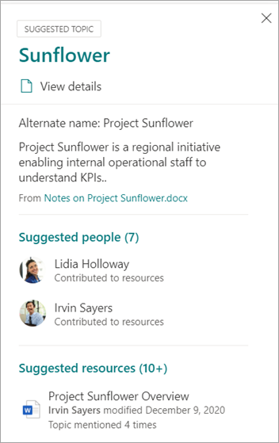
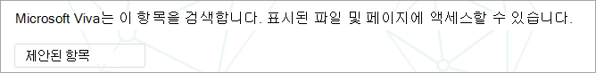
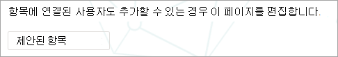

# 항목의 규모에 따라 Microsoft Viva 관리

Viva SharePoint 사이트 또는 전체 조직을 인덱싱할 때 많은 주제가 생성될 수 있습니다. 이 경우 항목 관리 페이지에서 수천 개의 제안된 주제가 표시될 경우 어디서부터 시작해야 할지 알기 어려울 수 있습니다.  이 문서에서는 많은 수의 주제가 있는 대규모 조직에서도 Viva Topics를 통해 정보를 검색하는 사용자에게 표시되는 항목과 정보를 최적화하는 방법에 대해 설명하고 있습니다.

먼저 항목에 대한 네 가지 [단계에 대한 미리 알림입니다.](manage-topics.md#topic-stages)

- **추천 항목**: AI에 의해 식별되어 있으며 충분한 지원 리소스, 연결 및 속성을 가지고 있습니다. 이러한 항목은 UI에서 추천 **항목으로** 표시됩니다.

- **확인:** AI에서 검색되고 유효성이 검사된 항목입니다. 항목 유효성 검사는 다음 중 하나에 따라 발생합니다.

   - 지식 관리자가 항목을 확인 합니다. 지식 관리자가 [항목](manage-topics.md#confirmed-topics) 관리 페이지에서 항목을 **확인** 합니다.

   - 여러 사용자가 항목을 확인 합니다. 항목 카드의 피드백 메커니즘을 사용하여 투표한 사용자로부터 받은 두 개의 긍정적인 투표의 네트워크가 있어야 합니다. 예를 들어 한 사용자가 특정 항목에 대해 긍정적인 반응을 보인 경우 한 사용자가 특정 항목에 대해 부정적인 반응을 보인 경우 확인하려면 여전히 두 개의 긍정적인 투표가 필요합니다.
 
- **게시:** 큐레이터로 된 항목입니다. 품질을 개선하기 위해 수동 편집을 하거나 사용자가 만든 것입니다.

- **제거됨**: 거부되어 뷰어에게 더 이상 표시되지 않는 항목입니다. 모든 상태(제안, 확인 또는 게시)에서 항목을 제거할 수 있습니다. 항목 제거는 다음 중 하나일 때 발생합니다.

   - 지식 관리자가 항목을 제거합니다. 기술 관리자가 항목 관리 페이지에서 항목을 **제거합니다.**

   - 여러 사용자가 항목 카드의 피드백 메커니즘을 사용하여 부정적인 투표를 캐스팅합니다. 항목을 제거하려면 사용자로부터 받은 두 개의 부정적인 투표의 네트워크가 있어야 합니다. 예를 들어 한 사용자가 음수로 투표하고 한 사용자가 특정 항목에 대해 긍정적인 반응을 보인 경우 제거할 항목에 대해 두 개의 부정적인 투표가 더 필요합니다.

  게시된 항목을 제거하면 항목 센터의 페이지 라이브러리를 통해 큐레이터 세부 정보가 있는 페이지를 수동으로 삭제해야 합니다.

## 지식 관리자 역할 

Viva 항목을 구성하면 사용 권한이 부여된 사용자 그룹을 추가하여 항목 관리  페이지를 항목 센터에서 볼 수 있습니다. 이 항목은 항목에 대한 기본 큐레이터 역할을 보유하는 사용자에게만 표시됩니다. 또한 항목에 대한 데이터에 액세스할 수 있으며 검토 및 큐레이터에 액세스할 수 있는 모든 항목의 목록을 볼 수 있습니다.

이 역할의 직원은 광범위한 주제를 볼 수 있는 광범위한 권한이 필요합니다. 또는 사용 권한이 분할된 경우 비즈니스의 다른 영역을 나타내고 자신의 영역에 대해 큐레이터할 수 있는 사용자 그룹을 선택할 수 있습니다.

항목 센터에서 항목을 처음 검토할 때 추천 항목은 전적으로 AI로 정의됩니다. 지식 관리자는 광범위한 사용자 커뮤니티에 Viva 항목을 롤아웃하기 전에 각 항목을 검토할 수 있습니다. 대규모로 작업하는 경우 이 방법은 수천 개의 항목 때문에 실용적이지 않습니다.

권장되는 방법은 초기 사용자 집합에 대한 가장 관련되거나 중요한 항목의 균형을 찾고 Viva 항목의 롤아웃 전에 해당 항목의 큐링에 집중하는 것입니다. 사용자로부터 피드백을 수집하기 시작하고 크라우드소싱에서 이 문서에 제시된 전략에 대해 알리기 위해 사용자의 사용 및 기여 패턴을 결정할 수 있도록 합니다.

시스템에서 AI 추천 항목과 사람이 추천한 항목을 모두 식별하고 모든 사용자에게 표시하는 것이 중요합니다. 그러나 제안된 모든 주제가 모든 최종 사용자에게 표시되는 것은 아니며, 보안 설정은 각 직원이 콘텐츠 자체에 대해 설정된 사용 권한에 따라 액세스할 수 있는 항목만 표시됩니다.

항목 관리 페이지를 볼 수  있는 권한이 있는 기술 관리자는 조직의 역할 및 액세스 수준에 따라 관리자 권한이 상승되어 나열되는 항목 수가 훨씬 많을 수 있습니다. 또한 하이라이트 또는 검색을 사용하여 항목에 액세스하는 대신 단일 위치에 나열된 항목을 볼 수 있는 보기에 액세스할 수도 있습니다.

또한 대부분의 사용자가 볼 수 있는 항목의 비율이 더 적고 사용 권한으로 인해 훨씬 더 자주 볼 수 있는 더 많은 항목 집합이 있을 수 있습니다. 따라서 조직에 가장 중요하고 더 광범위하게 볼 수 있는 항목에 먼저 큐레이터 작업에 집중하는 것이 좋습니다.

이 문서에서는 큐레이터에 대한 몇 가지 전략을 다산합니다. 이러한 전략은 덜 빈번하거나 덜 일반적인 항목은 지식 관리자가 완전히 큐레이터하지 않을 수 있는 것을 의미할 수 있습니다. 그러나 이러한 제안된 항목은 계속 유용하며 인사이트나 포인터를 사용자에게 제공할 수 있으며, 이를 통해 시작점을 찾는 직원 시간을 절약할 수 있습니다. 크라우드소싱 업데이트를 항목에 허용하는 것이 도움이 되므로 덜 일반적인 항목에 대해 더 많은 콘텐츠와 범위를 제공합니다.

이 문서에서는 항목 관리 및 큐레이터에 접근하기 위한 몇 가지 지침과 모범 사례를 제공합니다.

## 제안된 항목 이해

AI에서 항목을 검색하면 항목 관리 페이지와 사용자에게 제시된 항목  카드 모두에서 추천 항목으로 표시됩니다. 제거된 것으로 표시되지 않은 항목은 확인, 게시 및 제안된 항목을 포함하는 사용자에게 표시됩니다. 최종 사용자가 세 가지 상태의 항목을 모두 사용할 수 있습니다.

항목 카드 또는 페이지 내에서는 다양한 안내를 사용하여 AI가 정보를 생성한 방법을 보여 주세요. 시스템은 다양한 증거를 사용하여 주로 콘텐츠 자체를 통해 리소스를 추가합니다.

- 레이블은 항목을 제안하고 Viva 항목에 의해 검색된 것으로 표시됩니다.  

   

- 원본을 지정하여 정의가 시작된 카드 상태의 정보입니다.

- 추천된 사람은 주제 증거로 문서를 작성하거나 편집한 사용자들을 집계하여 파생됩니다. 제목에 항목 이름이 있는 문서를 작성하는 경우 해당 문서에 여러 보기가 있는 경우 관련 문서로 설정하려면 문서 하나만 필요할 수 있습니다. 그러나 대부분의 경우 더 많은 증거가 더 낫고 나열된 사용자가 여러 문서에서 작업했습니다.  

   

- 표시된 파일 및 페이지의 경우 시스템에서 문서에서 해당 항목을 언급한 수를 식별하지만 프로젝트 또는 팀과 같은 특정 유형의 항목에 대한 참조를 식별하는 특정 컨텍스트에서도 이 항목을 언급해야 합니다. 이는 AI에 대한 증거로 계산됩니다. 또한 시스템에서는 문서 제목, 문서 유형 및 기타 분석 기능(예: 보기)에 항목 이름이 있는 경우를 고려합니다.

   

   

   

이러한 특성은 콘텐츠가 AI에 의해 추가된 경우와 AI가 이를 결정한 방법을 보여줄 수 있습니다.

### 통신

사용자에게 Viva 항목에 대한 정보를 전달할 때 AI에서 제안하는 항목과 콘텐츠와 해당 콘텐츠의 차이점을 명확히 하는 것이 중요합니다.

독자는 보다 중요한 눈으로 제안된 항목을 볼 수 있습니다. 조직 참을성 있는 출처로 인식하면 안 됩니다. 대신 액세스 권한이 있는 콘텐츠를 통해 제시되는 부정 정보에 액세스하는 방법을 찾는 도구입니다. AI가 항목을 검색하고 이를 보여 주기에 충분한 증거가 있지만 해당 값은 사람이 확인하지 않은 것입니다.

### 크라우드소싱 컨트롤

제안된 항목은 페이지 큐레이터 및 항목에 대한 크라우드소싱 피드백을 통해 개선할 수 있습니다.

사용자가 제안된 항목과 상호 작용할 때 UI에서 간단한 질문을 할 수 있습니다. 예: *이 항목은 페이지와 관련이 있나요?* *이 사람이 주제와 관련이 있습니까?* *이 정의가 정확한가요?* 이러한 질문에 대한 피드백을 사용하여 명명된 개인이 페이지를 구성하지 않고도 항목의 정확도를 높일 수 있습니다.

주제 센터의 홈 페이지는 제안된 항목에 대한 피드백이 수집되는 또 다른 위치입니다. 항목 센터에서 사용자는 연결된 항목을 볼 수 있으며 이 연결 확인 또는 제거 옵션도 제공됩니다.

   

항목의 광범위한 크라우드소싱을 허용하는 경우 다음 요인을 고려해야 합니다.

-   사용자는 항목  페이지에서 편집 옵션을 볼 수 있으며 다른 최신 페이지와 동일한 환경의 페이지를 SharePoint 있습니다.

-   일부 **추천 항목** 웹 파트는 제거할 수 없습니다. 항목 이름, 대체 이름, 정의, 제안된 사용자 및 추천 리소스는 제거할 수 없습니다.

-   게시된 추천 항목 또는 확인된 항목을 항목 관리 페이지의 게시된  목록으로 이동하는 데 다소 시간이 걸릴 **수** 있습니다.

    -   검색, 강조 표시, 해시태그 또는 주석에 항목을 표시하는 예상 시간은 2시간입니다.

    -   대부분의 경우 관리되는 항목 페이지의  게시된 목록에  항목을 표시하는 데 예상되는 시간은 24시간을 넘지 않습니다. 2시간 내에 표시되지만 24시간마다 전체 동기화가 있기 때문에 대기 시간이 24시간보다 길면 안 됩니다.

-   사용자가 게시된 항목을 체크 아웃 또는 편집 상태로 떠날 수 있습니다. 기술 관리자는 항목 센터의 페이지 라이브러리에서 이러한 항목을 볼 수 있으며, 항목을 다시 게시하기 위해 사용자의 변경 내용을 삭제하거나 해당 사용자에게 문의하여 항목을 체크 인하도록 요청할 수 있습니다.

### 항목 표시 여부 및 콘텐츠는 사용자의 사용 권한을 기반으로 합니다.

지식 관리자로 제안된 항목 목록을 검토할 때 제안된 항목의 내용은 사용 권한에 따라 동적으로 작성됩니다. 추천 콘텐츠 및 사용자에게 표시되는 사용자는 사용자 또는 다른 기술 관리자에게 제공된 콘텐츠와 다를 수 있습니다.

항목과 연결된 콘텐츠를 볼 수 있는 권한에 따라 각 사용자에게 제안된 리소스, 사용자, 대체 이름 및 정의 집합이 표시될 수 있습니다.

## 큐레이터에 대한 항목 우선 순위 지정

다음 전략을 사용하여 두드러질 수 있으므로 큐레이터에 좋은 항목을 식별할 수 있습니다. 

### 세분화

기존 세분화는 사용자에게 두드러질 수 있는 항목 목록을 제공할 수 있습니다. 예를 들어 다음과 같습니다.

-   조직에서 제공하는 제품 및 서비스

-   Teams 조직 내 사용자 관리

-   프로필이 높은 프로젝트

이 접근 방식은 조직의 해당 영역을 이해하고 있는 주제 전문가와 함께 부서 또는 기능 수준에서도 적용될 수 있습니다. 목표는 선택 영역이나 모든 항목을 검토하지 않는 것입니다. 대신 선택적 큐레이터를 안내하기 위해 자체 도메인 전문 지식을 제공합니다.

### 검색

일반적인 검색 용어는 종종 항목으로 검색됩니다. 의 [최상위](/sharepoint/view-search-usage-reports)쿼리 보고서를 Microsoft Search 조직에서 가장 자주 사용하는 검색어를 식별할 수 있습니다. 이러한 용어에 대한 주제가 발견된 경우 큐레이터에 대한 좋은 후보입니다. 이러한 항목은 각 항목의 응답 카드로 Microsoft Search.

현재 책갈피를 사용하고 Microsoft Search 항목으로 대체할 수 있는 책갈피를 고려합니다. 책갈피 응답 카드에는 제목, 설명 및 URL이 포함되어 있습니다. 경우에 따라 항목 카드가 사용자에게 더 유용할 수 있으며 항목 카드에는 리소스와 사용자도 표시될 수 있습니다.

사용자의 검색 환경에서 사용자가 여행과 같은 용어를 검색하면 검색 결과가 다음 우선 순위 순서로 Microsoft Search.

1.  게시 또는 확인된 항목

2.  책갈피

3.  제안된 항목

### 노출 수 및 품질 점수

노출 [수 및](manage-topics.md#impressions) 품질 [점수는](manage-topics.md#quality-score) 항목의 동작을 이해하는 데 중요한 메트릭입니다. 이러한 메트릭의 값은 지식 관리자 또는 IT 팀만 항목에 액세스할 수 있는 경우 제한됩니다. 파일럿 사용자 그룹에 항목을 노출하면 이러한 측정값에 대한 보다 대표적인 데이터가 생성됩니다.

노출 횟수가 높은 항목은 상호 작용 횟수가 더 잦을 수 있습니다. 이러한 항목의 품질 점수는 해당 항목의 양을 알 수 있습니다. 노출 수가 높고 품질 점수가 낮은 항목은 큐레이터의 좋은 대상입니다.

### 대규모 조직 사이트의 정보 아키텍처에 대한 주요 용어

조직 내의 대규모 포털 사이트에서는 사업부, 제품 라인, 주요 프로젝트 등 주요 주제 영역을 중심으로 정보 아키텍처를 구성하고 사이트를 탐색하는 데 시간을 투자한 것일 수 있습니다. 이러한 용어를 검토하고 이러한 용어에 대한 항목을 식별하고 큐레이터하면 이러한 영역에 대한 정보를 찾고 있는 사용자에게 도움이 될 수 있습니다.

### 내부 기술 자료 또는 Wiki 사이트 활용

조직에서 기술 자료 또는 Wiki 사이트에 투자한 경우 이러한 항목 목록을 초기 큐레이터에 사용할 수 있습니다. 특히 큰 경우 가장 많이 보거나 편집한 항목을 시작점으로 선택합니다.

## 참고 항목

[주제 센터에서 주제 관리](manage-topics.md)

[주제 센터 개요](topic-center-overview.md)
