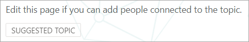

# Microsoft Viva 항목에서 대규모로 항목 관리Manage topics at scale in Microsoft Viva Topics

Viva SharePoint 사이트 또는 전체 조직을 인덱싱할 때 많은 주제가 생성될 수 있습니다.When you index your SharePoint sites or your entire organization for Viva Topics, many topics might be generated. 이 경우 항목 관리 페이지에서 수천 개의 제안된 주제가 표시될 경우 어디서부터 시작해야 할지 알기 어려울 수 있습니다. When this happens and you see thousands of suggested topics on the **Manage topics** page, it can be challenging to know where to start. 이 문서에서는 많은 수의 주제가 있는 대규모 조직에서도 Viva Topics를 통해 정보를 검색하는 사용자에게 표시되는 항목과 정보를 최적화하는 방법에 대해 설명하고 있습니다.This article describes how Viva Topics helps you optimize which topics and information are shown to users who are searching for information, even in large organizations with large numbers of topics.

먼저 항목에 대한 네 가지 [단계에 대한 미리 알림입니다.](manage-topics.md#topic-stages)First, a reminder of the [four stages for topics](manage-topics.md#topic-stages):

- **추천 항목**: AI에 의해 식별되어 있으며 충분한 지원 리소스, 연결 및 속성을 가지고 있습니다.**Suggested**: A topic has been identified by AI and has enough supporting resources, connections, and properties. 이러한 항목은 UI에서 추천 **항목으로** 표시됩니다.(These are marked as a **Suggested Topic** in the UI.)

- **확인:** AI에서 제안한 항목의 유효성을 검사해야 합니다.**Confirmed**: A topic that has been suggested by AI needs to be validated. 항목 유효성 검사는 다음 중 하나에 따라 발생합니다.Topic validation occurs when either:
   - 지식 관리자가 항목을 확인 합니다.A knowledge manager confirms a topic. 지식 관리자가 [항목](manage-topics.md#confirmed-topics) 관리 페이지에서 항목을 **확인** 합니다.A knowledge manager [confirms a topic](manage-topics.md#confirmed-topics) on the **Manage topics** page. 
   - 여러 사용자가 항목을 확인 합니다.Multiple users confirm a topic. 항목 카드의 피드백 메커니즘을 사용하여 투표한 사용자로부터 받은 두 개의 긍정적인 투표의 네트워크가 있어야 합니다.There must be a net of two positive votes received from users who voted using the feedback mechanism on the topic card. 예를 들어 한 사용자가 특정 항목에 대해 긍정적인 반응을 보인 경우 한 사용자가 특정 항목에 대해 부정적인 반응을 보인 경우 확인하려면 여전히 두 개의 긍정적인 투표가 필요합니다.For example, if one user voted positive and one user voted negative for a particular topic, you would still need two more positive votes for the topic to be confirmed.
 
- **게시:** 큐레이터가 확정된 항목입니다.**Published**: A confirmed topic that has been curated. 품질을 개선하기 위해 수동으로 편집했습니다.Manual edits have been made to improve its quality.

- **제거됨**: 지식 관리자가 항목을 거부하며 더 이상 볼 수 없습니다.**Removed**: A topic is rejected by a knowledge manager and will no longer be visible to viewers. 모든 상태(제안, 확인 또는 게시)에서 항목을 제거할 수 있습니다.A topic can be removed in any state (suggested, confirmed, or published). 항목을 제거하려면 항목 카드의 피드백 메커니즘을 사용하여 투표한 사용자로부터 받은 두 개의 부정적인 투표의 네트워크가 있어야 합니다.For a topic to be removed, there must be a net of two negative votes received from users who voted using the feedback mechanisms on the topic card. 예를 들어 한 사용자가 음수로 투표하고 한 사용자가 특정 항목에 대해 긍정적인 반응을 보인 경우 제거할 항목에 대해 두 개의 부정적인 투표가 더 필요합니다.For example, if one user voted negative and one user voted positive for a particular topic, you would still need two more negative votes for the topic to be removed. 게시된 항목을 제거하면 항목 센터의 페이지 라이브러리를 통해 큐레이터 세부 정보가 있는 페이지를 수동으로 삭제해야 합니다.When a published topic is removed, the page with the curated details will need to be deleted manually through the Pages Library of the topic center.

## 지식 관리자 역할Knowledge manager role 

Viva 항목을 구성하면 사용 권한이 부여된 사용자 그룹을 추가하여 항목 관리  페이지를 항목 센터에서 볼 수 있습니다.When you configure Viva Topics, you'll add a group of users who are granted permissions to see the **Manage topics** page in the topic center. 이 항목은 항목에 대한 기본 큐레이터 역할을 보유하는 사용자에게만 표시됩니다.It will appear only for these users who hold the role of primary curation for the topics. 또한 항목에 대한 데이터에 액세스할 수 있으며 검토 및 큐레이터에 액세스할 수 있는 모든 항목의 목록을 볼 수 있습니다.They'll have access to data about the topics and will be able to see lists of all topics that they have access to review and curate.

이 역할의 직원은 광범위한 주제를 볼 수 있는 광범위한 권한이 필요합니다.Employees in this role should have broad permissions to view a wide array of topics. 또는 사용 권한이 분할된 경우 비즈니스의 다른 영역을 나타내고 자신의 영역에 대해 큐레이터할 수 있는 사용자 그룹을 선택할 수 있습니다.Or if permissions are segmented, you might want to select a group of users that represent different areas of the business and can curate for their own areas.

항목 센터에서 항목을 처음 검토할 때 추천 항목은 전적으로 AI로 정의됩니다.When you first review topics in the topic center, suggested topics are purely AI-defined. 지식 관리자는 광범위한 사용자 커뮤니티에 Viva 항목을 롤아웃하기 전에 각 항목을 검토할 수 있습니다.Knowledge managers might want to review each one before rolling out Viva Topics to a broad user community. 대규모로 작업하는 경우 이 방법은 수천 개의 항목 때문에 실용적이지 않습니다.When working at scale, this approach is rarely a practical because of the thousands of topics.

권장되는 방법은 초기 사용자 집합에 대한 가장 관련되거나 중요한 항목의 균형을 찾고 Viva 항목의 롤아웃 전에 해당 항목의 큐링에 집중하는 것입니다.The recommended approach is to find a balance of the most pertinent or important topics for your initial set of users and focus on curation of those topics before rollout of Viva Topics. 사용자로부터 피드백을 수집하기 시작하고 크라우드소싱에서 이 문서에 제시된 전략에 대해 알리기 위해 사용자의 사용 및 기여 패턴을 결정할 수 있도록 합니다.Begin to collect feedback from the users and allow crowdsourcing to determine the usage and contribution patterns of your users to inform the strategies suggested in this article.

시스템에서 AI 추천 항목과 사람이 추천한 항목을 모두 식별하고 모든 사용자에게 표시하는 것이 중요합니다.It's important to recognize that the system will identify and show both AI-suggested and human-curated published topics to all users. 그러나 제안된 모든 주제가 모든 최종 사용자에게 표시되는 것은 아니며,However, this doesn't mean that every suggested topic will be shown to all end users. 보안 설정은 각 직원이 콘텐츠 자체에 대해 설정된 사용 권한에 따라 액세스할 수 있는 항목만 표시됩니다.The security settings in place will show only the topics that each employee can access based on the permissions that are set on the content itself.

항목 관리 페이지를 볼 수  있는 권한이 있는 기술 관리자는 조직의 역할 및 액세스 수준에 따라 관리자 권한이 상승되어 나열되는 항목 수가 훨씬 많을 수 있습니다.As a knowledge manager with permissions to view the **Manage topics** page, you might see a much larger number of topics listed because of your own elevated permissions, depending on your role in the organization and level of access. 또한 하이라이트 또는 검색을 사용하여 항목에 액세스하는 대신 단일 위치에 나열된 항목을 볼 수 있는 보기에 액세스할 수도 있습니다.You'll also have access to views that allow you see topics listed in a single location rather than accessing them by using highlights or search.

또한 대부분의 사용자가 볼 수 있는 항목의 비율이 더 적고 사용 권한으로 인해 훨씬 더 자주 볼 수 있는 더 많은 항목 집합이 있을 수 있습니다.In addition, there is likely a smaller percentage of topics that will be viewed by most users and a larger set of more topics that will be seen much less frequently due to permissions. 따라서 조직에 가장 중요하고 더 광범위하게 볼 수 있는 항목에 먼저 큐레이터 작업에 집중하는 것이 좋습니다.As a result, it is good to first focus any curation tasks on the topics that are the most important for your organization and that are the most likely to be seen more broadly.

이 문서에서는 큐레이터에 대한 몇 가지 전략을 다산합니다.This article covers a few strategies for curation. 이러한 전략은 덜 빈번하거나 덜 일반적인 항목은 지식 관리자가 완전히 큐레이터하지 않을 수 있는 것을 의미할 수 있습니다.These strategies might mean that the less frequent or less common topics might not be fully curated by knowledge managers. 그러나 이러한 제안된 항목은 계속 유용하며 인사이트나 포인터를 사용자에게 제공할 수 있으며, 이를 통해 시작점을 찾는 직원 시간을 절약할 수 있습니다.However, these suggested topics remain useful and can provide insight or a pointer to a person, which can save an employee hours of looking for a starting point. 크라우드소싱 업데이트를 항목에 허용하는 것이 도움이 되므로 덜 일반적인 항목에 대해 더 많은 콘텐츠와 범위를 제공합니다.Allowing crowdsourced updates to topics is beneficial and provides more content and coverage for the less common topics.

이 문서에서는 항목 관리 및 큐레이터에 접근하기 위한 몇 가지 지침과 모범 사례를 제공합니다.This article provides some guidance and best practices to approach topic management and curation.

## 제안된 항목 이해Understanding suggested topics

AI에서 항목을 검색하면 항목 관리 페이지와 사용자에게 제시된 항목  카드 모두에서 추천 항목으로 표시됩니다.When topics are discovered by AI, they're marked as a **Suggested Topic**, both on the **Manage topics** page, and in the topic cards that are presented to users. 제거된 것으로 표시되지 않은 항목은 확인, 게시 및 제안된 항목을 포함하는 사용자에게 표시됩니다.Any topic that hasn't been marked as removed will be shown to users—this includes confirmed, published, and suggested topics. 최종 사용자가 세 가지 상태의 항목을 모두 사용할 수 있습니다.Topics in all three states are available to end users.

항목 카드 또는 페이지 내에서는 다양한 안내를 사용하여 AI가 정보를 생성한 방법을 보여 주세요.Within a topic card or page, we use various cues to show how the AI has generated the information. 시스템은 다양한 증거를 사용하여 주로 콘텐츠 자체를 통해 리소스를 추가합니다.The system uses a variety of evidence to add the resources, primarily through the content itself.

- 레이블은 항목을 제안하고 Viva 항목에 의해 검색된 것으로 표시됩니다.Labels show that a topic is suggested and that it was discovered by Viva Topics.  

   

- 원본을 지정하여 정의가 시작된 카드 상태의 정보입니다.Information on the card states where a definition has come from by specifying its source.

- 추천된 사람은 주제 증거로 문서를 작성하거나 편집한 사용자들을 집계하여 파생됩니다.Suggested people are derived by aggregating people who have written or edited documents with topic evidence. 제목에 항목 이름이 있는 문서를 작성하는 경우 해당 문서에 여러 보기가 있는 경우 관련 문서로 설정하려면 문서 하나만 필요할 수 있습니다.If a person writes a document that has a topic name in the title, and that document has many views, it might only require one document to establish the person as related. 그러나 대부분의 경우 더 많은 증거가 더 낫고 나열된 사용자가 여러 문서에서 작업했습니다.However, in many cases more evidence is better, and people who are listed have worked on multiple documents.  

   

- 표시된 파일 및 페이지의 경우 시스템에서 문서에서 해당 항목을 언급한 수를 식별하지만 프로젝트 또는 팀과 같은 특정 유형의 항목에 대한 참조를 식별하는 특정 컨텍스트에서도 이 항목을 언급해야 합니다.For the files and pages shown, the system identifies how many times the topic has been mentioned in the document, but the topic also must be mentioned in a specific context that identifies the reference to the topic of specific type (such as project or team). 이는 AI에 대한 증거로 계산됩니다.This is what counts as evidence for the AI. 또한 시스템에서는 문서 제목, 문서 유형 및 기타 분석 기능(예: 보기)에 항목 이름이 있는 경우를 고려합니다.The system also considers the occurrence of a topic name in the titles of documents, types of documents, and other analytics features (such as views).

   

   

   

이러한 특성은 콘텐츠가 AI에 의해 추가된 경우와 AI가 이를 결정한 방법을 보여줄 수 있습니다.These attributes demonstrate that the content has been added by AI, and how the AI has made that determination.

### 커뮤니케이션Communication

사용자에게 Viva 항목에 대한 정보를 전달할 때 AI에서 제안하는 항목과 콘텐츠와 해당 콘텐츠의 차이점을 명확히 하는 것이 중요합니다.When communicating to your users about Viva Topics, it's important to clarify the difference between AI-suggested topics and content and their curated equivalents.

독자는 보다 중요한 눈으로 제안된 항목을 볼 수 있습니다.As a reader, you should view suggested topics with a more critical eye. 조직 참을성 있는 출처로 인식하면 안 됩니다.They shouldn't be perceived as authoritative sources of organizational truth. 대신 액세스 권한이 있는 콘텐츠를 통해 제시되는 부정 정보에 액세스하는 방법을 찾는 도구입니다.Rather, they're a way-finding tool to access tacit knowledge that is presented through the content that you have access to. AI가 항목을 검색하고 이를 보여 주기에 충분한 증거가 있지만 해당 값은 사람이 확인하지 않은 것입니다.The AI has discovered the topic and has enough evidence to show it to you, but its value hasn't been confirmed by a person.

### 크라우드소싱 컨트롤Crowdsourced controls

제안된 항목은 페이지 큐레이터 및 항목에 대한 크라우드소싱 피드백을 통해 개선할 수 있습니다.Suggested topics can be improved by curation of the page and through crowdsourced feedback on the topic.

사용자가 제안된 항목과 상호 작용할 때 UI에서 간단한 질문을 할 수 있습니다.When users interact with a suggested topic, they might be asked a simple question in the UI. 예: *이 항목은 페이지와 관련이 있나요?*For example: *Was this topic relevant to the page?* *이 사람이 주제와 관련이 있습니까?**Is this person relevant for the topic?* *이 정의가 정확한가요?**Was this definition accurate?* 이러한 질문에 대한 피드백을 사용하여 명명된 개인이 페이지를 구성하지 않고도 항목의 정확도를 높일 수 있습니다.By using the feedback to such questions, the accuracy of the topics can increase without the need for a named individual to curate the page.

주제 센터의 홈 페이지는 제안된 항목에 대한 피드백이 수집되는 또 다른 위치입니다.The home page of a topic center is another location where feedback on suggested topics is gathered. 항목 센터에서 사용자는 연결된 항목을 볼 수 있으며 이 연결 확인 또는 제거 옵션도 제공됩니다.In the topic center, a user can see the topics that they have been associated with and are given the option to either confirm this association or have it removed.

   

항목의 광범위한 크라우드소싱을 허용하는 경우 다음 요인을 고려해야 합니다.When you allow broad crowdsourcing of topics, you should consider the following factors:

-   사용자는 항목  페이지에서 편집 옵션을 볼 수 있으며 다른 최신 페이지와 동일한 환경의 페이지를 SharePoint 있습니다.Users will see the **Edit** option on topic pages and can edit the pages in the same experience as other modern SharePoint pages.

-   일부 **추천 항목** 웹 파트는 제거할 수 없습니다.Some **Suggested Topic** web parts can't be removed. 항목 이름, 대체 이름, 정의, 제안된 사용자 및 추천 리소스는 제거할 수 없습니다.The topic name, alternate names, definition, suggested people, and suggested resources can't be removed.

-   게시된 추천 항목 또는 확인된 항목을 항목 관리 페이지의 게시된  목록으로 이동하는 데 다소 시간이 걸릴 **수** 있습니다.It can take some time for a suggested or confirmed topic that has been published to be moved to the **Published** list on the **Manage topics** page.

    -   검색, 강조 표시, 해시태그 또는 주석에 항목을 표시하는 예상 시간은 2시간입니다.The estimated time for a topic to appear in search, highlights, hashtags, or annotations is 2 hours.

    -   대부분의 경우 관리되는 항목 페이지의  게시된 목록에  항목을 표시하는 데 예상되는 시간은 24시간을 넘지 않습니다.The estimated time for a topic to appear in **Published** list on the **Managed topics** page is no more than 24 hours in most cases. 2시간 내에 표시되지만 24시간마다 전체 동기화가 있기 때문에 대기 시간이 24시간보다 길면 안 됩니다.You should see them within 2 hours, but because there's a full sync every 24 hours, the wait shouldn't be longer than 24 hours.

-   사용자가 게시된 항목을 체크 아웃 또는 편집 상태로 떠날 수 있습니다.It's possible that a user might leave a published topic in a checked-out or editing state. 기술 관리자는 항목 센터의 페이지 라이브러리에서 이러한 항목을 볼 수 있으며, 항목을 다시 게시하기 위해 사용자의 변경 내용을 삭제하거나 해당 사용자에게 문의하여 항목을 체크 인하도록 요청할 수 있습니다.A knowledge manager can see these in the Pages Library of the topic center and either can discard the user's changes to republish the topic or contact that user to request that they check in the topic.

### 항목 표시 여부 및 콘텐츠는 사용자의 사용 권한을 기반으로 합니다.Topic visibility and content is based on a user's permissions

지식 관리자로 제안된 항목 목록을 검토할 때 제안된 항목의 내용은 사용 권한에 따라 동적으로 작성됩니다.When you review the list of suggested topics as a knowledge manager, keep in mind that the contents on a suggested topic will be dynamically based on permissions. 추천 콘텐츠 및 사용자에게 표시되는 사용자는 사용자 또는 다른 기술 관리자에게 제공된 콘텐츠와 다를 수 있습니다.The suggested content and people that are shown to you might not be the same as those who are presented to any user or another knowledge manager.

항목과 연결된 콘텐츠를 볼 수 있는 권한에 따라 각 사용자에게 제안된 리소스, 사용자, 대체 이름 및 정의 집합이 표시될 수 있습니다.Based on the permissions to view content that is associated with a topic, each user might see a different set of suggested resources, people, alternative names, and definition.

## 큐레이터에 대한 항목 우선 순위 지정Prioritize the topics for curation

다음 전략을 사용하여 두드러질 수 있으므로 큐레이터에 좋은 항목을 식별할 수 있습니다.You can use the following strategies to identify topics that are likely to be prominent, and therefore are good candidates for curation. 

### 세분화Taxonomies

기존 세분화는 사용자에게 두드러질 수 있는 항목 목록을 제공할 수 있습니다.Using existing taxonomies can provide a list of topics that are likely to be prominent for users. 예를 들어 다음과 같습니다.For example, these could be:

-   조직에서 제공하는 제품 및 서비스Products and services that your organization provides

-   Teams 조직 내 사용자 관리Teams in your organization

-   프로필이 높은 프로젝트High-profile projects

이 접근 방식은 조직의 해당 영역을 이해하고 있는 주제 전문가와 함께 부서 또는 기능 수준에서도 적용될 수 있습니다.This approach could also be taken on a departmental or functional level, with subject-matter experts who understand that area of your organization. 목표는 선택 영역이나 모든 항목을 검토하지 않는 것입니다.The goal isn't to have them review a selection or all of the topics. 대신 선택적 큐레이터를 안내하기 위해 자체 도메인 전문 지식을 제공합니다.Rather, they bring their own domain expertise to guide selective curation.

### 검색Search

일반적인 검색 용어는 종종 항목으로 검색됩니다.Common search terms are often discovered as topics. [Microsoft Search의](/sharepoint/view-search-usage-reports)최상위 쿼리 보고서를 사용하여 조직에서 가장 자주 사용하는 검색어를 식별할 수 있습니다.By using the [top query reports in Microsoft Search](/sharepoint/view-search-usage-reports), you can identify the most frequent search terms in your organization. 이러한 용어에 대한 주제가 발견된 경우 큐레이터에 대한 좋은 후보입니다.If topics have been discovered for these terms, they're good candidates for curation. 이러한 항목은 Microsoft Search에서 응답 카드로 표시될 수 있습니다.These topics can be presented as answer cards in Microsoft Search.

현재 [Microsoft Search](/microsoftsearch/manage-bookmarks)책갈피를 사용하고 있는 경우 이 중 어떤 항목을 항목으로 바꿀 수 있을지 고려합니다.If you're currently using [Microsoft Search bookmarks](/microsoftsearch/manage-bookmarks), consider which of these can be replaced with a topic. 책갈피 응답 카드에는 제목, 설명 및 URL이 포함되어 있습니다.A bookmark answer card contains a title, description, and URL. 경우에 따라 항목 카드가 사용자에게 더 유용할 수 있으며 항목 카드에는 리소스와 사용자도 표시될 수 있습니다.In some circumstances, a topic card might be more useful to a user, and a topic card also shows resources and people.

사용자의 검색 환경에서 사용자가 여행과 같은 용어를 검색하면 검색 결과가 Microsoft Search에서 다음 우선 순위 순서로 표시됩니다.In the user's search experience, when a user searches for a term like *travel*, search results are displayed in the following priority order in Microsoft Search:

1.  게시 또는 확인된 항목Published or confirmed topics

2.  책갈피Bookmarks

3.  제안된 항목Suggested topics

### 노출 수 및 품질 점수Impressions and quality score

노출 [수 및](manage-topics.md#impressions) 품질 [점수는](manage-topics.md#quality-score) 항목의 동작을 이해하는 데 중요한 메트릭입니다.The [impressions](manage-topics.md#impressions) count and [quality score](manage-topics.md#quality-score) are important metrics for understanding the behavior of a topic. 이러한 메트릭의 값은 지식 관리자 또는 IT 팀만 항목에 액세스할 수 있는 경우 제한됩니다.The value of these metrics will be limited when only knowledge managers or IT teams have access to topics. 파일럿 사용자 그룹에 항목을 노출하면 이러한 측정값에 대한 보다 대표적인 데이터가 생성됩니다.Exposing topics to a pilot group of users will generate more representative data for these measures.

노출 횟수가 높은 항목은 상호 작용 횟수가 더 잦을 수 있습니다.Topics with a high impression count are likely to be more frequently interacted with. 이러한 항목의 품질 점수는 해당 항목의 양을 알 수 있습니다.The quality score for these topics will give a sense of how rich those topics are. 노출 수가 높고 품질 점수가 낮은 항목은 큐레이터의 좋은 대상입니다.Topics with a high impression count and a low quality score are good targets for curation.

### 대규모 조직 사이트의 정보 아키텍처에 대한 주요 용어Key terms from the information architecture of larger organizational sites

조직 내의 대규모 포털 사이트에서는 사업부, 제품 라인, 주요 프로젝트 등 주요 주제 영역을 중심으로 정보 아키텍처를 구성하고 사이트를 탐색하는 데 시간을 투자한 것일 수 있습니다.Larger portal sites within your organization might have invested time in organizing their information architecture and the navigation of their site around key topic areas for their business units, product lines, major projects, and so on. 이러한 용어를 검토하고 이러한 용어에 대한 항목을 식별하고 큐레이터하면 이러한 영역에 대한 정보를 찾고 있는 사용자에게 도움이 될 수 있습니다.Reviewing these terms and identifying and curating topics for these terms can help users who are looking for information on these areas.

### 내부 기술 자료 또는 Wiki 사이트 활용Leverage internal knowledge bases or wiki sites

조직에서 기술 자료 또는 Wiki 사이트에 투자한 경우 이러한 항목 목록을 초기 큐레이터에 사용할 수 있습니다.If your organization has invested in knowledge bases or wiki sites, these can provide a list of topics to use for your initial curation efforts. 특히 큰 경우 가장 많이 보거나 편집한 항목을 시작점으로 선택합니다.If they're particularly large, select the most viewed or edited topics as a starting point.

## 참고 항목See also

[주제 센터에서 주제 관리Manage topics in the topic center](manage-topics.md)

[주제 센터 개요Topic center overview](topic-center-overview.md)
