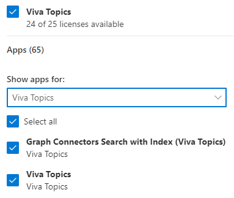
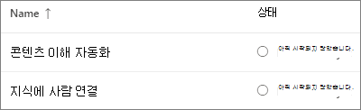
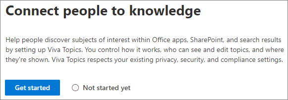
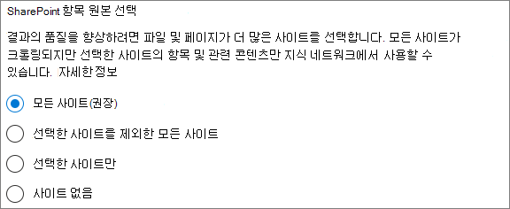
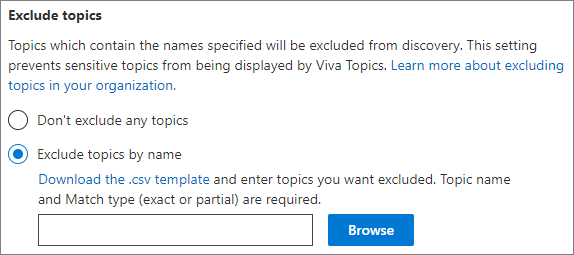
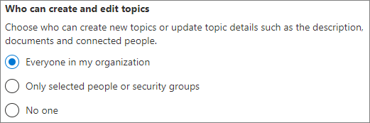
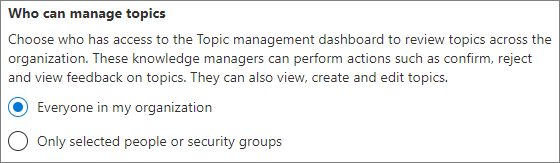
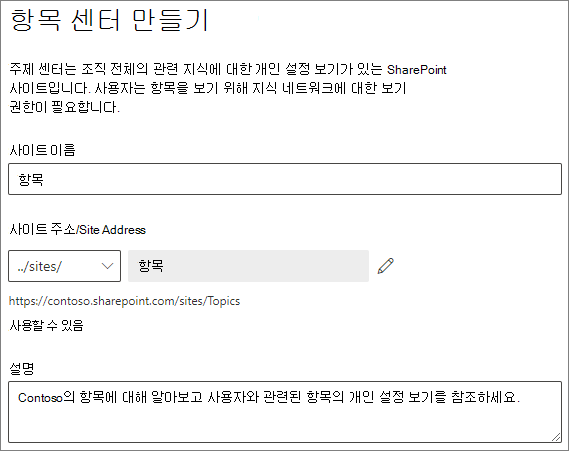
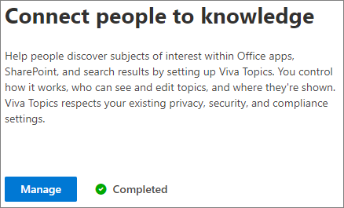

# 항목 Microsoft Viva 설정

를 사용하여 Microsoft 365 관리 센터 및 [구성할 수 있습니다.](topic-experiences-overview.md) 

환경에서 항목을 설정하고 구성하는 가장 좋은 방법을 계획하는 것이 중요합니다. 이 문서의 절차를 시작하기 전에 plan [for Microsoft Viva Topics을](plan-topic-experiences.md) 읽어야 합니다.

Viva 항목에 액세스하고 항목을 설정하려면 [Viva](https://www.microsoft.com/microsoft-viva/topics) SharePoint 관리자 또는 Microsoft 365 관리 센터 해야 합니다.

> [!IMPORTANT]
> 관리되는 장치를 SharePoint 구성한 경우 관리되는 장치에서 항목을 설정해야 합니다.

## 동영상 데모

이 비디오에서는 2016에서 항목을 설정하는 프로세스를 Microsoft 365.

 

> [!VIDEO https://www.microsoft.com/videoplayer/embed/RE4Li0E]  

 

## 라이선스 할당

항목을 사용할 사용자에 대한 라이선스를 할당해야 합니다. 라이선스가 있는 사용자만 하이라이트, 주제 카드, 주제 페이지 및 주제 센터를 비롯한 주제에 대한 정보를 볼 수 있습니다. 

라이선스를 할당하려면 다음을 수행합니다.

1. Microsoft 365 관리 센터의 **사용자** 아래에서 **활성 사용자** 를 클릭합니다.

2. 라이선스를 부여할 사용자를 선택하고 라이선스 및 **앱을 클릭합니다.**

3. **라이선스에서** **Viva 항목을 선택합니다.**

4. 앱 **아래에서** **Graph(Viva 항목)** 및 **Viva** 항목을 사용하여 커넥터 검색을 모두 선택해야 합니다.

   > [!div class="mx-imgBorder"]
   > 

5. **변경 내용 저장** 을 클릭합니다.

라이선스가 할당된 후 사용자가 항목에 액세스하는 데 최대 1시간이 걸릴 수 있습니다.

## 주제 설정

> [!Note]
> 항목을 처음 검색할 수 있도록 설정한 경우 제안된 모든 항목을 항목 관리 보기에 표시하는 데 최대 2주가 걸릴 수 있습니다. 콘텐츠에 대한 새 콘텐츠 또는 업데이트가 진행될 때 항목 검색이 계속됩니다. Viva Topics는 새 정보를 평가하므로 조직에서 제안된 주제 수가 변동되는 것은 일반적입니다.

항목을 설정하기 위해
1. 에서 [Microsoft 365 관리 센터](https://admin.microsoft.com) **를 선택한** 다음 파일 및 콘텐츠 **섹션을** 를 니다.
2. 파일 **및 콘텐츠 섹션에서** 정보를 **커넥트 클릭합니다.**

     

3. 사용자 **커넥트** 페이지에서 시작을 클릭하여 설정  프로세스를 진행합니다.

     

4. **Viva 항목을 찾는 방법** 선택 페이지에서 항목 검색을 구성합니다. 검색 **SharePoint** 원본 선택 섹션에서 SharePoint 항목의 원본으로 크롤링할 사이트를 선택합니다. 다음 중 선택:
    - **모든 사이트**: 조직의 모든 SharePoint 사이트입니다. 여기에는 현재 사이트와 향후 사이트가 포함됩니다.
    - **선택한 사이트를 제외한** 모든 사이트: 제외할 사이트의 이름을 입력합니다.  검색에서 옵트아웃하려는 사이트 목록을 업로드할 수도 있습니다. 향후 만들어진 사이트는 항목 검색을 위한 원본으로 포함됩니다. 
    - **선택한 사이트만:** 포함할 사이트의 이름을 입력합니다. 사이트 목록을 업로드할 수도 있습니다. 이후에 생성된 사이트는 토픽 검색의 원본으로 포함되지 않습니다.
    - **사이트 없음**: SharePoint 사이트는 포함하지 않습니다.

     
   
5. 이름 **항목 제외 섹션에서** 항목 검색에서 제외하려는 항목의 이름을 추가할 수 있습니다. 이 설정을 사용하여 중요한 정보가 항목으로 포함되지 않도록 합니다. 다음과 같은 옵션이 있습니다.
    - **항목을 제외하지 않습니다.** 
    - **이름으로 토픽 제외**

     

    (기술 관리자는 검색 후 항목 센터의 항목을 제외할 수 있습니다.)

    #### 이름으로 항목을 제외하는 방법    

    항목을 제외해야 하는 경우 이름으로 항목 제외를 선택한 후 .csv 템플릿을 다운로드하고 검색 결과에서 제외하려는 항목 목록으로 업데이트합니다.

     

    CSV 템플릿에서 제외할 토픽에 대한 다음 정보를 입력합니다.

    - **이름**: 제외할 토픽의 이름을 입력합니다. 이 작업을 수행하는 방법은 다음 두 가지입니다.
        - 정확한 일치: 정확한 이름 또는 약어(예: *Contoso* 또는 ATL)를 포함할 *수 있습니다.*
        - 부분 일치: 특정 단어가 있는 모든 항목을 제외할 수 있습니다.  예를 들어 *호는* 호 원, 4도분의 호, 교육 호 등 호 단어가 있는 모든 항목을 *제외합니다.*  아키텍처와 같이 텍스트가 단어의 일부로 포함된 항목은 제외되지 *않습니다.*
    - **Stands for (optional)**: If you want to exclude an acronym, type the words the acronym stands for.
    - **MatchType-Exact/Partial**: 입력한 이름이 정확히  일치 유형인지 또는 부분 일치 *유형인지 여부를* 입력합니다.

    파일 파일을 완료하고 .csv 찾아보기를 선택하여  찾아보기를 선택합니다.
    
    **다음** 을 선택합니다.

6. 항목 **Who** 볼 수 있는 위치 페이지에서 항목 표시를 구성합니다. 항목 **Who** 수 있습니다. 설정에서 강조 표시된 항목, 항목 카드, 검색의 항목 답변 및 항목 페이지와 같은 항목 세부 정보에 액세스할 수 있는 사용자 선택 다음을 선택할 수 있습니다.
    - **조직의 모든 사용자**
    - **선택한 사용자 또는 보안 그룹만**
    - **아무도 없어**

      

    > [!Note] 
    > 이 설정을 사용하면 조직의 사용자를 선택할 수 있는 반면, 항목에 할당된 항목 환경 라이선스가 있는 사용자만 항목을 볼 수 있습니다.

7. 항목 **관리에 대한** 사용 권한 페이지에서 항목을 만들거나 편집하거나 관리할 수 있는 인원을 선택합니다. 항목 Who 수 있습니다. **섹션에서** 다음을 선택할 수 있습니다.
    - **조직의 모든 사용자**
    - **선택한 사용자 또는 보안 그룹만**
    - **아무도 없어**

     

8. 항목 **Who 수 있습니다. 섹션에서** 다음을 선택할 수 있습니다.
    - **조직의 모든 사용자**
    - **선택한 사용자 또는 보안 그룹만**

     

    **다음** 을 선택합니다.

9. 항목 **센터 만들기 페이지에서** 항목 페이지를 보고 항목을 관리할 수 있는 항목 센터 사이트를 만들 수 있습니다. 사이트 **이름 상자에** 항목 센터의 이름을 입력합니다. URL을 변경하려면 연필 아이콘을 클릭할 수 있습니다. 선택적으로 설명 상자에 간단한 설명을 **입력합니다.** 

   > [!Important]
   > 나중에 사이트 이름을 변경할 수 있지만 마법사를 완료한 후 URL을 변경할 수 없습니다.

   **다음** 을 선택합니다.

     

10. **검토 및 마침** 페이지에서 선택한 설정을 보고 변경하도록 선택할 수 있습니다. 원하는 항목을 선택한 경우 **활성화** 를 선택합니다.

11. **Viva 항목** 활성화 페이지가 표시되어 시스템에서 선택한 사이트에서 항목을 분석하고 항목 센터 사이트를 만들기 시작할 것 것 을 확인합니다. **완료** 를 선택합니다.

12. You'll be returned to your **커넥트 people to knowledge** page. 이 페이지에서 **관리** 를 선택하여 구성 설정을 변경할 수 있습니다. 

        

## 항목 환경 관리

항목을 설정한 후 의 설치 중에 선택한 설정을 변경할 [Microsoft 365 관리 센터.](https://admin.microsoft.com/AdminPortal#/featureexplorer/csi/KnowledgeManagement) 다음 사항을 참조하세요.

- [항목에서 항목 Microsoft Viva 관리](topic-experiences-discovery.md)
- [항목의 항목 표시 Microsoft Viva 관리](topic-experiences-knowledge-rules.md)
- [다음 항목에서 항목 사용 Microsoft Viva 관리](topic-experiences-user-permissions.md)
- [다음 항목에서 항목 센터의 Microsoft Viva 변경](topic-experiences-administration.md)

## 참고 항목

[항목 환경 개요](topic-experiences-overview.md)
