# 특정 SharePoint 용어를 사용하여 Microsoft Viva 항목 만들기

> [!Note] 
> 이 기능은 현재 초기 채택자 프로그램에 참여하는 참가자만 사용할 수 있습니다. 이 기능은 나중에 전 세계 사용자가 사용할 수 있습니다.

특정 SharePoint 사용하여 인공 지능(AI)을 안내하여 Viva 항목에서 항목을 만들 수 있습니다. SharePoint 서비스는 모든 사이트에서 사용할 수 있는 전역 용어를 제공합니다. 사용자는 용어로 표현되는 개념에 해당하는 항목을 만들 수 있습니다. 

이러한 작업을 수행하는 데 사용할 전역 용어에 대한 편집 권한이 있어야 합니다.

<!---
> [!Note]
> This feature is available only for users who are licensed for Viva Topics.
--->

## 작업 방법

누군가가 용어에서 항목을 만들 수 있는 항목을 만들면 해당 항목을 만들기 위해 해당 용어에 대한 정보를 Viva Topics로 릴레이합니다. 이 정보에는 다음이 포함됩니다.

- 이름(기본 레이블)
- 동의어
- 설명
- 용어로 태그가 지정된 파일

만들어진 항목에서는 용어의 원래 이름을 사용하여 동의어를 항목의 대체 이름으로 고려하고 해당 용어의 설명을 항목 설명에 사용하게 됩니다. 이 항목에서는 "제안된" 파일로 간주됩니다. 그런 다음 AI가 항목의 추가 콘텐츠를 계속 검색합니다.

> [!Note]
> 항목 만들기가 성공하려면 해당 용어에 태그가 지정된 파일이 하나 이상 있어야 합니다. 그렇지 않은 경우 시스템에서 요청을 거부합니다.

용어에서 항목을 만든 후 용어는 SharePoint 용어 저장소에 계속 존재하며 항목 만들기의 영향을 받지 않습니다. 목록 및 라이브러리에서 계속 사용할 SharePoint 있습니다.

용어를 삭제해도 해당 항목은 자동으로 제거되지 않습니다. Viva Topics가 용어 및 태그가 지정한 콘텐츠만이 아닌 항목과 관련된 콘텐츠를 식별하는 경우 해당 항목은 계속 존재합니다.

용어의 기본 레이블이나 설명이 변경되는 경우 Viva Topics는 변경 내용을 평가하고 변경이 적절한 것으로 확인될 경우 항목 정보를 업데이트합니다. 용어로 태그가 지정되는 콘텐츠도 Viva 항목으로 주기적으로 전달됩니다. 용어로 태그가 지정된 콘텐츠가 더 이상 없는 경우 Viva Topics에서 해당 항목과 연결된 다른 콘텐츠를 식별하지 않은 경우 해당 항목은 제거될 수 있습니다.

항목의 업데이트는 원래 용어에 영향을 주지 않습니다.

## 항목 만들기 요청 시작

용어 집합에서 단일 용어 또는 여러 용어를 요청할 수 있습니다. 최신 용어 저장소에서 항목 만들기 요청을 SharePoint 합니다. 용어 집합을 편집할 수 있는 사용자에게는 요청을 시작할 수 있는 권한이 있습니다. 이러한 사용자에게는 용어 저장소 관리자, 그룹 관리자 및 참가자가 포함됩니다.

### 단일 용어 요청

1. SharePoint 관리 센터의 왼쪽 탐색에서 용어 저장소 **를 선택합니다.**

    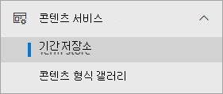 

2. 용어 **저장소 페이지에서** 사용할 용어를 검색하고 선택합니다.

    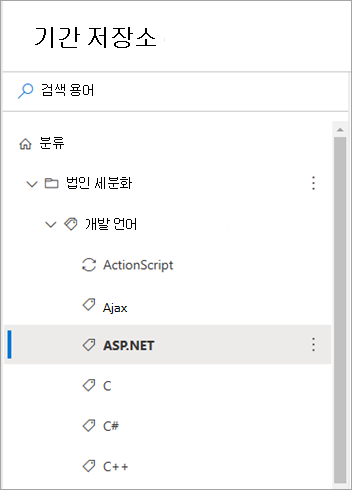

3. 용어 페이지에서 사용 설정 **탭을** 선택합니다.

    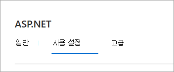

4. 이 **용어에서 항목 만들기 섹션에서** 요청 항목을 **선택합니다.**

    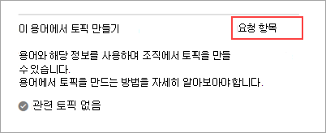

### 용어 집합에서 여러 용어 요청

1. SharePoint 관리 센터의 왼쪽 탐색에서 용어 저장소 **를 선택합니다.**

     

2. 용어 **저장소 페이지에서** 사용할 용어 집합을 검색하고 선택합니다.

    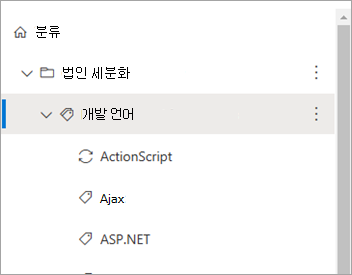

3. 용어 페이지에서 사용 설정 **탭을** 선택합니다.

    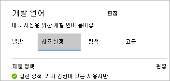

4. 용어에서 **항목 만들기 섹션에서** 시작 **을 선택합니다.** 과거에 요청을 발생시작한 경우 나타나는 옵션은 만들기 용어 **만들기입니다.**

    

    용어로부터 **항목 만들기 섹션에서** 항목 **요청 을 선택합니다.**

    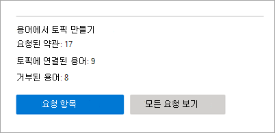

    1. 항목을 **만들 용어** 선택 페이지에서 이 용어 집합 내의 용어 계층 구조를 선택할 수 있습니다.

        

    2. 특정 용어를 선택하려면 각 용어를 개별적으로 선택합니다.

    3. 계층 구조에서 노드의 직접 자식 노드를 모두 선택할 수도 있습니다. 

5. 항목을 만들 용어를 선택한 후 제출을 **선택합니다.**

    Viva Topics는 요청을 만들고 처리될 요청을 큐에 대기합니다. Viva 항목에서는 용어 및 관련 리소스를 평가하고 새 항목을 작성하거나 기존 항목과 병합합니다. 초기 요청이 끝난 후 24시간 내에 항목 생성됩니다.

## 항목 만들기 요청의 상태 보기

항목 만들기 요청은 요청, 성공 또는 거절의 세 가지 상태 중 하나에 있습니다.

- **Requested** – 요청이 대기 중이고 서비스가 필요한 모든 용어 정보를 수집하고 있는 경우를 나타냅니다. 새 요청은 두 최종 상태 중 하나로 이동하기 전에 몇 시간 동안 요청된 상태로 남아 있을 수 있습니다.

- **Success** – 필요한 모든 용어 정보를 통해 요청이 Viva 항목으로 성공적으로 릴레이된 경우를 나타냅니다. Viva Topics는 다음 24시간 내에 해당 항목을 만듭니다.

- **거절 –** 용어로 태그가 지정되는 파일이 아니기 때문에 요청을 처리할 수 없다고 나타냅니다. 요청이 성공하기 위해 태그가 지정된 파일이 하나 이상 있습니다. 나중에 파일이 용어로 태그가 지정되는 경우 용어에 대한 새 요청을 수동으로 만들 수 있습니다.

용어 저장소에서 다음을 통해 요청 상태를 볼 수 있습니다.

- 개별 용어로 진행합니다.
- 특정 용어 집합에 대한 모든 요청 보기

### 단일 용어의 상태 보기

1. 용어 **저장소 페이지에서** 상태를 확인할 용어를 검색하고 선택합니다.

    

2. 용어 페이지에서 사용 설정 **탭을** 선택합니다.

    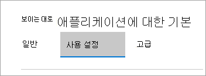

3. 이 **용어에서 항목 만들기 섹션에서** 요청의 상태를 니다.

    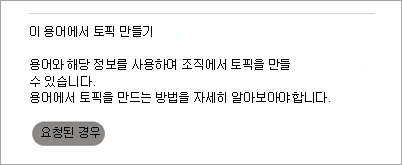

### 용어 집합에서 여러 용어의 상태 보기

1. 용어 **저장소 페이지에서** 상태를 확인할 용어 집합을 검색하고 선택합니다.

    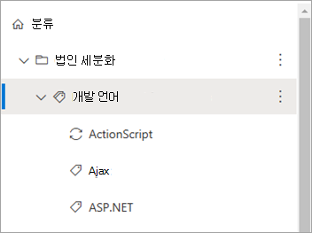

2. 용어 페이지에서 사용 설정 **탭을** 선택합니다.

    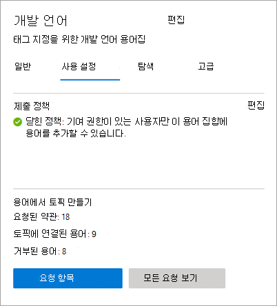

    용어로  항목 만들기 섹션에서 총 요청 수, 항목에 연결된 수 및 거부된 요청 수를 볼 수 있습니다.

3. 모든 **요청 보기 를 선택합니다.**

4. 항목 **만들기에** 대해 요청된 모든 용어 패널에서 용어 요청의 상태를 시청합니다.

    

5. 요청이 많은 경우 추가  항목 로드를 선택하여 추가 항목을 계속 로드합니다.

    

6. 특정 상태에 있는 요청을 검토하려면 상태  열에서 다음으로 **필터링을 선택합니다.**

    

     필터링할 상태(거절, 성공 또는  **요청)를 선택합니다.**

    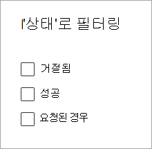

<!---

## Identify topics created from terms (feature not ready yet)

After Viva Topics processes a request and creates a topic, you can see a topic card when you hover over a term name in the list of requests for the term set.

    

Also, if you go to individual terms, and select the **Usage settings** tab, the **Create topic from this term** section shows a topic card when you hover over the name.

    

Topic pages also indicate that the taxonomy is one of the sources for the topic.

**--Insert screenshot from final UX - source string in topic page--**

--->
