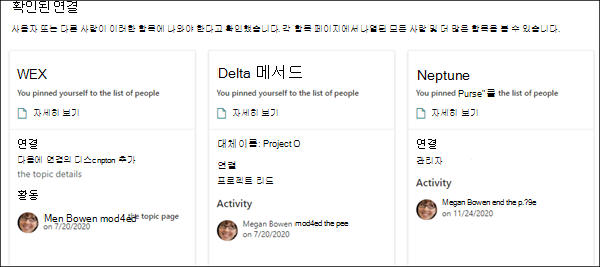

# Microsoft Viva 항목의 항목 센터 개요

Microsoft Viva 항목에서 항목 센터는 조직에 대한 지식의 중심 역할을 하는 최신 SharePoint 사이트입니다. Microsoft 365 관리 센터의 [Viva 항목](set-up-topic-experiences.md) 설정 중에 만들어집니다.

항목 센터에는 사용이 허가된  모든 사용자가 연결이 있는 항목을 볼 수 있는 항목 웹 파트가 있는 기본 홈 페이지가 있습니다. 

항목을 볼 수 있는 모든 사용이 허가된 사용자는 항목 센터에 액세스할 수 있는 반면, 기술 관리자는 항목 관리 페이지를 통해 항목을 관리할 **수** 있습니다. 항목 **관리 탭은** 항목 관리 권한이 있는 사용자에게만 표시됩니다. 

## 내 항목 센터 위치

항목 센터는 Viva 항목 설정 중에 만들어집니다. 설치가 완료되면 관리자는 항목 센터 관리 페이지에서 [URL을 찾을 수 있습니다.](./topic-experiences-administration.md#to-access-topics-management-settings)

1. Microsoft 365 관리 센터에서 설정 을 선택한 다음 **Org 설정을 선택합니다.**
2. 서비스 **탭에서** 항목 환경 **을 선택합니다.**

      

3. 항목 **센터 탭을** 선택합니다. 사이트 **주소 아래에는** 항목 센터에 대한 링크가 있습니다.

      

## 홈페이지

 

> [!VIDEO https://www.microsoft.com/videoplayer/embed/RE4LAhZ]  

 

항목 센터 홈 페이지에서 연결이 있는 조직의 항목을 볼 수 있습니다.

- 제안된 연결 - 이러한 항목에 나열된 아래에 나열된 **항목을 볼 수 있습니다. 올바른가요?**. 다음은 AI를 통해 항목에 대한 연결을 제안한 항목입니다. 예를 들어 관련 파일이나 사이트의 작성자일 수 있습니다. 항목에 대한 관련 사람으로 나열되어야 하는지 확인이 요청됩니다.

     
 
- 확정된 연결 - 항목 페이지에 고정되거나 항목에 대한 제안된 연결을 확인한 항목입니다. 제안된 연결을 확인하면 항목은 제안된 섹션에서 확인된 섹션으로 이동됩니다.
 
     

사용자가 항목에 대한 연결을 확인하면 사용자는 항목 페이지를 편집하여 연결을 큐레이터로 만들 수 있습니다. 예를 들어 항목에 대한 연결에 대한 자세한 정보를 제공할 수 있습니다.

## 항목 관리 페이지

항목 센터의 **항목** 관리 섹션에서 작업하려면 기술 관리자 역할에 필요한 항목 관리 권한이 필요합니다. 관리자는 지식 관리 설정 중에 사용자에게 이러한 사용 권한을 할당할 수 있습니다. 또는 관리자가 Microsoft 365 관리 센터를 통해 이후에 새 사용자를 추가할 수 있습니다. 

항목 관리 페이지에 있는 항목 대시보드에는 지정된 원본 위치에서 식별된 모든 항목(액세스 권한이 있습니다.)이 표시됩니다. 각 항목에는 항목을 검색한 날짜가 표시될 것입니다. Manage topics 권한이 할당된 사용자는 확정되지 않은 항목을 검토하고 다음을 선택할 수 있습니다.
- 확인 항목: 항목과 관련된 파일 및 페이지에 액세스할 수 있는 사용자에게 항목을 강조 표시하고 관련 항목 카드 및 항목 페이지를 볼 수 있도록 합니다.
- 항목 게시: 항목 정보를 편집하여 처음 식별된 항목의 품질을 개선하고 항목에 대한 보기 권한이 있는 모든 사용자에게 해당 항목을 강조합니다. 
- Reject the topic: Makes the topic not available to users. 이 항목은 거부된 탭으로 이동하며 필요한 경우 나중에 확인할 수 있습니다.  

> [!Note] 
> 항목 [관리 페이지에서](manage-topics.md) 항목 관리 항목에 대한 자세한 내용은 항목 관리를 참조하세요.

## 항목 만들기 또는 편집

항목 만들기 및 편집 권한이 있는 경우 다음을 할 수 있습니다.

- [기존 항목 편집:](edit-a-topic.md)검색을 통해 만들어진 기존 항목 페이지를 변경할 수 있습니다.
- [새 항목 만들기:](create-a-topic.md)검색을 통해 찾을 수 없는 항목이나 AI 도구에서 항목을 만들 수 있는 충분한 증거를 찾지 못하면 새 항목을 만들 수 있습니다.

## 참고 항목

[주제 센터에서 주제 관리](manage-topics.md)

