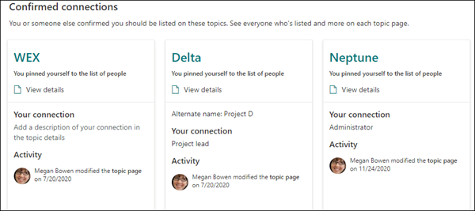

# 항목 센터 개요(미리 보기)Topic center overview (Preview)

> [!Note] 
> 이 문서의 내용은 Project Cortex Private Preview용입니다.The content in this article is for Project Cortex Private Preview. [Project Cortex](https://aka.ms/projectcortex)에 대해 자세히 알아보세요.[Find out more about Project Cortex](https://aka.ms/projectcortex).

이 항목 센터는 조직에 대한 지식의 중심 역할을 하는 최신 SharePoint 사이트입니다.The topic center is a Modern SharePoint site that serves as a center of knowledge for your organization. Microsoft 365 관리 센터에서 항목 환경 설정 중에 만들어집니다. It is created during [Topic Experiences setup](set-up-topic-experiences.md) in the Microsoft 365 admin center.

항목 센터에는 모든 항목 환경 사용자가 연결이 있는 항목을 볼 수 있는 기본 홈 페이지(내 항목)가 있습니다.The Topic center has a default home page (My topics) where all Topic Experience users can see the topics to which they have a connection. 

항목을 볼 수 있는 모든 사용이 허가된 사용자는 항목 센터에 액세스할 수 있는 반면, 기술 관리자는 항목 관리 페이지를 통해 항목을 관리할 **수도** 있습니다.While all licensed users who can view topics will have access to the Topic center, knowledge managers will also be able to manage topics through the **Manage topics** page. 항목 관리 탭은 항목 관리 권한이 있는 **사용자에게만** 표시됩니다.The Manage topics tab will only display to users who have the **Manage topics** permissions. 

## 내 항목 센터 위치Where is my Topic center

항목 센터는 항목 환경 설정 중에 만들어집니다.The Topic center is created during Topic Experiences setup. 설치가 완료되면 관리자는 항목 센터 관리 페이지에서 URL을 찾을 [수 있습니다.](https://docs.microsoft.com/microsoft-365/knowledge/topic-experiences-administration#to-access-topics-management-settings)After setup completes, an admin can find the URL on the [Topic center management page](https://docs.microsoft.com/microsoft-365/knowledge/topic-experiences-administration#to-access-topics-management-settings).

1. Microsoft 365 관리 센터에서 설정, Org 설정을 **클릭합니다.**In the Microsoft 365 admin center, click **Settings**, then **Org settings**.
2. 서비스 **탭에서** 기술 **네트워크를 클릭합니다.**On the **Services** tab, click **Knowledge network**.

      

3. 항목 센터 **탭을** 선택합니다. 사이트 **주소 아래에는** 항목 센터에 대한 링크가 있습니다.Select the **Topic center** tab. Under **Site address** is a link to your Topic center.

      

## 홈페이지Home page

 

> [!VIDEO https://www.microsoft.com/videoplayer/embed/RE4LAhZ]  

 

항목 센터 홈 페이지에서 연결이 있는 조직의 항목을 볼 수 있습니다.On the Topic center home page, you can see the topics in your organization to which you have a connection.

- 제안된 연결 - 이러한 항목에 나열된 아래에 제안된 항목을 **볼 수 있습니다. 올바른 선택이 했나요?**.Suggested connections - You will see suggested topics listed under **We've listed you on these topics. Did we get it right?**. 다음은 AI를 통해 항목에 대한 연결을 제안한 항목입니다.These are topics where your connection to the topic has been suggested through AI. 예를 들어 관련 파일 또는 사이트의 소유자일 수 있습니다.For example, you may be the owner of a related file or site. 제안된 항목은 항목에 대한 연결을 확인하는 데 필요합니다.Suggested topics will ask you to confirm you connection to the topic.

     
 
- 확인된 연결 - 다른 사용자가 항목에 고정하거나 항목에 대한 연결을 확인한 항목입니다.Confirmed connections - These are topics where you are pinned on the topic by another user or you've confirmed your connection to the topic. 제안된 연결을 확인하면 항목은 제안된 섹션에서 확인된 섹션으로 이동됩니다.Topics will move from the suggested to confirmed section when you confirm a suggested connection.
 
     

사용자가 항목에 대한 연결을 확인하면 사용자는 항목 페이지를 편집하여 연결을 큐레이터할 수 있습니다.Once a user confirms their connection to a topic, the user can make edits to the topic page to curate their connection. 예를 들어 항목에 대한 연결에 대한 자세한 정보를 제공할 수 있습니다.For example, they can provide more information about their connection to the topic.

## 항목 관리 페이지Manage topics page

항목 센터의  항목 관리 섹션에서 작업하려면 기술 관리자  역할에 필요한 항목 관리 권한이 필요합니다.To work in the **Manage Topics** section of Topic center, you need to have the required *Manage topics* permissions needed for the knowledge manager role. 관리자는 지식 관리 설정 중에 사용자에게 이러한 권한을 할당하거나,  관리자가 Microsoft 365 관리 센터를 통해 이후에 새 사용자를 추가할 수 있습니다.Your admin can assign these permissions to users during [knowledge management setup](set-up-topic-experiences.md), or new users can be [added afterwards](topic-experiences-knowledge-rules.md) by an admin through the Microsoft 365 admin center.

항목 관리 페이지의 항목 대시보드에는 지정된 원본 위치에서 식별된 항목들이 표시됩니다.On the Manage Topics page, the topic dashboard shows topics that were identified from your specified source locations. 각 항목에는 항목을 검색한 날짜와 해당 항목에 대한 피드백이 제공된 경우가 표시될 것입니다.Each topic will show the date the topic was discovered and if any feedback has been provided on it. 항목 관리 권한이  할당된 사용자는 확정되지 않은 항목을 검토하고 다음을 선택할 수 있습니다.A user who was assigned **Manage topics** permissions can review the unconfirmed topics and choose to:
- 항목 확인: 액세스 권한이 있는 사용자에게 항목을 강조 표시하고 관련 항목 카드 및 항목 페이지를 볼 수 있도록 합니다.Confirm the topic: Highlights the topic to users who have access and lets them see the associated topic card and topic page.
- 항목 거부: 사용자가 이 항목을 사용할 수 없습니다.Reject the topic: Makes the topic not available to users. 이 항목은 거부된 탭으로 이동된 후 필요한 경우 나중에 확인할 수 있습니다. 지식 관리자가 안내할 수 있습니다. The topic is moved to the **Rejected** tab and can be confirmed later if needed.a knowledge manager can guide 

> [!Note] 
> 항목 [관리 페이지에서](manage-topics.md) 항목 관리에 대한 자세한 내용은 항목 관리 항목을 참조하십시오.See [Manage topics](manage-topics.md) for more details about topic managing topics in the Manage topics page.

## 항목 만들기 또는 편집Create or edit a topic

항목 만들기 **및** 편집 권한이 있는 경우 다음을 할 수 있습니다.If you have **Create and edit topics** permissions, you will be able to:

- [기존 항목 편집:](edit-a-topic.md)검색을 통해 만들어진 기존 항목 페이지를 변경할 수 있습니다.[Edit existing topics](edit-a-topic.md): You can make changes to existing topic pages that were created through discovery.
- [새 항목](create-a-topic.md)만들기: 검색을 통해 찾을 수 없는 항목이나 AI 도구에서 항목을 만들 수 있는 충분한 증거를 찾지 못하면 새 항목을 만들 수 있습니다.[Create new topics](create-a-topic.md): You can create new topics for ones that were not found through discovery, or if AI tools did not find enough evidence to create a topic.

## 참고 항목See also

  

