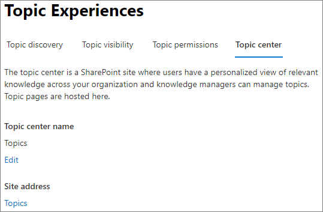

# 다음 항목에서 항목 센터의 Microsoft Viva 변경

에서 항목 센터의 이름을 변경할 [수 Microsoft 365 관리 센터.](https://admin.microsoft.com) 이러한 작업을 수행하려면 전역 관리자 또는 SharePoint 관리자 되어야 합니다.

## 주제 관리 설정에 액세스하려면 다음을 수행합니다.

1. 다음 Microsoft 365 관리 센터 **를** 클릭하고 설정 **를 클릭합니다.**
2. 서비스 **탭에서** 항목 환경을 **클릭합니다.**

     

3. 항목 **센터 탭을** 선택합니다. 각 설정에 대한 자세한 내용은 다음 섹션을 참조하세요.

     

##  주제 센터 이름 업데이트

항목 센터의 이름을 변경합니다.

1. 항목 센터 **탭의** 항목 **센터 이름에서** 편집 을 **선택합니다.**
2. 항목 **센터 이름 편집** 페이지의 항목 **센터** 이름 상자에 항목 센터의 새 이름을 입력합니다.
3. **저장** 을 선택합니다.

      

## 참고 항목

[항목에서 항목 Microsoft Viva 관리](topic-experiences-discovery.md)

[항목의 항목 표시 Microsoft Viva 관리](topic-experiences-knowledge-rules.md)

[다음 항목에서 항목 사용 Microsoft Viva 관리](topic-experiences-user-permissions.md)
