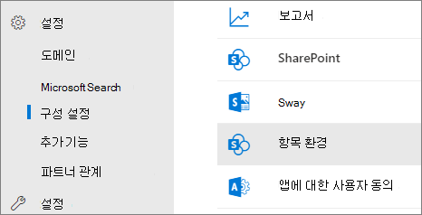
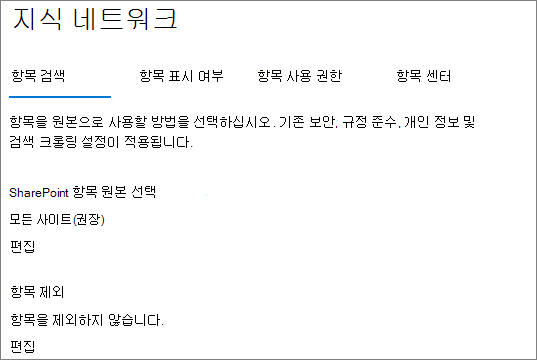

# <a name="manage-topic-discovery-in-microsoft-viva-topics"></a>항목에서 항목 Microsoft Viva 관리

에서 항목 검색 설정을 관리할 [수 Microsoft 365 관리 센터.](https://admin.microsoft.com) 이러한 작업을 수행하려면 전역 관리자 또는 SharePoint 관리자 되어야 합니다.

## <a name="to-access-topics-management-settings"></a>주제 관리 설정에 액세스하려면 다음을 수행합니다.

1. 다음 Microsoft 365 관리 센터 **를** 클릭하고 설정 **를 클릭합니다.**
2. 서비스 **탭에서** 항목 환경을 **클릭합니다.**

     

3. 항목 검색 **탭을** 선택합니다. 각 설정에 대한 자세한 내용은 다음 섹션을 참조하세요.

     

## <a name="select-sharepoint-topic-sources"></a>항목 SharePoint 선택

항목에 대해 크롤링할 SharePoint 사이트를 변경할 수 있습니다.

특정 사이트 목록을 포함하거나 제외하려는 경우 다음 서식 파일을 .csv 있습니다.

``` csv
Site name,URL
```

사이트 선택기를 사용하여 사이트를 추가하면 해당 사이트는 포함하거나 제외할 기존 사이트 목록에 추가됩니다. .csv 파일을 업로드하면 기존 목록을 덮어씁니다. 이전에 특정 사이트를 포함하거나 제외한 경우 목록을 .csv 파일로 다운로드하고 변경한 후 새 목록을 업로드합니다.

항목 검색을 위한 사이트를 선택하기 위해

1. **토픽 검색** 탭의 **SharePoint 토픽 원본 선택** 에서 **편집** 을 선택하세요.
2. 검색 **SharePoint** 원본 선택 페이지에서 SharePoint 항목의 원본으로 크롤링할 사이트를 선택합니다. 여기에는 다음이 포함됩니다.
    - **모든 사이트:** 테넌트의 SharePoint 사이트입니다. 그러면 현재 및 향후 사이트를 캡처합니다.
    - **선택한 사이트를 제외한** 모든 사이트: 제외할 사이트의 이름을 입력합니다.  검색에서 옵트아웃하려는 사이트 목록을 업로드할 수도 있습니다. 이후에 생성된 사이트는 토픽 검색의 원본으로 포함됩니다. 
    - **선택한 사이트만:** 포함할 사이트의 이름을 입력합니다. 사이트 목록을 업로드할 수도 있습니다. 이후에 생성된 사이트는 토픽 검색의 원본으로 포함되지 않습니다.
    - **사이트 없음:** 항목은 콘텐츠가 자동으로 생성되거나 업데이트되지 SharePoint 않습니다. 기존 항목은 항목 센터에 남아 있습니다.

    
   
3. **저장** 을 클릭합니다.

## <a name="exclude-topics-by-name"></a>이름으로 토픽 제외

.csv 파일을 사용하여 목록을 업로드하여 검색에서 토픽을 제외할 수 있습니다. 이전에 토픽을 제외했으면 .csv를 다운로드하고 변경한 후 다시 업로드할 수 있습니다.

1. **토픽 검색** 탭의 **토픽 제외** 에서 **편집** 을 선택하세요.
2. 이름으로 **항목 제외를 클릭합니다.**
3. 목록을 만들어야 하는 경우 .csv 템플릿을 다운로드하고 제외할 항목을 *추가합니다(아래* .csv 서식 파일 작업 참조). 파일이 준비되면 찾아보기를 **클릭하고** 파일을 업로드합니다. 기존 목록이 있는 경우 목록이 포함된 .csv 수 있습니다.
4. **저장** 을 클릭합니다.

    

### <a name="working-with-the-csv-template"></a>.csv 작업

아래 csv 템플릿을 복사할 수 있습니다.

``` csv
Name (required),Expansion,MatchType- Exact/Partial (required)
```

CSV 템플릿에서 제외할 토픽에 대한 다음 정보를 입력합니다.

- **이름**: 제외할 토픽의 이름을 입력합니다. 이 작업을 수행하는 방법은 다음 두 가지입니다.
    - 정확한 일치: 정확한 이름이나 약어(예: *Contoso* 또는 ATL)를 제외할 *수 있습니다.*
    - 부분 일치: 특정 단어가 있는 모든 항목을 제외할 수 있습니다.  예를 들어 *호는* 호 원, 4도분의 호, 교육 호 등 호 단어가 있는 모든 항목을 *제외합니다.*  아키텍처와 같이 텍스트가 단어의 일부로 포함된 항목은 제외되지 *않습니다.*
- **Stands for (optional)**: If you want to exclude an acronym, type the words the acronym stands for.
- **MatchType-Exact/Partial**: 입력한 이름이 정확히  일치 유형인지 또는 부분 일치 *유형인지 여부를* 입력합니다.

     

## <a name="see-also"></a>참고 항목

[2016에서 항목 표시 Microsoft 365](topic-experiences-knowledge-rules.md)

[2013에서 항목 사용 권한 Microsoft 365](topic-experiences-user-permissions.md)

[2013에서 항목 센터의 이름을 Microsoft 365](topic-experiences-administration.md)
