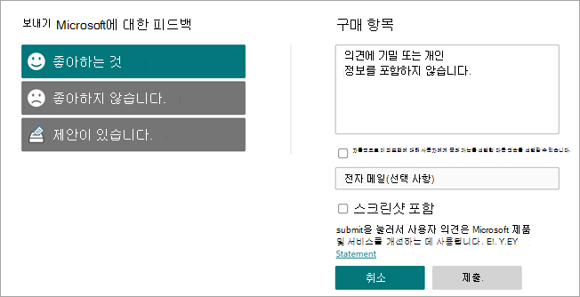

# Microsoft Viva 주제 개요 

Viva 항목에서는 Microsoft AI 기술, Microsoft 365, Microsoft Graph, 검색 및 기타 구성 요소 및 서비스를 사용하여 Word, PowerPoint, Outlook 및 검색에서 SharePoint 최신 페이지, Microsoft Search 및 검색부터 시작하여 일상적으로 사용하는 Microsoft 365 앱의 사용자에게 지식을 Excel.

 

> [!VIDEO https://www.microsoft.com/videoplayer/embed/RE4LhZP]  

 

Viva 항목은 많은 회사에서 중요한 비즈니스 문제를 해결하고 필요할 때 사용자에게 정보를 제공하는 데 도움이 됩니다. 예를 들어 새 직원은 많은 새 정보를 빠르게 학습하고 회사 정보를 읽을 때 전혀 모르는 용어를 접해야 합니다. 자세히 알아보기 위해 사용자는 현재 수행하고 있는 작업을 멈추고, 해당 용어가 무엇인지, 조직에서 주제 전문가인 사람이 누구인지, 해당 용어와 관련된 사이트 및 문서와 같은 세부 정보를 검색하는 데 시간을 소비해야 할 수 있습니다.

Viva Topics는 AI를 사용하여 조직에서 *주제* 를 자동으로 검색하고 식별합니다. 간략한 설명, 주제에 대해 작업하는 사용자, 주제에 관련된 사이트, 파일, 페이지 등 해당 주제에 대한 정보가 컴파일됩니다. 지식 관리자 또는 기여자는 필요한 경우 주제 정보를 업데이트할 수 있습니다. 사용자는 이 주제를 사용할 수 있습니다. 즉, 뉴스 및 페이지의 최신 SharePoint 사이트에 나타나는 주제의 모든 인스턴스에 대해 텍스트가 강조 표시됩니다. 사용자는 주제를 선택하여 주제 세부 정보를 통해 주제에 대해 자세히 알아볼 수 있습니다. SharePoint Search에서도 주제를 찾을 수 있습니다.

## 사용자에게 주제가 표시되는 방법

다음을 통해 사용자에게 항목을 표시합니다.

- [페이지 SharePoint](topic-experiences-overview.md#sharepoint-highlights) 강조 표시된 항목
- 검색 결과의 [항목 답변](topic-experiences-overview.md#search-results)
- Office 응용 [프로그램에서 검색](topic-experiences-overview.md#office-application-search)
- [항목 센터](topic-experiences-overview.md#topic-center) 홈 페이지

### SharePoint 강조 표시

SharePoint 뉴스 및 페이지의 콘텐츠에서 한 주제가 언급된 경우 해당 주제가 강조 표시됩니다. 하이라이트에서 주제 요약을 열 수 있습니다. 요약 제목에서 항목 세부 정보를 열어 전체 항목 페이지를 니다. 언급된 항목을 자동으로 식별하거나 페이지 작성자가 직접 참조할 수 있습니다. 

    

### 검색 결과

전체 조직을  포함하기 위해 검색 범위를 변경한 후 SharePoint 시작 페이지에서 검색하거나 Office.com에서 검색하거나 SharePoint 사이트에서 검색할 때 검색 결과에 항목 응답을 볼 수 있습니다. 이 항목의 대답은 결과 목록의 항목에 표시되어 해당 항목과 관련된 짧은 정보 집합을 제공합니다. 

    

### Office 응용 프로그램 검색

검색 상자를 통해 또는 상황에 맞는 메뉴에서 검색을 선택하여 Word, PowerPoint, Outlook 또는 Excel 앱과 같은  Office 앱에서 검색을 사용하는 경우 항목 답변이 검색 결과에 표시됩니다.

   

   

### 항목 센터

사용자는 조직에서 항목 센터 홈 페이지에서 연결이 있는 [항목을 볼 수 있습니다.](topic-center-overview.md#home-page)

## 지식 인덱싱

Viva Topics는 Microsoft AI 기술을 사용하여 Microsoft 365 환경에서 *주제* 를 식별합니다.

주제는 조직적으로 특별한 의미가 있거나 중요한 문구 또는 용어입니다. 주제에는 조직에 대해 특정한 의미가 있으며, 사용자가 무엇인지 이해하고 자세한 정보를 찾는 데 도움이 될 수 있는 관련된 리소스가 있습니다. 조직에 중요한 주제 유형은 여러 가지가 있습니다. 처음 Microsoft AI 기술은 다음과 같은 유형에 중점을 두고 있습니다.

- 프로젝트
- 이벤트
- 조직
- 위치
- 제품
- 창의적 작업
- 연구 필드

특정 주제가 식별되어 AI가 해당 주제가 추천 주제가 되기에 충분한 정보가 있다고 판단하면 *주제 페이지에는* 다음과 같은 주제 인덱싱을 통해 수집된 정보가 표시됩니다.

- 대체 이름 및 머리글자어
- 주제에 대한 간단한 설명
- 주제에 대해 잘 아는 사람
- 주제와 관련된 파일, 페이지 및 사이트

지식 관리자는 테넌트의 모든 SharePoint 사이트를 크롤링하거나 특정 SharePoint 사이트를 선택할 수 있습니다.

자세한 내용은 항목 검색 및 [큐레이터를 참조하세요.](./topic-experiences-discovery-curation.md)

## 역할

Microsoft 365 환경에서 Viva Topics를 사용하는 경우 사용자는 다음 역할을 맡게 됩니다.

- 주제 뷰어: 최소 *읽기* 권한이 있는 SharePoint 최신 사이트와 Microsoft Search에서 주제 하이라이트를 볼 수 있는 사용자입니다. 주제 페이지에서 주제 세부 정보를 보기 위해 주제 하이라이트를 선택할 수 있습니다. 주제 뷰어는 특정 주제가 얼마나 유용한지 피드백을 제공할 수 있습니다.

- 기여자: 기존 주제를 편집하거나 새 주제를 만들 수 있는 권한이 있는 사용자입니다. 지식 관리자는 Microsoft 365 관리 센터의 Viva Topics 설정을 통해 사용자에게 기여자 권한을 할당합니다. 모든 주제 뷰어에게 주제를 편집하고 만들 수 있는 권한을 부여하여 모든 사용자가 자신이 보는 주제에 기여할 수 있도록 선택할 수도 있습니다.

- 지식 관리자: 주제 수명 주기를 통해 주제를 안내하는 사용자입니다. 지식 관리자는 항목  센터의 항목 관리 페이지를 사용하여 AI 추천 항목을 확인하고, 더 이상 관련이 없는 항목을 제거하고, 기존 항목을 편집하거나 새 항목을 만들 수 있으며, 항목에 액세스할 수 있는 유일한 사용자입니다. 지식 관리자는 Microsoft 365 관리 센터의 Viva Topics 관리 설정을 통해 사용자에게 지식 관리자 권한을 할당합니다. 

- 지식 관리자: 관리자는 Viva 항목을 설정하고 관리자의 관리 컨트롤을 통해 Microsoft 365 관리 센터. 현재 Microsoft 365 전역 또는 SharePoint 관리자는 지식 관리자 역할을 할 수 있습니다.

자세한 내용은 [Viva Topics 역할 을 참조하세요.](topic-experiences-roles.md)

## 주제 관리

항목 관리는 조직의  항목 센터의 항목 관리 *페이지에서 수행됩니다.* 항목 센터는 설치 중에 만들어지며 조직의 지식 센터 역할을 합니다. 

라이선스가 부여된 모든 사용자는 항목 센터에서 연결된 항목을 볼 수  있는 반면 항목 관리 권한이 있는 사용자(기술 관리자)만 항목 관리 페이지를 보고 사용할 **수** 있습니다.

지식 관리자는 다음을 할 수 있습니다.

- 테넌트에서 검색된 주제를 확인하거나 제거합니다.
- 필요한 경우 새 주제를 수동으로 만들 수 있습니다(예: AI를 통해 검색하기에 충분한 정보가 부족한 경우).
- 기존 주제 페이지를 편집합니다.

자세한 내용은 항목 센터에서 [항목 관리를 참조하세요.](manage-topics.md)  

## 관리자 컨트롤

관리자 컨트롤의 Microsoft 365 관리 센터 Viva 항목을 관리할 수 있습니다. 관리자 컨트롤을 통해 Microsoft 365 전역 또는 SharePoint 관리자가 다음을 할 수 있습니다.

- SharePoint 최신 페이지 또는 SharePoint 검색 결과에서 주제를 볼 수 있는 조직의 사용자를 제어합니다.
- 주제를 식별하기 위해 크롤링할 SharePoint 사이트를 제어합니다.
- 특정 주제를 찾을 수 없게 합니다.
- 주제 센터에서 주제를 관리할 수 있는 사용자를 제어합니다.
- 주제를 만들고 편집할 수 있는 사용자를 제어합니다.
- 주제를 볼 수 있는 사용자를 제어합니다.

관리 컨트롤에 대한 자세한 내용은 사용자 권한 [할당,](./plan-topic-experiences.md#user-permissions)항목 표시 관리 [및](./topic-experiences-knowledge-rules.md)항목 검색 [관리를 참조하세요.](./topic-experiences-discovery.md)

## 항목 큐레이터 및 제안

AI는 사용자 환경이 변함에 따라 계속해서 주제를 개선하기 위한 제안을 제공할 것입니다. 

주제를 편집하거나 만드는 권한이 있는 사용자는 수정하거나 정보를 추가하려는 경우 주제 페이지를 직접 업데이트할 수 있습니다. 또한, AI가 식별할 수 없는 새 주제를 추가할 수도 있습니다. 이러한 수동으로 추가된 항목에 대한 충분한 정보가 있으며 AI가 이러한 유형의 항목을 식별할 수 있는 경우 AI의 추가 제안으로 이러한 수동으로 추가된 항목을 향상시킬 수 있습니다.

일상 업무에서 주제를 볼 수 있도록 허용하는 사용자에게 해당 주제가 유용한지 물어볼 수 있습니다. 시스템에서 응답을 보고 응답을 사용하여 주제 하이라이트를 개선하고, 주제 요약과 주제 세부 정보에 표시할 항목을 결정할 수 있습니다.

자세한 내용은 항목 검색 및 [큐레이터를 참조하세요.](./topic-experiences-discovery-curation.md)

## 피드백 제공

Microsoft는 고객의 피드백을 매우 중요하게 생각합니다. Viva 항목에 대해 제공하는 피드백은 문제 해결, 버그 수정, 기존 기능 향상 및 새 기능 개발에 사용됩니다. 

항목 페이지 및 항목 관리 및 내 항목  페이지에서 직접 Microsoft에 **피드백을** 보낼 수 있습니다. 페이지의 오른쪽 아래 모서리에서 이 단추를 찾아 봐야 합니다.

   

Microsoft에  피드백 보내기 페이지에서 원하는 것을 원하지 않는 경우 또는 제안 사항이 있는 경우 알려주세요.

   

피드백을 제출할 때 전화 번호, 주소 또는 개인 이야기와 같은 중요한 정보는 포함하지 않는 것이 좋습니다. 대신 Viva 항목에서 발생하는 특정 문제 또는 Viva 항목의 일반적인 사용 경험에 대한 정보를 제공하세요. 이런 정보는 Microsoft가 검토하고 피드백을 기반으로 조치를 취할 때 귀하의 개인 정보를 유지하는 데 도움이 됩니다.

여러분의 생각을 공유해 주셔서 감사합니다. 사용자 관점은 기존 기능을 개선하고 새로운 기능을 개발하는 데 도움이 됩니다.

## 참고 항목

[Viva Microsoft Search 항목을 찾아보는 데 사용할 수 있습니다.](./search.md)
