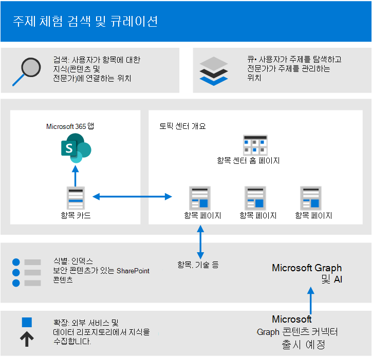
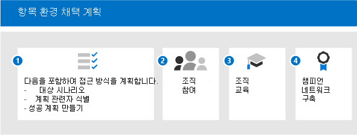

# Microsoft Viva 항목의 채택 시작

채택을 시작하기 전에 지식 관리 및 Viva 항목과 관련된 개념을 이해해야 합니다. 다음 다이어그램은 항목 검색 및 큐레이터 중에 발생하는 항목을 보여줍니다.

- **검색:** 사용자는 항목 카드를 통해 매일 사용하는 앱의 지식을 검색할 수 있습니다. 또한 Microsoft Search에서 항목을 검색할 수도 있습니다.
- **큐레이터:** 중소기업(주제 전문가)은 주제 페이지를 통해 항목을 구체화하고 AI는 입력을 통해 학습합니다. 주제 센터에는 사용자가 탐색하고 전문가가 관리할 수 있는 항목 페이지가 포함되어 있습니다.
- **식별:** Microsoft Graph 및 AI(인공 지능) 지식과 사용자(항목, 기술 등)를 식별하고 관련 항목으로 자동으로 구성합니다. SharePoint 콘텐츠는 보안 콘텐츠로 인덱싱됩니다.
- **확장:** Microsoft Graph 콘텐츠 커넥터(출시 예정)를 통해 외부 서비스 및 데이터 저장소에서 지식을 수집할 수 있습니다.

자세한 내용은 소개 [개요를 검토할](topic-experiences-overview.md) 수 있습니다.

유의해야 합니다.

- 더 많은 콘텐츠를 사용할 수 있는 경우 항목 검색이 개선됩니다.
- 정보가 새로운 환경으로 제공된 경우에도 데이터의 보안, 개인 정보 및 위치가 보존됩니다.
- 사용자는 Viva 항목을 볼 수 있는 라이선스가 필요합니다.
- 검색은 처음에 영어 콘텐츠에 있습니다.

준비를 지원하기 위해 다음 질문을 생각해 보아야 합니다.

- 항목 검색에 어떤 콘텐츠를 사용해야 하나요?
- 항목을 관리할 사람
- 항목 카드 및 강조 표시는 누구에게 표시될까요?
- 예상되는 항목은 무엇입니까?

Viva 항목을 가장 많이 사용하기 위한 이 선행 사항 목록을 검토합니다.

|제품 또는 기능 |Description |
|:-------|:--------|
|최신 SharePoint 페이지가 있는 SharePoint Online |항목 마이너링에는 SharePoint 사이트의 콘텐츠만 포함하며 항목 카드는 최신 페이지에만 표시될 수 있습니다.|
|Microsoft Graph |Microsoft Graph 설정을 사용하여 항목을 검색 또는 Delve에서 포함하거나 제외할지 여부를 제어할 수 있습니다. |

## 채택 계획

Viva 항목의 채택을 계획하려면 다음을 해야 합니다.

1. 접근 방식 및 대상 시나리오를 계획합니다.
    - 시나리오의 정의 및 우선 순위 지정에 대해 [생각해 봤습니다.](#target-scenarios)
    - 관련된 관련자 [및](#identify-stakeholders) 프로젝트 팀 구성원에 대해 생각해 보아야 합니다.  
    - 영향이 주도하려는 비즈니스 영향과 성공 측정 방법을 [알아 야 합니다.](#create-a-success-plan)

2. 조직에 참여:
    - 참여해야 하는 비즈니스 그룹 및 비즈니스 팀을 식별하고 계획하는 시나리오에 맞게 조정합니다.
    - 최상의 솔루션을 얻을 수 있도록 일부 초기 채택자들의 참여를 유도하여 중요하고 초기 피드백을 얻을 수 있는 방법을 생각하기 시작하십시오.
    - 커뮤니티 구축을 시작하고 이러한 여러 그룹에서 Viva 항목을 조직 전체에서 사용할 수 있는 방법에 대해 생각해 보아야 합니다.

3. 조직 교육: 대부분의 사람들은 항목의 개념과 항목 카드가 관련 정보를 컴파일하는 방법을 직관적으로 이해하고 값을 이해하고 볼 수 있습니다. 그러나 Viva 항목을 사용하는 방법을 보여 주기 위해 자신의 문화와 조직에 맞게 조정된 교육을 만들 수 있습니다. 일부 교육 리소스:
    - [프로젝트 Cortex 자원 센터.](https://aka.ms/projectcortex) 개요 및 기능 정보, 녹음된 사무실 시간 비디오 및 프레젠테이션, 파트너 및 해당 제품 관련 정보가 포함됩니다.
    - 곧 최종 사용자를 위한 비디오 및 도움말이 곧 출시될 예정입니다.

4. [챔피언 네트워크 구축:](#build-a-champion-network)
    - 연습 커뮤니티나 챔피언 네트워크가 이미 있을 수 있습니다. 이러한 방법은 서로에게 도움을 주면서 동료를 공유하고 전도하고 참여할 수 있는 좋은 방법입니다. 또한 유용한 성공 사례를 공유할 수 있습니다. 조언을 제공하고 기대를 생성할 수 있습니다.

### 대상 시나리오

Viva 항목을 성공적으로 사용할 수 있도록 조직에서 Viva 항목을 사용할 방법을 결정하십시오. 다음은 지식 관리 및 항목으로 조직에 도움이 되는 몇 가지 시나리오입니다.

- 역할 온보 &: 새 조직의 용어, 주요 프로젝트 및 문화를 이해하는 것은 온보드의 중요한 단계입니다. 항목을 쉽게 검색하면 신입 사원이 새 작업, 역할 또는 프로젝트를 빠르게 탐색하는 데 도움이 될 수 있습니다.
- 전문 지식 찾기 및 정보 공유: 항목을 관리하고 공유할 때 조직의 사용자가 매일 업무에 도움이 되는 정보와 전문가를 보다 쉽게 찾을 수 있습니다.
- 확장된 의사 결정 및 출시 시간 개선: 정보 및 전문가에게 쉽게 도달할 수 있는 경우 결정을 더 쉽게 내릴 수 있으며 프로젝트를 벗어날 수 있습니다.

#### 역할 온보드 시나리오 예

HR 관리자는 신입 사원이 회사 및 팀에 신속하게 온보드할 수 있도록 정보를 제공해야 합니다. 또한 신속하고 효율적으로 온보드해야 하는 올바른 리소스, 문서 및 팀 구성원을 보게 하려는 경우 새 직원이 여러 리포지토리에서 검색하거나 이미 사용하고 있는 응용 프로그램을 나가지 않고도 필요한 정보를 빠르게 찾을 수 있는 솔루션을 찾고 있습니다.

예:

- 직원(Jordan)이 새 역할을 맡고 있으며 새로 고용된 후 역할을 시작하고 있습니다. 요르단은 최대한 빨리 참여하고 생산성을 향상하기를 원합니다. 하지만 요르단은 시작 장소를 찾는 데도 도움이 필요합니다.
- Jordan이 신입 사원과 해당 정보를 찾는 데 도움이 되는 항목 페이지를 만들기 전에 역할에 있는 동료(Kim)입니다.
- Kim은 SME이자 확정되지 않은 항목 페이지를 볼 수 있는 권한을 가졌다. 확정되지 않은 항목 페이지는 AI가 검색하고 만든 항목에 대한 좋은 시작 지점으로, Kim은 이를 편집하여 전문가 리소스, 정의 및 기타 리소스를 고정할 수 있습니다.
- Jordan은 SharePoint의 새 게시물을 읽을 때 주제를 강조 표시하고 마우스로 마우스로 여서 용어에 대한 정의를 빠르게 얻을 수 있으며 더 많은 질문과 함께 연락할 사람입니다. 요르단은 이 정보를 찾은 후 동료에게 연락하여 어떤 정보를 물어보아야 했던 것일 수 있습니다.
- 이 정보는 이전까지는 제공된 것일 수 있기는 하지만, 이 정보는 사일로 사용 가능하고 찾기가 어렵기 때문에 항목을 통해 이 정보를 노출하는 것이 매우 강력할 수 있습니다. 요르단이 사용하고 있는 응용 프로그램으로 가져오고 이러한 전문가를 찾는 데 도움을 주면 참여와 커뮤니티를 주도할 수 있습니다. 또한 새 역할을 처리하면 더 큰 역량을 발휘할 수 있습니다.

이 시나리오를 자동화할 때 다음을 보장할 수 있습니다.

- 신입 사원은 올바른 프로젝트의 올바른 사용자와 빠르게 연결할 수 있습니다.
- 신입 사원은 업무 흐름 내에서 최신 프로젝트 정보에 즉시 액세스할 수 있습니다.
- 검색 시간은 크게 줄어듭됩니다.
- 온보더링 시간은 크게 줄어듭습니다.

#### 고객 콜 센터에 대한 예제 시나리오

고객 서비스에서 파일 및 전문가를 빠르게 찾아 비정상적인 세금 관련 질문에 대한 대답을 신속하게 문서화하고 다른 사용자가 Viva 항목을 사용하여 쉽게 액세스할 수 있도록 답변을 문서화할 수 있습니다.

예를 들어 지원 담당자가 고객을 지원할 수 있도록 기술 자료 문서, 문서 및 정책을 빠르게 찾아야 합니다. 여러 데이터 기반, 리포지토리 또는 응용 프로그램을 수동으로 제거하거나 통화를 디스패치하지 않고도 올바른 정보를 찾으려 합니다. 또한 대화 흐름에서 기본 통화 프롬프트 내에 남아 있으며 정책, 규정 및 지침에 액세스하여 질문에 신속하게 응답하고 사례를 업데이트할 수 있는 솔루션을 찾고 있습니다.

Viva 항목을 사용하여 이 시나리오를 자동화할 때 다음을 보장할 수 있습니다.

- 지원 통화 시간을 줄입니다.
- 2 계층 및 3 계층 지원으로의 에스컬레이터가 감소합니다.
- 주어진 사례에 대한 콜백 수가 감소합니다.
- 고객 만족도가 높아진 경우

#### 시나리오 우선 순위 지정

시나리오를 식별한 후 시나리오의 우선 순위를 지정할 수 있습니다.

이러한 시나리오의 우선 순위를 지정하는 한 가지 방법은 영향과 구현 용이성을 보여 미치는 표에 시나리오를 그리면 됩니다. 영향력이 높고 구현하기 쉬운 시나리오를 찾아서 우선 순위를 정합니다. 영향이 낮고 구현하기 어려운 시나리오가 가장 낮은 우선 순위입니다. 영향력이 높고 구현하기 쉬운 시나리오를 통해 빠르게 이길 수 있는 경우 사람들이 기대를 하게 하여 항목을 사용할 수 있는 가능성을 쉽게 볼 수 있습니다.

초기에 초점을 맞추고, 초기 채택자와 함께 몇 가지 피드백을 확인한 후 단계적으로 롤아웃할 수 있는 몇 가지 주요 시나리오를 선택하십시오. 이렇게 하면 시간이 지날수록 채택을 증가할 수 있도록 계속하고, 개선하고, 피드백을 얻을 수 있습니다.

### 관련자 파악

프로젝트 관련자를 식별합니다. 주요 역할은 임원진 스폰서, 성공 소유자 및 챔피언입니다.

|역할 |책임 |부서 |
|:-------|:-------|:--------|
| Executive sponsor(s)   | 회사에 높은 수준의 비전과 가치 전달   |  임원진 리더십   |
| 프로젝트 주도자 | 전체 실행 실행 및 롤아웃 프로세스에 대한 오버시 | 프로젝트 관리 |
| 지식 관리자| Viva 항목 설정 및 구성 | IT 부서 |
| 지식 관리자 | 항목 관리 및 세분화 관리 | 모든 부서 |
| 세분화 관리자 | 면세법을 주시합니다. | 모든 부서 |
| 주제 전문가 및 주제 참가자 | 항목 및 설명 생성 또는 검토 | 모든 부서 |
| 챔피언 | 이의 처리를 전도하고 관리하는 데 도움이 됩니다. | 모든 부서(직원) |
| 테넌트 관리자 | 테넌트 수준 설정 구성 | IT 부서 |
| Power Platform 관리자| 일반 데이터 서비스 환경 구성 | IT 부서 |
| 검색 관리자 또는 관리자 | 검색 설정 구성 | IT 부서 |

대규모 조직에서는 이러한 역할에 여러 사람이 있을 수도 있으며 이러한 사용자들 사이에서 조정을 진행해야 합니다. 소규모 회사에서는 한 사람이 이러한 역할 중 일부를 수행할 수 있습니다. 프로젝트의 여러 단계에서 역할이 더 많이 관련될 수 있습니다. 예를 들어 테넌트 관리자는 기능을 설정하는 데 더 많은 관여를 하지만 주제 전문가와 챔피언은 주제 정의를 시작할 때까지 참여하지 않습니다.
 
이러한 각 역할을 롤아웃 전체에서 이행하는 것이 까다로우면 식별된 솔루션을 시작하는 데 이러한 역할이 모두 필요하지 않을 수도 있습니다.

### 성공 계획 만들기

이러한 표시기를 사용하여 조직에서 Viva 항목의 성공을 측정할 수 있습니다. 보세요:

1. 항목 사용법:
      - 항목 노출 수
      - 항목 수량 - 큐레이터 항목 목록에서 확인 및 확인되지 않은 항목입니다.
      - 게시된 항목 페이지 수입니다.
1. 항목 카드의 최종 사용자 피드백입니다.
1. 직원 만족도 설문 조사를 실시합니다. Viva 항목은 직원이 정보를 찾을 수 있는 능력을 개선해야 하여 해당 경험에 대한 입력 및 피드백을 수집하는 방법을 찾아야 합니다.
1. 검색 분석에 대한 긍정적인 영향. 항목은 검색 경험에 나타나기 때문에 시간이 지날수록 사람들이 검색에서 항목을 쉽게 찾을 수 있기 때문에 검색 중단 비율이 낮아지는 것을 볼 수 있습니다. 

### 챔피언 네트워크 구축

조직에서 챔피언 네트워크를 구축합니다. 챔피언은 다음을 할 수 있기 때문에 중요합니다.

- 팀 내에서 영향 원 만들기
- 항목 관리 & 유지 관리

다양한 역할(지식 관리자 및 주제 전문가)의 챔피언을 모집할 수 있습니다.

많은 챔피언 네트워크가 플랫폼으로 Yammer 사용합니다. 이 Yammer 사용자들은 질문을 게시하고 답변을 받을 수 있으며 성공 사례를 공유할 수 있습니다. 단어를 단독으로 사용하는 것은 어렵기 때문에 회사 전체의 사용자 네트워크에 따라 동료에게 조언을 제공하고 팀에서 Viva 항목을 사용하는 방법을 보여 주어 다른 팀이 자신의 시나리오를 생각할 수 있도록 할 수 있습니다.

일부 조직에서는 해커호인(공식 또는 비공식, 가상 또는 대면)을 사용하여 특정 프로젝트에서 작업할 사용자 그룹을 수집합니다. 예를 들어 주제 전문가를 모으고 함께 작업하여 주제 페이지 집합을 큐레이터할 수 있습니다.

챔피언을 인식하는 방법에 대해 생각해 보아야 합니다. 활동에 대한 보상을 받고, 일부 인정을 받고, 누군가가 무언가에 기여하고 있는 것 같은 느낌을 주며 투자로부터 무언가를 되돌리기 위해 보이는 커뮤니티와 참여를 생성합니다.

이제 롤아웃할 준비가 되었습니다. 지속적인 참여를 유도하고 있는지 확인하려는 것입니다.

- 챔피언에 Yammer 활성 사용자 그룹을 유지 관리합니다.
- 성공 사례를 공유합니다.
- 스토리를 공유하거나 새로운 기능을 도입하기 위해 주기적으로 참여 이벤트를 호스팅합니다.
- 사람에 대한 과제를 설정하고 경연대회를 실행합니다.

## 다음 단계

Viva 항목을 롤아웃할 준비가 되면 사용자 참여를 모아야 합니다.

- 기능 집합을 소개하고 시나리오에 대해 생각해 보게 합니다.
- 이해 관계자를 모으고 시나리오를 만들 수 있습니다.
- 커뮤니티를 주도하고 참여를 유도하는 방법에 대해 생각해 보아야 합니다.
- 그런 다음 준비 단계를 완료합니다. 일부는 기술 준비일 수 있으며 일부 비즈니스 준비 중일 수 있습니다.
- 마지막으로 소셜화하고 홍보합니다.
