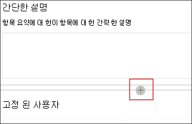

# 항목 센터의 항목에 대 한 작업 (미리 보기)

> [!Note] 
> 이 문서에서 설명 하는 내용은 Project Cortex 비공개 미리 보기를 위한 것입니다. [Project Cortex](https://aka.ms/projectcortex)에 대해 자세히 알아보세요.

기술 자료 관리자는 항목 센터에서 지정한 SharePoint 원본 위치에서 검색 하 고 찾은 항목을 검토 하 고이를 확인 하거나 거부할 수 있습니다. 또한 기술 관리자가 항목 검색에서 새 항목 페이지를 만들거나 업데이트 해야 하는 경우에는이를 편집할 수 있습니다.

## 요구 사항

항목 센터에서 작업 하려면 필요한 사용 권한이 있어야 합니다. 관리자는 [지식 관리 설치](set-up-knowledge-network.md)중에 사용자를 추가 하거나 [나중](give-user-permissions-to-the-topic-center.md)에 새 사용자를 추가할 수 있습니다.

항목 센터 사용자에 게는 다음과 같은 두 가지 권한 집합이 제공 될 수 있습니다.

- 항목 만들기 및 편집: 새 항목을 만들거나 설명, 문서 및 관련 사용자와 같은 항목 콘텐츠를 업데이트 합니다.

- 항목 관리: 관리 대시보드를 사용 하 여 조직 전체의 항목을 검토 합니다. 사용자는 확인 및 거부 항목과 같은 작업을 수행할 수 있습니다.

## 제안 항목 검토

항목 센터 홈 페이지에서 지정한 SharePoint 원본 위치에서 검색 된 항목이 **제안** 된 탭에 나열 됩니다. 항목 관리 권한이 있는 사용자는 확인 되지 않은 항목을 검토 하 고이를 선택 하거나 거부할 수 있습니다.

추천 항목을 검토 하려면 다음을 수행 합니다.

1. **제안** 된 탭에서 항목 페이지를 여는 항목을 선택 합니다. 

2. 항목 페이지에서 항목 페이지를 검토 하 고 페이지를 변경 해야 하는 경우 **편집** 을 선택 합니다.

3. 정보 센터 홈 페이지에서 선택한 항목에 대해 다음 작업을 수행할 수 있습니다.

    1. 항목을 유지할지 여부를 확인 하는 확인을 선택 합니다.
    
    1. **X** 를 선택 하 여 항목을 거부 합니다.

    **확정 된 항목이** 확인 되지 않은 목록에서 제거 되며 이제 **확인** 탭에 표시 됩니다.

    거부 됨 항목이 **확정** 되지 않은 목록에서 제거 되며 이제 **거부 또는 제외** 탭에 표시 됩니다.

## 확인 된 항목 검토

항목 센터 홈 페이지에서 지정 된 SharePoint 원본 위치에서 검색 되 고, 고객에 게 카드 피드백 메커니즘을 통해 2 명 이상의 사용자가 확인 한 crowdsourced에 따라 확인 된 항목이 **확인** 탭에 나열 됩니다. 항목 관리 권한이 있는 사용자는 확인 된 항목을 검토 하 고 거부 하도록 선택할 수 있습니다.

확인 된 항목을 검토 하려면 다음을 수행 합니다.

1. **확정** 탭에서 항목 페이지를 여는 항목을 선택 합니다. 

2. 항목 페이지에서 항목 페이지를 검토 하 고 페이지를 변경 해야 하는 경우 **편집** 을 선택 합니다.

3. 이를 거부 해도 됩니다.

## 게시 된 항목 검토
게시 된 항목은 페이지를 encountrs 하는 사람에 게 항상 표시 되는 speific 정보를 편집 했습니다. 수동으로 만든 항목은 여기에 표시 됩니다.

   
## 새 항목 만들기

항목 만들기 또는 편집 권한이 있는 사용자는 필요한 경우 새 항목을 만들 수 있습니다. 항목이 검색을 통해 검색 되지 않거나 인공 지능 기술에서이를 항목으로 설정 하기에 충분 한 증거를 찾지 못한 경우이 작업을 수행 해야 할 수 있습니다.

새 항목을 만들려면 다음을 수행 합니다.

1. 항목 센터 페이지에서 **새로 만들기** 를 선택한 다음 **항목 페이지** 를 선택 합니다.

    

2. 새 항목 페이지에서 새 항목 서식 파일에 대 한 정보를 작성할 수 있습니다.

    1. **이 항목의 이름** 섹션에서 새 항목의 이름을 입력 합니다.
    
    1. **대체 이름** 섹션에서 항목을 참조 하는 데 사용 되는 이름 또는 머리글자어를 입력 합니다.
    
    1. **간단한 설명** 섹션에서 항목에 대 한 한 가지 또는 두 개의 문장의 설명을 입력 합니다. 이 텍스트는 연결 된 항목 카드에 사용 됩니다.
    
    1. **사용자** 섹션에서 해당 항목에 대 한 주제별 전문가의 이름을 입력 합니다.
    
    1. **파일 및 페이지** 섹션에서 **추가** 를 선택 하 고 다음 페이지에서 연결 된 OneDrive 파일 또는 SharePoint Online 페이지를 선택할 수 있습니다.
    
    1. **사이트** 섹션에서 **추가** 를 선택 합니다. 표시 되는  **사이트** 창에서 항목에 연결 된 사이트를 선택 합니다.

    
    
3. 페이지에 텍스트, 이미지, 웹 파트, 링크 등의 다른 구성 요소를 추가 해야 하는 경우 페이지 가운데에서 캔버스 아이콘을 선택 하 여 셰이프를 찾아서 추가 합니다.

    

4. 작업을 마치면 **게시** 를 선택 하 여 항목 페이지를 게시 합니다. 게시 된 항목 페이지는 **페이지** 탭에 표시 됩니다.

> [!Note] 
> 새 항목 페이지는 *기술 네트워크를 인식* 하는 웹 파트로 구성 됩니다. 즉, AI에서 항목에 대 한 추가 정보를 수집 하는 경우 이러한 웹 파트의 정보가 사용자에 게 더 유용한 페이지를 만들기 위한 제안으로 업데이트 됩니다.

## 기존 항목 페이지 편집

기존 항목 페이지는 **페이지** 페이지에서 찾을 수 있습니다. 

1. 항목 센터 페이지에서 **페이지** 를 선택 합니다.

2. **페이지** 페이지에 항목 페이지 목록이 표시 됩니다. 검색 상자를 사용 하 여 업데이트할 항목 페이지를 찾습니다. 편집 하려는 항목 페이지의 이름을 클릭 합니다.

3. 항목 페이지에서 **편집** 을 선택 합니다.

4. 페이지에 필요한 사항을 변경 합니다. 여기에는 다음 필드에 대 한 업데이트가 포함 됩니다.

    1. 대체 이름
    1. 설명
    1. 사람
    1. 파일 및 페이지
    1. 사이트
    1. 캔버스 아이콘을 선택 하 여 텍스트, 이미지 또는 링크와 같은 정적 항목을 페이지에 추가할 수도 있습니다.

5. 다시 **게시** 를 선택 하 여 변경 내용을 저장 합니다.

<!--## See also-->

