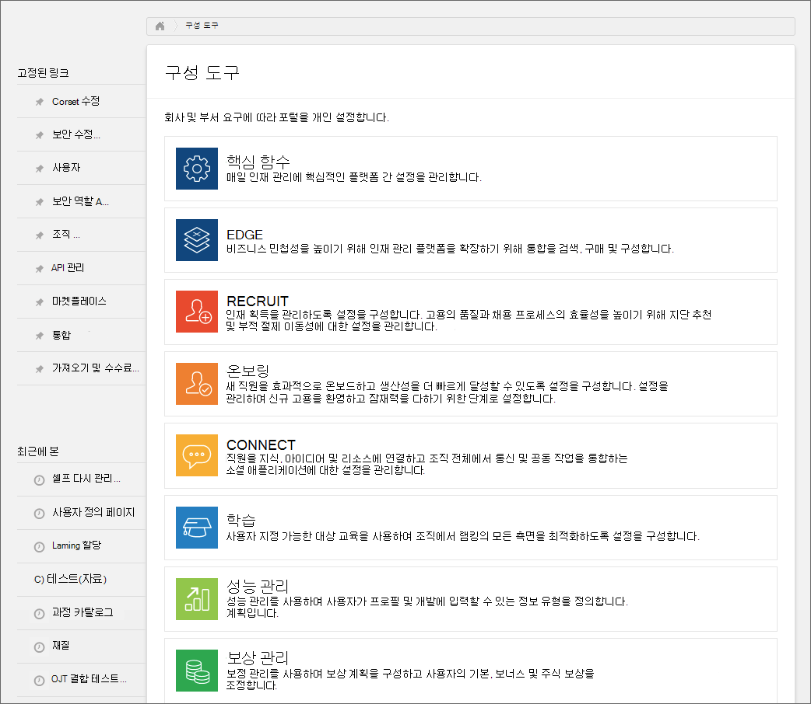
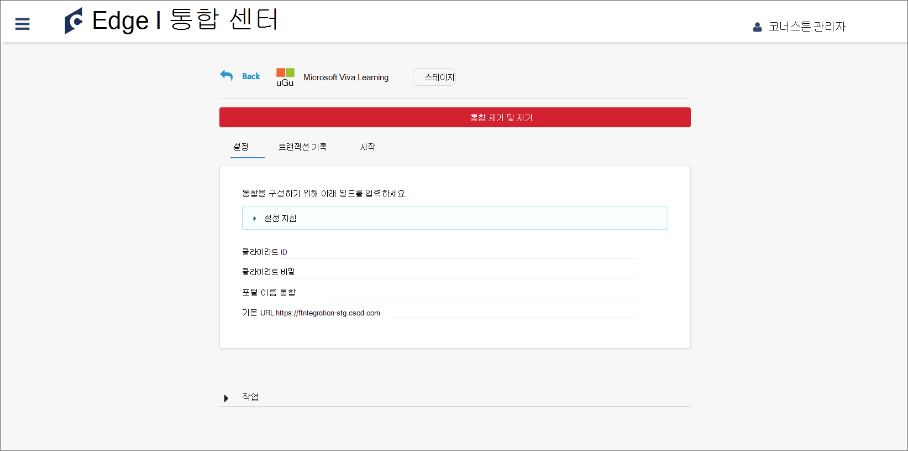
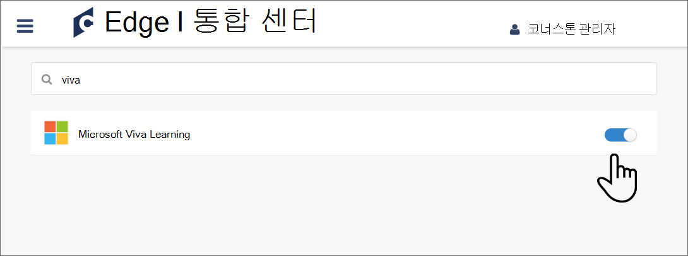

# Cornerstone OnDemand를 콘텐츠 원본으로 Microsoft Viva Learning

이 문서에서는 Viva 2013에서 Cornerstone OnDemand를 타사 학습 콘텐츠 원본으로 구성하는 Learning. 먼저 Viva를 사용하도록 설정하고 Learning 포털에서 세부 정보를 얻습니다. 그런 다음 사용자 설정에서 구성을 완료해야 Microsoft 365 관리 센터.

>[!NOTE]
>Viva Learning 액세스할 수 있는 콘텐츠에는 Microsoft 제품 약관이 없는 약관이 적용될 수 있습니다. Cornerstone OnDemand 콘텐츠 및 모든 관련 서비스는 Cornerstone OnDemand의 개인 정보 및 서비스 약관을 준수합니다.

## 코너 스턴트 포털에서 구성

1. 관리자로 Cornerstone Portal에 로그인합니다.

    

2. Edge **를 선택 합니다.**

    

3. **마켓플레이스로 이동하여** Viva를 검색합니다.

    

4. Viva Learning 선택합니다.

    

5. **설치** 를 선택합니다.

    

6. 사용 약관에 동의하는지 확인란을 선택하고 설치를 **선택합니다.**

    

7. 지금 **구성을 선택합니다.**

    

8. 클라이언트 ID, 비밀, 포털 이름 및 기본 URL을 복사합니다. 그런 다음 돌아가서 Viva를 검색합니다.

    

9. Viva를 통합할 수 있도록 토글을 Learning 합니다.

    

## 사용자 설정에서 Microsoft 365 관리 센터

1. 에 [로그인합니다Microsoft 365 관리 센터.](https://admin.microsoft.com)
2. 다음 **설정** **로 이동합니다.** Viva Learning 선택하고 패널에서 Cornerstone OnDemand를 사용하도록 설정합니다.
3. Cornerstone 포털에서 검색한 구성 세부 정보를 입력합니다.

    >[!NOTE]
    >표시 이름은 Viva 2016에서 조직에 Cornerstone 학습 콘텐츠가 표시될 수 있는 Learning. 이름을 입력하지 않은 경우 기본 이름 "Cornerstone OnDemand"가 표시됩니다.

4. **저장을** 선택하여 Viva Learning. Viva 앱에 콘텐츠가 표시될 때 최대 24시간이 Learning 있습니다.

>[!NOTE]
>현재 조직 내의 모든 사용자는 모든 테넌트 관련 과정을 검색할 수 있지만 액세스 권한이 있는 과정만 사용할 수 있습니다. 역할 및 사용 권한을 기반으로 하는 사용자별 콘텐츠 검색은 향후 릴리스될 예정입니다.
