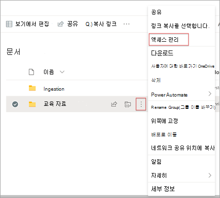
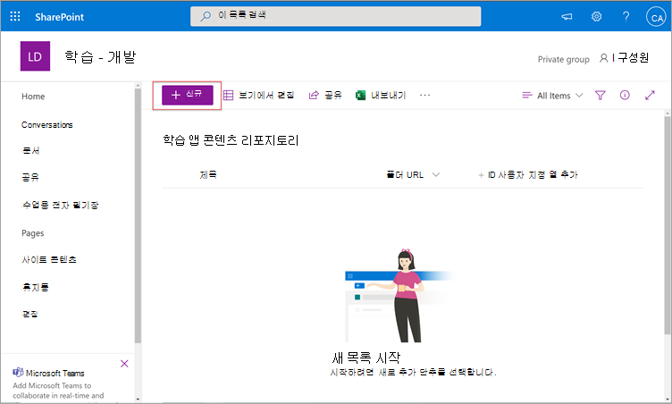
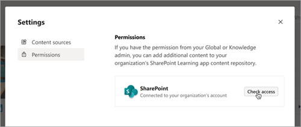

# 웹 SharePoint 콘텐츠 원본으로 Microsoft Viva Learning

조직에서 SharePoint 콘텐츠를 Viva 2013에서 사용할 수 있도록 학습 콘텐츠 원본으로 구성할 수 Learning.

>[!NOTE]
> Viva Learning 액세스할 수 있는 콘텐츠에는 Microsoft 제품 약관이 없는 약관이 적용될 수 있습니다. Viva Learning 추가하는 콘텐츠(예: SharePoint 호스팅된 콘텐츠)에는 해당 콘텐츠와 연결된 개인 정보 및 서비스 약관이 적용됩니다.

## 개요

지식 관리자(또는 전역 관리자)는 Learning  서비스가 구조화된 중앙 집중식 목록 형태로 빈 중앙 위치를 만들 수 있는 사이트 URL을 SharePoint 있습니다. 이 목록을 앱 Learning 리포지토리라고 합니다. 조직에서는 이 목록을 사용하여 학습 콘텐츠가 포함된 폴더에 대한 교차 회사 SharePoint 링크를 포함할 수 있습니다. 관리자는 폴더의 URL 목록을 수집하고 큐레이터해야 합니다. 이러한 폴더에는 Viva 2016에서 사용할 수 있는 콘텐츠만 Learning.

Viva Learning 지원되는 문서 유형은 다음과 같습니다.

- Word, PowerPoint, Excel, PDF
- 오디오(.m4a)
- 비디오(.mov, .mp4, .avi)

자세한 내용은 제한 [SharePoint 참조하세요.](/office365/servicedescriptions/sharepoint-online-service-description/sharepoint-online-limits?redirectSourcePath=%252farticle%252fSharePoint-Online-limits-8f34ff47-b749-408b-abc0-b605e1f6d498)

## Multi-geo

[Microsoft 365 Multi-geo를](/microsoft-365/enterprise/microsoft-365-multi-geo)사용하는 경우 기술 관리자가 제공하는 사이트 URL(Learning 앱 콘텐츠 리포지토리가 위치)은 Microsoft 365 구독이 처음 프로비전된 중앙 위치에 속해야 합니다. 리포지토리에 연결된 폴더도 중앙 위치에 속해야 합니다. Viva Learning 데이터 상주 요구 사항을 준수하기 위해 이 제한을 추가했습니다.

[Microsoft 365 Multi-Geo는](/microsoft-365/enterprise/microsoft-365-multi-geo) 데이터 상주 요구 사항을 충족하도록 디자인되었습니다. 자세한 내용은 온라인 에서 [Multi-geo 기능을 SharePoint 참조하세요.](/microsoft-365/enterprise/multi-geo-capabilities-in-onedrive-and-sharepoint-online-in-microsoft-365)

## 사용 권한

문서 라이브러리 폴더 URL은 조직의 모든 SharePoint 수집할 수 있습니다. Viva Learning 모든 기존 콘텐츠 사용 권한을 따르게 됩니다. 따라서 사용자에게 액세스 권한이 있는 콘텐츠만 Viva 2013에서 검색 및 Learning. 이러한 폴더 내의 모든 콘텐츠는 검색할 수 있지만 개별 직원이 사용 권한을 가지는 콘텐츠만 사용할 수 있습니다.

조직 리포지토리에서 콘텐츠 삭제는 현재 지원되지 않습니다.

의도하지 않은 표면이 있는 콘텐츠를 제거하려면 다음 단계를 수행합니다.

1. 문서 라이브러리에 대한 액세스를 제한하려면 작업 표시 옵션을 선택한 다음 액세스 **관리를 선택합니다.** 

     

2. 문서 라이브러리 내에서 원본 문서를 삭제합니다.

자세한 내용은 최신 환경의 공유 및 SharePoint [참조하세요.](/sharepoint/modern-experience-sharing-permissions)

## Learning 서비스

Learning 서비스는 제공된 폴더 URL을 사용하여 해당 폴더에 저장된 모든 콘텐츠의 메타데이터를 얻습니다. 직원이 중앙 저장소에 폴더 URL을 제공한 후 24시간 이내에 Viva 저장소 내에서 조직의 콘텐츠를 검색하고 사용할 수 Learning. 업데이트된 메타데이터 및 사용 권한을 포함하여 콘텐츠에 대한 모든 변경 내용은 24시간 이내에 Learning 서비스에서도 적용됩니다.

## 원본 SharePoint 구성

이러한 작업을 수행하려면 Microsoft 365 관리자, SharePoint 관리자 또는 지식 관리자 중 한 명으로 설정해야 합니다.

Viva SharePoint 학습 콘텐츠 원본으로 Learning 다음 단계를 수행합니다.

1. 사이트 모음의 왼쪽 탐색 Microsoft 365 관리 센터 로 이동하여 설정  >  **로 이동합니다.**

2. Org **설정 페이지의** 서비스 **탭에서** **Viva** Learning.

     

3. **Viva Learning** 패널의 SharePoint Viva SharePoint 중앙 저장소를 만들 Learning 사이트 URL을 제공합니다. 새 SharePoint 사이트가 새로 추가된 경우 사이트 만들기 후 1시간을 기다렸다가 여기에 추가해야 합니다.

     

     조직에서 [multi-geo를 Microsoft 365](/microsoft-365/enterprise/microsoft-365-multi-geo)경우 지역 또는 국가는 [Multi-geo](/microsoft-365/enterprise/microsoft-365-multi-geo#microsoft-365-multi-geo-availability)가용성 Microsoft 365 있습니다. Viva **Learning** 패널에도 이 정보가 표시됩니다.

     

4. SharePoint 목록은 제공된 사이트 내에서 SharePoint 만들어집니다.

     사이트 모음의 왼쪽 탐색 SharePoint 앱 콘텐츠 리포지토리에서  >  **Learning 콘텐츠를 선택합니다.**

     

5. 앱 **Learning** 리포지토리 페이지에서 학습 콘텐츠 SharePoint URL로 앱 목록을 채우십시오.

   1. 새로 **보기를** 선택하여 새 항목 **패널을** 볼 수 있습니다.

       

   2. 새 **항목 패널의** **제목** 필드에 선택한 디렉터리 이름을 추가합니다. 폴더 **URL 필드에서** 학습 콘텐츠 폴더에 URL을 추가합니다. **저장** 을 선택합니다. [폴더 URL을 만드는 방법에 대해 자세히 알아보세요.](#folder-url-document-library-curation)

       

   3. 앱 **Learning 리포지토리** 페이지가 새 학습 콘텐츠로 업데이트됩니다.

       

   4. 조직에서 [Microsoft 365 Multi-geo를](/microsoft-365/enterprise/microsoft-365-multi-geo) 사용하는 경우 중앙 위치에 속하지 않는 폴더에 대한 링크를 추가하려고 시도하면 오류 메시지가 표시됩니다. 모든 폴더는 중앙 위치에 속해야 합니다.
       

  > [!NOTE]
  > Learning 앱 콘텐츠 저장소에 대한 광범위한 액세스를 허용하기 위해 사용자가 액세스를 요청하고 궁극적으로 목록을 채우는 데 도움이 되는 Viva Learning 인터페이스에서 목록에 대한 링크를 곧 사용할 수 있습니다. 사이트 소유자 및 전역 관리자는 목록에 대한 액세스 권한을 부여해야 합니다. Access는 목록에만 해당하며 목록이 저장된 사이트에는 적용되지 않습니다. 자세한 내용은 이 문서 의 부분에 있는 자체 조직의 [콘텐츠](#provide-your-own-organizations-content) 제공을 참조하십시오.

### 폴더 URL 문서 라이브러리 큐레이터

조직의 학습 콘텐츠를 저장할 폴더를 만드시다.

1. 문서 라이브러리로 이동하여 **+ 새로 고치기 를 선택합니다.**

    

2. 폴더를 **선택하고** 폴더 이름을 입력합니다.

    

3. **만들기** 를 선택합니다. 이제 폴더가 문서 라이브러리에 표시됩니다.

    

4. 업로드 학습 콘텐츠로 게시할 파일을 지정합니다.
5. 폴더 URL을 확인하려면 이 폴더를 선택하고 링크 **복사 를 선택합니다.**

    

기본 메타데이터(예: 수정 날짜, 만든 날짜, 문서 이름, 콘텐츠 형식 및 조직 이름)는 Microsoft Learning API에 의해 Viva Graph 끌어올 수 있습니다.

콘텐츠의 전체 검색 및 검색 관련성을 개선하기 위해 설명 열을 **추가하는 것이** 좋습니다. 이미 설명 열이 있는 경우 해당 열을 삭제하고 아래 단계에 따라 새 설명 열을 추가할 수 있습니다.

문서 라이브러리 **페이지에 설명** 열을 추가하기 위해 다음 단계를 수행합니다.

1. 문서 **페이지에서** 열 **추가를 선택합니다.**

2. 작업 **표시 옵션을** 선택한 다음 한 줄 **텍스트 를 선택합니다.**

    :::image type="content" alt-text="텍스트 한 줄이 강조 SharePoint 작업 표시 옵션을 표시하는 페이지의 문서 페이지" source="../media/learning/learning-sharepoint-curation1.png":::

3. 열 **만들기 패널의** 이름 **필드에** 열에 대한 설명적인 이름을 추가합니다. **저장** 을 선택합니다.

    

4. 문서 **페이지의** 설명 열에서  각 항목에 대한 사용자 지정 설명을 추가합니다. 설명을 제공하지 Learning Viva Learning 라이브러리에서 콘텐츠를 강조 표시하는 기본 SharePoint 제공합니다.

     

### 자체 조직의 콘텐츠 제공

지식 관리자는 조직의 Learning 앱 콘텐츠 저장소에 액세스할 수 SharePoint 조직 간 문서 라이브러리에 대한 참조를 제공할 수 있습니다. 이러한 라이브러리 내의 콘텐츠는 Viva 2013에서 학습 콘텐츠로 Learning.

1. Viva Learning , select the ellipses (**...**), and then select **설정**.

    
  
2. 다음 **설정** **에서 사용 권한을 선택합니다.**

    

3. 액세스 **확인을** 선택하여 조직의 중앙 집중식 라이브러리에 연결합니다.

## 다음 단계

[Viva 에 대한](configure-lms.md) 학습 관리 시스템을 추가하거나 Learning 에 대한 다른 콘텐츠 공급자 [Microsoft Viva Learning.](configure-other-content-sources.md)
