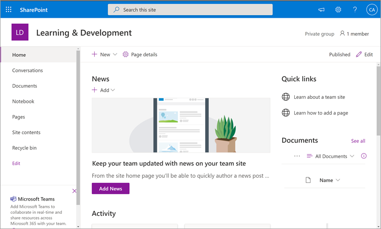
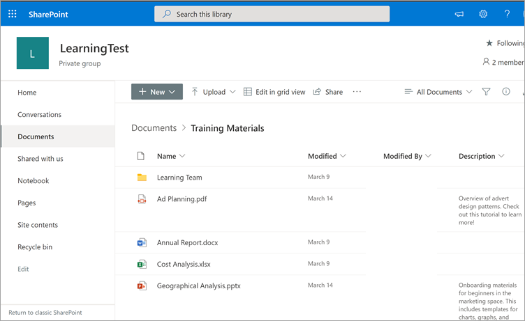

# 출시 예정: SharePoint Microsoft Viva Learning용 학습 콘텐츠 원본으로 구성(미리 보기)

> [!NOTE]
> 이 문서의 정보는 상업적으로 출시되기 전에 상당수 수정될 수 있는 미리 보기 제품과 관련이 있습니다. 

조직에서 SharePoint 콘텐츠를 Viva Learning(미리 보기)에서 사용할 수 있도록 학습 콘텐츠 원본으로 구성할 수 있습니다.

## 개요

지식 관리자(또는 전역 관리자)는 학습 서비스가 구조화된 중앙 집중식 목록 형태로 빈 중앙 집중식 위치인 학습 앱 콘텐츠 저장소를 만들 수 있는 사이트 URL을 SharePoint 있습니다. 이 목록은 조직에서 학습 콘텐츠가 포함된 폴더에 대한 교차 회사 SharePoint 링크를 포함하는 데 사용할 수 있습니다. 관리자는 폴더의 URL 목록을 수집하고 큐레이터해야 합니다. 이러한 폴더에는 Viva Learning(미리 보기)에서 사용할 수 있는 콘텐츠만 포함되어야 합니다.

Viva Learning(미리 보기)은 다음과 같은 문서 유형을 지원합니다.

- Word, PowerPoint, Excel, PDF
- 오디오(.m4a)
- 비디오(.mov, .mp4, .avi)

자세한 내용은 제한 [SharePoint 참조하세요.](/office365/servicedescriptions/sharepoint-online-service-description/sharepoint-online-limits?redirectSourcePath=%252farticle%252fSharePoint-Online-limits-8f34ff47-b749-408b-abc0-b605e1f6d498) 

## 권한

문서 라이브러리 폴더 URL은 조직의 모든 SharePoint 수집할 수 있습니다. Viva Learning(미리 보기)은 모든 기존 콘텐츠 사용 권한을 따르게 됩니다. 따라서 사용자에게 액세스 권한이 있는 콘텐츠만 Viva Learning(미리 보기) 내에서 검색 및 표시됩니다. 이러한 폴더 내의 모든 콘텐츠는 검색할 수 있지만 개별 직원이 사용 권한을 가지는 콘텐츠만 사용할 수 있습니다.

조직 리포지토리에서 콘텐츠 삭제는 현재 지원되지 않습니다.

의도하지 않은 표면이 있는 콘텐츠를 제거하려면 다음 단계를 수행합니다.

1.  문서 라이브러리에 대한 액세스를 제한하려면 작업 표시 옵션을 선택한 다음 액세스 **관리를 선택합니다.** 
     
     

2.  문서 라이브러리 내에서 원본 문서를 삭제합니다.

자세한 내용은 최신 환경의 공유 및 SharePoint [참조하세요.](/sharepoint/modern-experience-sharing-permissions) 

## 학습 서비스

학습 서비스는 제공된 폴더 URL을 사용하여 해당 폴더에 저장된 모든 콘텐츠의 메타데이터를 얻습니다. 직원이 중앙 저장소에 폴더 URL을 제공한 후 24시간 이내에 Viva Learning(미리 보기) 내에서 조직의 콘텐츠를 검색하고 사용할 수 있습니다. 업데이트된 메타데이터 및 사용 권한을 포함하여 콘텐츠에 대한 모든 변경 내용은 24시간 이내에 학습 서비스에도 적용됩니다.

## 원본 SharePoint 구성

이러한 작업을 수행하려면 Microsoft 365 관리자, SharePoint 관리자 또는 지식 관리자 중 한 명으로 설정해야 합니다.

Viva SharePoint(미리 보기)에서 학습 콘텐츠 원본으로 구성하기 위해 다음 단계를 수행합니다.

1.  Microsoft 365 센터의 왼쪽 탐색에서 설정   >  **설정으로 이동합니다.**
 
2.  Org **설정 페이지의** 서비스 **탭에서** **Viva Learning(미리 보기)을 선택합니다.**

     

3.  **Viva Learning(미리 보기)** 패널의 SharePoint Viva Learning(미리 보기)에서 중앙 리포지토리를 만들 SharePoint 사이트 URL을 제공합니다.

     

4.  SharePoint 목록은 제공된 사이트 내에서 SharePoint 만들어집니다.

     

     SharePoint 탐색 창에서 사이트 콘텐츠 학습 앱 콘텐츠 리포지토리  >  **를 선택합니다.** 

      

5. 학습 앱 **콘텐츠** 리포지토리 페이지에서 학습 콘텐츠 폴더에 SharePoint 목록으로 채우십시오.

   1. 새로 **보기를** 선택하여 새 항목 **패널을** 볼 수 있습니다. 

       
 
   2. 새 **항목 패널의** **제목** 필드에 선택한 디렉터리 이름을 추가합니다. 폴더 **URL 필드에서** 학습 콘텐츠 폴더에 URL을 추가합니다. **저장** 을 선택합니다.

       

   3. 학습 **앱 콘텐츠 리포지토리** 페이지는 새 학습 콘텐츠로 업데이트됩니다.

       

> [!NOTE]
> 학습 앱 콘텐츠 리포지토리에 대한 광범위한 액세스를 허용하기 위해 사용자가 액세스를 요청하고 궁극적으로 목록을 채우는 데 도움이 되는 Viva Learning(미리 보기) 인터페이스에서 목록에 대한 링크를 곧 사용할 수 있습니다. 사이트 소유자 및 전역 관리자는 목록에 대한 액세스 권한을 부여해야 합니다. Access는 목록에만 해당하며 목록이 저장된 사이트에는 적용되지 않습니다. 자세한 내용은 이 문서 의 부분에 있는 자체 조직의 [콘텐츠](#provide-your-own-organizations-content) 제공을 참조하십시오.

### 폴더 URL 문서 라이브러리 큐레이터

Microsoft Graph API에 의해 수정된 날짜, 문서 이름, 콘텐츠 형식 및 조직 이름과 같은 기본 메타데이터가 Viva Learning(미리 보기)에 자동으로 Graph.
 
콘텐츠의 전체 검색 및 검색 관련성을 개선하기 위해 설명 열을 **추가하는 것이** 좋습니다.

문서 라이브러리 **페이지에 설명** 열을 추가하기 위해 다음 단계를 수행합니다.

1.  문서 **페이지에서** 열 **추가를 선택합니다.**

2. 작업 **표시 옵션을** 선택한 다음 한 줄 **텍스트 를 선택합니다.**

     

3. 열 **만들기 패널의** 이름 **필드에** 열에 대한 설명적인 이름을 추가합니다. **저장** 을 선택합니다.

     
 
4. 문서 **페이지의** 설명 열에서  각 항목에 대한 사용자 지정 설명을 추가합니다. 설명을 제공하지 못하면 Viva Learning(미리 보기)에서 콘텐츠가 사용자 지정 라이브러리의 콘텐츠로 강조 표시된 기본 SharePoint 제공합니다. 

     
 
### 자체 조직의 콘텐츠 제공

지식 관리자는 조직의 학습 앱 콘텐츠 저장소에 액세스할 수 SharePoint 조직 간 문서 라이브러리에 대한 참조를 제공할 수 있습니다. 이러한 라이브러리 내의 콘텐츠는 Viva Learning(미리 보기)에서 학습 콘텐츠로 표시됩니다.

1. Viva Learning(미리 보기)에서 **추가** 옵션(**...**)을 선택한 다음 를 **설정.**

     
     
2. 다음 **설정** **에서 사용 권한을 선택합니다.**

     

3. 액세스 **확인을** 선택하여 조직의 중앙 집중식 라이브러리에 연결합니다.
     
