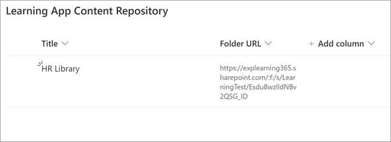

# 출시 예정: SharePoint Microsoft Viva Learning용 학습 콘텐츠 원본으로 구성(미리 보기)Coming soon: Configure SharePoint as a learning content source for Microsoft Viva Learning (Preview)

> [!NOTE]
> 이 문서의 정보는 상업적으로 출시되기 전에 상당수 수정될 수 있는 미리 보기 제품과 관련이 있습니다.The information in this article relates to a preview product that may be substantially modified before it's commercially released. 

조직에서 SharePoint 콘텐츠를 Viva Learning(미리 보기)에서 사용할 수 있도록 학습 콘텐츠 원본으로 구성할 수 있습니다.You can configure SharePoint as a learning content source to make your organization's own content available in Viva Learning (Preview).

## 개요Overview

지식 관리자(또는 전역 관리자)는 학습 서비스가 구조화된 중앙 집중식 목록 형태로 빈 중앙 집중식 위치인 학습 앱 콘텐츠 저장소를 만들 수 있는 사이트 URL을 SharePoint 있습니다.The knowledge admin (or global administrator) provides a site URL to where the Learning Service can create an empty centralized location—the Learning App Content Repository—in the form of a structured SharePoint list. 이 목록은 조직에서 학습 콘텐츠가 포함된 폴더에 대한 교차 회사 SharePoint 링크를 포함하는 데 사용할 수 있습니다.This list can be used by your organization to house links to cross-company SharePoint folders that contain learning content. 관리자는 폴더의 URL 목록을 수집하고 큐레이터해야 합니다.Admins are responsible for collecting and curating a list of URLs for folders. 이러한 폴더에는 Viva Learning(미리 보기)에서 사용할 수 있는 콘텐츠만 포함되어야 합니다.These folders should only include content that can be made available in Viva Learning (Preview).

Viva Learning(미리 보기)은 다음과 같은 문서 유형을 지원합니다.Viva Learning (Preview) supports the following document types:

- Word, PowerPoint, Excel, PDFWord, PowerPoint, Excel, PDF
- 오디오(.m4a)Audio (.m4a)
- 비디오(.mov, .mp4, .avi)Video (.mov, .mp4, .avi)

자세한 내용은 온라인 [설명서를 SharePoint 참조하세요.](/office365/servicedescriptions/sharepoint-online-service-description/sharepoint-online-limits?redirectSourcePath=%252farticle%252fSharePoint-Online-limits-8f34ff47-b749-408b-abc0-b605e1f6d498)For more information, see the [SharePoint Online documentation](/office365/servicedescriptions/sharepoint-online-service-description/sharepoint-online-limits?redirectSourcePath=%252farticle%252fSharePoint-Online-limits-8f34ff47-b749-408b-abc0-b605e1f6d498). 

## 사용 권한Permissions

문서 라이브러리 폴더 URL은 조직의 모든 SharePoint 수집할 수 있습니다.Document library folder URLs can be collected from any SharePoint site in the organization. Viva Learning(미리 보기)은 모든 기존 콘텐츠 사용 권한을 따르게 됩니다.Viva Learning (Preview) follows all existing content permissions. 따라서 사용자에게 액세스 권한이 있는 콘텐츠만 Viva Learning(미리 보기) 내에서 검색 및 비어 있습니다.Therefore, only content for which a user has permission to access is searchable and visable within Viva Learning (Preview). 이러한 폴더 내의 모든 콘텐츠는 검색할 수 있지만 개별 직원이 사용 권한을 가지는 콘텐츠만 사용할 수 있습니다.Any content within these folders will be searchable, but only content to which the individual employee has permissions can be used.

조직 리포지토리에서 콘텐츠 삭제는 현재 지원되지 않습니다.Content deletion from your organization’s repository is not currently supported.

의도하지 않은 표면이 있는 콘텐츠를 제거하려면 다음 단계를 수행합니다.To remove unintentionally surfaced content, follow these steps:

1.  문서 라이브러리에 대한 액세스를 제한하려면 작업 표시 옵션을 선택한 다음 액세스 **관리를 선택합니다.** To restrict access to the document library, select the **Show actions** option, and then select **Manage access**.
     
     

2.  문서 라이브러리 내에서 원본 문서를 삭제합니다.Delete the original document within the document library.

자세한 내용은 최신 환경의 공유 및 SharePoint [참조하세요.](/sharepoint/modern-experience-sharing-permissions)For more information, see [Sharing and permissions in the SharePoint modern experience](/sharepoint/modern-experience-sharing-permissions). 

## 학습 서비스Learning Service

학습 서비스는 제공된 폴더 URL을 사용하여 해당 폴더에 저장된 모든 콘텐츠의 메타데이터를 얻습니다.The Learning Service uses the provided folder URLs to get metadata from all content stored in those folders. 직원이 중앙 저장소에 폴더 URL을 제공한 후 24시간 이내에 Viva Learning(미리 보기) 내에서 조직의 콘텐츠를 검색하고 사용할 수 있습니다.Within 24 hours of supplying the folder URL in the centralized repository, employees can search for and use your organization’s content within Viva Learning (Preview). 업데이트된 메타데이터 및 사용 권한을 포함하여 콘텐츠에 대한 모든 변경 내용은 24시간 이내에 학습 서비스에도 적용됩니다.All changes to content, including updated metadata and permissions, will also be applied in the Learning Service within 24 hours.

## 원본 SharePoint 구성Configure SharePoint as a source

이러한 작업을 수행하려면 Microsoft 365 관리자, SharePoint 관리자 또는 지식 관리자 중 한 명으로 설정해야 합니다.You must be a Microsoft 365 global administrator, SharePoint administrator, or knowledge admin to perform these tasks.

Viva SharePoint(미리 보기)에서 학습 콘텐츠 원본으로 구성하기 위해 다음 단계를 수행합니다.To configure SharePoint as a learning content sources in for Viva Learning (Preview), follow these steps:

1.  Microsoft 365 센터의 왼쪽 탐색에서 설정   >  **설정으로 이동합니다.**In the left navigation of the Microsoft 365 admin center, go to **Settings** > **Org settings**.
 
2.  Org **설정 페이지의** 서비스 **탭에서** 학습 앱(미리 **보기)을 선택합니다.**On the **Org settings** page, on the **Services** tab, select **Learning app (Preview)**.

     

3.  학습 **앱(미리 보기)** 패널의 SharePoint Viva Learning에서 중앙 리포지토리를 만들 SharePoint 사이트 URL을 제공합니다.On the **Learning app (Preview)** panel, under SharePoint, provides the site URL to the SharePoint site where you want Viva Learning to create a centralized repository.

     

4.  SharePoint 목록은 제공된 사이트 내에서 SharePoint 만들어집니다.A SharePoint list is created automatically within the provided SharePoint site.

     

     SharePoint 탐색 창에서 사이트 콘텐츠 학습 앱 콘텐츠 리포지토리  >  **를 선택합니다.**In the left navigation of the SharePoint site, select **Site contents** > **Learning App Content Repository**. 

      

5. 학습 앱 **콘텐츠** 리포지토리 페이지에서 학습 콘텐츠 폴더에 SharePoint 목록으로 채우십시오.On the **Learning App Content Repository** page, populate the SharePoint list with URLs to the learning content folders.

   1. 새로 **보기를** 선택하여 새 항목 **패널을** 볼 수 있습니다.Select **New** to view the **New item** panel. 

       
 
   2. 새 **항목 패널의** **제목** 필드에 선택한 디렉터리 이름을 추가합니다.On the **New item** panel, in the **Title** field, add a directory name of your choice. 폴더 **URL 필드에서** 학습 콘텐츠 폴더에 URL을 추가합니다.In the **Folder URL** field, add the URL to the learning content folder. **저장** 을 선택합니다.Select **Save**.

       

   3. 학습 **앱 콘텐츠 리포지토리** 페이지는 새 학습 콘텐츠로 업데이트됩니다.The **Learning App Content Repository** page is updated with the new learning content.

       

> [!NOTE]
> 학습 앱 콘텐츠 리포지토리에 대한 광범위한 액세스를 허용하기 위해 사용자가 액세스를 요청하고 궁극적으로 목록을 채우는 데 도움이 되는 Viva Learning(미리 보기) 인터페이스에서 목록에 대한 링크를 곧 사용할 수 있습니다.To allow for broader access to the Learning App Content Repository, a link to the list soon will be available in the Viva Learning (Preview) interface where users can request access and ultimately help populate the list. 사이트 소유자 및 전역 관리자는 목록에 대한 액세스 권한을 부여해야 합니다.Site owners and global administrators will be required to grant access to the list. Access는 목록에만 해당하며 목록이 저장된 사이트에는 적용되지 않습니다.Access is specific to the list only and does not apply to the site where the list is stored. 자세한 내용은 이 문서 의 부분에 있는 자체 조직의 [콘텐츠](#provide-your-own-organizations-content) 제공을 참조하십시오.For more information, see [Provide your own organization's content](#provide-your-own-organizations-content) later in this article.

### 폴더 URL 문서 라이브러리 큐레이터Folder URL document library curation

Microsoft Graph API에 의해 수정된 날짜, 문서 이름, 콘텐츠 형식 및 조직 이름과 같은 기본 메타데이터가 Viva Learning(미리 보기)에 자동으로 Graph.Default metadata (such as modified date, created by, document name, content type, and organization name) is automatically pulled into Viva Learning (Preview) by the Microsoft Graph API.
 
콘텐츠의 전체 검색 및 검색 관련성을 개선하기 위해 설명 열을 **추가하는 것이** 좋습니다.To improve overall discovery and search relevance of the content, we recommend adding a **Description** column.

문서 라이브러리 **페이지에 설명** 열을 추가하기 위해 다음 단계를 수행합니다.To add a **Description** column to the document library page, follow these steps:

1.  문서 **페이지에서** 열 **추가를 선택합니다.**On the **Documents** page, select **Add column**.

2. 작업 **표시 옵션을** 선택한 다음 한 줄 **텍스트 를 선택합니다.**Select the **Show actions** option, and then select **Single line of text**.

     

3. 열 **만들기 패널의** 이름 **필드에** 열에 대한 설명적인 이름을 추가합니다.On the **Create a column** panel, in the **Name** field, add a descriptive name for the column. **저장** 을 선택합니다.Select **Save**.

     
 
4. 문서 **페이지의** 설명 열에서  각 항목에 대한 사용자 지정 설명을 추가합니다.On the **Documents** page, in the **Description** column, add custom descriptions for each item. 설명을 제공하지 못하면 Viva Learning(미리 보기)에서 콘텐츠가 사용자 지정 라이브러리의 콘텐츠로 강조 표시된 기본 SharePoint 제공합니다.If no description is supplied, Viva Learning (Preview) will provide a default message that highlights the content as being from your own SharePoint library. 

     
 
### 자체 조직의 콘텐츠 제공Provide your own organization's content

지식 관리자는 조직의 학습 앱 콘텐츠 저장소에 액세스할 수 SharePoint 조직 간 문서 라이브러리에 대한 참조를 제공할 수 있습니다.Knowledge admins can access their organization’s Learning App Content Repository in SharePoint, where they can provide references to cross-organization document libraries. 이러한 라이브러리 내의 콘텐츠는 Viva Learning(미리 보기)에서 학습 콘텐츠로 표시됩니다.Content within these libraries will be then surfaced as learning content in Viva Learning (Preview).

1. Viva Learning(미리 보기)에서 **추가** 옵션(**...**)을 선택한 다음 를 **설정.**In Viva Learning (Preview), select **More options** (**...**), and then select **Settings**.

     
     
2. 다음 **설정** **에서 사용 권한을 선택합니다.**Under **Settings**, select **Permissions**.

     

3. 액세스 **확인을** 선택하여 조직의 중앙 집중식 라이브러리에 연결합니다.Select **Check access** to connect to your organization’s centralized library.
     
