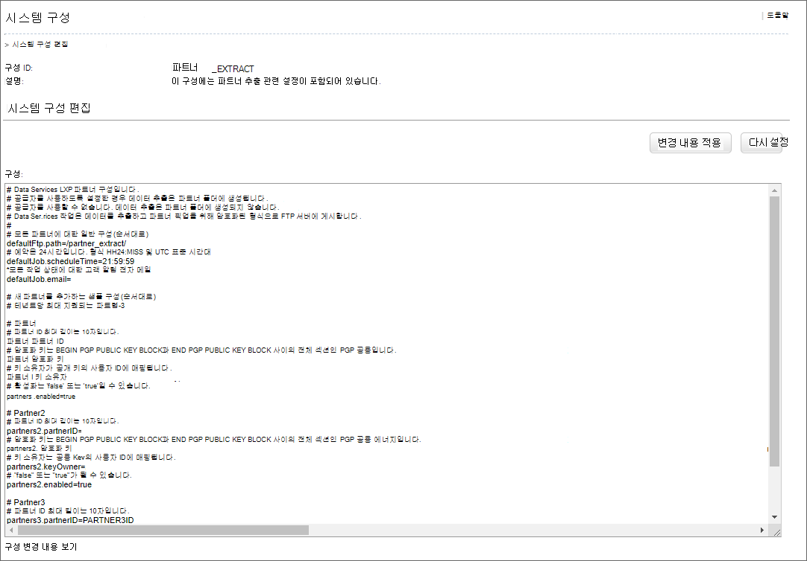
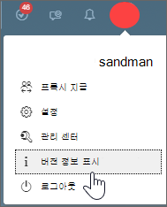
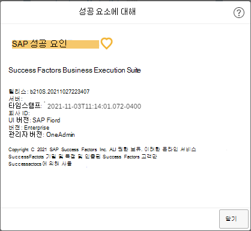

# SAP SuccessFactors를 콘텐츠 원본으로 Microsoft Viva Learning

이 문서에서는 SAP SuccessFactors를 타사 콘텐츠 원본으로 구성하는 Microsoft Viva Learning. 먼저 SuccessFactors 포털에서 시스템 구성을 편집해야 합니다. 그런 다음 구성을 완료해야 Microsoft 365 관리 센터.

>[!NOTE]
>Viva Learning 액세스할 수 있는 콘텐츠에는 Microsoft 제품 약관이 없는 약관이 적용될 수 있습니다. SAP SuccessFactors 콘텐츠 및 모든 관련 서비스에는 SAP SuccessFactors 개인 정보 및 서비스 약관이 있습니다.

## SuccessFactors 포털에서 구성

>[!NOTE]
>이러한 단계를 완료하려면 SuccessFactors에서 관리자 권한이 필요합니다.

1. 시스템 관리 구성 시스템 구성 PARTNER_EXTRACT 로 이동하여 작업 구성을 편집하는 데 필요한 워크플로를  >    >    >  PARTNER_EXTRACT.

2. PGP 도구를 사용하여 원하는 크기의 PGP 키(공개 키, 개인 키, 개인 키 암호)를 생성합니다. PGP 키를 생성하는 동안 RSA 알고리즘(권장)을 선택할 수 있습니다. GNUPG 도구는 사용할 수 있는 PGP 키 생성 도구 중 하나입니다.

3. 구성에서 다음 매개 변수를 PARTNER_EXTRACT 입력합니다. SuccessFactors에서 파트너 추출 구성을 편집하려면  SuccessFactors에서 시스템 구성 워크플로 편집 권한이 필요합니다.

    - 모든 작업 상태에 대한 고객 알림 전자 메일
        - defaultJob.email=
    
    - Partner1
        - PartnerID 최대 길이는 10자입니다. LMS 테넌트 ID일 수 있습니다.
    partners1.partnerID=
    
    - EncryptionKey는 BEGIN PGP PUBLIC KEY BLOCK과 END PGP PUBLIC KEY BLOCK 사이의 전체 섹션인 PGP 공개 암호화 키입니다.
        - partners1.encryptionKey=
    
    - KeyOwner는 공개 키의 사용자 ID에 매핑됩니다.
        - partners1.keyOwner=
    
    - enabled는 "false" 또는 "true"일 수 있습니다. 파트너 추출을 사용하도록 설정하려면 이 설정을 "true"로 설정하세요.
        - partners1.enabled=
    
    

SuccessFactors 포털에서 이러한 단계를 완료한 후 2단계에서 설정을 완료해야 Microsoft 365 관리 센터.

## 사용자 설정에서 Microsoft 365 관리 센터

>[!NOTE]
>이러한 단계를 완료하려면 관리자 권한이 Microsoft 365 합니다.

1. 에서 [로 Microsoft 365 관리 센터.](https://admin.microsoft.com)

2. 에서 **설정**  >  **설정으로 이동합니다.** *Viva* Learning 검색하고 옵션에서 SAP SuccessFactors를 사용하도록 설정할 수 있습니다.

3. 구성 세부 정보를 입력합니다.

    **표시 이름:** SAP SuccessFactors carousel에 원하는 표시 이름을 입력합니다.

    **SFTP 호스트 URL**: **LMS 관리** 응용 프로그램 시스템  >  **관리** 구성 시스템  >  **구성**  >    >  **커넥터로 이동합니다.** 속성 값을 `connector.ftp.server` 얻습니다.

    **사용자 이름:** SFTP 호스트 URL에 대해 수행한 단계와 동일한 단계를 따릅니다. 속성 값을 `connector.ftp.userID` 얻습니다.

    **암호:** 암호를 입력합니다. LMS 응용 프로그램 소유자에게 암호 검색에 대한 도움말을 확인하세요.

    **폴더 경로**: **LMS 관리** 응용 프로그램 시스템 관리 구성 시스템 구성  >    >    >    >  PARTNER_EXTRACT. 속성 값을 `defaultFtp.path` 얻습니다.

    **클라이언트의 호스트 URL:** BizX 도메인 URL입니다. BizX 로그인 URL에서 이 정보를 얻을 수 있습니다. 예를 들어 BizX 로그인 URL이 호스트 URL인 경우 `organization.successfactors.com/sf/start/#/login` 호스트 URL은 입니다. `organization.successfactors.com`

    **클라이언트의 Learning 대상 URL:** 학습 도메인 모듈 URL에서 이 URL을 얻을 수 있습니다. 예를 들어 학습 도메인 URL이 이면 대상 `organization.scdemo.successfactors.com/learning/...` URL은 Learning `organization.scdemo.successfactors.com` 입니다.

    **PGP 개인** 키: 암호 해독을 위한 PGP 개인 키로, BEGIN PGP 개인 키 블록과 END PGP 개인 키 블록 사이의 전체 섹션입니다. 키가 생성된 그대로 복사해야 합니다. 새 줄 문자는 제거하지 않습니다.

    **PGP 개인** 키 암호: IT 관리자 또는 PGP 키를 제공하는 팀에서 이 값을 제공해야 합니다.

    **회사 ID:** SuccessFactors 포털에 로그인합니다. 프로필 아이콘을 선택한 다음 버전 **표시를 설정.** 여기에서 회사 ID를 볼 수 있습니다.

    

    

4. **저장을** 선택하여 에지에서 SuccessFactors 콘텐츠를 활성화합니다Microsoft Viva Learning. Viva 2013에서 콘텐츠를 사용할 수 Learning.

>[!Note]
> SuccessFactors 과정이 설치가 완료된 후 Learning Viva에서 나타나기 시작할 것입니다.

>[!Note]
> 조직 내의 모든 사용자는 모든 테넌트 관련 과정을 검색할 수 있지만 액세스 권한이 있는 과정에만 액세스하고 사용할 수 있습니다. 사용자별 콘텐츠 검색은 향후 릴리스될 예정입니다.

>[!NOTE]
>현재 조직 내의 모든 사용자는 모든 테넌트 관련 과정을 검색할 수 있지만 액세스 권한이 있는 과정만 사용할 수 있습니다. 역할 및 사용 권한을 기반으로 하는 사용자별 콘텐츠 검색은 향후 릴리스될 예정입니다.
