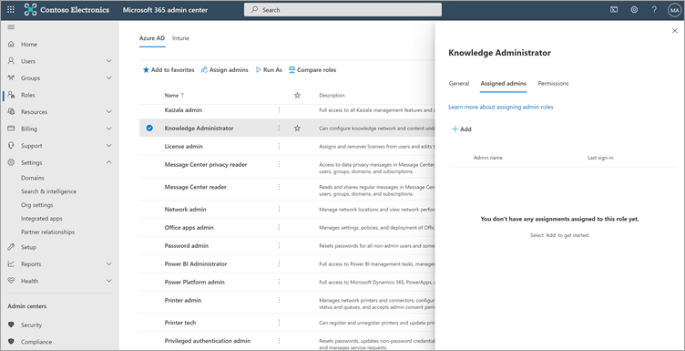

# Microsoft 365 관리 센터에서 Microsoft Viva Learning(미리 보기)에 대한 학습 콘텐츠 원본 구성Configure learning content sources for Microsoft Viva Learning (Preview) in the Microsoft 365 admin center

> [!NOTE]
> 이 문서의 정보는 상업적으로 출시되기 전에 상당수 수정될 수 있는 미리 보기 제품과 관련이 있습니다.The information in this article relates to a preview product that may be substantially modified before it's commercially released. 

Microsoft 365 관리 센터의 관리자는 직접 또는 조직에서 선택한 개인에게 지식 관리자 역할을 할당하여 Viva Learning(미리 보기)과 관련된 설정을 관리하고 학습 콘텐츠 원본을 구성할 수 있습니다.The administrators for the Microsoft 365 admin center—either by themselves or by assigning the knowledge admin role to selected individuals in your organization—can manage settings related to Viva Learning (Preview) and can configure the learning content sources.

관리자는 Viva Learning(미리 보기) 사용자가 사용할 다른 학습 콘텐츠 원본(예: SharePoint 또는 지원되는 타사 콘텐츠 공급자 원본)을 선택합니다.The administrator selects which other learning content sources (for example, SharePoint or supported third-party content provider sources) will be available to users of Viva Learning (Preview). 그런 다음 관리자는 해당 원본을 구성하여 콘텐츠를 검색 및 검색에 사용할 수 있으며 Viva Learning(미리 보기)을 사용하는 직원이 검색할 수 있도록 합니다.The admin then configures those sources to make sure the content is available for search and discovery and can be browsed by the employees who use Viva Learning (Preview).

> [!NOTE]
>  사용자는 브라우저 또는 포함된 뷰어에서 학습을 Pro Microsoft가 아닌 다른 사용자 및 LinkedIn Learning에 로그인합니다.Users sign in to non-Microsoft and LinkedIn Learning Pro learnings in a browser or embedded viewer. 이 구성된 학습은 Viva Learning(미리 보기) 약관이 아니라 조직과 제3자 간의 별도의 사용권, 개인 정보 보호 및 서비스 약관의 적용을 하게 됩니다.This configured learning is subject to the separate license, privacy and service terms between your organization and the third party, and not the Viva Learning (Preview) terms. 이 유형의 학습을 선택하기 전에 조직 및 사용자에 대한 계약이 있는지 확인해야 합니다.Before selecting this type of learning, verify you have an agreement in place for your organization and users.

## 지식 관리자 역할 할당(선택 사항)Assign the knowledge admin role (Optional)

이러한 작업을 수행하려면 Microsoft 365 전역 관리자 되어야 합니다.You must be a Microsoft 365 global administrator to perform these tasks.

> [!TIP]
> 지식 관리자는 보통 기술적인 지식이 있으며 기존 SharePoint 자격 증명(조직의 교육, 학습, 교육 또는 직원 경험에 잘 학습된 사용자)이 있는 것이 바람직합니다.The knowledge admin should be moderately technical and have existing SharePoint admin credentials, preferably someone who is well-versed in the education, learning, training, or employee experience part of the organization.

### 지식 관리자 추가Add a knowledge admin

Viva Learning(미리 보기)에 대한 지식 관리자를 추가하려면 다음 단계를 따릅니다.To add a knowledge admin for Viva Learning (Preview), follow these steps:

1.  Microsoft 365 관리 센터의 왼쪽 탐색에서 역할로 **이동하세요.**In the left navigation of the Microsoft 365 admin center, go to **Roles**.

2.  역할 **페이지의** Azure AD **탭에서** 기술 관리자 **를 선택합니다.**On the **Roles** page, on the **Azure AD** tab, select **Knowledge Administrator**.
 
3.  기술 **관리자 패널에서** 할당된 **관리자를** 선택하고 추가 를 **선택합니다.**On the **Knowledge Administrator** panel, select **Assigned admins**, and then select **Add**.

     

3.  관리자 **추가 패널에서** 역할에 대해 선택한 사람을 선택하고 추가 를 **선택합니다.**On the **Add admins** panel, select the person you choose for the role, and then select **Add**.

     

### 지식 관리자 제거Remove a knowledge admin

Viva Learning(미리 보기)에 대한 지식 관리자를 제거하려면 다음 단계를 따르세요.To remove a knowledge admin for Viva Learning (Preview), follow these steps:

1.  Microsoft 365 관리 센터의 왼쪽 탐색에서 역할로 **이동하세요.**In the left navigation of the Microsoft 365 admin center, go to **Roles**.

2.  역할 **페이지의** Azure AD **탭에서** 기술 관리자 **를 선택합니다.**On the **Roles** page, on the **Azure AD** tab, and then select **Knowledge Administrator**.
 
3.  지식 **관리자 패널의** 할당된 관리자  **탭에서** 제거 를 선택한 다음 역할에서 제거할 사람을 선택합니다.On the **Knowledge Administrator** panel, on the **Assigned Admins** tab, select **Remove**, and then select the person you want to remove from the role. 확인하려면 제거 를 **선택합니다.**To confirm, select **Remove**.

     

## 학습 콘텐츠 원본에 대한 설정 구성Configure settings for the learning content sources

이러한 작업을 수행하려면 Microsoft 365 관리자 또는 지식 관리자 되어야 합니다.You must be a Microsoft 365 global administrator or knowledge admin to perform these tasks.

Viva Learning에서 콘텐츠 원본을 학습하기 위한 설정을 구성하려면 다음 단계를 수행합니다.To configure settings for learning content sources in Viva Learning, follow these steps:

1.  Microsoft 365 센터의 왼쪽 탐색에서 설정   >  **설정으로 이동합니다.**In the left navigation of the Microsoft 365 admin center, go to **Settings** > **Org settings**.

2.  Org **설정 페이지의** 서비스 **탭에서** **Viva Learning(미리 보기)을 선택합니다.**On the **Org settings** page, on the **Services** tab, select **Viva Learning (Preview)**.

     

3.  **Viva Learning(미리 보기)** 패널에서 조직에 대해 구성할 학습 콘텐츠 원본을 선택한 다음 저장을 **선택합니다.**On the **Viva Learning (Preview)** panel, select the learning content sources you want to configure for the organization, and then select **Save**.

     

존재하는 모든 학습 소스 중에서 일부는 기본적으로 사용하도록 설정됩니다.Among all the learning sources that exist, some will be enabled by default. 이러한 학습 원본은 다음과 같습니다.These learning sources include:

- LinkedIn Learning(무료 콘텐츠)LinkedIn Learning (free content)
- Microsoft LearnMicrosoft Learn
- Microsoft 365 교육Microsoft 365 Training

> [!NOTE]
> LinkedIn 무료 콘텐츠는 LinkedIn 개인 정보 취급 방침 및 사용자 계약에 따라 사용자에게 제공됩니다.LinkedIn free content is provided to users under the LinkedIn privacy policies and user agreement. LinkedIn은 사용자의 IP 주소, 이전에 LinkedIn에서 설정한 쿠키를 수신하며 무료 콘텐츠 사용을 추적하기 위해 새 쿠키를 설정할 것입니다.LinkedIn will receive the user’s IP address, any cookies previously set by LinkedIn, and will set a new cookie to track use of free content. 사용자는 무료 콘텐츠를 받기 위해 LinkedIn에 로그인할 필요는 없습니다.Users are not required to sign in with LinkedIn to receive free content.  
LinkedIn 프리미엄 콘텐츠의 경우 조직에서 해당 콘텐츠에 액세스하려면 팀의 구독이 필요합니다.For LinkedIn premium content, your organization needs a subscription for your team to access that content. 사용자는 LinkedIn을 통해 조직 및 사용자 약관에 따라 제공되는 학습에 액세스하려면 LinkedIn에 로그인해야 합니다.Users will need to sign into LinkedIn to access that learning, which is provided under the terms of your organization’s and user terms with LinkedIn.   Microsoft가 아닌 콘텐츠(무료 LinkedIn 콘텐츠 제외)의 경우 조직에 사용자가 Viva Learning(미리 보기)에 연결하기 전에 작업 계정을 사용하여 해당 콘텐츠에 액세스할 수 있는 구독이 조직에 있도록 합니다.For non-Microsoft content (except free LinkedIn content), ensure your organization has a subscription for your users to access that content using a work account before connecting it to Viva Learning (Preview). Microsoft가 아닌 학습 공급자에 대한 사용자의 개인 구독은 Viva Learning(미리 보기)와 통합되지 않습니다.Users’ personal subscriptions to non-Microsoft learning providers will not be integrated with Viva Learning (Preview). 사용자는 브라우저 또는 포함된 뷰어에서 학습을 Pro Microsoft가 아닌 다른 사용자 및 LinkedIn Learning에 로그인합니다.Users sign in to non-Microsoft and LinkedIn Learning Pro learnings in a browser or embedded viewer. 사용자가 조직 구독이 없는 콘텐츠로 이동하면 개별 구독에 등록할 수 있는 공급자 페이지가 표시될 수 있습니다.If users navigate to content where they do not have an organizational subscription, they may see a provider page where they could sign up for an individual subscription. Microsoft가 아닌 모든 학습은 Viva Learning의 일부가 아니라 Microsoft가 아닌 공급자의 약관에 따라 제공됩니다.All non-Microsoft learning is provided under the non-Microsoft provider’s terms and not as part of Viva Learning. 

학습 콘텐츠 원본을 사용하도록 설정하거나 사용하지 않도록 설정하려면 원본 옆의 확인란을 선택합니다.To enable or disable a learning content source, select the check box next to the source. 원본을 사용하도록 설정하면 확인 표시가 표시됩니다.If a source is enabled, a check mark will be visible.

## 타사 콘텐츠 공급자Third-party content providers 

사용 가능한 연결된 학습 공급자 집합은 변경될 수 있습니다.The set of available connected learning providers might change at any time. 프로그램이 커질수록 더 많은 공급자가 참여하게 됩니다.More providers will join as the program grows. 사용 가능한 공급자가 Viva Learning(미리 보기)와의 연결을 중단할 수도 있습니다.Available providers might also choose to discontinue their connection with Viva Learning (Preview).

### 콘텐츠 원본으로 기술Skillsoft as a content source  

Viva Learning(미리 보기)의 경우 Skillsoft를 사용하도록 설정하고 Skillsoft 콘텐츠를 보기로 선택한 사용자는 조직의 Percipio 사이트 이름을 입력할 수 있는 Percipio 페이지에 표시됩니다.For Viva Learning (Preview), users who have Skillsoft enabled and choose to view Skillsoft content will land on a Percipio page that asks them to input your organization's Percipio site name. 사용자가 조직의 사이트 이름을 입력하면 조직의 Percipio 사이트에 로그인하기 위해 페이지로 이동됩니다.After users input your organization's site name, they will be directed to page to sign in to your organization's Percipio site. 사용자는 기존 자격 증명을 사용하여 로그인하고 원래 선택한 콘텐츠를 볼 수 있습니다.Users will sign in by using their existing credentials and see the content they originally selected. 사용자는 브라우저 캐시가 지워질 때까지 Percipio 사이트 이름을 한 번만 입력해야 합니다.Users will be asked to input the Percipio site name only once, until their browser cache is cleared. 사용자를 위해 이 환경을 간소화하기 위해 Viva Learning(미리 보기)에 대해 보내는 내부 통신에 Percipio 사이트 이름을 포함하는 것이 좋습니다.To streamline this experience for your users, we recommend including your Percipio site name in internal communications you send about Viva Learning (Preview).

이는 미리 보기를 위한 임시 환경으로, 사용자가 조직의 Percipio 사이트 이름을 제공해야 하는 단계를 우회하는 일반 가용성을 위해 테넌트별 통합을 지원하기 위해 Skillsoft와 협력하고 있습니다.This is intended to be a temporary experience for preview, and we are working with Skillsoft to enable tenant-specific integration for general availability, which will bypass the step that requires users to provide your organization's Percipio site name. 

### Microsoft 기판에 대한 세부 정보Details on Microsoft substrate  

Microsoft가 아닌 서비스(학습 공급자 또는 학습 관리 시스템)에서 Viva Learning(미리 보기)에 복사하는 데이터의 경우 Viva Learning(미리 보기)에서 해당 데이터를 직접 추출, 수정 또는 삭제할 수 없습니다.For data that you copy to Viva Learning (Preview) from a non-Microsoft service (learning provider or learning management system), you are not able to directly extract, correct, or delete that data in Viva Learning (Preview). Microsoft가 아닌 다른 공급자에서 가져온 데이터를 즉시 새로 고쳐 Microsoft가 아닌 원본 데이터의 변경 내용과 변경 내용을 반영합니다.We refresh the data you import from non-Microsoft providers promptly to reflect changes and deletions in the non-Microsoft source data.

Microsoft가 아닌 서비스의 라이선스, 서비스 또는 개인 정보 취급 방침에 따라 데이터를 액세스, 수정, 삭제 또는 추출하려면 Microsoft가 아닌 서비스 공급업체와 협력해야 합니다.You need to work with the supplier of the non-Microsoft service to access, correct, delete or extract data under the license, service, or privacy terms of the non-Microsoft service. 이 변경 내용은 Microsoft가 아닌 서비스 및 Viva Learning(미리 보기)의 데이터 업데이트 주기가 완료될 때 Viva Learning(미리 보기)에서 사용하기 위해 처리된 데이터에 반영됩니다.The changes made there will be reflected in the data processed for your use in Viva Learning (Preview) upon completion of the data update cycles of the non-Microsoft service and Viva Learning (Preview). Viva Learning(미리 보기)과 Microsoft가 아닌 서비스 간의 연결을 해제하면 이전에 해당 서비스에서 가져온 모든 데이터가 삭제됩니다.If you turn off the connection between Viva Learning (Preview) and a non-Microsoft service, all data you had previously imported from that service will be deleted. 

## 다음 단계Next step

[Microsoft SharePoint 학습용 콘텐츠 원본으로 구성(미리 보기)Configure SharePoint as a learning content source for Microsoft Viva Learning (Preview)](configure-sharepoint-content-source.md)