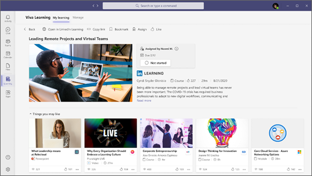

# 개요 Microsoft Viva Learning(미리 보기) 

> [!NOTE]
> 이 문서의 정보는 상업적으로 출시되기 전에 상당수 수정될 수 있는 미리 보기 제품과 관련이 있습니다. 

Viva Learning(미리 보기)는 학습 및 구축 기술을 Microsoft Teams 통합할 수 있는 중앙 집중식 학습 허브입니다. Viva Learning(미리 보기)에서 팀은 조직과 파트너가 제공하는 콘텐츠 라이브러리를 검색, 공유, 할당 및 학습할 수 있습니다. 모든 작업을 종료하지 않고도 이 작업을 Microsoft Teams.

   
 
직원들은 학습하고 성장할 기회를 제공하면 만족감을 보고하고 조직에 더 오래 남아 있을 가능성이 습니다. Viva Learning(미리 보기)를 사용하면 이미 사용 중이던 통신 도구를 멀어지지 않고도 조직에 이러한 기회를 쉽게 만들 수 있습니다.

## 작업 중 학습

### 모든 사용자

Viva Learning(미리 보기)를 사용하면 하루 중 학습을 쉽게 통합할 수 있습니다. Microsoft Teams Viva Learning(미리 보기)를 열면 조직과 파트너(예: LinkedIn)의 학습 콘텐츠에 대한 개인 설정 보기가 Learning. 더 많은 교육을 계속 검색하고 완료하면 관심사에 반영하기 위해 권장 콘텐츠가 업데이트됩니다.

- 조직에서 제공하는 학습 기회를 쉽게 찾을 수 있습니다.
- LinkedIn Learning, Microsoft Learn, Microsoft 365 Training, Skillsoft, Coursesra, edX, Pluralsight 및 기타 타사 학습 파트너의 과정을 찾아볼 수 있습니다.
- 도움이 되거나 경력 목표를 지원하는 특정 학습 콘텐츠를 검색합니다.
- 채팅 또는 채널에서 팀 구성원 또는 그룹과 관련, 흥미롭고 중요한 학습 Microsoft Teams 공유합니다.
- 채널 및 탭에서 학습 콘텐츠의 사용자 지정 Microsoft Teams 구성합니다.
- 관심 있는 과정과 마찬가지로 저장합니다.
- LinkedIn Learning 종료하지 않고 포함된 플레이어의 과정을 Microsoft Teams.

### 관리자

플랫폼 전체에서 학습을 조정하지 않고도 팀이 필요한 기술에 참여하고 최신 정보를 유지하세요. 개인 또는 그룹에 학습 콘텐츠를 할당하고, 팀과 콘텐츠를 공유하고, 할당된 학습의 완료 상태를 추적할 수 있습니다.

## 관리자 역할

관리자는 Viva 2013(미리 보기)에 대한 사용 권한을 설정하고 Learning 허용합니다. Viva Learning(미리 보기)를 설정하려면 다음 권한이 필요합니다.

- Microsoft Teams 관리자
- Microsoft 365 관리자 또는 SharePoint 관리자 권한
- 지식 관리자

### 지식 관리자

지식 관리자는 조직의 모든 Azure Active Directory 할당할 수 있는 Microsoft 365 관리 센터(Azure AD) 역할입니다. 이 역할은 조직의 학습 콘텐츠 원본을 관리하기 위해 Microsoft 365 관리 센터. 자세한 내용은 Azure AD 기본 [제공 역할을 참조하세요.](/azure/active-directory/roles/permissions-reference#knowledge-administrator)

지식 관리자는 보통 기술적인 지식이 있으며 관리자 자격 증명을 SharePoint 합니다. 지식 관리자는 조직의 교육, 학습, 교육 또는 직원 경험에서 잘 교육을 쌓아야 합니다.

## 시작하기

사용자 환경에서 Viva Learning(미리 보기)를 설정하고 구성할 Microsoft 365 경우:

- Microsoft Teams 관리 센터를 사용하여 조직 전체에서 [Viva Learning(미리 보기)를 관리합니다.](set-up-teams-admin-center.md)
- 다음 Microsoft 365 관리 센터 사용하여 특정 그룹에서 사용할 수 있는 학습 [원본을 구성합니다.](content-sources-365-admin-center.md)
- SharePoint 관리 센터를 사용하여 학습 콘텐츠를 관리하고 [저장합니다.](configure-sharepoint-content-source.md)

