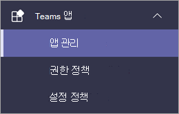
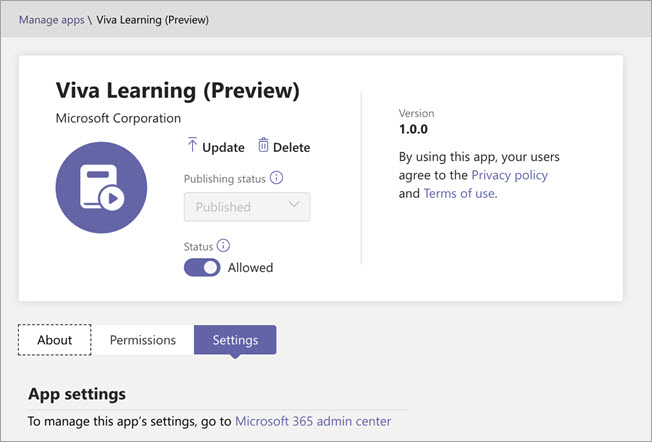
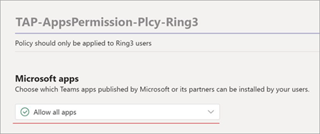

# Microsoft Viva Learning 관리 센터에서 Teams(미리 보기) 설정

> [!NOTE]
> 이 문서의 정보는 상업적으로 출시되기 전에 상당수 수정될 수 있는 미리 보기 제품과 관련이 있습니다. 

Teams 관리자는 특정 단계를 수행하여 테넌트의 사용자에 대해 Viva Learning(미리 보기)를 사용하도록 설정해야 합니다. 이러한 단계는 테넌트가 활성화되는 방식에 따라 달라집니다. [*공개*](set-up-teams-admin-center.md#public-preview-tenants) 미리 보기 또는 비공개 [ *미리* 보기(또는 베타)](set-up-teams-admin-center.md#private-preview-tenants)).

## 공개 미리 보기 테넌트

### 공개 미리 보기 테넌트에 대한 관리자 단계

Viva Learning(미리 보기)를 아직 사용할 수 없는 상태이기 때문에 기능을 사용하도록 설정하고 특정 사용자 또는 그룹에 대한 사용 권한을 설정하려면 특정 단계가 필요합니다. 

1. Viva(미리 보기) 사용자에 대해 Learning 미리 보기 기능을 사용하도록 설정

    a. 공용 Teams 기능을 사용하도록 업데이트 정책을 수정합니다. 공개 [Microsoft Teams 을 참조합니다.](/microsoftteams/public-preview-doc-updates)

    b. Viva Learning(미리 보기) 테스트를 수행할 사용자 또는 그룹에 대해 업데이트 정책을 사용하도록 설정하십시오. 사용자 [및 그룹에 정책 할당을 참조합니다.](/microsoftteams/assign-policies-users-and-groups)

2. Viva(미리 보기) 사용자에 대한 Learning 권한 정책을 수정합니다.

    a. 현재 글로벌 정책의 일부가 않는 한 앱 사용 권한 정책의 모든 Microsoft 앱을 허용합니다. 에서 [앱 권한 정책 Microsoft Teams.](/microsoftteams/teams-app-permission-policies) 

    b. Viva Learning(미리 보기) 테스트를 수행할 사용자 또는 그룹에 대해 앱 권한 정책을 사용하도록 설정할 수 있습니다. 사용자 [및 그룹에 정책 할당을 참조합니다.](/microsoftteams/assign-policies-users-and-groups)

3. Viva Learning(미리 보기)를 테스트할 사용자에게 빌드 클라이언트를 공개 미리 보기로 전환할 수 있도록 [Teams.](set-up-teams-admin-center.md#user-steps-for-public-preview-tenants)

> [!IMPORTANT]
> 공개 미리 보기 테넌트의 경우 최종 제품 릴리스가  Teams 관리 센터의 관리되는 앱에 Viva Learning(미리 보기)가 표시되지 않습니다. 그러나 사용하도록 설정된 공개 미리 보기 사용자는 Teams 앱 스토어에서 Viva Learning(미리 보기)를 찾아서 사용할 수 있습니다( 올바른 정책 및 사용 권한이 설정되면).

### 공개 미리 보기 테넌트에 대한 사용자 단계

이전에 설명한 정책을 사용하도록 설정하여 공개  미리 보기 테스트를  사용하도록 설정된 사용자는 해당 클라이언트에서 공개 미리 보기로 Teams 합니다.

1. 사용자는 공개 미리 보기 정보에서 > **이미지를**  >  **선택해야 합니다.**

    

2. 사용자는 공개 미리 보기 사용 약관에 동의해야 합니다.

    

3. 이제 사용자는 Teams 스토어에서 Viva Learning(미리 보기)를 찾아 사용할 수 있습니다.

## 비공개 미리 보기 테넌트

### 비공개 미리 보기(또는 베타) 테넌트에 대한 관리자 단계

비공개 미리 보기 테넌트의 경우 사용하도록 설정해야 하는 추가 정책이 없습니다. 그러나 Viva Learning(미리 보기)는 조직의 사용자가 사용할 수 있도록 설정해야 합니다.

1. Teams 센터의 왼쪽 탐색 창에서 앱 관리 **Teams 로**  >  <a href="https://go.microsoft.com/fwlink/?linkid=2172960" target="_blank">**이동하세요.**</a>

   

2. 앱 **관리 페이지의** 검색 상자에 *Viva* Learning 를 입력한 다음 **Viva Learning(미리 보기)를 선택합니다.**

   

3. **Viva Learning(미리 보기)** 페이지의 **상태** 아래에서  Viva Learning 켜기 허용(미리 보기)을 선택합니다.

   

<!---
The Teams admin installs Viva Learning (Preview) and applies permission policies through the <a href="https://go.microsoft.com/fwlink/p/?linkid=2066851" target="_blank">Teams admin center</a>.

1. For Viva Learning (Preview), you must first set the Update policy in Teams. For more information, see [Microsoft Teams Public Preview](/MicrosoftTeams/public-preview-doc-updates).

    1. Sign in to the Teams admin center > **Teams** > <a href="https://go.microsoft.com/fwlink/p/?linkid=2173206" target="_blank">**Update policies**</a>.

    3. Select **Add**. 

    4. Name the update policy, add a policy, and turn on **Show preview features**.

2. The admin must notify users of the policy update so that they move their build into the Public Preview for Teams. 

    1. Users must select their profile image > **About** > **Public Preview**.
   
        
    
    2. Users must accept the **Public preview** terms and conditions.

        
 
3. For organizations that have restrictive policies and need to enable Viva Learning (Preview), follow the process in the next section.

## Manage settings for Viva Learning (Preview)

You must be an administrator in the Teams admin center to perform these tasks.

To make Viva Learning (Preview) available for users in your organization, follow these steps:

1. In the left navigation of the Teams admin center, go to **Teams apps** > <a href="https://go.microsoft.com/fwlink/?linkid=2172960" target="_blank">**Manage apps**</a>.

   

2. On the **Manage apps** page, in the search box, type *Viva learning*, and then select **Viva Learning (Preview)**.

   

3. On the **Viva Learning (Preview)** page:

   1. Under **Status**, select **Allowed** to turn on Viva Learning (Preview).

   2. On the **Settings** tab, under **App settings**, go to the Microsoft 365 admin center to [configure learning content sources](content-sources-365-admin-center.md).

   

4. After **Manage app** settings, go to **Permission policies** and **Setup policies** to grant permission to employees who should have access to Viva Learning (Preview) as part of your organization's participation in the preview.

> [!NOTE]
>  If your organization is in Ring 4.0 as part of Teams TAP100 program, you might need to enable approved users in Ring 3.0 to access Viva Learning (Preview).   As part of the preview, Viva Learning (Preview) is released in Ring 3.0. If your organization is in Ring 4.0, you won’t see Viva Learning (Preview) on the **Manage apps** page. To test the app, you need to create a custom apps permission policy, set it to **Allow all apps**, and assign it to Ring 3.0 approved users.      

--->

## 다음 단계

[Viva Learning(미리 보기)에 대한 학습 콘텐츠 원본을 Microsoft 365 관리 센터](content-sources-365-admin-center.md)
