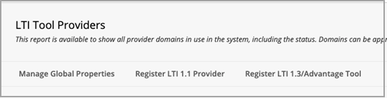

# 학습 관리 시스템에서 Microsoft Teams 클래스 사용

> [!IMPORTANT]
> 일부 정보는 상용으로 출시되기 전에 실질적으로 수정될 수 있는 사전 릴리스된 제품과 관련이 있습니다. Microsoft는 여기에서 제공하는 정보와 관련하여 명시적이거나 묵시적인 어떠한 보증도 제공하지 않습니다.

Microsoft Teams 수업 팀은 교육자 및 학생이 LMS(학습 관리 시스템) 및 Teams 간을 쉽게 탐색할 수 있도록 돕는 LTI(학습 도구 상호 운영성) 앱입니다. 사용자는 LMS 내에서 직접 과정과 연결된 수업 팀에 액세스할 수 있습니다.

## Microsoft Azure 테넌트에서 앱 승인

다음 작업은 Microsoft Office 365 관리자 및 Blackboard Learn Ultra 관리자에 의해 완료됩니다.

Blackboard Learn Ultra 내에서 통합을 관리하기 전에 Microsoft Office 365 관리자는 기관의 Microsoft Azure 테넌트에 대한 울트라 Azure 앱용 Blackboard **MSFT Teams를** 승인해야 합니다.

1. Microsoft 테넌트 ID를 찾아야 합니다. [테넌트 를 찾는 방법을 참조합니다.](/azure/active-directory/fundamentals/active-directory-how-to-find-tenant)

2. 다음 예에 따라 Microsoft Identity Platform 관리자 동의 끝점을 리디렉션합니다.

   `https://login.microsoftonline.com/{tenant}/adminconsent?client\_id=2d94989f-457a-47c1-a637-e75acdb11568`

   > [!NOTE]
   > {tenant}를 조직의 Microsoft 테넌트 ID로 대체합니다.

## 통합 앱 등록

Blackboard Learn Ultra admin, you'll need to register 2 LTI 1.3 integration apps within your Test environment:

- 로스터 동기화를 지원하기 위한 Blackboard Learn Class Teams 통합

- Microsoft Teams 수업 팀 LTI 앱

1. 두 앱에 대한 다음 LTI 클라이언트 ID를 메모합니다.

    - Blackboard - f1561daa-1b21-4693-ba90-6c55f1a0eb41

    - Microsoft - 027328b7-c2e3-4c9e-aaa1-07802dae6c89

2. 관리 패널에 액세스하고 통합에서 LTI 도구 공급자를 찾습니다.

   

3. **LTI1.3/Advantage 도구 등록을 선택합니다.**

4. 제공된 클라이언트 ID 중 첫 번째(Blackboard 또는 Microsoft)를 입력하고 제출 을 **선택합니다.**

   

5. 미리 채워진 설정을 검토하고 도구 상태가 승인됨으로 표시되어 있는지 확인합니다.

6. 아래쪽으로 스크롤한 다음 제출을 **선택합니다.**

7. 환경 내에 LTI 앱의 두 번째를 등록하기 위해 이전 단계를 반복합니다.

## REST 응용 프로그램 및 교차 원본 리소스 공유 설정

Blackboard Learn Ultra 관리자는 REST 응용 프로그램 및 교차 원본 리소스 공유 구성도 구성해야 합니다.

다음을 완료하여 REST 응용 프로그램 설정

1. 관리 도구 학습에 액세스한 다음 통합 섹션에서 **REST API** **통합을** 선택합니다.

2. 통합 **만들기를 선택하고** Blackboard 수업 Teams 통합 LTI 도구에 대해 입력한 동일한 응용 프로그램/클라이언트 ID를 입력합니다.

3. 사용자 학습(직접 관리자 사용자 이름일 수 있습니다)을 입력하거나 **찾아보기를** 선택하여 찾습니다.

4. 최종 **사용자 액세스에** **대해 예를 선택합니다.**

5. 사용자로 활동 **권한이 부여된 경우 예를 선택합니다.** 

6. 완료되면 **제출을** 선택합니다.

## 원본 간 리소스 공유 설정

1. 관리 도구 학습에 액세스하고 통합 섹션에서 원본 **간** 리소스 **공유를** 선택합니다.

2. 구성 **만들기를 선택합니다.**

3. 원본에 `https://bb-ms-teams-ultra-ext.api.blackboard.com` 입력합니다.

4. 허용되는 **헤더에 권한** 부여 **단어를 추가합니다.**

5. 사용 **가능을 예로** **설정**

6. 완료되면 **제출을** 선택합니다.

## Blackboard에서 수업 팀 사용 학습

LTI 도구를 사용하도록 설정한 후 다음 단계는 365 테넌트에서 Microsoft 클래스 Teams 통합을 Microsoft Office 것입니다. Blackboard Learn Ultra admin로 다음 단계를 수행하여 이 작업을 할 수 있습니다.

1. 관리 **도구 및** 유틸리티  >  **학습에서** **Microsoft Teams 통합 관리자 를 선택합니다.**

   

2. Microsoft Teams 사용 **확인란을 선택합니다.**

3. Microsoft O365 관리자 아래 섹션에 참조된 테넌트 ID를 입력합니다.

 > [!NOTE]
 > O365 관리자가 앱을 승인하기 전까지는 설정을 저장할 수 없습니다. [Microsoft Azure 테넌트에서 앱 승인을 참조하세요.](#approve-the-app-in-the-microsoft-azure-tenant)

4. 전역 O365 관리자가 Microsoft 테넌트에서 Blackboard Teams 응용 프로그램을 승인한 경우 제출을 **선택합니다.**
