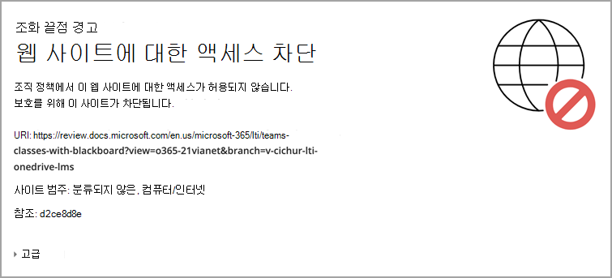

# Blackboard Microsoft Teams 클래스 사용Use Microsoft Teams classes with Blackboard Learn Ultra

팀워크는 모든 최신 조직의 핵심입니다.Teamwork is at the core of every modern organization. 공동 작업을 육성하여 성공적인 모든 기관의 특징을 정의합니다.By fostering collaboration, it’s a defining characteristic of every successful institution. 각 클래스와 페어링하여 Blackboard Learn Ultra의 모든 기능과 Microsoft Teams 있습니다.You can enhance all the capabilities and features of Blackboard Learn Ultra by pairing them up with Microsoft Teams classes.

클래스에는 실시간 대화, 비디오 모임 또는 비동기 조작이 포함되어 있을 수 있습니다.Your classes might include real-time conversations, video meetings, or asynchronous interactions. 학생을 위한 파일 공유 및 공동 준비 환경을 한 장소에 모두 추가할 수 있습니다.You can add file sharing and cocreation experiences for your students, all in one place. Microsoft Teams 학습을 통해 교육의 역동성 및 효과적인 학습의 의미를 다시 정합니다.Microsoft Teams classes with Learn Ultra redefine the dynamics of teaching and what effective learning means.

> [!IMPORTANT]
> [SIS(학생](https://help.blackboard.com/Learn/Administrator/SaaS/Integrations/Student_Information_System/SIS_Planning) 정보 시스템)에서 기관 전자 메일 필드를 성공적으로 설정해야 합니다.Ensure that you have successfully set up the Institution Email field in your [Student Information System (SIS)](https://help.blackboard.com/Learn/Administrator/SaaS/Integrations/Student_Information_System/SIS_Planning)
>
>Microsoft Teams 클래스 통합은 SIS의 기관 전자 메일 필드를 통해 AAD(Microsoft Azure Active Directory) [UPN(사용자](/azure/active-directory/hybrid/howto-troubleshoot-upn-changes)원칙 이름)에 매핑됩니다.The Microsoft Teams classes integration relies on the institution email field in your SIS to map to the correct Microsoft Azure Active Directory’s (AAD) [User Principle Name (UPN)](/azure/active-directory/hybrid/howto-troubleshoot-upn-changes). 기관 전자 메일이 프로비전되지 않은 경우 이 전자 메일은 기본적으로 기존 전자 메일로 설정됩니다.If no institution email has been provisioned, this will default to the existing email. 데이터가 올바르게 동기화되도록 모든 사용자에 대해 이 필드를 설정하고 AAD와 Blackboard Learn Ultra 간에 전자 메일 데이터가 충돌하지 않도록 하는 것이 좋습니다.It’s recommended that this field be set for every user to ensure their data is synchronized correctly and that there is no conflict of email data between AAD and Blackboard Learn Ultra.
>
> SIS 매핑에서 이 필드를 적절하게 설정하지 않은 경우 통합이 계속 작동하지만 사용자가 만든 Teams 나타나지 않을 수 있으며 오류가 발생할 수 있습니다.If you haven’t set this field appropriately in your SIS mapping, the integration will continue to work, but users might not appear in the Teams classes created, and errors could occur.

## 기관 데이터 매핑 지원 - 기관 전자 메일 SIS 필드Supporting Institutional Data Mapping – Institution Email SIS Field

클라우드 공급자 통합의 일부로 Blackboard Learn Ultra는 학생  정보 시스템 프레임워크 통합과 공용 REST API 모두에 새로운 기관 전자 메일 필드를 만들어 기관이 Blackboard Learn Ultra와 AAD 간에 데이터 동기화 프로세스를 효과적으로 관리할 수 있도록 합니다.As part of the evolution with Cloud provider integrations, Blackboard Learn Ultra has created a new **Institution Email** field, in both the Student Information System Framework integration and public REST APIs, allowing institutions to manage the data synchronization process effectively between Blackboard Learn Ultra and AAD.

### 기관 전자 메일의 의미와 지원 여부What does the Institution Email mean and what does it support?

기관 **전자 메일 필드를** 사용하면 클라이언트의 외부에서 지원되는 데이터 원본과 Blackboard Learn Ultra 간에 사용자 지정된 필드 매핑을 사용할 수 있습니다.The **Institution Email** field allows customized field mappings between a client’s externally supported data sources and Blackboard Learn Ultra. 데이터 원본이 Microsoft와 같은 클라우드 공급자인 경우 UPN(사용자 원칙 이름)은 @ 기호와 함께 가입된 UPN 접두사(사용자의 계정 이름)와 UPN 접미사(DNS 도메인 이름)로 구성된 각 사용자의 기본 고유 식별자입니다.If data sources are cloud providers, such as Microsoft, the User Principle Name (UPN) is a primary unique identifier for each user consisting of a UPN prefix (the user’s account name) and a UPN suffix (a DNS domain name) joined together with an @ symbol. 이렇게 하면 사용자 계정 내의 각 특정 사용자에 대해 고유한 전자 메일 Microsoft Azure Active Directory.This creates a unique email address for each specific user within the Microsoft Azure Active Directory.

데이터가 정확하고 Blackboard Learn Ultra 및 Microsoft Teams 클래스 간의 등록 또는 멤버 자격이 올바르게 달성되도록 보장하려면 사용자의 전자 메일 주소가 두 시스템 간에 일치해야 합니다.To ensure data is accurate and enrollments or memberships between Blackboard Learn Ultra and Microsoft Teams classes are correctly achieved, a user’s email address must match between both systems. Blackboard Learn Ultra에서 사용자는 사용자 인터페이스에서 기존 전자 메일 주소를 변경하거나 이로 인해 동기화 오류가 발생하고 사용자가 수업 팀에 올바르게 추가되지 않을 수 있습니다.In Blackboard Learn Ultra, users can change or override their existing email address in the user interface, which could result in sync errors occurring and the user not being correctly added to a Class Team. 기관 **전자 메일** 필드 매핑을 사용하면 사용자가 Blackboard Learn Ultra 내에서 전자 메일을 변경한 경우와 관계없이 이 수준의 보안 및 유효성 검사 검사를 올바르게 관리할 수 있습니다.The **Institution Email** field mapping ensures this level of security and validation checking can be correctly managed, regardless if users have changed their email within Blackboard Learn Ultra or not.

 두 전자 메일 주소가 서로 다른 경우 다음 중 하나를 사용합니다.When two email addresses are different, either:

- 우선 순위를 가지는 원본에 대한 결정을 내리고 개인 및 기관 전자 메일로 취해야 합니다.A decision must be made as to which source has precedence and will be taken as both the Person and Institution Emails.
  또는Or
- 기관은 기관 전자 메일에서 사용자 정의 필드 매핑을 설정하여 잠재적인 충돌을 해결할 수 있습니다.An institution can set a custom field mapping in its Institution Email, which can resolve a potential conflict.

이제 **고급** 구성에서 모든 기존 SIS 통합 유형에 대해 기관 **전자 메일** 필드 매핑을 사용할 설정 개체 유형 필드 매핑을 사용할 수  >    >  **있습니다.**The **Institution Email** field mapping is now available for all existing SIS integration types at **Advanced Configuration Settings** > **Users Learn Object Type** > **Field Mapping**.

> [!NOTE]
> 기본적으로 기관 전자 메일은 모든 SIS 형식에 대해  개인 전자 메일로 설정되어 있으며 각 사용자에 대해 고유해야 합니다. It’s important to note that, by default, the **Institution Email** is set to the **Person Email** for all SIS formats and must be unique for each person. 전자 메일이 중복될 경우 SIS에서 사용자를 가져오지 못하기 때문에 설정 및 실행 중인 모든 기존 통합에는 이 데이터 매핑이 설정됩니다.All existing integrations that are set up and running will have this data mapping in place, as SIS will fail to import users if their email is duplicated. 기관에서 기관 전자 메일을 사용자 지정으로 변경할 수 있는 기능을 요구하는  경우 SIS의 고급 구성 설정 관리해야 합니다.If an institution requires the ability to change the Institution Email to **custom**, they'll need to manage this through the **Advanced Configuration Settings** in the SIS.

## 요구 사항Requirements

이 Microsoft Teams 통합은 울트라 코스 보기 과정에만 **사용할 수 있습니다.**The Microsoft Teams classes integration is available for **Ultra Course View courses only**. 해당 기관에서 다음 요구 사항을 충족해야 합니다.Your institution needs to complete these requirements to use it:

- 초고속 탐색을 사용하도록 설정한 Blackboard가 매우 자세히 학습 SaaS를 사용하도록 설정Have Blackboard Learn Ultra Learn SaaS with Ultra Base Navigation enabled

  

- 과정에 사용할 LTI를 사용하도록 설정Enable LTI for use in courses.

  a.a. 관리자 패널   >  **LTI 도구 공급자 전역** 속성 관리 로  >  **이동하세요.**Go to the **Administrator Panel** > **LTI Tool Providers** > **Manage Global Properties**.

  b.b. 과정에서 **LTI 사용 을 선택하고** 원하는 경우 **조직에서 사용 을 선택합니다.**Select **LTI Enabled in Courses**, and optionally, select **Enabled in Organizations**.

  c.c. **전송** 을 선택합니다.Select **Submit**.

- LTI가 구성되어 있어야 합니다.Must have LTI configured

- Add Blackboard Learn Ultra Teams Classes LTI IntegrationAdd Blackboard Learn Ultra Teams Classes LTI Integration

- 추가 Microsoft Teams 클래스 LTI 1.3 도구Add Microsoft Teams Classes LTI 1.3 Tool

- REST API 도구 및 원본 간 리소스 공유 추가Add the REST API Tool and Cross-Origin Resource Sharing

- 통합 클래스 Microsoft Teams 구성 및 승인Configure and approve Microsoft Teams classes Integration

## Blackboard Learn Ultra Teams 클래스 LTI 1.3 도구 추가Add the Blackboard Learn Ultra Teams Classes LTI 1.3 Tool

1. 관리자 **패널에서** **LTI 도구 공급자 를 선택합니다.**From the **Administrator Panel**, select **LTI Tool Providers**.

2. **LTI 1.3 도구 등록을 선택합니다.**Select **register LTI 1.3 Tool**.

3. 클라이언트 **ID 필드에** 이 ID를 입력하거나 복사하여 붙여넣습니다.In the **Client ID** field, type or copy and paste this ID:

   `f1561daa-1b21-4693-ba90-6c55f1a0eb41`

4. 미리 채워진 모든 설정을 검토하고 도구 상태 에서 **를** 검토한 다음 사용 을 **선택합니다.**Review all settings that have been pre-populated and in **Tool Status**, and then select **Enabled**.

5. 기관 **정책에서** 과정의 **역할,** 이름 및 전자 메일 주소를 선택한 다음 둘 **다에 대해 예를** 선택합니다.In **Institution Policies**, select **Role in Course, Name,** and **Email Address**, and then select **Yes** for both.

6. 등급 **서비스 액세스 허용 및** 멤버 자격 서비스 액세스 **허용을 선택합니다.**Select **Allow grade service access** and **Allow Membership Service Access**.

## Microsoft Teams 클래스 LTI 1.3 도구 추가Add the Microsoft Teams Classes LTI 1.3 Tool

1. 관리자 **패널에서** **LTI 도구 공급자 를 선택합니다.**From the **Administrator Panel**, select **LTI Tool Providers**.

2. **LTI 1.3 도구 등록을 선택합니다.**Select **register LTI 1.3 Tool**.

3. 클라이언트 **ID 필드에** 이 ID를 입력하거나 복사하여 붙여넣습니다.In the **Client ID** field, type or copy and paste this ID:

   `027328b7-c2e3-4c9e-aaa1-07802dae6c89`

4. 미리 채워진 모든 설정을 검토하고 도구 상태를 *검토하고* 사용 을 *선택합니다.*Review all settings that have been pre-populated and in *Tool Status* and select *Enabled.*

5. 기관 **정책에서** **과정의 역할, 이름 및** 전자 메일 주소를 **선택합니다.**In **Institution Policies**, select **Role in Course, Name,** and **Email Address**. 둘 **다에 대해 예를** 선택합니다.Select **Yes** for both.

6. 등급 **서비스 액세스 허용 및** 멤버 자격 서비스 액세스 **허용을 선택합니다.**Select **Allow grade service access** and **Allow Membership Service Access**.

## REST API 도구 추가Add the REST API tool

1. 관리자 **패널에서** 통합으로 **이동하고** **Rest API Integrations 를 선택합니다.**From the **Administrator Panel**, navigate to **Integrations** and select **Rest API Integrations**.

2. 통합 **만들기를 선택합니다.**Select **Create Integration**.

3. 응용 **프로그램 ID 필드에** 이 ID를 입력하거나 복사하여 붙여넣습니다.In the **Application ID** field, type or copy and paste this ID:

   `f1561daa-1b21-4693-ba90-6c55f1a0eb41`

4. 이 통합에 대한 사용자를 입력합니다.Type a user for this integration.

   이 사용자는 응용 프로그램이 연결된 홈 API 액세스 권한이 있는 사용자가 됩니다.This user will be the one with home API access from which the application is associated.

5. **전송** 을 선택합니다.Select **Submit**.

## 원본 간 리소스 공유 추가Add the Cross-Origin Resource Sharing

1. 관리자 **패널에서** 통합으로 **이동하고** \* 원본 간 리소스 공유 *를 선택합니다.*From the **Administrator panel**, navigate to **Integrations** and select \**Cross-origin Resource Sharing*.

2. 구성 **만들기를 선택합니다.**Select **Create Configuration**.

3. 원본 **필드에** 이 URL을 복사하여 붙여넣습니다.In the **Origin** field, type of copy and paste this URL:

   `https://bb-ms-teams-ultra-ext.api.blackboard.com`

4. 허용되는 **헤더 필드에** 권한 부여 를 **입력합니다.**In the **Allowed Headers** field, type **Authorization**.

5. 사용 **가능을 예로** **설정**Set **Available** to **Yes**.

6. **전송** 을 선택합니다.Select **Submit**.

## 통합 클래스 Microsoft Teams 구성 및 승인Configure and Approve Microsoft Teams classes Integration

Blackboard Learn Ultra 인스턴스를 Microsoft Teams 클래스와 성공적으로 통합하려면 Blackboard Learn Ultra 응용 프로그램이 Microsoft Azure 테넌트 내에서 액세스가 승인되어 있는지 확인해야 합니다.To successfully integrate your Blackboard Learn Ultra instance with Microsoft Teams classes, you'll need to make sure the Blackboard Learn Ultra application is approved for access within your Microsoft Azure tenant. 이 프로세스는 기관의 전역 관리자가 Microsoft 365 합니다.This is a process that will need to be completed by your institution’s Microsoft 365 Global Admin.

이 프로세스는 Blackboard Learn Ultra Instance에서 LTI 응용 프로그램을 구성하기 전이나 후에 완료할 수 있습니다.This process can be done either before or after you have configured the LTI applications in your Blackboard Learn Ultra Instance.

### LTI 응용 프로그램을 구성하기 전에Before Configuring the LTI Applications

LTI 통합을 구성하기 전에 Blackboard Learn Ultra Teams Classes Azure 앱을 승인하려면 Microsoft Identity Platform 관리자 동의 끝점으로 **리디렉션해야 합니다.**If you choose to approve the Blackboard Learn Ultra Teams Classes Azure app before configuring the LTI integrations, you'll need to redirect to the **Microsoft Identity Platform Admin Consent Endpoint**. URL이 표시됩니다.The URL is shown:

`https://login.microsoftonline.com/{tenant}/adminconsent?client\_id=2d94989f-457a-47c1-a637-e75acdb11568`

> [!NOTE]
> **{Tenant}를** 특정 기관용 테넌트 Microsoft Azure 대체합니다.You’ll replace **{Tenant}** with your specific institutional Microsoft Azure tenant ID.

사용자에게 액세스 권한을 Blackboard Learn Ultra에 부여할 수 있는 권한을 설명하는 사용 권한 창이 Microsoft Teams.You'll see a permissions window that explains you're giving permission to Blackboard Learn Ultra to access Microsoft Teams.

### LTI 응용 프로그램 구성 후After Configuring the LTI Applications

1. 관리자 **패널에서** 도구  및 유틸리티로 이동하고 통합 **Microsoft Teams 선택합니다.**On the **Administrator Panel**, navigate to **Tools and Utilities** and select **Microsoft Teams Integration Admin**.

2. 에서 **사용 을 Microsoft Teams.**Select **Enable Microsoft Teams**.

3. 사용 가능한 **텍스트 필드에 Microsoft 테넌트 ID를** 추가합니다.Add your **Microsoft Tenant ID** into the available text field.

4. 다음 옵션 중 하나를 선택합니다.Choose one of the following options:

   - 앱에 사전 동의가 있는 경우 작은 확인 표시가 표시 됩니다.If the app has pre-consent, it will show a small checkmark. 확인 표시가 나타나면 제출을 **선택합니다.**If the checkmark appears, select **Submit**.

   - 동의가 승인되지 않은 경우 설명된 단계에 따라 동의를 위해 URL을 생성하고 승인을 위해 Microsoft 365 전역 관리자에게 전송합니다.If consent hasn’t been approved, follow the steps described to generate the URL for consent and send it to the Microsoft 365 Global Admin for approval.

5. 승인을 확인한 후 다시 **시도를** 선택하여 확인한 다음 제출을 **선택합니다.**Once you've confirmation of approval, select **Retry** to confirm, and then select **Submit**.

   