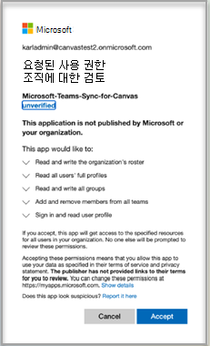

# Canvas에서 Microsoft Teams 클래스 사용

Microsoft Teams 클래스는 교사와 학생이 LMS(Learning Management System) 및 LMS(Learning 관리 시스템) 사이를 쉽게 탐색하는 데 도움이 되는 LTI(Learning 도구 상호 운영성) 앱입니다Teams. 사용자는 LMS 내에서 직접 과정과 연결된 수업 팀에 액세스할 수 있습니다.

## 배포 전의 선행 구성

> [!NOTE]
> 현재 클래스 Teams LTI는 Canvas 사용자와 제한된 범위의 AAD(Microsoft Azure Active Directory) 동기화만 지원됩니다. 
> - 테넌트에 Microsoft Education 라이선스가 있어야 합니다.
> - Canvas와 Microsoft 간에 사용자를 매핑하는 데는 단일 Microsoft 테넌트만 사용할 수 있습니다.
> - 그룹이 중복되는 것을 방지하기 위해 학교 데이터 동기화 LTI 클래스를 Teams(SDS)를 해제해야 합니다.

## 관리자 동의 부여

Instructure Canvas 내에서 Microsoft Teams 통합을 관리하기 전에 Canvas 관리자 설정을 완료하기 전에 캔버스의 **Microsoft-Teams-Sync-for-Canvas** Azure 앱을 Microsoft Azure 테넌트의 기관의 Microsoft Office 365 관리자가 승인해야 합니다. 이러한 단계를 수행하려면 전역 관리자로 설정해야 합니다.

1. 사이트로 Azure Active Directory.

2. 응용 Enterprise 열고 **Microsoft-Teams-Sync-for-Canvas 응용 프로그램을** 선택합니다.

3. 사용 **권한을 선택하고** 관리자 동의 부여 **를 선택합니다.**

4. 응용 프로그램에 필요한 사용 권한에 동의한 다음 동의를 부여합니다.

## Microsoft Office 365 관리자

1. Canvas에 로그인합니다.

2. 전역 **탐색에서** 관리자 링크를 선택한 다음 계정을 선택합니다.

3. 관리자 탐색에서 설정 **링크를** 선택한 다음 **통합 탭을** 선택합니다.

4. 토글을 Microsoft Teams 동기화를 사용하도록 설정
   
   

5. Microsoft 테넌트 이름, 로그인 특성, 도메인 접미사 및 AAD 검색 특성을 입력합니다.

   이러한 필드는 Canvas의 사용자와 캔버스의 사용자 일치에 Microsoft Azure Active Directory. 
   * Login 특성은 일치에 활용된 Canvas 사용자 특성입니다.
   * 접미사 필드는 선택 사항이며 Canvas 특성과 Microsoft AAD 필드 간에 정확한 매핑이 없는 경우 도메인을 지정할 수 있습니다. 예를 들어 Microsoft AAD의 UPN이 '이름'인 동안 Canvas 전자 메일이 'name@example.edu'인 경우 접미사 필드에 'example.edu'를 입력하여 사용자를 일치할 수 있습니다.
   * Active Directory Lookup Attribute는 Canvas 특성이 일치하는 Microsoft 쪽 필드입니다. UPN, 기본 전자 메일 주소 또는 전자 메일 별칭 사이에서 선택합니다.

6. 한 **번 설정** 업데이트를 선택합니다.

7. Canvas의 **Microsoft-Teams-Sync-for-Canvas** Azure 앱에 대한 액세스를 승인하려면 테넌트 액세스 권한 부여 **링크를** 선택합니다. Microsoft Identity Platform 관리자 동의 끝점으로 리디렉션됩니다.

   

8. **수락** 을 선택합니다.

## Canvas Admin

LTI Microsoft Teams 1.3 통합을 설치합니다.

Canvas 관리자는 사용자 환경 내에 Microsoft Teams 클래스 LTI 앱을 추가해야 합니다. 기본 계정의 개발자 키 목록에 액세스하고, 상속된 키로 전환하고, LTI 도구를 Teams 활성화합니다. 앱에 대한 LTI 클라이언트 ID를 메모합니다.

 - Microsoft Teams 클래스 - 170000000000570

1. 관리자 **설정 앱에**  >  **액세스합니다.**

2. **+ 앱을 선택하여** LTI Teams 추가합니다.

   

3. 구성 **유형으로 클라이언트 ID를** 선택합니다.

   

4. 제공된 클라이언트 ID를 입력한 다음 제출을 **선택합니다.**

   확인을 위해 클라이언트 Microsoft Teams 클래스 LTI 앱 이름을 알 수 있습니다.

5. **설치** 를 선택합니다.

   LTI Microsoft Teams 클래스가 외부 앱 목록에 추가됩니다.
   
## Canvas에 대한 LTI 앱 사용 과정

과정 내에서 LTI 앱을 사용하려면 Canvas 과정의 강사는 통합 동기화를 사용하도록 설정해야 합니다. 각 강사는 해당 팀을 만들 수 있어야 합니다. 팀을 만들기 위한 전역 메커니즘은 있습니다. 이는 원치 않는 팀이 만들어지지 않도록 예방 조치로 디자인되었습니다.

각 과정에 대해  LTI 앱을 사용하도록 설정하고 통합 설정을 완료하려면 강사 설명서를 참조하세요.
