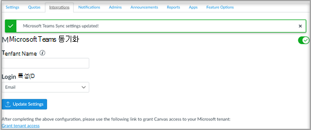

# Canvas에서 Microsoft Teams 모임 사용

Microsoft Teams 모임은 교육자 및 학생이 LMS(Learning Management System) 및 LMS(Learning 관리 시스템) 사이를 쉽게 탐색하는 데 도움이 되는 LTI(Learning 도구 상호 운영성) Teams. 사용자는 LMS 내에서 직접 과정과 연결된 수업 팀에 액세스할 수 있습니다.

## 배포 전의 선행 구성

> [!NOTE]
> 현재 Teams LTI는 Canvas 사용자와 제한된 범위의 AAD(Microsoft Azure Active Directory) 동기화만 지원됩니다. 
> - 테넌트에 Microsoft Education 라이선스가 있어야 합니다.
> - Canvas와 Microsoft 간에 사용자를 매핑하는 데는 단일 Microsoft 테넌트만 사용할 수 있습니다.
> - 그룹이 중복되는 것을 방지하기 위해 학교 데이터 동기화 LTI 클래스를 Teams(SDS)를 해제해야 합니다.

## Microsoft Office 365 관리자

Instructure Canvas 내에서 Microsoft Teams 통합을 관리하기 전에 Canvas 관리자 설정을 완료하기 전에 캔버스의 **Microsoft-Teams-Sync-for-Canvas** Azure 앱을 Microsoft Office 365 Microsoft Azure 테넌트에서 승인해야 합니다.

1. Canvas에 로그인합니다.

2. 전역 **탐색에서** 관리자 링크를 선택한 다음 계정을 선택합니다.

3. 관리자 탐색에서 설정 **링크를** 선택한 다음 **통합 탭을** 선택합니다.

4. Microsoft 테넌트 이름, 로그인 특성, 도메인 접미사 및 AAD 검색 특성을 입력합니다. 이러한 필드는 Canvas의 사용자와 캔버스의 사용자 일치에 Microsoft Azure Active Directory. 
   * Login 특성은 일치에 활용된 Canvas 사용자 특성입니다.
   * 접미사 필드는 선택 사항이며 Canvas 특성과 Microsoft AAD 필드 간에 정확한 매핑이 없는 경우 도메인을 지정할 수 있습니다. 예를 들어 Microsoft AAD의 UPN이 '이름'인 동안 Canvas 전자 메일이 'name@example.edu'인 경우 접미사 필드에 'example.edu'를 입력하여 사용자를 일치할 수 있습니다.
   * Active Directory Lookup Attribute는 Canvas 특성이 일치하는 Microsoft 쪽 필드입니다. UPN, 기본 전자 메일 주소 또는 전자 메일 별칭 사이에서 선택합니다.

5. 한 **번 설정** 업데이트를 선택합니다.

6. Canvas의 **Microsoft-Teams-Sync-for-Canvas** Azure 앱에 대한 액세스를 승인하려면 테넌트 액세스 권한 부여 **링크를** 선택합니다. Microsoft Identity Platform 관리자 동의 끝점으로 리디렉션됩니다.

   

7. **수락** 을 선택합니다. 

> [!NOTE]
> 동기화는 LMS 파트너가 관리하는 기능으로, 교육 과정 수준에서 Microsoft 그래프 API를 사용하여 Teams 팀과 동기화하는 데 사용됩니다. 이는 주로 강사들이 교육 수준에서 true로 전환하는 기능입니다. 그 후 LMS 파트너가 구현한 동기화를 사용하여 구성원을 추가 또는 지우기 위해 LMS 쪽에서 수행한 멤버 자격 변경이 반영됩니다. 교육자에 대해 이 프로세스를 사용하도록 설정하기 전에도 M365 교육 기관 관리자는 강사들이 아래 발견된 동기화 권한 모달을 사용하여 동기화에 액세스할 수 있습니다. 이러한 사용 권한은 LMS 파트너에게 부여되어 강사들이 LMS 과정과 수업 팀 간에 멤버십을 동기화할 Teams 부여됩니다.

8. 토글을 Microsoft Teams 동기화할 수 있도록 합니다.

   

## Canvas Admin

LTI Microsoft Teams 1.3 통합을 설치합니다.

Canvas 관리자는 사용자 환경 내에서 Microsoft Teams 모임 LTI 앱을 추가해야 합니다. 앱에 대한 LTI 클라이언트 ID를 메모합니다.

 - Microsoft Teams 모임 - 170000000000703

1. 관리자 **설정 앱에**  >  **액세스합니다.**

2. **+ 앱을 선택하여** LTI Teams 추가합니다.

   

3. 구성 **유형으로 클라이언트 ID를** 선택합니다.

   

4. 제공된 클라이언트 ID를 입력한 다음 제출을 **선택합니다.**

   확인을 위해 Microsoft Teams 모임 LTI 앱 이름을 알 수 있습니다.

5. **설치** 를 선택합니다.

   모임 Microsoft Teams LTI 앱이 외부 앱 목록에 추가됩니다.

6. Canvas 관리 계정의 개발자 키로 가고, 상속된 키를 선택하고, 모임에 대해 "켜기"를 설정하여 Microsoft Teams 활성화합니다.
   
## Canvas 과정 사용

과정 내에서 LTI를 사용하려면 Canvas 과정의 강사는 통합 동기화를 사용하도록 설정해야 합니다. 해당 강사가 각 강의를 사용하도록 설정해야 해당 Teams 수 있습니다. 전역 메커니즘을 만들 수 Teams 않습니다. 이는 원치 않는 사용자가 생성되지 않도록 Teams 않도록 디자인되었습니다.

강사에게 각  과정에 대한 LTI를 사용하도록 설정하고 통합 설정을 완료하려면 강사 설명서를 참조하세요.
