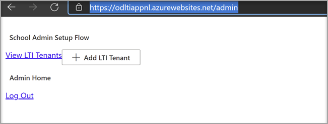
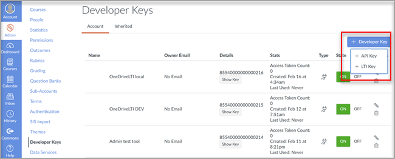

# 학습 Microsoft OneDrive 시스템과 함께 사용Use Microsoft OneDrive with your Learning Management System

> [!IMPORTANT]
> 일부 정보는 상용으로 출시되기 전에 실질적으로 수정될 수 있는 사전 릴리스된 제품과 관련이 있습니다.Some information relates to prereleased product which may be substantially modified before it's commercially released. Microsoft는 여기에서 제공하는 정보와 관련하여 명시적이거나 묵시적인 어떠한 보증도 제공하지 않습니다.Microsoft makes no warranties, express or implied, with respect to the information provided here.

LMS(학습 관리 시스템Microsoft OneDrive 함께 사용할 경우의 이점에 대해 자세히 알아보아야 합니다.Learn the benefits of using Microsoft OneDrive with your Learning Management System (LMS).

**워크플로에 Microsoft Office 365 직접 연결****Brings Microsoft Office 365 directly into your workflows**

LTI(Microsoft OneDrive Learning Tools Interoperability) 앱은 LMS와 통합되어 다음을 Microsoft OneDrive Microsoft Office 365 워크플로에 직접 통합할 수 있습니다.The Microsoft OneDrive Learning Tools Interoperability (LTI) App integrates with your LMS to bring Microsoft OneDrive and Microsoft Office 365 directly into your most important workflows that include:

- 리소스 연결 및 콘텐츠 구성Attaching resources and organizing content.
- 공동 작업 문서 시작Starting collaborative documents.
- 배정 만들기 및 그라데이트Creating and grading assignments.

**최신 LTI 표준을 안전하고 완벽하게 준수****Secure and fully compliant with latest LTI standards**

이 Microsoft OneDrive LTI 앱은 LTI 1.3 및 LTI 이점과 호환됩니다.The Microsoft OneDrive LTI App is compatible with LTI 1.3 and LTI Advantage. 이러한 이점을 통해 보안이 강화되고 긴밀하게 통합된 사용자 환경을 사용할 수 있습니다.This advantage allows for a highly secure and tightly integrated user experience.

**현대적이고 풍부한 사용자 환경****Modern and Rich User Experience**

LTI Microsoft OneDrive LMS 환경으로 Microsoft의 최고를 제공합니다.The Microsoft OneDrive LTI App brings the best of Microsoft right into your LMS experience. LMS의 기존 Office 365 통합을 개선하고 있으며, 새로운 확장된 Microsoft OneDrive 파일 선택기 및 Office 파일을 위한 더 풍부한 편집 환경을 제공합니다.We're improving upon the existing Office 365 integration in your LMS by delivering a more modern user experience, complete with a new and expanded Microsoft OneDrive file picker and richer editing experiences for Office files. 또한 Microsoft는 앞으로 Microsoft OneDrive LTI 앱을 완전히 소유합니다. 즉, 항상 Microsoft에서 최신 및 가장 좋은 앱을 자동으로 다운로드할 수 있습니다.Microsoft will also fully own the Microsoft OneDrive LTI App going forward, which means you’ll always get the latest and greatest from Microsoft automatically.

LTI Microsoft OneDrive 사용하여 다음을 할 수 있습니다.The Microsoft OneDrive LTI App allows you to:

- Word Office 365, 프레젠테이션, 프레젠테이션 PowerPoint 등의 Excel 파일을 첨부합니다.Attach Office 365 files including Word documents, PowerPoint presentations, and Excel from the Rich Content Editor.

- 클라우드 Office 365 배포합니다.Distribute Office 365 cloud assignments.

- 개인 및 과정 파일을 보고 Microsoft OneDrive 구성합니다.View and organize your personal and course Microsoft OneDrive files.

- 과정 구성원이 공유 문서에서 실시간으로 공동 작업할 수 있는 공동 작업을 만들 수 있습니다.Create collaborations where course members can work together on shared documents in real time.

- 개인 및 Microsoft OneDrive 계정을 포함하여 여러 사용자 계정에 액세스합니다.Access multiple Microsoft OneDrive accounts, including personal and school accounts.

- 교육 Office 365 모듈과 통합합니다.Integrate Office 365 files with your course modules.

- LMS와의 Single Sign-On에 Microsoft 계정을 사용하세요.Use your Microsoft account for single sign-on with your LMS.

## Canvas와 통합Integrate with Canvas

이 통합을 수행하는 사용자는 Canvas의 관리자이자 테넌트의 Microsoft 365 합니다.The person who performs this integration should be an admin of Canvas and an admin of the Microsoft 365 tenant.

1. 테넌트 관리자 계정으로 Microsoft Azure 포털에 로그인합니다.Sign in to the Microsoft Azure portal with the tenant admin account. Azure 테넌트 관리자에게도 그룹 관리자 역할이 있습니다.The Azure tenant administrator should also have the Group administrator role.

    

2. Microsoft OneDrive [LTI 포털에 로그인합니다.](https://odltiappnl.azurewebsites.net/admin)Sign in to the Microsoft [OneDrive LTI portal](https://odltiappnl.azurewebsites.net/admin).

3. 로그인을 완료하려면 사용 권한을 수락합니다.Accept the permissions to complete the sign-in.

    

4. LTI **테넌트 추가를 선택합니다.**Select **Add LTI Tenant**.

     

5. **드롭다운에서 LTI 소비자** 플랫폼을 **캔버스로** 선택합니다.Select **LTI Consumer Platform** as **Canvas** from the dropdown.

6. 캔버스 **기본 URL을 선택하고** 다음 을 **선택합니다.**Select **Canvas Base URL** and then select **Next**.

    

   다음 화면에는 기밀 필드가 표시됩니다.The next screen shows fields that are confidential to you.

7. **?에서 다음을** 선택합니다.Select **Next** from ?? 페이지.page. 검토자는 여기에서 공백을 채울 수 있나요?CAN REVIEWERS FILL IN THE BLANK HERE?

8. **화면에서** 기밀 정보를 표시하는 다음을 선택합니다.Select **Next** in the screen that shows information that's confidential to you.

   Azure Portal의 마지막 화면에는 Canvas 인스턴스를 추가하기 위한 다음 단계가 표시됩니다.The final screen of the Azure portal shows the next steps for adding your Canvas instance.

9. 이 화면에서 개발자 키를 복사합니다.Copy the Developer Keys from this screen. Canvas 인스턴스를 만들 때 사용할 수 있습니다.You'll use when you create the Canvas instance.

## Canvas 인스턴스 추가Add the Canvas instance

1. Canvas 인스턴스에서 관리자 개발자 **키의**  >  **선택을 선택합니다.**In your Canvas instance, deselect **Admin** > **Developer Keys**.

2. 개발자 **키의** 드롭다운에서 LTI **키를 선택하세요.**Choose **LTI Key** in the dropdown on **Developer Key**.

   

3. 여기에 개발자 키를 붙여 넣습니다.Paste the developer keys here.

     

   키가 **꺼진** 모드에서 생성됩니다.The key gets created in **OFF** mode

   

4. 강조 표시된 텍스트를 복사합니다.Copy the highlighted text.
    이 ID는 LTI 포털에서 Microsoft OneDrive 역할을 합니다.This serves as Client ID in Microsoft OneDrive LTI portal.

5. LTI 포털의 클라이언트 **ID** 필드에 텍스트를 Microsoft OneDrive 다음 을 **선택합니다.**Paste the text into the **Client ID** field in Microsoft OneDrive LTI portal, and then select **Next**.

6. **저장** 을 선택합니다.Select **Save**.

7. LTI 테넌트 보기 를 선택하여 **설정을 확인합니다.**View the settings by selecting **View LTI Tenants**.
