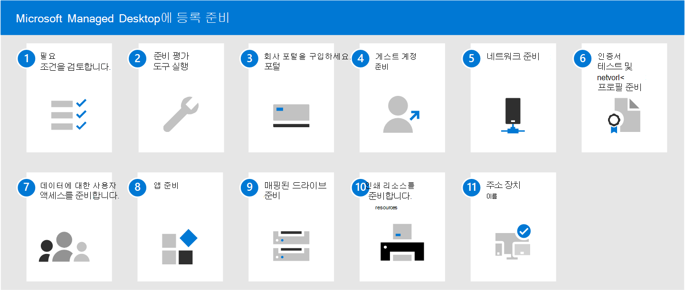

# Microsoft Managed Desktop에 등록 준비

이 항목에서는 환경이 주요 필수 구성 요소를 충족하는지 확인하고, 네트워크를 구성하고, 인증서를 설정하고, 서비스에 포함할 앱을 준비하는 등 조직에서 등록을 준비하기 위해 수행해야 하는 단계에 대해 설명합니다. 준비 평가 도구를 실행한 후 다른 단계를 순서대로 완료하거나 동시에 완료할 수 있습니다. 환경에 따라 일부 단계는 사용자와 관련이 없을 수 있습니다.

1. [Microsoft Managed Desktop의 필수 구성 요소](prerequisites.md)를 감토하세요.
2. [준비 상태 평가 도구](readiness-assessment-tool.md)를 실행하세요.
1. [회사 포털](../get-started/company-portal.md)을 구입하세요.
1. [게스트 계정에 대한 필수 구성 요소](guest-accounts.md)를 검토합니다.
1. [네트워크 구성](network.md)을 확인합니다.
1. [인증서 및 네트워크 프로필을 준비](certs-wifi-lan.md)합니다.
1. [데이터에 대한 사용자 액세스를 준비](authentication.md)합니다.
1. [앱을 준비](apps.md)합니다.
1. [매핑된 드라이브를 준비](mapped-drives.md)합니다.
1. [인쇄 리소스를 준비](printing.md)합니다.
1. [장치 이름](address-device-names.md)을 기입합니다.
