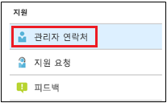
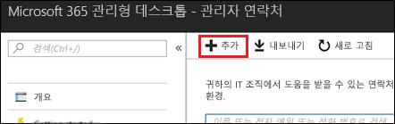
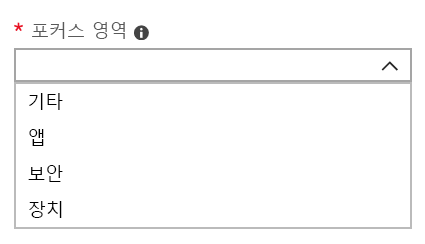

# 관리 포털에서 관리자 연락처 추가 및 확인Add and verify admin contacts in the Admin portal

Microsoft Managed Desktop 서비스가 고객과 소통하는 방법에는 여러 가지가 있습니다.There are several ways that Microsoft Managed Desktop service communicates with customers. 의사 소통이 원활하고 올바른 사용자에게 확인하고 있는지 확인하려면 관리자 연락처 집합을 제공해야 합니다.To streamline communication and ensure we’re checking with the right people, you need to provide a set of admin contacts. Microsoft Managed Desktop IT 운영팀에서 이 사용자들에게 연락하여 테넌트에 대한 문제 해결에 대한 도움을 줄 것입니다.Microsoft Managed Desktop IT Operations will contact these people for assistance troubleshooting issues for your tenant.

> [!IMPORTANT]
> 관리자 포털에서 이미 이 연락처를 추가했을 수 있습니다.You might have already added these contacts in the Admin portal. 이 경우에는 심각한 문제가 발생할 경우 Microsoft Managed Desktop이 연락할 수 **있어야** 하기 때문에 연락처 목록이 정확한지 다시 한 번 확인하세요.If so, take a moment now to double-check that the contact list is accurate, since Microsoft Managed Desktop **must** be able to reach them if a severe incident occurs.

## Microsoft Managed Desktop 관리 포털에 대한 Azure Active Directory 액세스Azure Active Directory access for Microsoft Managed Desktop Admin portal

Microsoft Managed Desktop 관리 포털을 사용하려면 포털에 액세스 하는 사용자가 다음 Azure AD(Active Directory) 역할 중 하나를 보유해야 합니다.Microsoft Managed Desktop Admin portal requires that people accessing the portal have one of these Azure Active Directory (AD) roles:
- 전역 관리자Global Administrator
- Intune 서비스 관리자Intune Service Administrator
- 대금 청구 관리자Billing Administrator
- 서비스 지원 관리자Service Support Administrator

전역 관리자는 Microsoft Managed Desktop에 조직을 등록해야 합니다.The Global Administrator must be the one to enroll your organization in Microsoft Managed Desktop. 모든 5개 역할은 관리자 포털에서 동일한 액세스 권한을 가지며 작업을 시작하고 볼 수 있습니다.All five roles have the same access within the Admin portal to initiate and view tasks. Azure AD에서 역할을 할당하는 방법에 대한 자세한 내용은 [Azure Active Directory에서 관리자 역할 사용 권한](https://docs.microsoft.com/azure/active-directory/users-groups-roles/directory-assign-admin-roles)을 참조하세요.For more information on assigning these roles in Azure AD, see [Administrator role permissions in Azure Active Directory](https://docs.microsoft.com/azure/active-directory/users-groups-roles/directory-assign-admin-roles). 

## 관리자 연락처 포커스 영역Admin contact areas of focus

관리자 연락처는 질문에 답하고 다양한 중점 영역에 대한 의사 결정을 내릴 수 있는 최고의 사용자나 그룹이어야 합니다.Admin contacts should be the best person or group that can answer questions and make decisions for different areas of focus. **Microsoft Managed Desktop 운영팀이 이러한 관리자 연락처에 연락하여 고객이 제출한 지원 요청과 관련된 질문을 할 수 있습니다.****Microsoft Managed Desktop Operations will contact these Admin contacts for questions involving support requests filed by the customer.** 이 관리자 연락처는 지원 요청 업데이트와 새 메시지에 대한 알림을 받습니다.These Admin contacts will receive notifications for support request updates and new messages. 해당 영역은 다음과 같습니다.These areas include:

포커스 영역Area of focus | 관련 질문For questions about
--- | ---
앱 패키징App packaging | 앱 패키징 문제 해결Troubleshooting app packaging
장치Devices | 장치 상태, Microsoft Managed Desktop 장치를 사용하여 문제 해결Device health, troubleshooting with Microsoft Managed Desktop devices
보안Security | Microsoft Managed Desktop 장치를 사용하여 보안 문제 해결Troubleshooting security issues with Microsoft Managed Desktop devices
IT 지원 센터IT help desk | 지원 담당자가 Microsoft Managed Desktop 지원 영역 외부에서 최종 사용자 티켓을 전달하는 경우in cases where our Support staff hands over end-user tickets outside of Microsoft Managed Desktop support areas 
기타Other | 다른 영역에서 다루지 않는 문제For issues not covered by other areas

**이러한 연락처로 선택한 사용자는 Microsoft Managed Desktop 환경을 결정할 수 있는 지식과 권한이 있어야 합니다.****Whoever you choose for these contacts needs to have the knowledge and authority to make decisions for your Microsoft Managed Desktop environment.** Microsoft Managed Desktop 환경을 온보드하는 경우 로컬 지원 센터 및 보안에 대한 연락처를 추가하라는 메시지가 표시됩니다.When you onboard your Microsoft Managed Desktop environment, you’re prompted to add contacts for your local Helpdesk and Security. 

[지원 요청을 제출](../service-description/support.md)하는 경우 관리자 연락처가 필요합니다.Admin contacts are required when you [submit a Support request](../service-description/support.md). 지원 요청의 포커스 영역에 대한 관리자에게 문의해야 합니다.You’ll need to have an admin contact for the focus area of the Support request. 

**관리자 연락처 추가하기****To add admin contacts**

1.  [Microsoft Managed Desktop 관리 포털](https://aka.ms/mwaasportal)에 로그인합니다.Sign in to [Microsoft Managed Desktop admin portal](https://aka.ms/mwaasportal). 

2.  **지원**에서 **관리자 연락처**를 선택합니다.Under **Support**, select **Admin contacts**. 

    

3. **추가**를 선택하세요.Select **Add**.

    

4.  **포커스 영역**을 선택하고 연락처에 대한 정보를 입력합니다.Select an **Area of focus** and enter the info for the contact. 

    

5. 각 포커스가 영역에 대해 반복합니다.Repeat for each area of focus. 

## Microsoft Managed Desktop을 시작하기 위한 단계Steps to get started with Microsoft Managed Desktop

1. 관리 포털에서 관리자 연락처 추가 및 확인(이 항목)Add and verify admin contacts in the Admin portal (this topic)
2. [조건부 액세스 조정Adjust conditional access](conditional-access.md)
3. [라이선스 할당Assign licenses](assign-licenses.md)
4. [장치에 Intune 회사 포털 설치Install Intune Company Portal on on devices](company-portal.md)
5. [엔터프라이즈 상태 로밍 사용Enable Enterprise State Roaming](enterprise-state-roaming.md)
6. [Microsoft Managed Desktop 장치 설정Set up Microsoft Managed Desktop devices](set-up-devices.md)
7. [사용자들이 장치를 사용할 수 있도록 준비시키기Get your users ready to use devices](get-started-devices.md)
8. [장치에 앱 배포Deploy apps to devices](deploy-apps.md)