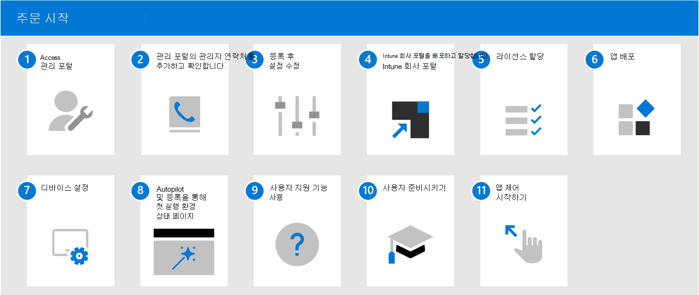

# Microsoft Managed Desktop 시작

등록할 준비가 되었습니다. [Microsoft Endpoint Manager](https://endpoint.microsoft.com/)를 열고 **테넌트 관리** 로 이동하세요. **Microsoft Managed Desktop** 하위 섹션에서 **테넌트 등록** 을 선택한 다음 마법사에 따라 Microsoft Managed Desktop에 테넌트를 등록합니다.

> [!NOTE]
> 등록을 완료하려면 전역 관리자로 로그인해야 합니다. 자세한 내용은 [관리 포털에 액세스](access-admin-portal.md)를 참조하세요.

등록을 완료한 후 아래 단계에 따라 서비스를 구성합니다. 이 단계를 수행하는 것이 좋습니다. 그러나 순서는 어느 정도 조정할 수 있습니다.

 

1. [관리 포털](access-admin-portal.md)에 액세스합니다.
1. [관리 포털의 관리자 연락처를 추가하고 확인합니다](add-admin-contacts.md).
1. [등록 후 설정을 조정합니다](conditional-access.md).
1. [Intune 회사 포털](company-portal.md)을 배포하고 할당합니다.
1. [라이선스를 할당합니다](assign-licenses.md).
1. [앱을 배포합니다](deploy-apps.md).
1. [디바이스를 설정합니다](set-up-devices.md).
1. [Autopilot 및 등록 상태 페이지의 첫 실행 환경](esp-first-run.md)을 설정합니다.
1. [사용자 지원 기능을 사용하도록 설정합니다](enable-support.md).
1. [사용자가 디바이스를 사용할 수 있도록 준비합니다](get-started-devices.md).
1. [앱 컨트롤을 시작합니다](get-started-app-control.md).