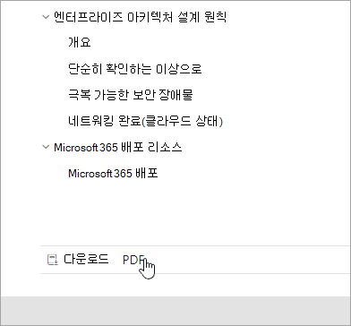
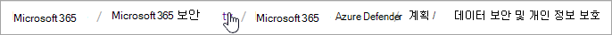

# Microsoft 365 설명서 탐색 가이드

이 항목에서는 기술 문서 공간의 주요 정보를 Microsoft 365 팁과 트릭을 제공합니다.  

## 허브 페이지

Microsoft 365 허브 페이지는 관련 콘텐츠 찾기를 위한 [https://aka.ms/microsoft365docs](./index.yml) 진입점 Microsoft 365 있습니다.

기술 설명서 집합 내의 모든 페이지 **맨 위에** 있는 머리 Microsoft 365 를 선택하여 항상 이 페이지로 Microsoft 365 있습니다.

## 오프라인 설명서

오프라인 시스템에서 Microsoft 365 설명서를 보시고자 하는 경우 기술 설명서의 어느 곳에나 PDF를 Microsoft 365 있습니다.

PDF를 만들 경우 모든 콘텐츠 테이블의 맨 아래에 있는 **PDF** 다운로드 링크를 선택합니다.

## TOC 검색 
이 docs.microsoft.com 맨 위에 있는 필터 검색 상자를 사용하여 콘텐츠 테이블의 콘텐츠를 검색할 수 있습니다.

## 버전 필터
기술 Microsoft 365 설명서는 독일 Office 365 21 Vianet(중국)에서 운영하는 Office 365 추가 제품에 대한 콘텐츠를 제공합니다. 기능은 이러한 버전마다 다를 수 있으며, 따라서 콘텐츠 자체가 다를 수 있습니다.

버전 필터를 사용하여 적절한 버전의 버전에 대한 콘텐츠가 표시되도록 할 수 Microsoft 365.

## 이동 경로

이동 경로는 머리글 아래와 콘텐츠 표 위에 있으며 현재 문서가 콘텐츠 표에 있는 위치를 나타냅니다.  이렇게 하면 컨텍스트를 읽는 콘텐츠의 유형으로 설정할 수 있습니다. 또한 콘텐츠 트리의 테이블을 백업할 수 있습니다.

## 문서 섹션 탐색

오른쪽 탐색 창을 사용하면 문서 내의 섹션으로 빠르게 이동하고 문서 내의 위치를 식별할 수 있습니다.  

## Docs 피드백 제출

문서 내에서 문제가 발견되는 경우 페이지 아래쪽으로 스크롤하여 SQL 피드백을 선택하여 해당 문서에 대한 SQL 팀에 피드백을 제출할 **수 있습니다.**

## 문서 Microsoft 365 기여

직접 콘텐츠를 편집할 수 docs.microsoft.com 있나요? 이렇게 하면 설명서가 개선될 뿐만 아니라 페이지에 기여한 크레딧도 제공됩니다. 시작을 위해 다음을 참조합니다.

- [Microsoft Docs 참가자 가이드](/contribute/)

## 다음 단계

- 기술 설명서를 Microsoft 365 [시작하세요.](index.yml)