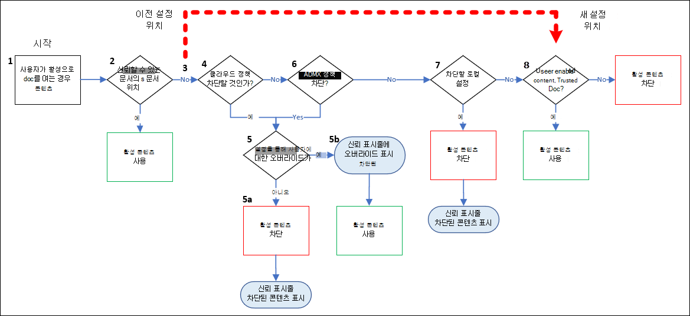

# 문서에서 활성 Office 관리

> [!NOTE]
> 이 문서에서 설명하는 기능은 미리 보기에 있으며 모든 사람이 사용할 수 있으며 변경될 수 있습니다.

Office 활성 콘텐츠가 포함된 문서를 자동으로 새로 고치거나 업데이트하거나 실행할 _수 있습니다._ 활성 콘텐츠의 예로는 매크로, ActiveX 및 추가 Office 있습니다. 활성 콘텐츠는 사용자에게 강력하고 유용한 기능을 제공할 수 있지만 공격자는 활성 콘텐츠를 사용하여 맬웨어를 전달할 수도 있습니다.

관리자는 활성 콘텐츠의 사용을 특정 사용자 집합으로 제한하거나 활성 콘텐츠를 완전히 사용하지 않도록 설정하는 조직 정책(그룹 정책 또는 클라우드 정책)을 만들 수 있습니다. 사용자는 파일 옵션 보안 센터의 Office 앱의 Office 보안 및 개인 정보  설정을 \> **구성할** \> **수 있습니다.**

이전에는 사용자가 문서를 신뢰할 수 있는 문서로 식별한 경우 관리자가 문서의 활성 콘텐츠를 차단하도록 정책을 구성한 경우에도 활성 콘텐츠가 실행될 Office 있습니다. 이제 관리자가 설정한 정책이 신뢰할 수 있는 문서의 사용자 식별보다 우선합니다. 이러한 동작 변경으로 인해 사용자에게 문제가 발생할 수 있습니다.

업데이트된 신뢰 센터 논리는 다음 다이어그램에 설명되어 있습니다.

1. 사용자가 활성 콘텐츠가 Office 문서를 여는 경우

2. 문서가 신뢰할 수 있는 위치에 있는 경우 활성 콘텐츠를 사용하도록 설정하여 문서가 열립니다. 문서가 신뢰할 수 있는 위치에 있지 않은 경우 평가가 계속됩니다.

3. 업데이트된 동작이 적용됩니다.
   - 이전에는 사용자가 이 문서를 신뢰할 수 있는 문서로 식별한 경우 다음으로 평가된 설정이 사용되었습니다. 활성화된 경우 문서는 활성 콘텐츠를 사용하도록 설정하여 열립니다.
   - 이제 사용자가 문서를 신뢰할 수 있는 문서로 식별하는지 여부는 여기에서 고려되지 않습니다(현재 8단계).

     이는 기본적으로 동작의 변화입니다. 즉, 신뢰할 수 있는 문서의 사용자 지정을 고려하기 전에  클라우드 정책(4단계), 그룹 정책(6단계) 및 로컬 설정(7단계)을 확인합니다. 이러한 단계 중 하나에서 활성  콘텐츠에 대한 액세스를 차단하고 사용자가 다시 설정하도록 허용하는 단계가 없는 경우 문서를 신뢰할 수 있는 문서로 식별하는 것은 기본적으로 관련이 없습니다.

4. 클라우드 정책은 이러한 유형의 활성 콘텐츠가 허용되거나 차단되는지 확인할 수 있습니다. 활성 콘텐츠가 차단되지 않은 경우 평가는 6단계를 계속 진행합니다.

   정책에 의해 활성 콘텐츠가 차단되는 경우 5단계에서 해당 환경을 설명합니다.

5. 문서 열기가 트러스트 표시줄에 알림으로 차단됩니다. 다음에 발생하는 문제는 사용자가 정책의 설정을 에 의해 제어합니다. a. **사용자 오버라이드 허용** 안 됩니다. 사용자가 문서를 열 수 없는 경우 평가가 중지됩니다.
   b. **사용자 다시 설정** 허용: 사용자는 트러스트 표시줄의 링크를 클릭하여 활성 콘텐츠가 활성화된 문서를 열 수 있습니다.

6. 이 유형의 활성 콘텐츠가 허용되거나 차단되는지 그룹 정책이 확인됩니다. 활성 콘텐츠가 차단되지 않은 경우 평가는 7단계를 계속 진행합니다.

   정책에 의해 활성 콘텐츠가 차단되는 경우 5단계에서 해당 환경을 설명합니다.

7. 로컬 설정을 검사하여 이러한 유형의 활성 콘텐츠가 허용되거나 차단되는지 확인합니다. 활성 콘텐츠가 차단된 경우 트러스트 표시줄에 알림이 표시되어 문서 열기가 차단됩니다. 활성 콘텐츠가 차단되지 않은 경우 평가가 계속됩니다.

8. 사용자가 이전에 문서를 신뢰할 수 있는 문서로 식별한 경우 활성 콘텐츠가 사용하도록 설정된 문서가 열립니다. 그렇지 않은 경우 문서 열기가 차단됩니다.

## 신뢰할 수 있는 문서란?

신뢰할 수 있는 Office 매크로, 컨트롤 및 기타 유형의 활성 콘텐츠에 대한 보안 ActiveX 열 수 있는 문서입니다. 보호된 보기 또는 Application Guard는 문서를 여는 데 사용되지 않습니다. 사용자가 신뢰할 수 있는 문서를 열면 모든 활성 콘텐츠가 사용하도록 설정됩니다.문서에 새 활성 콘텐츠 또는 기존 활성 콘텐츠 업데이트가 포함되어 있는 경우에도 다음에 문서를 열 때 보안 메시지가 사용자에게 제공되지 않습니다.

이러한 동작 때문에 사용자는 문서 원본을 신뢰할 때만 문서를 명확하게 신뢰해야 합니다.

관리자가 정책을 사용하여 활성 콘텐츠를 차단하거나 사용자가 활성 콘텐츠를 차단하는 신뢰 센터 설정을 설정한 경우 활성 콘텐츠는 차단된 상태로 유지됩니다.

자세한 내용은 다음 문서를 참조하세요.

- [신뢰할 수 있는 문서](https://support.microsoft.com/topic/trusted-documents-cf872bd8-47ec-4c02-baa5-1fdba1a11b53)
- [신뢰할 수 있는 위치 추가, 제거 또는 변경](https://support.microsoft.com/topic/add-remove-or-change-a-trusted-location-7ee1cdc2-483e-4cbb-bcb3-4e7c67147fb4)
- [파일의 활성 콘텐츠 형식](https://support.microsoft.com/topic/active-content-types-in-your-files-b7ff2e8a-4055-47d4-8c7d-541e19f62bea)

## 정책에서 신뢰할 수 있는 Office 설정 구성

관리자는 여러 가지 방법으로 조직에서 Office 구성할 수 있습니다. 예제:

- Office 클라우드 정책 **서비스:** Azure AD 계정으로 Office 앱의 파일에 액세스하는 모든 장치에서 사용자에게 적용되는 사용자 기반 정책을 설정합니다. 클라우드 정책 [서비스](/DeployOffice/overview-office-cloud-policy-service) 에서 Office 클라우드 정책 구성을 만드는 Office [단계를 참조하세요.](https://config.office.com/officeSettings/officePolicies)
- **Intune의** Office 정책: Intune 설정 카탈로그 또는 관리 템플릿을 사용하여 WINDOWS 10 PC에 HKCU 정책을 배포합니다. 장치 구성  프로필의 [MEM](https://endpoint.microsoft.com/#blade/Microsoft_Intune_DeviceSettings/DevicesMenu/configurationProfiles) 관리 \> 센터에서.
  - ***관리 템플릿:*** 관리 템플릿을 구성하기 위해 Windows 10 지침을 [참조하세요.](/mem/intune/configuration/administrative-templates-windows)
  - ***설정 카탈로그(미리 보기)***: 설정 [카탈로그(미리 보기)를 사용하는 지침을 참조하세요.](/mem/intune/configuration/settings-catalog)
- **그룹 정책:** 사내 Active Directory를 사용하여 사용자 및 컴퓨터에 GOS(그룹 정책 개체)를 배포합니다. 이 설정에 대한 GPO를 만들하려면 최신 관리 템플릿 [파일(ADMX/ADML)을](https://www.microsoft.com/download/details.aspx?id=49030)다운로드하고 Office, 엔터프라이즈용 Microsoft 365 앱, Office 2019 및 Office 2016용 사용자 지정 도구를 다운로드합니다.

## 활성 콘텐츠를 제한하기 위한 관리자 옵션

사용자가 인터넷에서 다운로드하는 콘텐츠와 내부에서 만든 콘텐츠의 신뢰 수준은 크게 차이가 있습니다. 내부 문서에서 활성 콘텐츠를 허용하고 인터넷에서 문서의 활성 콘텐츠를 전역적으로 허용하지 않는 것이 있습니다.

사용자에게 특정 유형의 활성 콘텐츠가 필요하지 않은 경우 가장 안전한 옵션은 정책을 사용하여 해당 활성 콘텐츠에 대한 사용자 액세스를 해제하고 필요한 경우 예외를 허용하는 것입니다.

사용할 수 있는 정책은 다음과 같습니다.

- **신뢰할 수 있는 위치 끄기:** 사용 가능한 그룹에 대한 예외.
- **신뢰할 수 있는 문서 끄기:** 사용 가능한 그룹에 대한 예외.
- **모든 활성 콘텐츠 끄기:** 개인에 대한 예외.

다음 섹션의 표에서는 활성 콘텐츠를 제어하는 설정에 대해 설명합니다. 이러한 정책은 사용자에게 적용될 경우 신뢰할 수 있는 문서에 적용되고 이전 최종 사용자 환경은 같지 않을 수 있습니다. 또한 표에는 권장 보안 기준 설정이 포함되어 있으며, 사용자가 활성 콘텐츠를 사용하도록 설정할 수 있도록 하는 사용자 확인 메시지를 사용할 수 있는 다른 설정을 식별합니다.

### HKEY_CURRENT_USER 설정

****
|범주|앱|정책 이름|보안 기준 설정(권장)|사용자 프롬프트를 사용하여 설정 사용 가능한지 여부|
|---|---|---|---|---|
|ActiveX|Office|ActiveX 컨트롤 초기화|**6**|**다음** 값에 대해 예: <ul><li>**3**</li><li>**4**</li><li>**5**</li><li>**6**</li></ul>|
|ActiveX|Office|양식에서 활성 X One Off 허용|**Outlook 컨트롤만 로드**|아니요|
|ActiveX|Office|개체 ActiveX 확인|보안 기준 설정이 아닌 경우|아니요|
|ActiveX|Office|모든 ActiveX 사용 안 함|보안 기준 설정이 아닌 경우|**다음** 값에 대해 예: <ul><li>**Disabled**</li><li>**구성되지 않음**</li></ul>|
|ActiveX|Office|Forms3에 컨트롤 로드|**1**|**다음** 값에 대해 예: <ul><li>**2**</li><li>**3**</li></ul>|
|추가 기능 & 수 있습니다.|Excel 
 PowerPoint 
 Project 
 게시자 
 Visio 
 Word|부호 없는 응용 프로그램 추가 기능의 신뢰 표시줄 알림을 사용하지 않도록 설정하고 차단|**Enabled**|**Disabled** 값의 경우 **예입니다.**|
|추가 기능 & 수 있습니다.|Excel 
 PowerPoint 
 Project 
 게시자 
 Visio 
 Word|응용 프로그램 추가 기능에 신뢰할 수 있는 게시자의 서명 필요|**Enabled**|아니요|
|추가 기능 & 수 있습니다.|Excel|자동 게시 경고 표시 안|**Disabled**|아니요|
|추가 기능 & 수 있습니다.|Excel|WEBSERVICE 함수 알림 설정|**모든 매크로 제외(알림 표시)**|**다음** 값에 대해 예: <ul><li>**모든 매크로 제외(알림 표시)**</li><li>**Disabled**</li><li>**구성되지 않음**</li></ul>|
|추가 기능 & 수 있습니다.|Office|Office 클라이언트가 SharePoint 서버에 게시된 링크를 폴링하지 않도록 설정|**Disabled**|아니요|
|추가 기능 & 수 있습니다.|Office|문서 및 서식 파일에서 확장되는 UI를 사용하지 않도록 설정|Word에서 비일관 = True 
 Project 불일치 = False 
 Excel 불일치 = True 
 Visio= False 
 PowerPoint 불일치 = True 
 Access에서 허용 안 끄기 = True 
 Outlook 불일치 = True 
 Publisher 불일치 = True 
 InfoPath에서 비일관 = True|아니요|
|추가 기능 & 수 있습니다.|Outlook|주소록에 액세스할 때 Outlook 개체 모델 확인 구성|**자동으로 거부**|**다음** 값에 대해 예: <ul><li>**사용자에게 확인**</li><li>**컴퓨터 보안에 따라 사용자에게 확인**</li><li>**Disabled**</li><li>**구성되지 않음**</li></ul>|
|추가 기능 & 수 있습니다.|Outlook|사용자 Outlook 개체 모델 프롬프트 구성 UserProperty 개체의 Formula 속성에 액세스할 때|**자동으로 거부**|**다음** 값에 대해 예: <ul><li>**사용자에게 확인**</li><li>**컴퓨터 보안에 따라 사용자에게 확인**</li><li>**Disabled**</li><li>**구성되지 않음**</li></ul>|
|추가 기능 & 수 있습니다.|Outlook|다른 이름으로 저장을 실행할 때 Outlook 개체 모델 확인 구성|**자동으로 거부**|**다음** 값에 대해 예: <ul><li>**사용자에게 확인**</li><li>**컴퓨터 보안에 따라 사용자에게 확인**</li><li>**Disabled**</li><li>**구성되지 않음**</li></ul>|
|추가 기능 & 수 있습니다.|Outlook|주소 정보를 읽을 때 Outlook 개체 모델 확인 구성|**자동으로 거부**|**다음** 값에 대해 예: <ul><li>**사용자에게 확인**</li><li>**컴퓨터 보안에 따라 사용자에게 확인**</li><li>**Disabled**</li><li>**구성되지 않음**</li></ul>|
|추가 기능 & 수 있습니다.|Outlook|모임 및 작업 요청에 응답할 때 Outlook 개체 모델 확인 구성|**자동으로 거부**|**다음** 값에 대해 예: <ul><li>**사용자에게 확인**</li><li>**컴퓨터 보안에 따라 사용자에게 확인**</li><li>**Disabled**</li><li>**구성되지 않음**</li></ul>|
|추가 기능 & 수 있습니다.|Outlook|메일을 보낼 때 Outlook 개체 모델 확인 구성|**자동으로 거부**|**다음** 값에 대해 예: <ul><li>**사용자에게 확인**</li><li>**컴퓨터 보안에 따라 사용자에게 확인**</li><li>**Disabled**</li><li>**구성되지 않음**</li></ul>|
|추가 기능 & 수 있습니다.|Outlook|개체 Outlook 사용자 지정 동작 실행 프롬프트 설정|**자동으로 거부**|**다음** 값에 대해 예: <ul><li>**사용자에게 확인**</li><li>**컴퓨터 보안에 따라 사용자에게 확인**</li><li>**Disabled**</li><li>**구성되지 않음**</li></ul>|
|추가 기능 & 수 있습니다.|PowerPoint|프로그램 실행|**사용 안 하게(프로그램을 실행하지 않습니다)**|**사용** 값에 대해 **예(실행하기 전에 사용자에게 메시지 표시)**|
|추가 기능 & 수 있습니다.|Word 
 Excel|스마트 문서의 매니페스트 사용 안|**Enabled**|아니요|
|DDE|Excel|DDE(Dynamic Data Exchange) 서버 시작을 허용하지 Excel|**Enabled**|**예(** 구성되지 않은 **값)**|
|DDE|Excel|DDE(Dynamic Data Exchange) 서버 Excel|**Enabled**|**다음** 값에 대해 예: <ul><li>**Disabled**</li><li>**구성되지 않음**</li></ul>|
|DDE|Word|동적 데이터 Exchange|**Disabled**|아니요|
|Jscript & VBScript|Outlook|일회용 Outlook 양식에 스크립트 허용|**Disabled**|아니요|
|Jscript & VBScript|Outlook|공용 폴더에 Outlook 개체 모델 스크립트 실행을 허용하지 않습니다.|**Enabled**|아니요|
|Jscript & VBScript|Outlook|공유 폴더에 Outlook 개체 모델 스크립트 실행을 허용하지 않습니다.|**Enabled**|아니요|
|매크로|Access 
 Excel 
 PowerPoint 
 Project 
 게시자 
 Visio 
 Word|VBA 매크로 알림 설정|**디지털 서명된 매크로를 제외한 모든 사용 안 하게 설정** 
 및 
 **신뢰할 수 있는 게시자가 매크로에 서명해야 합니다.**|**다음** 값에 대해 예: <ul><li>**Disabled**</li><li>**구성되지 않음**</li></ul>|
|매크로|Access 
 Excel 
 PowerPoint 
 Visio 
 Word|매크로가 인터넷에서 Office 실행되지 않습니다.|**Enabled**|**다음** 값에 대해 예: <ul><li>**Disabled**</li><li>**구성되지 않음**</li></ul>|
|매크로|Excel|Open XML 통합 Excel 암호화된 매크로 검색|**암호화된 매크로 검사(기본값)**|아니요|
|매크로|Office|VBA가 트러스트되지 않은 인트라넷 위치의 경로에 따라 형식 참조를 로드하도록 허용|**Disabled**|아니요|
|매크로|Office|자동화 보안|**응용 프로그램 매크로 보안 수준 사용**|아니요|
|매크로|Office|로컬 컴퓨터의 안전하지 않은 위치를 참조할 수 있는 VBA 라이브러리 참조에 대한 추가 보안 검사를 사용하지 않도록 설정|**Disabled**|아니요|
|매크로|Office|매크로 런타임 검사 범위|**모든 문서에 사용**|아니요|
|매크로|Office|V3 서명을 사용하는 VBA 매크로만 신뢰|보안 기준 설정이 아닌 경우|아니요|
|매크로|Outlook|Outlook 보안 모드|**보안 Outlook 정책 사용**|모든 GPO 설정을 사용하도록 Outlook 필요합니다. 
 종속성으로 언급됩니다(이 정책은 활성 콘텐츠 자체를 차단하지 않습니다).|
|매크로|Outlook|매크로에 대한 보안 설정|**서명된 경고, 서명되지 않은 해제**|**다음** 값에 대해 예: <ul><li>**항상 경고**</li><li>**서명된 경고, 서명되지 않은 해제**</li><li>**Disabled**</li><li>**구성되지 않음**</li></ul>|
|매크로|PowerPoint|Open XML 프레젠테이션에서 PowerPoint 매크로 검색|**암호화된 매크로 검사(기본값)**|아니요|
|매크로|게시자|Publisher 자동화 보안 수준|**UI 기준(메시지 표시)**|아니요|
|매크로|Word|Word Open XML 문서에서 암호화된 매크로 검사|**암호화된 매크로 검사(기본값)**|아니요|
|

### HKEY_LOCAL_MACHINE 설정

****
|범주|앱|정책 이름|보안 기준 설정(권장)|사용자 프롬프트를 사용하여 설정 사용 가능한지 여부|
|---|---|---|---|---|
|ActiveX|Office|ActiveX 설치 제한 |excel.exe = True 
 exprwd.exe = True 
 groove.exe = True 
 msaccess.exe = True 
 mse7.exe = True 
 mspub.exe = True 
 onent.exe = True 
 outlook.exe = True 
 powerpnt.exe = True 
 pptview.exe = True 
 spDesign.exe = True 
 visio.exe = True 
 winproj.exe = True 
 winword.exe = True|아니요|
|추가 기능 & 수 있습니다.|Office|추가 기능 관리 |excel.exe = True 
 exprwd.exe = True 
 groove.exe = True 
 msaccess.exe = True 
 mse7.exe = True 
 mspub.exe = True 
 onent.exe = True 
 outlook.exe = True 
 powerpnt.exe = True 
 pptview.exe = True 
 spDesign.exe = True 
 visio.exe = True 
 winproj.exe = True 
 winword.exe = True|아니요|
|추가 기능 & 수 있습니다.|Office|문서에서 플래시 Office 차단|COM killbits 목록은 Microsoft 보안 가이드 ADMX/ADML 파일을 참조하여 앱의 모든 Flash 정품 인증을 Microsoft 365 참조하세요. 엔터프라이즈 보안 기준에 대한 ADMX/ADML 파일은 Security [Compliance Toolkit.](https://www.microsoft.com/download/details.aspx?id=55319)|아니요|
|Jscript & VBScript|Office|사용자에 대해 레거시 JScript 실행을 Office|**사용 :** 
 액세스: 69632 
 Excel: 69632 
 OneNote: 69632 
 Outlook: 69632 
 PowerPoint: 69632 
 Project: 69632 
 Publisher: 69632 
 Visio: 69632 
 Word: 69632|아니요|
|Jscript & VBScript|Office|스크립트된 창 보안 제한 |excel.exe = True 
 exprwd.exe = True 
 groove.exe = True 
 msaccess.exe = True 
 mse7.exe = True 
 mspub.exe = True 
 onent.exe = True 
 outlook.exe = True 
 powerpnt.exe = True 
 pptview.exe = True 
 spDesign.exe = True 
 visio.exe = True 
 winproj.exe = True 
 winword.exe = True|아니요|
|
