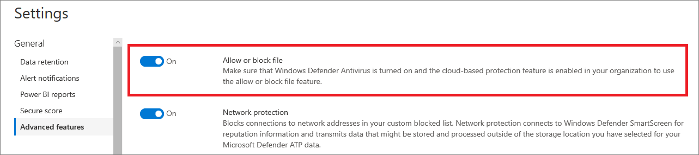

# 끝점용 Defender의 고급 기능 구성Configure advanced features in Defender for Endpoint

**적용 대상:****Applies to:**
- [엔드포인트용 Microsoft DefenderMicrosoft Defender for Endpoint](https://go.microsoft.com/fwlink/p/?linkid=2154037)
- [Microsoft 365 DefenderMicrosoft 365 Defender](https://go.microsoft.com/fwlink/?linkid=2118804)

[!INCLUDE [Microsoft 365 Defender rebranding](../../includes/microsoft-defender.md)]

> Endpoint용 Defender를 경험하고 싶나요?Want to experience Defender for Endpoint? [무료 평가판에 등록합니다.Sign up for a free trial.](https://www.microsoft.com/microsoft-365/windows/microsoft-defender-atp?ocid=docs-wdatp-advancedfeats-abovefoldlink)

사용하는 Microsoft 보안 제품에 따라 일부 고급 기능을 사용하여 Endpoint용 Defender를 통합할 수 있습니다.Depending on the Microsoft security products that you use, some advanced features might be available for you to integrate Defender for Endpoint with.

## 고급 기능 사용Enable advanced features

1. 탐색 창에서 기본 **설정** 고급 기능  >  **을 선택합니다.**In the navigation pane, select **Preferences setup** > **Advanced features**.
2. 구성할 고급 기능을 선택하고 설정 및 해제  간에 설정을 **전환합니다.**Select the advanced feature you want to configure and toggle the setting between **On** and **Off**.
3. 기본 **설정 저장을 클릭합니다.**Click **Save preferences**.

다음 고급 기능을 사용하여 잠재적으로 악의적인 파일로부터 더 잘 보호하고 보안 조사 중에 더 나은 통찰력을 얻습니다.Use the following advanced features to get better protected from potentially malicious files and gain better insight during security investigations.

## 자동화된 조사Automated investigation

이 기능을 켜서 서비스의 자동화된 조사 및 수정 기능을 활용합니다.Turn on this feature to take advantage of the automated investigation and remediation features of the service. 자세한 내용은 자동화된 [조사를 참조하세요.](automated-investigations.md)For more information, see [Automated investigation](automated-investigations.md).

## 라이브 응답Live response

적절한 권한이 있는 사용자가 디바이스에서 라이브 응답 세션을 시작할 수 있도록 이 기능을 켜야 합니다.Turn on this feature so that users with the appropriate permissions can start a live response session on devices.

역할 할당에 대한 자세한 내용은 역할 만들기 [및 관리를 참조하세요.](user-roles.md)For more information about role assignments, see [Create and manage roles](user-roles.md).

## 서버에 대한 실시간 응답Live response for servers
적절한 사용 권한이 있는 사용자가 서버에서 라이브 응답 세션을 시작할 수 있도록 이 기능을 켜야 합니다.Turn on this feature so that users with the appropriate permissions can start a live response session on servers.

역할 할당에 대한 자세한 내용은 역할 만들기 [및 관리를 참조하세요.](user-roles.md)For more information about role assignments, see [Create and manage roles](user-roles.md).

## 라이브 응답 부호 없는 스크립트 실행Live response unsigned script execution

이 기능을 사용하도록 설정하면 라이브 응답 세션에서 부호 없는 스크립트를 실행할 수 있습니다.Enabling this feature allows you to run unsigned scripts in a live response session.

## 항상 PUA 재구성Always remediate PUA
PUA(잠재적으로 원치 않는 응용 프로그램)는 컴퓨터의 실행 속도가 느려지거나 예기치 않은 광고를 표시하거나, 최악의 경우 예기치 않게 또는 원치 않는 다른 소프트웨어를 설치할 수 있는 소프트웨어 범주입니다.Potentially unwanted applications (PUA) are a category of software that can cause your machine to run slowly, display unexpected ads, or at worst, install other software which might be unexpected or unwanted. 

장치에 PUA 보호가 구성되어 있지 않은 경우에도 잠재적으로 원치 않는 응용 프로그램(PUA)이 테넌트의 모든 디바이스에서 수정될 수 있도록 이 기능을 켜야 합니다.Turn on this feature so that potentially unwanted applications (PUA) are remediated on all devices in your tenant even if PUA protection is not configured on the devices. 이렇게 하면 사용자가 장치에 원치 않는 응용 프로그램을 설치하지 못하도록 보호할 수 있습니다.This will help protect users from inadvertently installing unwanted applications on their device. 끄면 장치 구성에 따라 수정이 달라집니다.When turned off, remediation is dependent on the device configuration. 

## 범위가 지정되는 장치 그룹 내에서 상관 관계 제한Restrict correlation to within scoped device groups
이 구성은 로컬 SOC 작업에서 경고 상관 관계만 액세스할 수 있는 장치 그룹으로 제한하는 시나리오에 사용할 수 있습니다.This configuration can be used for scenarios where local SOC operations would like to limit alert correlations only to device groups that they can access. 이 설정을 켜면 장치 그룹 간 경고로 구성된 인시던트는 더 이상 단일 인시던트로 간주되지 않습니다.By turning this setting on, an incident composed of alerts that cross device groups will no longer be considered a single incident. 그러면 로컬 SOC가 관련된 장치 그룹 중 하나에 액세스할 수 있으므로 인시던트에 대해 조치를 취할 수 있습니다.The local SOC can then take action on the incident because they have access to one of the device groups involved. 그러나 전역 SOC는 하나의 인시던트가 아닌 장치 그룹으로 여러 가지 다른 인시던트가 표시됩니다.However, global SOC will see several different incidents by device group instead of one incident. 이 설정은 전체 조직에서 인시던트 상관 관계의 이점을 중시하지 않는 한 켜지 않는 것이 좋습니다.We do not recommend turning this setting on unless doing so outweighs the benefits of incident correlation across the entire organization
>[!NOTE]
>이 설정을 변경하면 향후 경고 상관 관계에만 영향을 미치게 됩니다.Changing this setting impacts future alert correlations only.

## 차단 EDR 사용Enable EDR in block mode
차단 모드의 끝점 감지 및 응답(EDR)은 수동 모드에서 실행되는 경우에도 Microsoft Defender 바이러스 백신 아티팩트로부터 보호합니다.Endpoint detection and response (EDR) in block mode provides protection from malicious artifacts, even when Microsoft Defender Antivirus is running in passive mode. 이 기능을 EDR 차단 모드에서는 디바이스에서 감지되는 악의적인 아티팩트 또는 동작을 차단합니다.When turned on, EDR in block mode blocks malicious artifacts or behaviors that are detected on a device. EDR 차단 모드에서는 장면 뒤에서 작동하여 위반 후 감지된 악성 아티팩트를 수정합니다.EDR in block mode works behind the scenes to remediate malicious artifacts that are detected post breach.

## 수정된 경고 자동 해결Autoresolve remediated alerts

Windows 10 버전 1809 이상에서 만들어진 테넌트의 경우 자동화된 분석 결과 상태가 "위협 없음" 또는 "수정"인 경고를 해결하도록 기본적으로 자동화된 조사 및 수정 기능이 구성됩니다.For tenants created on or after Windows 10, version 1809, the automated investigation and remediation capability is configured by default to resolve alerts where the automated analysis result status is "No threats found" or "Remediated".  경고를 자동으로 해결하지 못하게 하려는 경우 기능을 수동으로 해제해야 합니다.If you don't want to have alerts auto-resolved, you'll need to manually turn off the feature.

> [!TIP]
> 해당 버전 이전에 만든 테넌트의 경우 고급 기능 페이지에서 이 기능을 수동으로 [켜야](https://securitycenter.windows.com/preferences2/integration) 합니다.For tenants created prior to that version, you'll need to manually turn this feature on from the [Advanced features](https://securitycenter.windows.com/preferences2/integration) page.

> [!NOTE]
>
> - 자동 해결 작업의 결과는 장치에서 발견된 활성 경고를 기반으로 하는 장치 위험 수준 계산에 영향을 줄 수 있습니다.The result of the auto-resolve action may influence the Device risk level calculation which is based on the active alerts found on a device.
> - 보안 운영 분석가가 경고의 상태를 수동으로 "진행 중" 또는 "해결"으로 설정하면 자동 확인 기능이 덮어지지 않습니다.If a security operations analyst manually sets the status of an alert to "In progress" or "Resolved" the auto-resolve capability will not overwrite it.

## 파일 허용 또는 차단Allow or block file

차단은 조직에서 다음 요구 사항을 충족하는 경우만 사용할 수 있습니다.Blocking is only available if your organization fulfills these requirements:

- 활성 Microsoft Defender 바이러스 백신 맬웨어 방지 솔루션으로 사용Uses Microsoft Defender Antivirus as the active antimalware solution and,
- 클라우드 기반 보호 기능이 사용하도록 설정되어 있습니다.The cloud-based protection feature is enabled

이 기능을 사용하면 네트워크에서 잠재적으로 악의적인 파일을 차단할 수 있습니다.This feature enables you to block potentially malicious files in your network. 파일을 차단하면 조직의 장치에서 파일을 읽거나 쓰거나 실행할 수 없습니다.Blocking a file will prevent it from being read, written, or executed on devices in your organization.

파일 허용 **또는 차단을** 설정하려면To turn **Allow or block** files on:

1. 탐색 창에서 고급 **기능 설정**  >    >  **허용 또는 차단 을 선택합니다.**In the navigation pane, select **Settings** > **Advanced features** > **Allow or block file**.

1. 설정과 끄기 **간에 설정을** **전환합니다.**Toggle the setting between **On** and **Off**.

    

1. 페이지 **아래쪽의** 기본 설정 저장을 선택합니다.Select **Save preferences** at the bottom of the page.

이 기능을 켜면 파일  프로필 페이지의  표시기 추가 탭을 통해 파일을 차단할 수 있습니다.After turning on this feature, you can [block files](respond-file-alerts.md#allow-or-block-file) via the **Add Indicator** tab on a file's profile page.

## 사용자 지정 네트워크 표시기Custom network indicators

이 기능을 켜면 IP 주소, 도메인 또는 URL에 대한 표시기를 만들어 사용자 지정 표시기 목록에 따라 허용 또는 차단할지 여부를 결정할 수 있습니다.Turning on this feature allows you to create indicators for IP addresses, domains, or URLs, which determine whether they will be allowed or blocked based on your custom indicator list.

이 기능을 사용하려면 장치가 버전 1709 이상에서 Windows 10 실행되고 있어야 합니다.To use this feature, devices must be running Windows 10 version 1709 or later. 또한 맬웨어 방지 플랫폼의 차단 모드 및 버전 4.18.1906.3 이상에서도 네트워크 보호 기능을 사용할 수 [있습니다. KB 4052623을](https://go.microsoft.com/fwlink/?linkid=2099834)참조하세요.They should also have network protection in block mode and version 4.18.1906.3 or later of the antimalware platform [see KB 4052623](https://go.microsoft.com/fwlink/?linkid=2099834).

자세한 내용은 [지표 관리를 참조하세요.](manage-indicators.md)For more information, see [Manage indicators](manage-indicators.md).

> [!NOTE]
> 네트워크 보호는 끝점 데이터용 Defender에 대해 선택한 위치 밖에 있을 수 있는 위치에서 요청을 처리하는 신뢰도 서비스를 활용합니다.Network protection leverages reputation services that process requests in locations that might be outside of the location you have selected for your Defender for Endpoint data.

## 변조 방지Tamper protection
일부 종류의 사이버 공격 중에 악의적인 공격자는 컴퓨터의 바이러스 백신 보호와 같은 보안 기능을 사용하지 않도록 설정하려고 합니다.During some kinds of cyber attacks, bad actors try to disable security features, such as anti-virus protection, on your machines. 악의적인 공격자들은 데이터에 더 쉽게 액세스하거나, 맬웨어를 설치하거나, 데이터, ID 및 장치를 악용하기 위해 보안 기능을 사용하지 않도록 설정하는 것을 좋아합니다.Bad actors like to disable your security features to get easier access to your data, to install malware, or to otherwise exploit your data, identity, and devices.

변조 방지는 기본적으로 Microsoft Defender 바이러스 백신 앱 및 방법을 통해 보안 설정이 변경되지 않도록 합니다.Tamper protection essentially locks Microsoft Defender Antivirus and prevents your security settings from being changed through apps and methods.

이 기능은 조직에서 클라우드 기반 보호를 Microsoft Defender 바이러스 백신 경우 사용할 수 있습니다.This feature is available if your organization uses Microsoft Defender Antivirus and Cloud-based protection is enabled. 자세한 내용은 클라우드 제공 보호를 통해 Microsoft Defender 바이러스 백신 [차세대 기술 사용을 참조하세요.](cloud-protection-microsoft-defender-antivirus.md)For more information, see [Use next-generation technologies in Microsoft Defender Antivirus through cloud-delivered protection](cloud-protection-microsoft-defender-antivirus.md).

변조 방지 기능을 설정하여 보안 솔루션 및 해당 필수 기능에 대한 원치 않는 변경을 방지합니다.Keep tamper protection turned on to prevent unwanted changes to your security solution and its essential features.

## 사용자 세부 정보 표시Show user details

이 기능을 켜서 사용자 세부 정보를 볼 수 있도록 Azure Active Directory.Turn on this feature so that you can see user details stored in Azure Active Directory. 세부 정보에는 사용자 계정 엔터티를 조사할 때 사용자의 사진, 이름, 직위 및 부서 정보가 포함됩니다.Details include a user's picture, name, title, and department information  when investigating user account entities. 다음 보기에서 사용자 계정 정보를 찾을 수 있습니다.You can find user account information in the following views:

- 보안 운영 대시보드Security operations dashboard
- 경고 큐Alert queue
- 장치 세부 정보 페이지Device details page

자세한 내용은 사용자 계정 [조사를 참조하세요.](investigate-user.md)For more information, see [Investigate a user account](investigate-user.md).

## 비즈니스용 Skype 통합Skype for Business integration

비즈니스용 Skype 통합을 사용하도록 설정하면 사용자와 통신할 수 있는 비즈니스용 Skype, 전자 메일 또는 휴대폰을 사용할 수 있습니다.Enabling the Skype for Business integration gives you the ability to communicate with users using Skype for Business, email, or phone. 이는 사용자와 통신하고 위험을 완화해야 하는 경우 도움이 될 수 있습니다.This can be handy when you need to communicate with the user and mitigate risks.

> [!NOTE]
> 장치가 네트워크에서 격리되는 경우 네트워크에서 연결이 끊어진 동안 사용자에게 통신을 허용하는 Outlook 및 Skype 통신을 사용하도록 선택할 수 있는 팝업이 있습니다.When a device is being isolated from the network, there's a pop-up where you can choose to enable Outlook and Skype communications which allows communications to the user while they are disconnected from the network. 이 설정은 장치가 Skype Outlook 통신에 적용됩니다.This setting applies to Skype and Outlook communication when devices are in isolation mode.

## Microsoft Defender for Identity 통합Microsoft Defender for Identity integration

Id에 대한 Microsoft Defender와의 통합을 통해 다른 Microsoft Id 보안 제품으로 직접 피벗할 수 있습니다.The integration with Microsoft Defender for Identity allows you to pivot directly into another Microsoft Identity security product. Microsoft Defender for Identity는 손상된 계정 및 관련 리소스로 의심되는 추가 정보로 조사를 보강합니다.Microsoft Defender for Identity augments an investigation with additional insights about a suspected compromised account and related resources. 이 기능을 사용하도록 설정하면 식별 시점에서 네트워크를 통해 피벗하여 장치 기반 조사 기능을 향상할 수 있습니다.By enabling this feature, you'll enrich the device-based investigation capability by pivoting across the network from an identify point of view.

> [!NOTE]
> 이 기능을 사용하려면 적절한 라이선스가 필요합니다.You'll need to have the appropriate license to enable this feature.

## Office 365 위협 인텔리전스 연결Office 365 Threat Intelligence connection

이 기능은 E5 또는 위협 인텔리전스 추가 Office 365 활성화된 경우만 사용할 수 있습니다.This feature is only available if you have an active Office 365 E5 or the Threat Intelligence add-on. 자세한 내용은 E5 제품 Office 365 Enterprise 참조하세요.For more information, see the Office 365 Enterprise E5 product page.

이 기능을 켜면 Microsoft Defender의 데이터를 통합하여 Office 365 Microsoft Defender 보안 센터 사서함 및 Microsoft Defender 보안 센터 장치 전반에 걸쳐 Office 365 보안 조사를 Windows 있습니다.When you turn this feature on, you'll be able to incorporate data from Microsoft Defender for Office 365 into Microsoft Defender Security Center to conduct a comprehensive security investigation across Office 365 mailboxes and Windows devices.

> [!NOTE]
> 이 기능을 사용하려면 적절한 라이선스가 필요합니다.You'll need to have the appropriate license to enable this feature.

위협 인텔리전스에서 상황 Office 365 통합을 받으하려면 보안 및 준수 대시보드에서 끝점에 대한 Defender 설정을 & 합니다.To receive contextual device integration in Office 365 Threat Intelligence, you'll need to enable the Defender for Endpoint settings in the Security & Compliance dashboard. 자세한 내용은 위협 조사 및 [응답을 참조하세요.](/microsoft-365/security/office-365-security/office-365-ti)For more information, see [Threat investigation and response](/microsoft-365/security/office-365-security/office-365-ti).

## Microsoft 위협 전문가 - 대상 공격 알림Microsoft Threat Experts - Targeted Attack Notifications

Microsoft Threat Expert 구성 요소 2개 중 대상 공격 알림은 일반 공급 중입니다.Out of the two Microsoft Threat Expert components, targeted attack notification is in general availability. 전문가 요구 시 기능은 여전히 미리 보기 상태입니다.Experts-on-demand capability is still in preview. 미리 보기를 신청하고 응용 프로그램이 승인된 경우 전문가 요구 시 기능만 사용할 수 있습니다.You can only use the experts-on-demand capability if you have applied for preview and your application has been approved. 끝점 포털의 경고 대시보드를 Microsoft 위협 전문가 및 구성하는 경우 전자 메일을 통해 대상 공격 알림을 받을 수 있습니다.You can receive targeted attack notifications from Microsoft Threat Experts through your Defender for Endpoint portal's alerts dashboard and via email if you configure it.

> [!NOTE]
> Defender for endpoint의 Microsoft 위협 전문가 기능은 에 대한 E5 라이선스로 사용할 [Enterprise Mobility + Security.](https://www.microsoft.com/cloud-platform/enterprise-mobility-security)The Microsoft Threat Experts capability in Defender for Endpoint is available with an E5 license for [Enterprise Mobility + Security](https://www.microsoft.com/cloud-platform/enterprise-mobility-security).
## Microsoft Cloud App SecurityMicrosoft Cloud App Security

이 설정을 사용하도록 설정하면 끝점용 Defender 신호가 클라우드 응용 Microsoft Cloud App Security 더 심층적으로 표시될 수 있습니다.Enabling this setting forwards Defender for Endpoint signals to Microsoft Cloud App Security to provide deeper visibility into cloud application usage. 전달된 데이터는 사용자 데이터와 동일한 위치에 저장되고 Cloud App Security 처리됩니다.Forwarded data is stored and processed in the same location as your Cloud App Security data.

> [!NOTE]
> 이 기능은 Enterprise Mobility + Security 버전 1709(Windows 10 OS 빌드 16299.1085(KB4493441의 OS 빌드 16299.1085)에서 Windows 10. 버전 1803(OS 빌드 17134.704 [및 KB4493464](https://support.microsoft.com/help/4493464)), Windows 10, 버전 1809(OS 빌드 17763.379 및 [KB4489899)](https://support.microsoft.com/help/4489899)이상 Windows 10 버전.  This feature will be available with an E5 license for [Enterprise Mobility + Security](https://www.microsoft.com/cloud-platform/enterprise-mobility-security) on devices running Windows 10, version 1709 (OS Build 16299.1085 with [KB4493441](https://support.microsoft.com/help/4493441)), Windows 10, version 1803 (OS Build 17134.704 with [KB4493464](https://support.microsoft.com/help/4493464)), Windows 10, version 1809 (OS Build 17763.379 with [KB4489899](https://support.microsoft.com/help/4489899)), or later Windows 10 versions.

## Microsoft 보안 점수Microsoft Secure Score

Microsoft Defender for Endpoint 신호를 보안 센터의 Microsoft 보안 점수로 Microsoft 365 전달합니다.Forwards Microsoft Defender for Endpoint signals to Microsoft Secure Score in the Microsoft 365 security center. 이 기능을 켜면 Microsoft 보안 점수가 장치의 보안 상태와 관련한 가시성을 확보할 수 있습니다.Turning on this feature gives Microsoft Secure Score visibility into the device's security posture. 전달된 데이터는 Microsoft 보안 점수 데이터와 동일한 위치에 저장되고 처리됩니다.Forwarded data is stored and processed in the same location as your Microsoft Secure Score data.

### Microsoft Defender for Identity 포털에서 끝점에 대한 Microsoft Defender 통합 사용Enable the Microsoft Defender for Endpoint integration from the Microsoft Defender for Identity portal

Id에 대한 Microsoft Defender에서 상황에 맞는 장치 통합을 받으기 위해 Microsoft Defender for Identity 포털에서 기능을 사용하도록 설정해야 합니다.To receive contextual device integration in Microsoft Defender for Identity, you'll also need to enable the feature in the Microsoft Defender for Identity portal.

1. 전역 관리자 또는 보안 관리자 역할로 ID 포털에 Microsoft [Defender에](https://portal.atp.azure.com/) 로그인합니다.Log in to the [Microsoft Defender for Identity portal](https://portal.atp.azure.com/) with a Global Administrator or Security Administrator role.

2. 인스턴스 **만들기 를 클릭합니다.**Click **Create your instance**.

3. 통합 설정을 **으로 전환하고** 저장을 **클릭합니다.**Toggle the Integration setting to **On** and click **Save**.

두 포털에서 통합 단계를 완료한 후 장치 세부 정보 또는 사용자 세부 정보 페이지에서 관련 알림을 볼 수 있습니다.After completing the integration steps on both portals, you'll be able to see relevant alerts in the device details or user details page.

## 웹 컨텐츠 필터링Web content filtering
원치 않는 콘텐츠가 포함된 웹 사이트에 대한 액세스를 차단하고 모든 도메인에서 웹 활동을 추적합니다.Block access to websites containing unwanted content and track web activity across all domains. 차단할 웹 콘텐츠 범주를 지정하려는 경우 웹 콘텐츠 필터링 [정책을 만들어야 합니다.](https://security.microsoft.com/preferences2/web_content_filtering_policy)To specify the web content categories you want to block, create a [web content filtering policy](https://security.microsoft.com/preferences2/web_content_filtering_policy). 끝점용 Microsoft Defender 보안 기준을 배포할 때 네트워크 보호가 차단 [모드로 설정되도록 합니다.](https://devicemanagement.microsoft.com/#blade/Microsoft_Intune_Workflows/SecurityBaselineSummaryMenu/overview/templateType/2)Ensure you have network protection in block mode when deploying the [Microsoft Defender for Endpoint security baseline](https://devicemanagement.microsoft.com/#blade/Microsoft_Intune_Workflows/SecurityBaselineSummaryMenu/overview/templateType/2).

## Microsoft 준수 센터와 끝점 경고 공유Share endpoint alerts with Microsoft Compliance Center
끝점 보안 경고 및 해당 평가 상태를 Microsoft 규정 준수 센터에 전달하여 경고를 통해 내부자 위험 관리 정책을 향상하고 내부 위험을 발생시키는 위험을 해결한 후 손상을 일으킬 수 있습니다.Forwards endpoint security alerts and their triage status to Microsoft Compliance Center, allowing you to enhance insider risk management policies with alerts and remediate internal risks before they cause harm. 전달된 데이터는 처리되고 사용자 데이터와 동일한 위치에 Office 365 저장됩니다.Forwarded data is processed and stored in the same location as your Office 365 data.

내부자 위험  관리 설정에서 보안 정책 위반 표시기를 구성한 후 끝점용 Defender 경고는 해당 사용자의 내부자 위험 관리와 공유됩니다.After configuring the [Security policy violation indicators](/microsoft-365/compliance/insider-risk-management-settings#indicators) in the insider risk management settings, Defender for Endpoint alerts will be shared with insider risk management for applicable users.

## Microsoft Intune 연결Microsoft Intune connection

장치 위험 기반 [조건부 액세스를](/intune/what-is-intune) Microsoft Intune 끝점용 [Defender를](/intune/advanced-threat-protection#enable-windows-defender-atp-in-intune)통합할 수 있습니다.Defender for Endpoint can be integrated with [Microsoft Intune](/intune/what-is-intune) to [enable device risk-based conditional access](/intune/advanced-threat-protection#enable-windows-defender-atp-in-intune). 이 [기능을 켜면](configure-conditional-access.md)끝점 장치 정보에 대한 Defender를 Intune과 공유하여 정책 적용을 강화할 수 있습니다.When you [turn on this feature](configure-conditional-access.md), you'll be able to share Defender for Endpoint device information with Intune, enhancing policy enforcement.

> [!IMPORTANT]
> 이 기능을 사용하려면 Intune 및 Endpoint용 Defender에서 통합을 사용하도록 설정해야 합니다.You'll need to enable the integration on both Intune and Defender for Endpoint to use this feature. 특정 단계에 대한 자세한 내용은 [Configure Conditional Access in Defender for Endpoint을 참조하세요.](configure-conditional-access.md)For more information on specific steps, see [Configure Conditional Access in Defender for Endpoint](configure-conditional-access.md).

이 기능은 다음이 있는 경우만 사용할 수 있습니다.This feature is only available if you have the following:

- E5 및 Enterprise Mobility + Security E3 및 Windows E5용 Microsoft 365 Enterprise 테넌트A licensed tenant for Enterprise Mobility + Security E3, and Windows E5 (or Microsoft 365 Enterprise E5)
- Intune에서 관리하는 Microsoft Intune Azure AD에 가입된 장치를 Windows 10 활성 상태 [환경.](/azure/active-directory/devices/concept-azure-ad-join/)An active Microsoft Intune environment, with Intune-managed Windows 10 devices [Azure AD-joined](/azure/active-directory/devices/concept-azure-ad-join/).

### 조건부 액세스 정책Conditional Access policy

Intune 통합을 사용하도록 설정하면 Intune에서 클래식 CA(조건부 액세스) 정책을 자동으로 생성합니다.When you enable Intune integration, Intune will automatically create a classic Conditional Access (CA) policy. 이 클래식 CA 정책은 상황 보고서를 Intune으로 설정하기 위한 전제입니다.This classic CA policy is a prerequisite for setting up status reports to Intune. 삭제하면 안 됩니다.It should not be deleted.

> [!NOTE]
> Intune에서 만든 클래식 CA 정책은 끝점을 구성하는 데 사용되는 최신 조건부 액세스 정책과는 별개입니다.The classic CA policy created by Intune is distinct from modern [Conditional Access policies](/azure/active-directory/conditional-access/overview/), which are used for configuring endpoints.

## 장치 검색Device discovery
추가 어플라이언스 또는 번거로운 프로세스 변경 없이도 회사 네트워크에 연결된 관리되지 않는 장치를 찾을 수 있습니다.Helps you find unmanaged devices connected to your corporate network without the need for extra appliances or cumbersome process changes. 온보드 장치를 사용하여 네트워크에서 관리되지 않는 장치를 찾고 취약성 및 위험을 평가할 수 있습니다.Using onboarded devices, you can find unmanaged devices in your network and assess vulnerabilities and risks. 자세한 내용은 장치 [검색을 참조하세요.](device-discovery.md)For more information, see [Device discovery](device-discovery.md).

> [!NOTE]
> 항상 필터를 적용하여 관리되지 않는 장치를 장치 인벤토리 목록에서 제외할 수 있습니다.You can always apply filters to exclude unmanaged devices from the device inventory list. API 쿼리의 등록 상태 열을 사용하여 관리되지 않는 장치를 필터링할 수도 있습니다.You can also use the onboarding status column on API queries to filter out unmanaged devices. 

## 미리 보기 기능Preview features

Endpoint용 Defender 미리 보기 릴리스의 새로운 기능에 대해 자세히 알아보습니다.Learn about new features in the Defender for Endpoint preview release. 미리 보기 환경을 켜서 예정된 기능을 사용해 하세요.Try upcoming features by turning on the preview experience.

예정된 기능에 액세스할 수 있습니다. 기능은 일반적으로 사용 가능하기 전에 전반적인 환경을 개선하는 데 도움이 되기 위해 피드백을 제공할 수 있습니다.You'll have access to upcoming features, which you can provide feedback on to help improve the overall experience before features are generally available.

## 관련 항목Related topics

- [데이터 보존 설정 업데이트Update data retention settings](data-retention-settings.md)
- [경고 알림 구성Configure alert notifications](configure-email-notifications.md)
