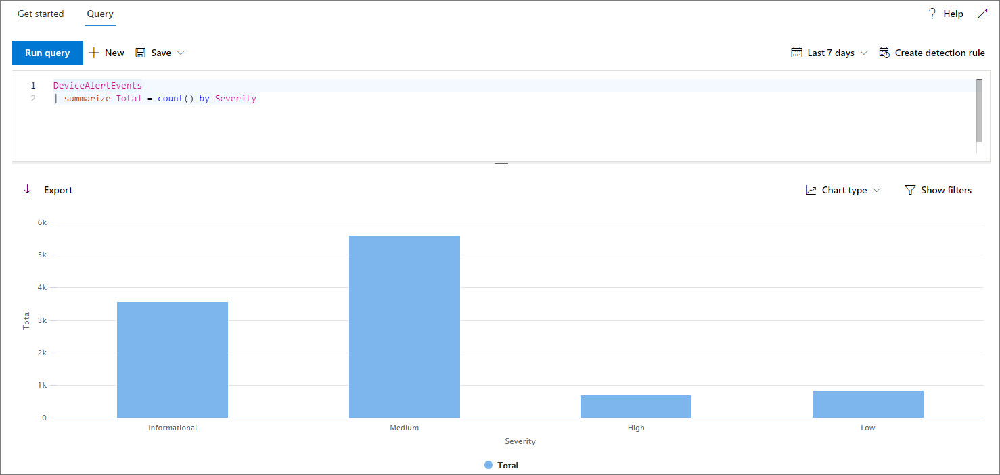
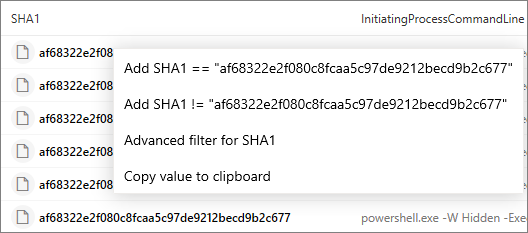

# <a name="work-with-advanced-hunting-query-results"></a><span data-ttu-id="1f11b-104">고급 헌팅 쿼리 결과 사용</span><span class="sxs-lookup"><span data-stu-id="1f11b-104">Work with advanced hunting query results</span></span>

[!INCLUDE [Microsoft 365 Defender rebranding](../../includes/microsoft-defender.md)]

<span data-ttu-id="1f11b-105">**적용 대상:**</span><span class="sxs-lookup"><span data-stu-id="1f11b-105">**Applies to:**</span></span>
- [<span data-ttu-id="1f11b-106">엔드포인트용 Microsoft Defender</span><span class="sxs-lookup"><span data-stu-id="1f11b-106">Microsoft Defender for Endpoint</span></span>](https://go.microsoft.com/fwlink/?linkid=2154037)

><span data-ttu-id="1f11b-107">Endpoint용 Defender를 경험하고 싶나요?</span><span class="sxs-lookup"><span data-stu-id="1f11b-107">Want to experience Defender for Endpoint?</span></span> [<span data-ttu-id="1f11b-108">무료 평가판에 등록합니다.</span><span class="sxs-lookup"><span data-stu-id="1f11b-108">Sign up for a free trial.</span></span>](https://www.microsoft.com/microsoft-365/windows/microsoft-defender-atp?ocid=docs-wdatp-advancedhunting-abovefoldlink)

<span data-ttu-id="1f11b-109">고급 헌팅 [](advanced-hunting-overview.md) 쿼리를 구성하여 매우 정확한 정보를 반환할 수 있는 반면, 쿼리 결과를 사용하여 더 많은 정보를 얻고 특정 활동 및 지표를 조사할 수도 있습니다.</span><span class="sxs-lookup"><span data-stu-id="1f11b-109">While you can construct your [advanced hunting](advanced-hunting-overview.md) queries to return very precise information, you can also work with the query results to gain further insight and investigate specific activities and indicators.</span></span> <span data-ttu-id="1f11b-110">쿼리 결과에 대해 다음 작업을 수행할 수 있습니다.</span><span class="sxs-lookup"><span data-stu-id="1f11b-110">You can take the following actions on your query results:</span></span>

- <span data-ttu-id="1f11b-111">결과를 표 또는 차트로 보기</span><span class="sxs-lookup"><span data-stu-id="1f11b-111">View results as a table or chart</span></span>
- <span data-ttu-id="1f11b-112">표 및 차트 내보내기</span><span class="sxs-lookup"><span data-stu-id="1f11b-112">Export tables and charts</span></span>
- <span data-ttu-id="1f11b-113">자세한 엔터티 정보로 드릴다운</span><span class="sxs-lookup"><span data-stu-id="1f11b-113">Drill down to detailed entity information</span></span>
- <span data-ttu-id="1f11b-114">결과에서 직접 쿼리 조정 또는 필터 적용</span><span class="sxs-lookup"><span data-stu-id="1f11b-114">Tweak your queries directly from the results or apply filters</span></span>

## <a name="view-query-results-as-a-table-or-chart"></a><span data-ttu-id="1f11b-115">테이블 또는 차트로 쿼리 결과 보기</span><span class="sxs-lookup"><span data-stu-id="1f11b-115">View query results as a table or chart</span></span>
<span data-ttu-id="1f11b-116">기본적으로 고급 헌팅은 쿼리 결과를 테이블형 데이터로 표시됩니다.</span><span class="sxs-lookup"><span data-stu-id="1f11b-116">By default, advanced hunting displays query results as tabular data.</span></span> <span data-ttu-id="1f11b-117">차트와 동일한 데이터를 표시할 수도 있습니다.</span><span class="sxs-lookup"><span data-stu-id="1f11b-117">You can also display the same data as a chart.</span></span> <span data-ttu-id="1f11b-118">고급 헌팅은 다음과 같은 보기를 지원합니다.</span><span class="sxs-lookup"><span data-stu-id="1f11b-118">Advanced hunting supports the following views:</span></span>

| <span data-ttu-id="1f11b-119">보기 유형</span><span class="sxs-lookup"><span data-stu-id="1f11b-119">View type</span></span> | <span data-ttu-id="1f11b-120">설명</span><span class="sxs-lookup"><span data-stu-id="1f11b-120">Description</span></span> |
| -- | -- |
| <span data-ttu-id="1f11b-121">**표**</span><span class="sxs-lookup"><span data-stu-id="1f11b-121">**Table**</span></span> | <span data-ttu-id="1f11b-122">쿼리 결과를 테이블 형식 형식으로 표시</span><span class="sxs-lookup"><span data-stu-id="1f11b-122">Displays the query results in tabular format</span></span> |
| <span data-ttu-id="1f11b-123">**열 차트**</span><span class="sxs-lookup"><span data-stu-id="1f11b-123">**Column chart**</span></span> | <span data-ttu-id="1f11b-124">x 축에 있는 일련의 고유한 항목을 높이가 다른 필드의 숫자 값을 나타내는 세로 막대로 렌더링합니다.</span><span class="sxs-lookup"><span data-stu-id="1f11b-124">Renders a series of unique items on the x-axis as vertical bars whose heights represent numeric values from another field</span></span> |
| <span data-ttu-id="1f11b-125">**누적 세로형 차트**</span><span class="sxs-lookup"><span data-stu-id="1f11b-125">**Stacked column chart**</span></span> | <span data-ttu-id="1f11b-126">x 축에 있는 일련의 고유한 항목을 높이가 하나 이상의 다른 필드의 숫자 값을 나타내는 누적 세로 막대로 렌더링합니다.</span><span class="sxs-lookup"><span data-stu-id="1f11b-126">Renders a series of unique items on the x-axis as stacked vertical bars whose heights represent numeric values from one or more other fields</span></span> |
| <span data-ttu-id="1f11b-127">**파이 차트**</span><span class="sxs-lookup"><span data-stu-id="1f11b-127">**Pie chart**</span></span> | <span data-ttu-id="1f11b-128">고유한 항목을 나타내는 섹션 파이를 렌더링합니다.</span><span class="sxs-lookup"><span data-stu-id="1f11b-128">Renders sectional pies representing unique items.</span></span> <span data-ttu-id="1f11b-129">각 파이의 크기는 다른 필드의 숫자 값을 나타냅니다.</span><span class="sxs-lookup"><span data-stu-id="1f11b-129">The size of each pie represents numeric values from another field.</span></span> |
| <span data-ttu-id="1f11b-130">**도넛형 차트**</span><span class="sxs-lookup"><span data-stu-id="1f11b-130">**Donut chart**</span></span> | <span data-ttu-id="1f11b-131">고유한 항목을 나타내는 섹션 호를 렌더링합니다.</span><span class="sxs-lookup"><span data-stu-id="1f11b-131">Renders sectional arcs representing unique items.</span></span> <span data-ttu-id="1f11b-132">각 호의 길이는 다른 필드의 숫자 값을 나타냅니다.</span><span class="sxs-lookup"><span data-stu-id="1f11b-132">The length of each arc represents numeric values from another field.</span></span> |
| <span data-ttu-id="1f11b-133">**꺾은선형 차트**</span><span class="sxs-lookup"><span data-stu-id="1f11b-133">**Line chart**</span></span> | <span data-ttu-id="1f11b-134">일련의 고유한 항목에 대한 숫자 값을 그리며 그루팅된 값을 연결합니다.</span><span class="sxs-lookup"><span data-stu-id="1f11b-134">Plots numeric values for a series of unique items and connects the plotted values</span></span> |
| <span data-ttu-id="1f11b-135">**분산형 차트**</span><span class="sxs-lookup"><span data-stu-id="1f11b-135">**Scatter chart**</span></span> | <span data-ttu-id="1f11b-136">일련의 고유 항목에 대한 숫자 값을 그리게 합니다.</span><span class="sxs-lookup"><span data-stu-id="1f11b-136">Plots numeric values for a series of unique items</span></span> |
| <span data-ttu-id="1f11b-137">**영역형 차트**</span><span class="sxs-lookup"><span data-stu-id="1f11b-137">**Area chart**</span></span> | <span data-ttu-id="1f11b-138">일련의 고유 항목에 대한 숫자 값을 그리고 그림을 그리게 하는 값 아래에 구역을 채우는 경우</span><span class="sxs-lookup"><span data-stu-id="1f11b-138">Plots numeric values for a series of unique items and fills the sections below the plotted values</span></span> |

### <a name="construct-queries-for-effective-charts"></a><span data-ttu-id="1f11b-139">유효 차트에 대한 쿼리 생성</span><span class="sxs-lookup"><span data-stu-id="1f11b-139">Construct queries for effective charts</span></span>
<span data-ttu-id="1f11b-140">차트를 렌더링할 때 고급 헌팅은 자동으로 관심 열과 집계할 숫자 값을 식별합니다.</span><span class="sxs-lookup"><span data-stu-id="1f11b-140">When rendering charts, advanced hunting automatically identifies columns of interest and the numeric values to aggregate.</span></span> <span data-ttu-id="1f11b-141">의미 있는 차트를 얻기 위해 시각화하려는 특정 값을 반환하는 쿼리를 생성합니다.</span><span class="sxs-lookup"><span data-stu-id="1f11b-141">To get meaningful charts, construct your queries to return the specific values you want to see visualized.</span></span> <span data-ttu-id="1f11b-142">다음은 몇 가지 예제 쿼리와 결과 차트입니다.</span><span class="sxs-lookup"><span data-stu-id="1f11b-142">Here are some sample queries and the resulting charts.</span></span>

#### <a name="alerts-by-severity"></a><span data-ttu-id="1f11b-143">심각도에 따라 알림</span><span class="sxs-lookup"><span data-stu-id="1f11b-143">Alerts by severity</span></span>
<span data-ttu-id="1f11b-144">연산자를 사용하여 차트에 사용할 값의 `summarize` 수를 구할 수 있습니다.</span><span class="sxs-lookup"><span data-stu-id="1f11b-144">Use the `summarize` operator to obtain a numeric count of the values you want to chart.</span></span> <span data-ttu-id="1f11b-145">아래 쿼리는 연산자를 사용하여 심각도에 따라 경고 `summarize` 수를 구합니다.</span><span class="sxs-lookup"><span data-stu-id="1f11b-145">The query below uses the `summarize` operator to get the number of alerts by severity.</span></span>

```kusto
DeviceAlertEvents
| summarize Total = count() by Severity
```
<span data-ttu-id="1f11b-146">결과를 렌더링할 때 열 차트에는 각 심각도 값이 별도의 열로 표시됩니다.</span><span class="sxs-lookup"><span data-stu-id="1f11b-146">When rendering the results, a column chart displays each severity value as a separate column:</span></span>

<span data-ttu-id="1f11b-147">
 *결과*</span><span class="sxs-lookup"><span data-stu-id="1f11b-147">
*Query results for alerts by severity displayed as a column chart*</span></span>

#### <a name="alert-severity-by-operating-system"></a><span data-ttu-id="1f11b-148">운영 체제의 경고 심각도</span><span class="sxs-lookup"><span data-stu-id="1f11b-148">Alert severity by operating system</span></span>
<span data-ttu-id="1f11b-149">연산자를 사용하여 여러 필드의 차트 값에 대한 `summarize` 결과를 준비할 수도 있습니다.</span><span class="sxs-lookup"><span data-stu-id="1f11b-149">You could also use the `summarize` operator to prepare results for charting values from multiple fields.</span></span> <span data-ttu-id="1f11b-150">예를 들어 운영 체제(OS)에 경고 심각도가 분산되어 있는 방법을 이해해야 할 수 있습니다.</span><span class="sxs-lookup"><span data-stu-id="1f11b-150">For example, you might want to understand how alert severities are distributed across operating systems (OS).</span></span> 

<span data-ttu-id="1f11b-151">아래 쿼리는 연산자를 사용하여 테이블에서 OS 정보를 끌어와서 및 열의 값을 계산하는 `join` `DeviceInfo` 데 `summarize` `OSPlatform` `Severity` 사용합니다.</span><span class="sxs-lookup"><span data-stu-id="1f11b-151">The query below uses a `join` operator to pull in OS information from the `DeviceInfo` table, and then uses `summarize` to count values in both the `OSPlatform` and `Severity` columns:</span></span>

```kusto
DeviceAlertEvents
| join DeviceInfo on DeviceId
| summarize Count = count() by OSPlatform, Severity
```
<span data-ttu-id="1f11b-152">이러한 결과는 누적 세로형 차트를 사용하여 가장 잘 시각화됩니다.</span><span class="sxs-lookup"><span data-stu-id="1f11b-152">These results are best visualized using a stacked column chart:</span></span>

<span data-ttu-id="1f11b-153">
 *누적 차트로 표시되는 OS의* 경고 및 심각도에 대한 쿼리 결과</span><span class="sxs-lookup"><span data-stu-id="1f11b-153">
*Query results for alerts by OS and severity displayed as a stacked chart*</span></span>

#### <a name="top-ten-device-groups-with-alerts"></a><span data-ttu-id="1f11b-154">경고가 있는 상위 10개 장치 그룹</span><span class="sxs-lookup"><span data-stu-id="1f11b-154">Top ten device groups with alerts</span></span>
<span data-ttu-id="1f11b-155">유한하지 않은 값 목록을 다루는 경우 연산자를 사용하여 대부분의 인스턴스가 있는 값만 차트로 `Top` 만들 수 있습니다.</span><span class="sxs-lookup"><span data-stu-id="1f11b-155">If you're dealing with a list of values that isn’t finite, you can use the `Top` operator to chart only the values with the most instances.</span></span> <span data-ttu-id="1f11b-156">예를 들어 알림이 가장 많은 상위 10개 장치 그룹을 얻은 경우 아래 쿼리를 사용합니다.</span><span class="sxs-lookup"><span data-stu-id="1f11b-156">For example, to get the top ten device groups with the most alerts, use the query below:</span></span>

```kusto
DeviceAlertEvents
| join DeviceInfo on DeviceId
| summarize Count = count() by MachineGroup
| top 10 by Count
```
<span data-ttu-id="1f11b-157">파이 차트 보기를 사용하여 상위 그룹 전체의 분포를 효과적으로 보여 주면 됩니다.</span><span class="sxs-lookup"><span data-stu-id="1f11b-157">Use the pie chart view to effectively show distribution across the top groups:</span></span>

<span data-ttu-id="1f11b-158">
 *결과의 이미지*</span><span class="sxs-lookup"><span data-stu-id="1f11b-158">
*Pie chart showing distribution of alerts across device groups*</span></span>

#### <a name="malware-detections-over-time"></a><span data-ttu-id="1f11b-159">시간의에 대한 맬웨어 감지</span><span class="sxs-lookup"><span data-stu-id="1f11b-159">Malware detections over time</span></span>
<span data-ttu-id="1f11b-160">함수와 함께 연산자를 사용하면 시간이 지날 때 특정 표시기가 `summarize` 관련된 이벤트를 확인할 수 `bin()` 있습니다.</span><span class="sxs-lookup"><span data-stu-id="1f11b-160">Using the `summarize` operator with the `bin()` function, you can check for events involving a particular indicator over time.</span></span> <span data-ttu-id="1f11b-161">아래 쿼리는 EICAR 테스트 파일의 검색 횟수를 30분 간격으로 계산하여 해당 파일의 검색 횟수가 스파이크로 표시됩니다.</span><span class="sxs-lookup"><span data-stu-id="1f11b-161">The query below counts detections of an EICAR test file at 30 minute intervals to show spikes in detections of that file:</span></span>

```kusto
DeviceEvents
| where ActionType == "AntivirusDetection"
| where SHA1 == "3395856ce81f2b7382dee72602f798b642f14140"
| summarize Detections = count() by bin(Timestamp, 30m)
```
<span data-ttu-id="1f11b-162">아래 라인 차트는 테스트 맬웨어가 더 많이 검색된 기간을 명확하게 강조합니다.</span><span class="sxs-lookup"><span data-stu-id="1f11b-162">The line chart below clearly highlights time periods with more detections of the test malware:</span></span> 

<span data-ttu-id="1f11b-163">
 *차트*</span><span class="sxs-lookup"><span data-stu-id="1f11b-163">
*Line chart showing the number of detections of a test malware over time*</span></span>


## <a name="export-tables-and-charts"></a><span data-ttu-id="1f11b-164">표 및 차트 내보내기</span><span class="sxs-lookup"><span data-stu-id="1f11b-164">Export tables and charts</span></span>
<span data-ttu-id="1f11b-165">쿼리를 실행한 후 내보내기 를 **선택하여** 결과를 로컬 파일에 저장합니다.</span><span class="sxs-lookup"><span data-stu-id="1f11b-165">After running a query, select **Export** to save the results to local file.</span></span> <span data-ttu-id="1f11b-166">선택한 보기에 따라 결과가 내보내는 방식이 결정됩니다.</span><span class="sxs-lookup"><span data-stu-id="1f11b-166">Your chosen view determines how the results are exported:</span></span>

- <span data-ttu-id="1f11b-167">**테이블 보기** - 쿼리 결과가 Microsoft Excel 통합 문서로 테이블 형식 형태로 내보내집니다.</span><span class="sxs-lookup"><span data-stu-id="1f11b-167">**Table view** — the query results are exported in tabular form as a Microsoft Excel workbook</span></span>
- <span data-ttu-id="1f11b-168">**모든 차트** - 쿼리 결과가 렌더링된 차트의 JPEG 이미지로 내보내집니다.</span><span class="sxs-lookup"><span data-stu-id="1f11b-168">**Any chart** — the query results are exported as a JPEG image of the rendered chart</span></span>

## <a name="drill-down-from-query-results"></a><span data-ttu-id="1f11b-169">쿼리 결과에서 드릴다운</span><span class="sxs-lookup"><span data-stu-id="1f11b-169">Drill down from query results</span></span>
<span data-ttu-id="1f11b-170">쿼리 결과에서 장치, 파일, 사용자, IP 주소 및 URL과 같은 엔터티에 대한 자세한 정보를 보려면 엔터티 식별자를 클릭하기만 합니다.</span><span class="sxs-lookup"><span data-stu-id="1f11b-170">To view more information about entities, such as devices, files, users, IP addresses, and URLs, in your query results, simply click the entity identifier.</span></span> <span data-ttu-id="1f11b-171">그러면 선택한 엔터티에 대한 자세한 프로필 페이지가 열립니다.</span><span class="sxs-lookup"><span data-stu-id="1f11b-171">This opens a detailed profile page for the selected entity.</span></span>

<span data-ttu-id="1f11b-172">쿼리 결과에서 레코드를 빠르게 검사하려면 해당 행을 선택하여 레코드 검사 패널을 여는 방법을 선택합니다.</span><span class="sxs-lookup"><span data-stu-id="1f11b-172">To quickly inspect a record in your query results, select the corresponding row to open the Inspect record panel.</span></span> <span data-ttu-id="1f11b-173">패널은 선택한 레코드에 따라 다음 정보를 제공합니다.</span><span class="sxs-lookup"><span data-stu-id="1f11b-173">The panel provides the following information based on the selected record:</span></span>

- <span data-ttu-id="1f11b-174">**자산** - 레코드에 있는 주요 자산(사서함, 장치 및 사용자)에 대한 요약된 보기로, 위험 및 노출 수준과 같은 사용 가능한 정보가 향상되었습니다.</span><span class="sxs-lookup"><span data-stu-id="1f11b-174">**Assets** — A summarized view of the main assets (mailboxes, devices, and users) found in the record, enriched with available information, such as risk and exposure levels</span></span>
- <span data-ttu-id="1f11b-175">**프로세스 트리** - 프로세스 정보가 있는 레코드에 대해 생성되어 사용 가능한 상황 정보를 사용하여 강화된 차트입니다. 일반적으로 더 많은 열을 반환하는 쿼리의 경우 프로세스 트리가 더 다양할 수 있습니다.</span><span class="sxs-lookup"><span data-stu-id="1f11b-175">**Process tree** — A chart generated for records with process information and enriched using available contextual information; in general, queries that return more columns can result in richer process trees.</span></span>
- <span data-ttu-id="1f11b-176">**모든 세부 정보** - 레코드의 열에 있는 모든 값을 나열합니다.</span><span class="sxs-lookup"><span data-stu-id="1f11b-176">**All details** — Lists all the values from the columns in the record</span></span>

## <a name="tweak-your-queries-from-the-results"></a><span data-ttu-id="1f11b-177">결과에서 쿼리 조정</span><span class="sxs-lookup"><span data-stu-id="1f11b-177">Tweak your queries from the results</span></span>
<span data-ttu-id="1f11b-178">결과 집합의 값을 마우스 오른쪽 단추로 클릭하면 쿼리가 빠르게 향상됩니다.</span><span class="sxs-lookup"><span data-stu-id="1f11b-178">Right-click a value in the result set to quickly enhance your query.</span></span> <span data-ttu-id="1f11b-179">옵션을 사용하여 다음을 수행할 수 있습니다.</span><span class="sxs-lookup"><span data-stu-id="1f11b-179">You can use the options to:</span></span>

- <span data-ttu-id="1f11b-180">선택한 값을 명시적으로 찾습니다 (`==`)</span><span class="sxs-lookup"><span data-stu-id="1f11b-180">Explicitly look for the selected value (`==`)</span></span>
- <span data-ttu-id="1f11b-181">쿼리에서 선택한 값을 제외합니다 (`!=`)</span><span class="sxs-lookup"><span data-stu-id="1f11b-181">Exclude the selected value from the query (`!=`)</span></span>
- <span data-ttu-id="1f11b-182">쿼리에 값을 추가하는 고급 연산자를 사용합니다 (예: `contains`, `starts with` 및 `ends with`)</span><span class="sxs-lookup"><span data-stu-id="1f11b-182">Get more advanced operators for adding the value to your query, such as `contains`, `starts with` and `ends with`</span></span> 



## <a name="filter-the-query-results"></a><span data-ttu-id="1f11b-184">쿼리 결과 필터링</span><span class="sxs-lookup"><span data-stu-id="1f11b-184">Filter the query results</span></span>
<span data-ttu-id="1f11b-185">오른쪽 창에 표시되는 필터는 결과 집합에 대한 요약을 제공합니다.</span><span class="sxs-lookup"><span data-stu-id="1f11b-185">The filters displayed in the right pane provide a summary of the result set.</span></span> <span data-ttu-id="1f11b-186">각 열에는 창에 자체 섹션이 있으며 각 섹션에는 해당 열에 있는 값과 인스턴스 수가 나열됩니다.</span><span class="sxs-lookup"><span data-stu-id="1f11b-186">Every column has its own section in the pane, each of which lists the values found in that column, and the number of instances.</span></span>

<span data-ttu-id="1f11b-187">포함하거나 제외하려는 값의 단추를 선택하여 쿼리를 `+` `-` 구체화합니다.</span><span class="sxs-lookup"><span data-stu-id="1f11b-187">Refine your query by selecting the `+` or `-` buttons on the values that you want to include or exclude.</span></span> <span data-ttu-id="1f11b-188">그런 다음 쿼리 **실행을 선택합니다.**</span><span class="sxs-lookup"><span data-stu-id="1f11b-188">Then select **Run query**.</span></span>


<span data-ttu-id="1f11b-190">필터를 적용하여 쿼리를 수정한 다음 쿼리를 실행하면 그에 따라 결과가 업데이트됩니다.</span><span class="sxs-lookup"><span data-stu-id="1f11b-190">Once you apply the filter to modify the query and then run the query, the results are updated accordingly.</span></span>

## <a name="related-topics"></a><span data-ttu-id="1f11b-191">관련 항목</span><span class="sxs-lookup"><span data-stu-id="1f11b-191">Related topics</span></span>
- [<span data-ttu-id="1f11b-192">지능형 헌팅 개요</span><span class="sxs-lookup"><span data-stu-id="1f11b-192">Advanced hunting overview</span></span>](advanced-hunting-overview.md)
- [<span data-ttu-id="1f11b-193">쿼리 언어 배우기</span><span class="sxs-lookup"><span data-stu-id="1f11b-193">Learn the query language</span></span>](advanced-hunting-query-language.md)
- [<span data-ttu-id="1f11b-194">공유 쿼리 사용</span><span class="sxs-lookup"><span data-stu-id="1f11b-194">Use shared queries</span></span>](advanced-hunting-shared-queries.md)
- [<span data-ttu-id="1f11b-195">스키마의 이해</span><span class="sxs-lookup"><span data-stu-id="1f11b-195">Understand the schema</span></span>](advanced-hunting-schema-reference.md)
- [<span data-ttu-id="1f11b-196">쿼리 모범 사례 적용</span><span class="sxs-lookup"><span data-stu-id="1f11b-196">Apply query best practices</span></span>](advanced-hunting-best-practices.md)
- [<span data-ttu-id="1f11b-197">사용자 지정 검색 개요</span><span class="sxs-lookup"><span data-stu-id="1f11b-197">Custom detections overview</span></span>](overview-custom-detections.md)
