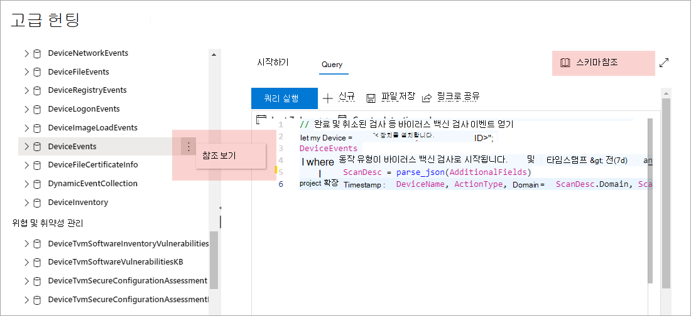

# 끝점용 Microsoft Defender의 고급 헌팅 스마 이해

[!INCLUDE [Microsoft 365 Defender rebranding](../../includes/microsoft-defender.md)]

**적용 대상:**
- [엔드포인트용 Microsoft Defender](https://go.microsoft.com/fwlink/?linkid=2154037)

> Endpoint용 Defender를 경험하고 싶나요? [무료 평가판을 신청하세요.](https://signup.microsoft.com/create-account/signup?products=7f379fee-c4f9-4278-b0a1-e4c8c2fcdf7e&ru=https://aka.ms/MDEp2OpenTrial?ocid=docs-wdatp-advancedhuntingref-abovefoldlink)

[!include[Prerelease information](../../includes/prerelease.md)]

고급 [헌팅](advanced-hunting-overview.md) 계획은 이벤트 정보나 장치 및 기타 엔터티에 대한 정보를 제공하는 여러 표로 구성됩니다. 여러 표를 포괄하는 쿼리를 효과적으로 작성하려면 고급 헌팅 스키마에서 표 및 열을 이해해야 합니다.

## 보안 센터에서 스마마 정보 얻기

쿼리를 구성하는 동안 기본 제공된 Schema 참조를 사용하여 해당 schema의 각 테이블에 대한 다음 정보를 빠르게 얻을 수 있습니다.

- **테이블 설명:** 테이블에 포함된 데이터 형식 및 해당 데이터의 원본입니다.
- **Columns:** 테이블의 모든 열입니다.
- **동작 유형:** 표에서 지원하는 이벤트 유형을 나타내는 `ActionType` 열의 가능한 값입니다. 이벤트 정보가 포함된 테이블에만 제공됩니다.
- **샘플 쿼리:** 테이블을 활용하는 방법을 특징으로 하는 쿼리 예제입니다.

### Schema 참조 액세스

스마마 참조에 빠르게 액세스하려면  해당 Schema 표현에서 테이블 이름 옆에 있는 참조 보기 작업을 선택합니다. 또한 **Schema 참조를 선택하여** 테이블을 검색할 수도 있습니다.

## Schema 테이블에 대해 자세히 알아보기

다음 참조에는 고급 헌팅 스마의 모든 테이블이 나열됩니다. 각 표 이름은 해당 표의 열 이름을 설명하는 페이지에 연결됩니다.

표 및 열 이름도 고급 헌팅 Microsoft Defender 보안 센터 표시에 표시됩니다.

 

****

|테이블 이름|설명|
|---|---|
|**[DeviceAlertEvents](advanced-hunting-devicealertevents-table.md)**|알림에 대한 Microsoft Defender 보안 센터|
|**[DeviceInfo](advanced-hunting-deviceinfo-table.md)**|OS 정보를 포함한 장치 정보|
|**[DeviceNetworkInfo](advanced-hunting-devicenetworkinfo-table.md)**|어댑터, IP 및 MAC 주소, 연결된 네트워크 및 도메인을 비롯한 장치의 네트워크 속성|
|**[DeviceProcessEvents](advanced-hunting-deviceprocessevents-table.md)**|프로세스 생성 및 관련 이벤트|
|**[DeviceNetworkEvents](advanced-hunting-devicenetworkevents-table.md)**|네트워크 연결 및 관련 이벤트|
|**[DeviceFileEvents](advanced-hunting-devicefileevents-table.md)**|파일 생성, 수정 및 기타 파일 시스템 이벤트|
|**[DeviceRegistryEvents](advanced-hunting-deviceregistryevents-table.md)**|레지스트리 항목 생성 및 수정|
|**[DeviceLogonEvents](advanced-hunting-devicelogonevents-table.md)**|로그인 및 기타 인증 이벤트|
|**[DeviceImageLoadEvents](advanced-hunting-deviceimageloadevents-table.md)**|DLL 로딩 이벤트|
|**[DeviceEvents](advanced-hunting-deviceevents-table.md)**|보안 제어에 의해 트리거되는 이벤트(예: Microsoft Defender 바이러스 백신 및 악용 방지 포함)|
|**[DeviceFileCertificateInfo](advanced-hunting-devicefilecertificateinfo-table.md)**|엔드포인트의 인증서 확인 이벤트에서 얻은 서명된 파일의 인증서 정보|
|**[DeviceTvmSoftwareInventory](advanced-hunting-devicetvmsoftwareinventory-table.md)**|버전 정보 및 지원 종료 상태를 포함하여 장치에 설치된 소프트웨어 인벤토리|
|**[DeviceTvmSoftwareVulnerabilities](advanced-hunting-devicetvmsoftwarevulnerabilities-table.md)**|장치에서 발견되는 소프트웨어 취약점 및 각 취약점을 해결하기 위한 사용 가능한 보안 업데이트 목록|
|**[DeviceTvmSoftwareVulnerabilitiesKB](advanced-hunting-devicetvmsoftwarevulnerabilitieskb-table.md)**|익스플로잇 코드를 공개적으로 사용할 수 있는지를 포함하여 공개적으로 보고된 취약성에 대한 기술 자료|
|**[DeviceTvmSecureConfigurationAssessment](advanced-hunting-devicetvmsecureconfigurationassessment-table.md)**|장치에서 다양한 보안 구성의 상태를 나타내는 위협 및 취약성 관리 평가 이벤트|
|**[DeviceTvmSecureConfigurationAssessmentKB](advanced-hunting-devicetvmsecureconfigurationassessmentkb-table.md)**|위협 및 취약성 관리에서 장치를 평가하기 위해 사용하는 다양한 보안 구성에 대한 기술 자료. 다양한 표준과 벤치 마크에 대한 매핑 포함|
|

> [!TIP]
> 고급 [헌팅을](/microsoft-365/security/defender/advanced-hunting-overview) Microsoft 365 Defender 끝점용 Defender, microsoft Defender for Office 365, Microsoft Cloud App Security Id에 대한 Microsoft Defender의 데이터를 사용하여 위협을 헌팅합니다. [를 Microsoft 365 Defender.](/microsoft-365/security/defender/m365d-enable)

끝점용 Microsoft Defender에서 고급 헌팅 워크플로를 끝점용 Microsoft [Defender로](/microsoft-365/security/defender/advanced-hunting-migrate-from-mde)이동하는 Microsoft 365 Defender Microsoft Defender에서 고급 헌팅 쿼리 마이그레이션에서 자세히 알아보하세요.

## 관련 항목

- [지능형 헌팅 개요](advanced-hunting-overview.md)
- [쿼리 언어 배우기](advanced-hunting-query-language.md)
- [쿼리 결과로 작업](advanced-hunting-query-results.md)
- [쿼리 모범 사례 적용](advanced-hunting-best-practices.md)
- [사용자 지정 검색 개요](overview-custom-detections.md)
- [고급 헌팅 데이터 스마마 변경 사항](https://techcommunity.microsoft.com/t5/microsoft-defender-atp/advanced-hunting-data-schema-changes/ba-p/1043914)
