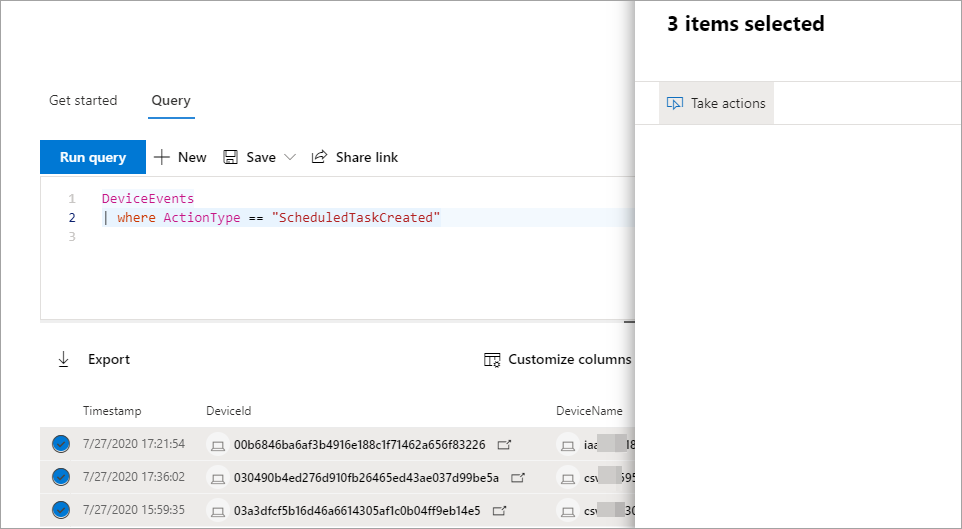

# 고급 헌팅 쿼리 결과에 대한 작업 수행Take action on advanced hunting query results

**적용 대상:****Applies to:**
- [엔드포인트용 Microsoft DefenderMicrosoft Defender for Endpoint](https://go.microsoft.com/fwlink/p/?linkid=2154037)

> Endpoint용 Defender를 경험하고 싶나요?Want to experience Defender for Endpoint? [무료 평가판에 등록합니다.Sign up for a free trial.](https://www.microsoft.com/microsoft-365/windows/microsoft-defender-atp?ocid=docs-wdatp-advancedhuntingref-abovefoldlink)

강력하고 포괄적인 작업 옵션을 사용하여 고급 헌팅에서 발견한 위협을 빠르게 포함하거나 손상된 자산을 해결할 수 있습니다. You can quickly contain threats or address compromised assets that you find in [advanced hunting](advanced-hunting-overview.md) using powerful and comprehensive action options. 이러한 옵션을 사용하여 다음을 할 수 있습니다.With these options, you can:

- 디바이스에서 다양한 작업 수행Take various actions on devices
- 파일 Quarantine filesQuarantine files

## 필요한 사용 권한Required permissions

고급 헌팅을 통해 조치를 취하려면 장치에서 수정 작업을 제출할 수 있는 권한이 있는 끝점용 Defender의 역할이 [필요합니다.](https://docs.microsoft.com/microsoft-365/security/defender-endpoint/user-roles#permission-options)To be able to take action through advanced hunting, you need a role in Defender for Endpoint with [permissions to submit remediation actions on devices](https://docs.microsoft.com/microsoft-365/security/defender-endpoint/user-roles#permission-options). 조치를 취할 수 없는 경우 전역 관리자에게 문의하여 다음 권한을 부여합니다.If you can't take action, contact a global administrator about getting the following permission:

*위협 및 > 관리에 대한 활성 수정 작업 - 수정 처리**Active remediation actions > Threat and vulnerability management - Remediation handling*

## 디바이스에서 다양한 작업 수행Take various actions on devices

쿼리 결과의 열로 식별된 장치에 대해 다음 `DeviceId` 작업을 수행할 수 있습니다.You can take the following actions on devices identified by the `DeviceId` column in your query results:

- 감염을 포함하거나 공격이 후방으로 이동하지 않도록 영향을 받는 장치를 격리Isolate affected devices to contain an infection or prevent attacks from moving laterally
- 조사 패키지를 수집하여 추가 포렌식 정보 얻기Collect investigation package to obtain more forensic information
- 바이러스 백신 검사 실행을 통해 최신 보안 인텔리전스 업데이트를 사용하여 위협 찾기 및 제거Run an antivirus scan to find and remove threats using the latest security intelligence updates
- 자동화된 조사를 시작하여 장치 및 기타 영향을 받는 장치에 대한 위협을 확인하고 수정합니다.Initiate an automated investigation to check and remediate threats on the device and possibly other affected devices
- 앱 실행을 Microsoft 서명된 실행 파일로만 제한하여 맬웨어 또는 기타 트러블되지 않은 실행 파일을 통한 후속 위협 활동 방지Restrict app execution to only Microsoft-signed executable files, preventing subsequent threat activity through malware or other untrusted executables

끝점용 Defender를 통해 이러한 응답 작업이 수행되는 방법에 대한 자세한 내용은 장치의 응답 [작업에 대해 읽어 보아야 합니다.](respond-machine-alerts.md)To learn more about how these response actions are performed through Defender for Endpoint, [read about response actions on devices](respond-machine-alerts.md).

## 파일 Quarantine filesQuarantine files

발생할 때  자동으로 검리될 수 있도록 파일에 대한 검지 작업을 배포할 수 있습니다.You can deploy the *quarantine* action on files so that they are automatically quarantined when encountered. 이 작업을 선택할 때 다음 열 중 선택하여 쿼리 결과에서 검사할 파일을 식별할 수 있습니다.When selecting this action, you can choose between the following columns to identify which files in your query results to quarantine:

- `SHA1` - 대부분의 고급 헌팅 테이블에서 기록된 작업의 영향을 받은 파일의 SHA-1입니다.`SHA1` — In most advanced hunting tables, this is the SHA-1 of the file that was affected by the recorded action. 예를 들어 파일을 복사한 경우 복사된 파일이 됩니다.For example, if a file was copied, this would be the copied file.
- `InitiatingProcessSHA1` — 대부분의 고급 헌팅 테이블에서 이 파일은 기록된 작업을 시작하는 데 사용할 수 있습니다.`InitiatingProcessSHA1` — In most advanced hunting tables, this is the file responsible for initiating the recorded action. 예를 들어 자식 프로세스가 시작된 경우 이는 상위 프로세스가 됩니다.For example, if a child process was launched, this would be the parent process. 
- `SHA256` — 열로 식별된 파일의 SHA-256에 해당하는 `SHA1` 것입니다.`SHA256` — This is the SHA-256 equivalent of the file identified by the `SHA1` column.
- `InitiatingProcessSHA256` — 열로 식별된 파일의 SHA-256에 해당하는 `InitiatingProcessSHA1` 것입니다.`InitiatingProcessSHA256` — This is the SHA-256 equivalent of the file identified by the `InitiatingProcessSHA1` column.

검사 작업을 수행 하는 방법 및 파일을 복원 하는 방법에 대 한 자세한 내용은 파일에 대 한 [응답 작업에 대 한 읽기.](respond-file-alerts.md)To learn more about how quarantine actions are taken and how files can be restored, [read about response actions on files](respond-file-alerts.md).

>[!NOTE]
>파일을 찾아서 이를 검지하려면 쿼리 결과에 장치 식별자 `DeviceId` 값도 포함되어야 합니다.To locate files and quarantine them, the query results should also include `DeviceId` values as device identifiers.  

## 작업 수행Take action

설명된 작업을 수행하려면 쿼리 결과에서 하나 이상의 레코드를 선택한 다음 작업 **실행을 선택합니다.**To take any of the described actions, select one or more records in your query results and then select **Take actions**. 마법사가 기본 작업을 선택한 다음 제출하는 프로세스를 안내합니다.A wizard will guide you through the process of selecting and then submitting your preferred actions.

## 수행한 작업 검토Review actions taken

각 작업은 각 작업 센터의 작업 센터 기록( 또는  >   [)에 security.microsoft.com/action-center/history](https://security.microsoft.com/action-center/history)기록됩니다.Each action is individually recorded in the action center, under **Action center** > **History** ([security.microsoft.com/action-center/history](https://security.microsoft.com/action-center/history)). 작업 센터로 이동하여 각 작업의 상태를 검사합니다.Go to the action center to check the status of each action.
 
## 관련 항목Related topics

- [고급 헌팅 개요Advanced hunting overview](advanced-hunting-overview.md)
- [쿼리 언어 배우기Learn the query language](advanced-hunting-query-language.md)
- [스키마의 이해Understand the schema](advanced-hunting-schema-reference.md)
- [쿼리 결과 작업Work with query results](advanced-hunting-query-results.md)
- [쿼리 모범 사례 적용Apply query best practices](advanced-hunting-best-practices.md)
- [사용자 지정 검색 개요Custom detections overview](overview-custom-detections.md)
