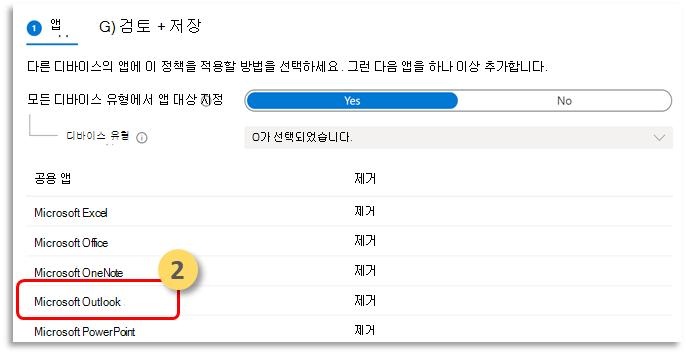
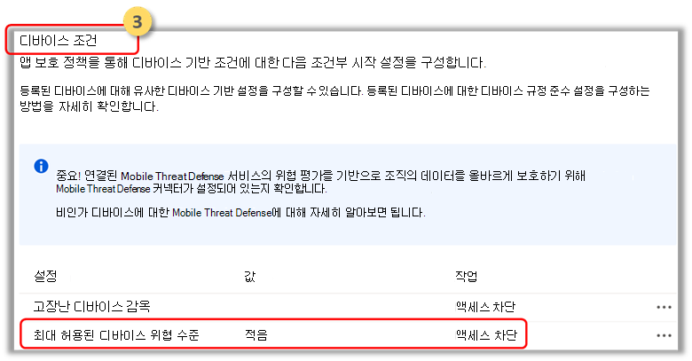

# MAM(앱 보호 정책)을 사용하여 끝점 위험 신호에 대한 Microsoft Defender 구성

[!INCLUDE [Microsoft 365 Defender rebranding](../../includes/microsoft-defender.md)]

**적용 대상:**
- [엔드포인트용 Microsoft Defender](https://go.microsoft.com/fwlink/p/?linkid=2154037)
- [Microsoft 365 Defender](https://go.microsoft.com/fwlink/?linkid=2118804)

MDM(모바일 장치 관리) 시나리오에서 엔터프라이즈 사용자를 이미 보호하는 끝점 Android용 Microsoft Defender는 이제 MAM(모바일 앱 관리)을 지원합니다. 이 기능을 사용하면 응용 프로그램 내에서 조직의 데이터를 관리하고 보호할 수 있습니다.

끝점용 Microsoft Defender Android 위협 정보는 Intune 앱 보호 정책에 의해 활용되어 이러한 앱을 보호합니다. APP(앱 보호 정책)은 조직의 데이터를 안전하게 유지하거나 관리되는 앱에 포함되도록 하는 규칙입니다. 관리되는 응용 프로그램에는 앱 보호 정책이 적용되고 Intune에서 관리할 수 있습니다.  

끝점용 Microsoft Defender(모바일)는 MAM의 두 구성을 모두 지원
- **Intune MDM + MAM:** IT 관리자는 Intune MDM(모바일 장치 관리)에 등록된 장치에서만 앱 보호 정책을 사용하여 앱을 관리할 수 있습니다.
- 장치 등록이 없는 **MAM**: 장치 등록이 없는 MAM 또는 MAM-WE를 사용하면 IT 관리자가 Intune MDM에 등록되지 않은 디바이스에서 앱 보호 정책을 사용하여 앱을 관리할 수 있습니다.  즉, 타사 EMM 공급자에 등록된 장치에서 Intune에서 앱을 관리할 수 있습니다. 위의 두 구성에서 모두 사용하여 앱을 관리하려면 고객이 앱 관리 센터에서 Intune을 [Microsoft Endpoint Manager 합니다.](https://go.microsoft.com/fwlink/?linkid=2109431)

이 기능을 사용하려면 관리자가 끝점용 Microsoft Defender와 Intune 간의 연결을 구성하고 앱 보호 정책을 만들고 대상 장치 및 응용 프로그램에 정책을 적용해야 합니다. 
 
또한 최종 사용자는 장치에 끝점용 Microsoft Defender를 설치하고 온보딩 흐름을 활성화하는 단계를 따라야 합니다.

## 관리자의 선행 준비

- **Microsoft Defender for Endpoint-Intune 사용하도록 설정되어 있는지 확인**

  a. 이동하여 security.microsoft.com. 

  b. 연결 **설정 > 고급> 끝점** > Microsoft Intune 끝점을 선택합니다.

  c. 연결이 설정되어 있지 않은 경우 켜는 토글을 선택한 다음 기본 설정 저장 **을 선택합니다.**

  

  d. Microsoft Endpoint Manager **(Intune)로** 이동하고 Microsoft Defender for Endpoint-Intune 활성화되어 있는지 확인합니다.

  

- **끝점에 대해 Microsoft Defender 사용(모바일) APP(앱 보호 정책)에 대한 커넥터 사용**
  
  앱 보호 정책에 대해 Intune Microsoft Endpoint Manager 커넥터를 구성합니다.

  a. Microsoft Defender for Endpoint의 > 커넥터 및 토큰 > **테넌트 관리로 이동하십시오.**

  b. Android 및 iOS용 앱 보호 정책에 대한 토글을 으로 하세요(다음 스크린샷에 나와 있는 경우).

  c. **저장** 을 선택합니다.

  

- **앱 보호 정책 만들기** 
 
앱 보호 정책을 만들어 끝점 위험 신호에 대한 Microsoft Defender를 기반으로 관리되는 앱의 액세스를 차단하거나 데이터 지우기
끝점용 Microsoft Defender는 MAM(앱 보호 정책)에 사용할 위협 신호를 보내도록 구성할 수 있습니다. 이 기능을 사용하면 끝점용 Microsoft Defender를 사용하여 관리되는 앱을 보호할 수 있습니다.

1. 정책 만들기  
APP(앱 보호 정책)은 조직의 데이터를 안전하게 유지하거나 관리되는 앱에 포함되도록 하는 규칙입니다. 정책은 사용자가 "회사" 데이터에 액세스하거나 이동하려고 할 때 적용되는 규칙 또는 사용자가 앱 내부에 있을 때 금지되거나 모니터링되는 작업 집합일 수 있습니다. 

2. 앱 추가  
    a. 이 정책을 다른 디바이스의 앱에 적용하는 방법을 선택하세요. 그런 다음 앱을 하나 이상 추가합니다.  
    이 옵션을 사용하여 해당 정책이 관리되지 않는 장치에 적용되는지 여부를 지정할 수 있습니다. Android의 경우 Android, 장치 관리자 또는 관리되지 않는 디바이스에 정책이 Enterprise 지정할 수 있습니다. 관리 상태의 디바이스에서 정책을 앱에 대상으로 지정하기로 선택할 수도 있습니다.
모바일 앱 관리에는 장치 관리가 필요하지 않습니다. 따라서 관리되는 디바이스와 관리되지 않는 디바이스 모두에서 회사 데이터를 보호할 수 있습니다. 관리는 사용자 ID를 중심으로 하여 장치 관리에 대한 요구 사항을 제거합니다. 회사에서는 MDM과 함께 또는 사용하지 않고 앱 보호 정책을 동시에 사용할 수 있습니다. 예를 들어 회사에서 발급한 휴대폰과 개인용 태블릿을 모두 사용하는 직원을 고려합니다. 회사 전화는 MDM에 등록되어 있으며 앱 보호 정책에 의해 보호되는 반면 개인 장치는 앱 보호 정책에 의해서만 보호됩니다.

    b. 앱 선택 
    관리되는 앱은 앱 보호 정책이 적용된 앱으로, Intune에서 관리할 수 있습니다. [Intune SDK와](/mem/intune/developer/app-sdk) 통합되거나 [Intune](/mem/intune/developer/apps-prepare-mobile-application-management) 앱에 의해 래핑된 모든 App Wrapping Tool Intune 앱 보호 정책을 사용하여 관리할 수 있습니다. 이러한 도구를 사용하여  Microsoft Intune 공개적으로 사용할 수 있는 보호된 앱의 공식 목록을 참조하세요.

    *예: Outlook 앱으로 사용*

    

 3. 보호 정책에 대한 로그인 보안 요구 사항을 설정하세요.  
장치 **조건에서 > 허용되는** 최대 장치 위협 수준 설정을 **선택하고** 값을 입력합니다. 그런 다음 **작업: "액세스 차단"을 선택합니다.** 끝점용 Microsoft Defender(모바일)는 이 장치 위협 수준을 공유합니다.

    

- **정책을 적용해야 하는 사용자 그룹을 할당합니다.** 
  포함된 **그룹을 선택합니다.** 그런 다음 관련 그룹을 추가합니다. 

    

## 최종 사용자 선행 준비
- 브로커 앱을 설치해야 합니다.
    - Android: Intune 회사 포털
    
- 사용자에게 관리되는 앱에 대한 필수 라이선스가 있으며 앱이 설치되어 있습니다.

### 최종 사용자 온보딩 

1. 관리되는 응용 프로그램에 로그인합니다(예: Outlook. 장치가 등록되어 있으며 응용 프로그램 보호 정책이 장치와 동기화됩니다. 응용 프로그램 보호 정책은 장치의 상태를 인식합니다.  

2. 계속을 **선택합니다.** 엔드포인트 Android 앱용 Microsoft Defender의 다운로드 및 설정을 권장하는 화면이 표시됩니다.

3. 다운로드를 **선택합니다.** 앱 스토어로 리디렉션됩니다(Google play). 

4.  끝점용 Microsoft Defender(모바일) 앱을 설치하고 관리되는 앱 온보딩 화면을 다시 실행합니다.

  

5.  시작 **> 계속을 클릭합니다.** 끝점용 Microsoft Defender 앱 온보딩/활성화 흐름이 시작됩니다. 단계에 따라 온보더링을 완료합니다. 자동으로 관리되는 앱 온보더링 화면으로 다시 리디렉션되며, 이는 이제 장치가 정상 상태입니다.

6. **계속을** 선택하여 관리되는 응용 프로그램에 로그인합니다. 

## 관련 항목

- [Microsoft Defender for Endpoint(iOS용) 개요](microsoft-defender-endpoint-android.md)
- [Microsoft Intune으로 Microsoft Defender for Endpoint(Android용) 배포](android-intune.md)
